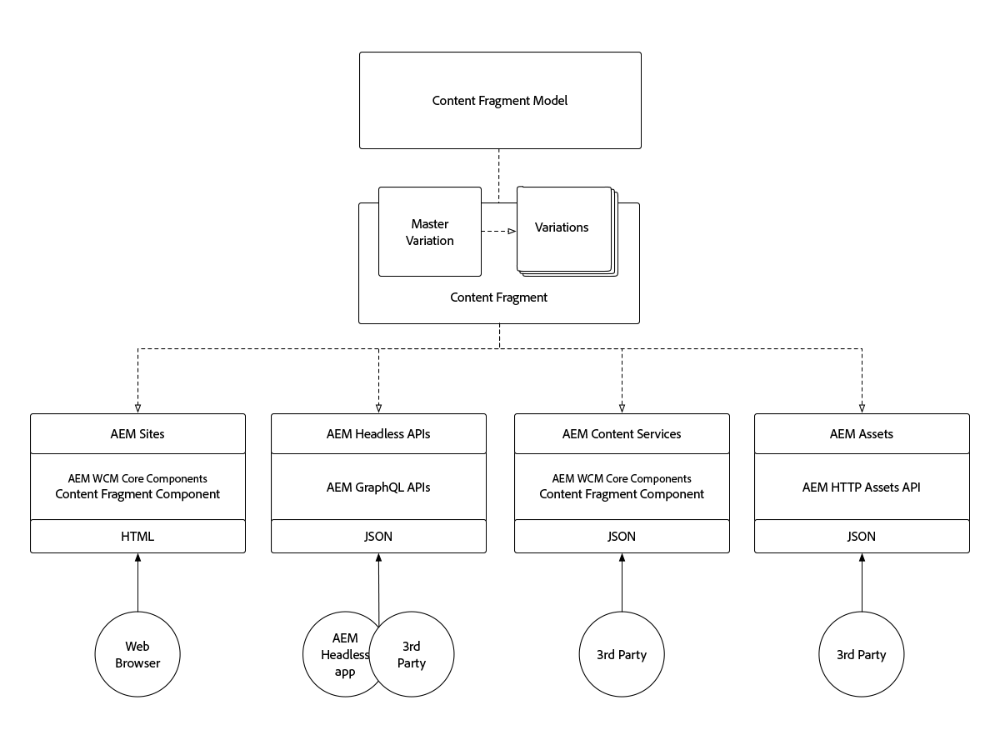

# 了解内容片段和体验片段

Adobe Experience Manager的内容片段和体验片段在表面上看似相似，但在不同的用例中，每个片段都起着关键作用。 了解内容片段和体验片段如何相似、不同，以及何时和如何使用它们。

## 内容片段和体验片段比较

<table>
<tbody><tr><td><strong> </strong></td>
<td><strong>内容片段(CF)</strong></td>
<td><strong>体验片段(XF)</strong></td>
</tr><tr><td><strong>定义</strong></td>
<td><ul>
<li>可重用的、与演示文 <strong>稿无关</strong>的内容，由结构化数据元素（文本、日期、引用等）组成</li>
</ul>
</td>
<td><ul>
<li>可重用的、由一个或多个AEM组件组成的组合，这些组件定义了构成独 <strong>立合理</strong> 的体验的内容和演示</li>
</ul>
</td>
</tr><tr><td><strong>核心租户</strong></td>
<td><ul>
<li>以内容为中心</li>
<li>由基于表 <a href="https://helpx.adobe.com/experience-manager/6-5/assets/using/content-fragments-models.html" target="_blank">单的结构化数据模型定义。</a></li>
<li>与设计和布局无关。</li>
<li>渠道拥有内容片段内容（布局和设计）的演示文稿</li>
</ul>
</td>
<td><ul>
<li>以演示文稿为中心</li>
<li>由AEM组件的非结构化组成定义</li>
<li>定义内容的设计和布局</li>
<li>在渠道中使用“原样”</li>
</ul>
</td>
</tr><tr><td><strong>技术详细信息</strong></td>
<td><ul>
<li>作为DAM实 <strong>施：资产</strong></li>
<li>由内容片段 <a href="https://helpx.adobe.com/experience-manager/6-5/assets/using/content-fragments-models.html" target="_blank">模型定义</a></li>
</ul>
</td>
<td><ul>
<li>作为cq: <strong>Page实施</strong></li>
<li>由可编辑模板定义</li>
<li>本机HTML再现</li>
</ul>
</td>
</tr><tr><td><strong>变量</strong></td>
<td><ul>
<li>主控变分是正则变分</li>
<li>变体是特定于用例的，它可能与渠道一致。</li>
</ul>
</td>
<td><ul>
<li>变体是渠道或上下文特定的</li>
<li>变量通过AEM Live Copy保持同步</li>
<li><a href="https://helpx.adobe.com/experience-manager/6-5/sites/authoring/using/experience-fragments.html#BuildingBlocks" target="_blank">构建基块</a> ，允许在不同的变量之间重复使用内容</li>
</ul>
</td>
</tr><tr><td><strong>功能</strong></td>
<td><ul>
<li>变量</li>
<li>版本</li>
<li><a href="https://helpx.adobe.com/experience-manager/6-5/assets/using/content-fragments-variations.html#SynchronizingwithMaster" target="_blank">跨变体</a> ，内容同步</li>
<li><a href="https://helpx.adobe.com/experience-manager/6-5/assets/using/content-fragments-managing.html#ComparingFragmentVersions" target="_blank">内容片段</a> 版本的可视差异</li>
<li><a href="https://helpx.adobe.com/experience-manager/6-5/assets/using/content-fragments-variations.html#AnnotatingaContentFragment" target="_blank">多行</a> 文本元素的注释</li>
<li>多 <a href="https://helpx.adobe.com/experience-manager/6-5/assets/using/content-fragments-variations.html#SummarizingText" target="_blank">行文</a> 本元素的智能摘要。</li>
<li><a href="https://helpx.adobe.com/experience-manager/6-5/assets/using/creating-translation-projects-for-content-fragments.html" target="_blank">翻译/本地化</a></li>
</ul>
</td>
<td><ul>
<li>变量</li>
<li>作为Live Copy的变体</li>
<li>版本</li>
<li><a href="https://helpx.adobe.com/experience-manager/6-5/sites/authoring/using/experience-fragments.html#BuildingBlocks" target="_blank">构建基块</a></li>
<li>注释</li>
<li>响应式布局和预览</li>
<li>翻译/本地化</li>
</ul>
</td>
</tr><tr><td><strong>用法</strong></td>
<td><ul>
<li><a href="https://docs.adobe.com/content/help/zh-Hans/experience-manager-core-components/using/components/content-fragment-component.html" target="_blank">AEM核心组件内容片段组件</a> ，用于AEM Sites、AEM Screens或体验片段。</li>
<li>通过AEM Content Services <a href="https://helpx.adobe.com/experience-manager/kt/sites/using/content-services-tutorial-use.html" target="_blank">导出JSON</a> ，用于第三方使用</li>
<li>通过AEM HTTP Assets API实现JSON，用于第三方使用。</li>
</ul>
</td>
<td><ul>
<li>AEM体验片段组件，用于AEM Sites、AEM Screens或其他体验片段。</li>
<li>导出为 <a href="https://helpx.adobe.com/experience-manager/6-5/sites/authoring/using/experience-fragments.html#ThePlainHTMLRendition" target="_blank">纯HTML</a> ，供第三方系统使用</li>
<li><a href="https://helpx.adobe.com/experience-manager/6-5/sites/administering/using/experience-fragments-target.html" target="_blank">向Adobe Target出口HTML</a> ，供目标优惠</li>
<li>JSON导出至Adobe Target，面向目标优惠</li>
</ul>
</td>
</tr><tr><td><strong>常见用例</strong></td>
<td><ul>
<li>高度结构化的数据输入／表单内容</li>
<li>长篇编辑内容（多行元素）</li>
<li>在提供内容的渠道的生命周期之外管理的内容</li>
</ul>
</td>
<td><ul>
<li>使用每渠道变量集中管理多渠道促销宣传资料。</li>
<li>内容在网站的多个页面间重复使用。</li>
<li>网站主题(例如 页眉和页脚)</li>
<li>在提供体验的渠道的生命周期之外管理的体验</li>
</ul>
</td>
</tr><tr><td><strong>文档</strong></td>
<td><ul>
<li><a href="https://helpx.adobe.com/experience-manager/6-5/assets/user-guide.html?topic=/experience-manager/6-5/assets/morehelp/content-fragments.ug.js" target="_blank">AEM内容片段用户指南</a></li>
<li><a href="https://helpx.adobe.com/experience-manager/kt/sites/using/content-fragments-feature-video-use.html" target="_blank">在AEM中使用内容片段</a></li>
</ul>
</td>
<td><ul>
<li><a href="https://helpx.adobe.com/experience-manager/6-5/sites/authoring/using/experience-fragments.html" target="_blank">Adobe体验片段文档</a></li>
</ul>
</td>
</tr></tbody></table>

## 内容片段架构

下图说明了AEM内容片段的总体架构

!

+ **内容片段模型** 定义元素（或字段），这些元素（或字段）定义内容片段可能捕获和公开的内容。
+ 内 **容片段** 是内容片段模型的一个实例，它表示逻辑内容实体。
+ 内容片 **段** 变量与内容片段模型相符，但内容中有变量。
+ 内容片段可由以下人员公开／使用：
   + 通过AEM WCM核 **心组件** 的内容片段组件在AEM Sites(或AEM Screens)上使用内容片段。
   + 通过AEM WCM核心组件 **的内容片段** 组件将内容片段嵌入体验片段中，以用于任何体验片段用例。
   + 通过AEM Content Services和API页面将内容片段变 **体内容作为JSON** 公开，以供只读用例使用。
   + 通过直接调用AEM Assets(通过AEM AssetsHTTP API)为CRUD用例直接将内容片段内容( **所有变体** )公开为JSON。

## 体验片段体系结构

!

+ **可编辑模板**(又由可编辑模板类 **型和AEM页面组件实** 现定义)定义 ****，定义允许的AEM组件，这些组件可用于构建体验片段。
+ 体验 **片段** 是可编辑模板的一个实例，它表示逻辑体验。
+ 体验片 **段变** 体符合可编辑模板的要求，但体验（内容和设计）也有变体。
+ 体验片段可以由以下人员公开／使用：
   + 通过AEM体验片段组件在AEM Sites(或AEM Screens)使用体验片段。
   + 通过AEM Content Services和API页面将体验片段变量内容 **公开为JSON** （含嵌入式HTML）。
   + 直接将体验片段变体 **公开为“纯HTML”**。
   + 将体验片段以 **HTML** 或JSON优惠的形式导出到Adobe Target。
   + AEM Sites本机支持HTML优惠，但JSON优惠需要自定义开发。

## 内容片段的支持材料

+ [内容片段用户指南](https://helpx.adobe.com/experience-manager/6-5/assets/user-guide.html?topic=/experience-manager/6-5/assets/morehelp/content-fragments.ug.js)
+ [在AEM中使用内容片段](https://helpx.adobe.com/experience-manager/kt/sites/using/content-fragments-feature-video-use.html)
+ [AEM WCM核心组件的内容片段组件](https://docs.adobe.com/content/help/zh-Hans/experience-manager-core-components/using/components/content-fragment-component.html)
+ [使用内容片段和AEM内容服务](https://helpx.adobe.com/experience-manager/kt/sites/using/structured-fragments-content-services-feature-video-use.html)
+ [AEM Content Services入门](https://helpx.adobe.com/experience-manager/kt/sites/using/content-services-tutorial-use.html)

## 体验片段的支持材料

+ [Adobe体验片段文档](https://helpx.adobe.com/experience-manager/6-5/sites/authoring/using/experience-fragments.html)
+ [了解AEM体验片段](https://helpx.adobe.com/experience-manager/kt/sites/using/experience-fragments-feature-video-understand.html)
+ [使用AEM Experience Fragments](https://helpx.adobe.com/experience-manager/kt/sites/using/experience-fragments-feature-video-use.html)
+ [将AEM Experience Fragments与Adobe Target一起使用](https://medium.com/adobetech/experience-fragments-and-adobe-target-d8d74381b9b2)
