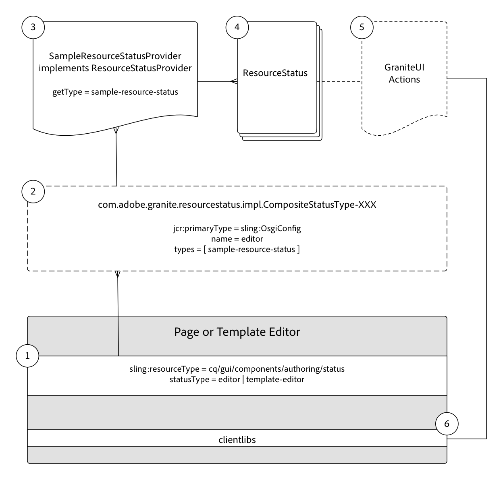

# 开发资源状态 {#developing-resource-statuses-in-aem-sites}

Adobe Experience Manager的资源状态API是一个可插件的框架，用于在AEM的各种编辑器Web UI中公开状态消息传递。

## 概述 {#overview}

编辑器资源状态框架提供了服务器端和客户端API，用于以标准和统一的方式显示编辑器状态并与编辑器状态交互。

编辑器状态栏在AEM的页面、体验片段和模板编辑器中本地可用。

自定义资源状态提供程序的示例用例包括：

* 在页面处于计划激活后的2小时内通知作者
* 通知作者，页面在过去15分钟内已激活
* 通知作者，页面在过去5分钟内进行了编辑，以及由谁编辑


## 资源状态提供程序框架 {#resource-status-provider-framework}

在开发自定义资源状态时，开发工作包括：

1. ResourceStatusProvider实现，负责确定是否需要状态，以及有关状态的基本信息：标题、消息、优先级、变体、图标和可用操作。
2. （可选）GraniteUI JavaScript，用于实现任何可用操作的功能。

   

3. 作为页面、体验片段和模板编辑器的一部分提供的状态资源通过资源»[!DNL statusType]”属性。

   * 页面编辑器： `editor`
   * 体验片段编辑器： `editor`
   * 模板编辑器： `template-editor`

4. 状态资源的 `statusType` 与已注册的匹配 `CompositeStatusType` 已配置OSGi `name` 属性。

   对于所有匹配， `CompositeStatusType's` 类型将被收集并用于收集 `ResourceStatusProvider` 具有此类型的实施，通过 `ResourceStatusProvider.getType()`.

5. 匹配 `ResourceStatusProvider` 传递给 `resource` 在编辑器中，并确定 `resource` 具有要显示的状态。 如果需要状态，则此实施负责生成0个或多个 `ResourceStatuses` 返回，每个字段表示要显示的状态。

   通常， `ResourceStatusProvider` 返回0或1 `ResourceStatus` 每 `resource`.

6. ResourceStatus是一个可由客户实现的接口，或是 `com.day.cq.wcm.commons.status.EditorResourceStatus.Builder` 可用于构造状态。 状态包括：

   * 标题
   * 消息
   * 图标
   * 变量
   * 优先级
   * 操作
   * 数据

7. （可选）如果 `Actions` 提供给 `ResourceStatus` 对象，需要支持clientlibs才能将功能绑定到状态栏中的操作链接。

   ```js
   (function(jQuery, document) {
       'use strict';
   
       $(document).on('click', '.editor-StatusBar-action[data-status-action-id="do-something"]', function () {
           // Do something on the click of the resource status action
   
       });
   })(jQuery, document);
   ```

8. 任何支持这些操作的JavaScript或CSS都必须通过每个编辑器各自的客户端库进行代理，以确保编辑器中提供前端代码。

   * 页面编辑器类别： `cq.authoring.editor.sites.page`
   * 体验片段编辑器类别： `cq.authoring.editor.sites.page`
   * 模板编辑器类别： `cq.authoring.editor.sites.template`

## 查看代码 {#view-the-code}

[请参阅GitHub上的代码](https://github.com/Adobe-Consulting-Services/acs-aem-samples/tree/master/bundle/src/main/java/com/adobe/acs/samples/resourcestatus/impl/SampleEditorResourceStatusProvider.java)

## 其他资源 {#additional-resources}

* [`com.adobe.granite.resourcestatus` JavaDocs](https://helpx.adobe.com/experience-manager/6-5/sites/developing/using/reference-materials/javadoc/com/adobe/granite/resourcestatus/package-summary.html)
* [`com.day.cq.wcm.commons.status.EditorResourceStatus` JavaDocs](https://helpx.adobe.com/experience-manager/6-5/sites/developing/using/reference-materials/javadoc/com/day/cq/wcm/commons/status/EditorResourceStatus.html)
