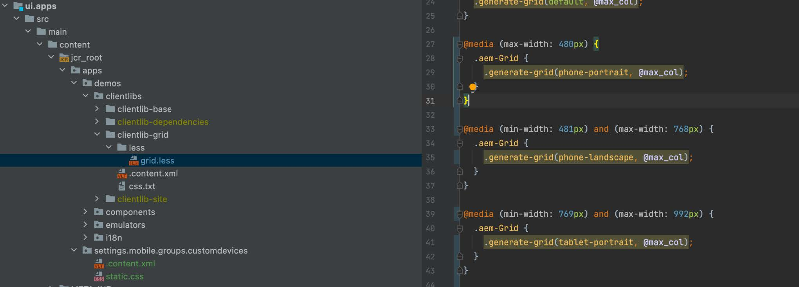

# 响应式断点

了解如何为AEM响应式页面编辑器配置新的响应式断点。

## 创建CSS断点

首先，在AEM响应式网格CSS中创建响应AEM站点所遵循的媒体断点。

在`/ui.apps/src/main/content/jcr_root/apps/[app name]/clientlibs/clientlib-grid/less/grid.less`文件中，创建要与移动设备模拟器一起使用的断点。 记下每个断点的`max-width`，因为这会将CSS断点映射到AEM响应式页面编辑器断点。

## 自定义模板的断点

打开`ui.content/src/main/content/jcr_root/conf/<app name>/settings/wcm/templates/page-content/structure/.content.xml`文件并使用新断点节点定义更新`cq:responsive/breakpoints`。 每个[CSS断点](#create-new-css-breakpoints)应在`breakpoints`下有一个对应的节点，其`width`属性设置为CSS断点的`max-width`。

## 创建模拟器

必须定义AEM模拟器，以允许作者在页面编辑器中选择要编辑的响应式视图。

在`/ui.apps/src/main/content/jcr_root/apps/<app name>/emulators`下创建模拟器节点

例如，`/ui.apps/src/main/content/jcr_root/apps/wknd-examples/emulators/phone-landscape`。将引用模拟器节点从CRXDE Lite中的`/libs/wcm/mobile/components/emulators`复制到并更新副本以加快节点定义。

## 创建设备组

将模拟器分组以[使其在AEM页面编辑器](#update-the-templates-device-group)中可用。

在`/ui.apps/src/main/content/jcr_root`下创建`/apps/settings/mobile/groups/<name of device group>`节点结构。

在`/apps/settings/mobile/groups/<device group name>`中创建一个`.content.xml`文件并定义
新模拟器使用的代码类似于以下代码：

## 更新模板的设备组

最后，将设备组映射回页面模板，以便可以在页面编辑器中为使用此模板创建的页面使用模拟器。

打开`ui.content/src/main/content/jcr_root/conf/[app name]/settings/wcm/templates/page-content/structure/.content.xml`文件并更新`cq:deviceGroups`属性以引用新的移动组（例如，`cq:deviceGroups="[mobile/groups/customdevices]"`）
