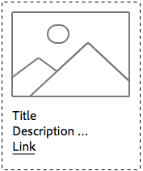
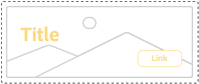

# 了解样式系统最佳实践{#understanding-style-organization-with-the-aem-style-system}

>[!NOTE]
>
>请在以下位置查看内容： [了解如何为样式系统编码](style-system-technical-video-understand.md)，以确保了解AEM Style System使用的类似BEM的约定。

AEM Style System有两种主要风格或样式：

* **布局样式**
* **显示样式**

**布局样式** 会影响组件的许多元素，以创建组件的明确定义和可识别的演绎版（设计和布局），通常与特定的可重复使用的品牌概念保持一致。 例如，Teaser组件可能能够以基于卡片的传统布局、水平促销样式或作为主页布局呈现，从而叠加图像上的文本。

**显示样式** 用于影响布局样式的次要变体，但是它们不会更改布局样式的基本性质或意图。 例如，主页布局样式可能具有显示样式，这些显示样式将颜色方案从主要品牌颜色方案更改为次要品牌颜色方案。

## 样式组织最佳实践 {#style-organization-best-practices}

在定义AEM作者可用的样式名称时，最好：

* 使用作者能够理解的词汇表命名样式
* 最小化样式选项的数量
* 仅显示品牌标准允许的样式选项和组合
* 仅显示具有效果的样式组合
   * 如果暴露无效组合，请确保它们至少不会产生不良影响

随着AEM作者可用的可能样式组合数量的增加，存在的必须进行QA并根据品牌标准进行验证的排列方式越多。 太多选项也可能使作者感到困惑，因为可能不清楚需要哪个选项或组合才能达到预期效果。

### 样式名称与CSS类的比较 {#style-names-vs-css-classes}

样式名称，或呈现给AEM作者的选项，以及实现CSS类名称在AEM中是分离的。

这允许“样式”选项以清楚的词汇进行标记并供AEM作者理解，但允许CSS开发人员以未来校对的语义方式命名CSS类。 例如：

组件必须具有使用品牌颜色显示的选项 **主要** 和 **辅助** 但是，AEM作者将颜色视为 **绿色** 和 **黄色**，而不是主要和次要的设计语言。

AEM样式系统可以使用作者友好标签公开这些着色显示样式 **绿色** 和 **黄色**，同时允许CSS开发人员使用 `.cmp-component--primary-color` 和 `.cmp-component--secondary-color` 以定义CSS中的实际样式实施。

的样式名称 **绿色** 映射到 `.cmp-component--primary-color`、和 **黄色** 到 `.cmp-component--secondary-color`.

如果公司的品牌颜色在将来发生变化，则只需对进行单个实施即可 `.cmp-component--primary-color` 和 `.cmp-component--secondary-color`和样式名称之间的关联。

## Teaser组件作为示例用例 {#the-teaser-component-as-an-example-use-case}

以下是将Teaser组件样式设置为具有多种不同的布局和显示样式的示例用例。

这将探索样式名称（向作者公开）的方式以及后备CSS类的组织方式。

### Teaser组件样式配置 {#component-styles-configuration}

下图显示了 [!UICONTROL 样式] 使用案例中讨论的变体的Teaser组件配置。

此 [!UICONTROL 样式组] 名称、布局和显示（按意外情况）与显示样式的一般概念匹配，而本文中的布局样式用于从概念上对样式类型进行分类。

此 [!UICONTROL 样式组] 名称和编号 [!UICONTROL 样式组] 应针对组件用例和特定于项目的组件样式约定进行定制。

例如， **显示** 样式组名称可能已被命名 **颜色**.


### 样式选择菜单 {#style-selection-menu}

下图显示了 [!UICONTROL 样式] 菜单作者可与交互以为组件选择适当的样式。 请注意 [!UICONTROL 样式图表] 名称以及样式名称均向作者公开。


### 默认样式 {#default-style}

默认样式通常是组件最常用的样式，以及在添加到页面时Teaser的默认无样式视图。

根据默认样式的通用性，CSS可以直接应用于 `.cmp-teaser` （无任何修饰符）或在 `.cmp-teaser--default`.

如果默认样式规则更常应用于所有变体，则最好使用 `.cmp-teaser` 作为默认样式的CSS类，因为所有变体都应隐式继承它们，前提是遵循类似于BEM的约定。 如果不适用，则应通过默认修饰符应用这些参数，例如 `.cmp-teaser--default`，则需要将它们添加到 [组件的样式配置的默认CSS类](#component-styles-configuration) 字段，否则必须在每个变体中覆盖这些样式规则。

甚至可以将“已命名”样式指定为默认样式，例如“主页”样式 `(.cmp-teaser--hero)` 定义，但是对于 `.cmp-teaser` 或 `.cmp-teaser--default` CSS类实施。

>[!NOTE]
>
>请注意，默认布局样式没有“显示”样式名称，但是，作者可以在“AEM样式系统”选择工具中选择“显示”选项。
>
>这违反了最佳做法：
>
>**仅显示具有效果的样式组合**
>
>如果作者选择显示样式 **绿色** 什么都不会发生。
>
>在此使用案例中，我们将承认此违规，因为所有其他布局样式必须使用品牌颜色进行着色。
>
>在 **促销（右对齐）** 部分中，我们将了解如何防止不需要的样式组合。



* **布局样式**
   * 默认
* **显示样式**
   * 无
* **有效的CSS类**： `.cmp-teaser--promo` 或 `.cmp-teaser--default`

### 促销样式 {#promo-style}

此 **促销布局样式** 用于推广网站上的高价值内容，并水平布局以占用网页上的一小段空间，并且必须能够通过品牌颜色保持样式（默认促销布局样式使用黑色文本）。

实现这一点， **布局样式** 之 **促销** 和 **显示样式** 之 **绿色** 和 **黄色** 在AEM样式系统中为Teaser组件配置。

#### 促销默认


* **布局样式**
   * 样式名称： **促销**
   * CSS类： `cmp-teaser--promo`
* **显示样式**
   * 无
* **有效的CSS类**： `.cmp-teaser--promo`

#### 主要促销


* **布局样式**
   * 样式名称： **促销**
   * CSS类： `cmp-teaser--promo`
* **显示样式**
   * 样式名称： **绿色**
   * CSS类： `cmp-teaser--primary-color`
* **有效的CSS类**： `cmp-teaser--promo.cmp-teaser--primary-color`

#### 促销次要


* **布局样式**
   * 样式名称： **促销**
   * CSS类： `cmp-teaser--promo`
* **显示样式**
   * 样式名称： **黄色**
   * CSS类： `cmp-teaser--secondary-color`
* **有效的CSS类**： `cmp-teaser--promo.cmp-teaser--secondary-color`

### 促销右对齐样式 {#promo-r-align}

此 **促销活动靠右对齐** 布局样式是“促销”样式的变体，它使图像和文本（右为图像，左为文本）的位置反转。

右对齐方式的核心是显示样式，可以将它作为显示样式输入到“AEM样式系统”中，该显示样式与“促销”布局样式一起选择。 这违反了以下最佳实践：

**仅显示具有效果的样式组合**

..已经违反了 [默认样式](#default-style).

由于正确对齐仅影响“促销”布局样式，而不影响其他两种布局样式：默认样式和主页样式，因此我们可以创建新的布局样式“促销”（右对齐），其中包括对“促销”布局样式内容进行右对齐的CSS类： `cmp -teaser--alternate`.

将多个样式组合到一个样式条目中还可以帮助减少可用样式和样式排列的数目，这是最好最小化的。

注意CSS类的名称， `cmp-teaser--alternate`，不必与便于作者使用的“right aligned”命名法相匹配。

#### 促销右对齐默认值


* **布局样式**
   * 样式名称： **促销（右对齐）**
   * CSS类： `cmp-teaser--promo cmp-teaser--alternate`
* **显示样式**
   * 无
* **有效的CSS类**： `.cmp-teaser--promo.cmp-teaser--alternate`

#### 促销活动右对齐主要播放器


* **布局样式**
   * 样式名称： **促销（右对齐）**
   * CSS类： `cmp-teaser--promo cmp-teaser--alternate`
* **显示样式**
   * 样式名称： **绿色**
   * CSS类： `cmp-teaser--primary-color`
* **有效的CSS类**： `.cmp-teaser--promo.cmp-teaser--alternate.cmp-teaser--primary-color`

#### 促销右对齐次要


* **布局样式**
   * 样式名称： **促销（右对齐）**
   * CSS类： `cmp-teaser--promo cmp-teaser--alternate`
* **显示样式**
   * 样式名称： **黄色**
   * CSS类： `cmp-teaser--secondary-color`
* **有效的CSS类**： `.cmp-teaser--promo.cmp-teaser--alternate.cmp-teaser--secondary-color`

### 英雄风格 {#hero-style}

主页布局样式将组件的图像显示为背景，并叠加标题和链接。 主页布局样式（与促销布局样式类似）必须使用品牌颜色进行上色。

要使用品牌颜色为主页布局样式着色，可以使用与促销布局样式相同的显示样式。

每个组件的样式名称均被映射到一组CSS类，这意味着为促销布局样式的背景着色的CSS类名称必须为主页布局样式的文本和链接着色。

可以通过设定CSS规则的范围轻松实现此目标，但是，这要求CSS开发人员了解这些排列如何在AEM上实施。

用于为背景着色的CSS **提升** 主色（绿色）的布局样式：

```css
.cmp-teaser--promo.cmp-teaser--primary--color {
   ...
   background-color: green;
   ...
}
```

用于为文本着色的CSS **英雄** 主色（绿色）的布局样式：

```css
.cmp-teaser--hero.cmp-teaser--primary--color {
   ...
   color: green;
   ...
}
```

#### 主页默认值


* **布局样式**
   * 样式名称： **英雄**
   * CSS类： `cmp-teaser--hero`
* **显示样式**
   * 无
* **有效的CSS类**： `.cmp-teaser--hero`

#### 主页主要


* **布局样式**
   * 样式名称： **促销**
   * CSS类： `cmp-teaser--hero`
* **显示样式**
   * 样式名称： **绿色**
   * CSS类： `cmp-teaser--primary-color`
* **有效的CSS类**： `cmp-teaser--hero.cmp-teaser--primary-color`

#### 主页次要



* **布局样式**
   * 样式名称： **促销**
   * CSS类： `cmp-teaser--hero`
* **显示样式**
   * 样式名称： **黄色**
   * CSS类： `cmp-teaser--secondary-color`
* **有效的CSS类**： `cmp-teaser--hero.cmp-teaser--secondary-color`

## 其他资源 {#additional-resources}

* [样式系统文档](https://helpx.adobe.com/experience-manager/6-5/sites/authoring/using/style-system.html)
* [创建AEM客户端库](https://helpx.adobe.com/cn/experience-manager/6-5/sites/developing/using/clientlibs.html)
* [BEM（块元素修饰符）文档网站](https://getbem.com/)
* [LESS文档网站](https://lesscss.org/)
* [jQuery网站](https://jquery.com/)
