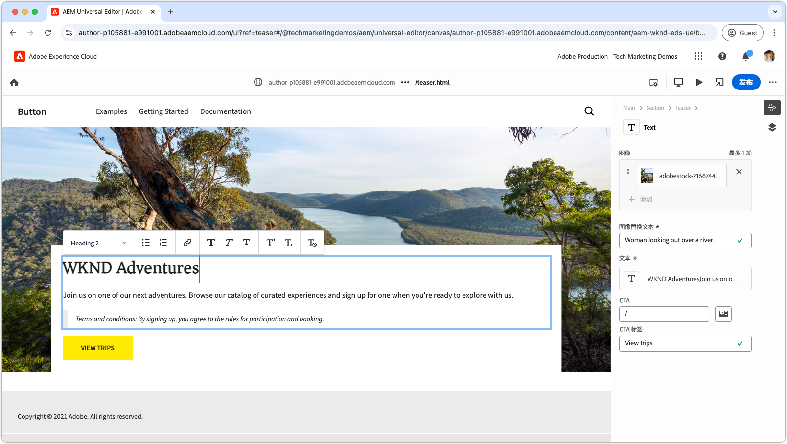
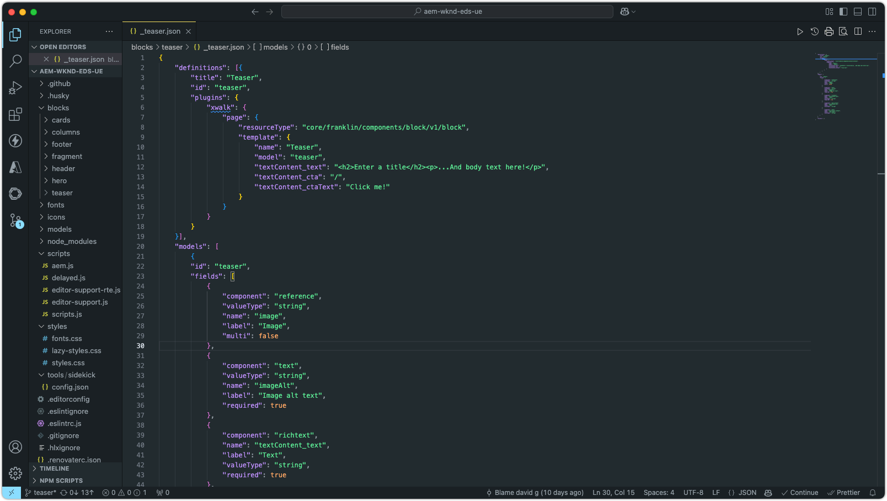

# Edge Delivery Services 和 Universal Editor 开发人员教程

在本教程中，您将学习构建 AEM 网站的基础知识，该网站将强大的创作功能与通用编辑器相结合，并利用 Edge Delivery Services 实现闪电般的快速投放。到教程结束时，你将会基本了解如何创建新项目、设置本地开发环境以及构建新区块。

## 项目设置

了解如何在 AEM as a Cloud Service 中创建代码项目和配置新网站。此设置支持使用通用编辑器进行无缝开发，以创建内容并通过 Edge Delivery Services 快速投放内容。

<!-- CARDS 

* ./1-new-code-project.md
* ./2-new-aem-site.md

-->
<!-- START CARDS HTML - DO NOT MODIFY BY HAND -->

    

        

            

                <figure class="image x-is-16by9">
                    
                </figure>
            

            

                

                    

                        <a href="./1-new-code-project.md" target="_blank" rel="referrer" title="创建代码项目 ">创建代码项目 </a>
                    

                    
为 Edge Delivery Services 创建一个代码项目，该项目可通过通用编辑器进行编辑。

                

                <a href="./1-new-code-project.md" target="_blank" rel="referrer" class="spectrum-Button spectrum-Button--outline spectrum-Button--primary spectrum-Button--sizeM" style="align-self: flex-start; margin-top: 1rem;">
                    了解详情
                </a>
            

        

    

    

        

            

                <figure class="image x-is-16by9">
                    
                </figure>
            

            

                

                    

                        <a href="./2-new-aem-site.md" target="_blank" rel="referrer" title="创建 AEM 网站">创建 AEM 网站</a>
                    

                    
在 AEM Sites 中为 Edge Delivery Services 创建一个网站，该网站可通过通用编辑器进行编辑。

                

                <a href="./2-new-aem-site.md" target="_blank" rel="referrer" class="spectrum-Button spectrum-Button--outline spectrum-Button--primary spectrum-Button--sizeM" style="align-self: flex-start; margin-top: 1rem;">
                    了解详情
                </a>
            

        

    

<!-- END CARDS HTML - DO NOT MODIFY BY HAND -->

## 开发设置

了解如何配置本地开发环境，以实现快速网站开发。这种设置可通过通用编辑器无缝地创建网站，并通过 Edge Delivery Services 实现高效的内容投放，确保开发工作流程顺畅且优化。
<!-- CARDS 

* ./3-local-development-environment.md
* ./4-website-branding.md

-->
<!-- START CARDS HTML - DO NOT MODIFY BY HAND -->

    

        

            

                <figure class="image x-is-16by9">
                    
                </figure>
            

            

                

                    

                        <a href="./3-local-development-environment.md" target="_blank" rel="referrer" title="设置本地开发环境">设置本地开发环境</a>
                    

                    
为通过 Edge Delivery Services 投放且可通过通用编辑器编辑的网站设置本地开发环境。

                

                <a href="./3-local-development-environment.md" target="_blank" rel="referrer" class="spectrum-Button spectrum-Button--outline spectrum-Button--primary spectrum-Button--sizeM" style="align-self: flex-start; margin-top: 1rem;">
                    了解详情
                </a>
            

        

    

    

        

            

                <figure class="image x-is-16by9">
                    
                </figure>
            

            

                

                    

                        <a href="./4-website-branding.md" target="_blank" rel="referrer" title="添加网站品牌">添加网站品牌</a>
                    

                    
为 Edge Delivery Services 网站定义全局 CSS、CSS 变量和 Web 字体。

                

                <a href="./4-website-branding.md" target="_blank" rel="referrer" class="spectrum-Button spectrum-Button--outline spectrum-Button--primary spectrum-Button--sizeM" style="align-self: flex-start; margin-top: 1rem;">
                    了解详情
                </a>
            

        

    

<!-- END CARDS HTML - DO NOT MODIFY BY HAND -->

## 区块开发

了解如何通过定义内容模型并为测试和开发设置示例内容来创建新区块。探索两种渲染该区块的方法，并了解如何在 AEM 和 Edge Delivery Services 中对其进行结构化，以实现最佳性能和灵活性。

<!-- CARDS 

* ./5-new-block.md {image = ./assets/5-new-block/card.png}
* ./6-author-block.md {image = ./assets/6-author-block/card.png}
* ./7a-block-css.md {image = ./assets/7a-block-css/card.png}
* ./7b-block-js-css.md {image = ./assets/7b-block-js-css/card.png}

-->
<!-- START CARDS HTML - DO NOT MODIFY BY HAND -->

    

        

            

                <figure class="image x-is-16by9">
                    
                </figure>
            

            

                

                    

                        <a href="./5-new-block.md" target="_blank" rel="referrer" title="创建一个区块">创建一个区块</a>
                    

                    
为 Edge Delivery Services 网站构建一个可通过通用编辑器进行编辑的区块。

                

                <a href="./5-new-block.md" target="_blank" rel="referrer" class="spectrum-Button spectrum-Button--outline spectrum-Button--primary spectrum-Button--sizeM" style="align-self: flex-start; margin-top: 1rem;">
                    了解详情
                </a>
            

        

    

    

        

            

                <figure class="image x-is-16by9">
                    
                </figure>
            

            

                

                    

                        <a href="./6-author-block.md" target="_blank" rel="referrer" title="创作区块">创作区块</a>
                    

                    
使用通用编辑器创作 Edge Delivery Services 区块。

                

                <a href="./6-author-block.md" target="_blank" rel="referrer" class="spectrum-Button spectrum-Button--outline spectrum-Button--primary spectrum-Button--sizeM" style="align-self: flex-start; margin-top: 1rem;">
                    了解详情
                </a>
            

        

    

    

        

            

                <figure class="image x-is-16by9">
                    
                </figure>
            

            

                

                    

                        <a href="./7a-block-css.md" target="_blank" rel="referrer" title="使用 CSS 开发一个区块">使用 CSS 开发一个区块</a>
                    

                    
使用 CSS 为 Edge Delivery Services 开发一个区块，该区块可通过通用编辑器进行编辑。

                

                <a href="./7a-block-css.md" target="_blank" rel="referrer" class="spectrum-Button spectrum-Button--outline spectrum-Button--primary spectrum-Button--sizeM" style="align-self: flex-start; margin-top: 1rem;">
                    了解详情
                </a>
            

        

    

    

        

            

                <figure class="image x-is-16by9">
                    
                </figure>
            

            

                

                    

                        <a href="./7b-block-js-css.md" target="_blank" rel="referrer" title="使用 CSS 和 JS 开发一个区块">使用 CSS 和 JS 开发一个区块</a>
                    

                    
使用 CSS 和 JavaScript 为 Edge Delivery Services 开发一个区块，该区块可通过通用编辑器进行编辑。

                

                <a href="./7b-block-js-css.md" target="_blank" rel="referrer" class="spectrum-Button spectrum-Button--outline spectrum-Button--primary spectrum-Button--sizeM" style="align-self: flex-start; margin-top: 1rem;">
                    了解详情
                </a>
            

        

    

<!-- END CARDS HTML - DO NOT MODIFY BY HAND -->

## 后续步骤

既然你已经完成了本教程，那就利用这些有针对性的操作指南来巩固所学知识吧。这些指南在此处涵盖的代码和概念基础上进行了扩展，探讨了特定角色的用例、高级技术以及提升 Edge Delivery Services 和通用编辑器开发技能的其他技巧。

<!-- CARDS 

* ./how-to/block-options.md
* ./how-to/header-and-footer.md
* ./how-to/local-extension-preview.md {image = ./how-to/assets/local-extension-preview/extension-loaded.png}

-->
<!-- START CARDS HTML - DO NOT MODIFY BY HAND -->

    

        

            

                <figure class="image x-is-16by9">
                    
                </figure>
            

            

                

                    

                        <a href="./how-to/block-options.md" target="_blank" rel="referrer" title="区块选项">区块选项</a>
                    

                    
了解如何构建具有多个显示选项的区块。

                

                <a href="./how-to/block-options.md" target="_blank" rel="referrer" class="spectrum-Button spectrum-Button--outline spectrum-Button--primary spectrum-Button--sizeM" style="align-self: flex-start; margin-top: 1rem;">
                    了解详情
                </a>
            

        

    

    

        

            

                <figure class="image x-is-16by9">
                    
                </figure>
            

            

                

                    

                        <a href="./how-to/header-and-footer.md" target="_blank" rel="referrer" title="页眉和页脚">页眉和页脚</a>
                    

                    
了解如何在 Edge Delivery Services 和通用编辑器中开发页眉和页脚。

                

                <a href="./how-to/header-and-footer.md" target="_blank" rel="referrer" class="spectrum-Button spectrum-Button--outline spectrum-Button--primary spectrum-Button--sizeM" style="align-self: flex-start; margin-top: 1rem;">
                    了解详情
                </a>
            

        

    

    

        

            

                <figure class="image x-is-16by9">
                    
                </figure>
            

            

                

                    

                        <a href="./how-to/local-extension-preview.md" target="_blank" rel="referrer" title="预览通用编辑器扩展">预览通用编辑器扩展</a>
                    

                    
了解如何在开发过程中预览本地运行的通用编辑器扩展。

                

                <a href="./how-to/local-extension-preview.md" target="_blank" rel="referrer" class="spectrum-Button spectrum-Button--outline spectrum-Button--primary spectrum-Button--sizeM" style="align-self: flex-start; margin-top: 1rem;">
                    了解详情
                </a>
            

        

    

<!-- END CARDS HTML - DO NOT MODIFY BY HAND -->
