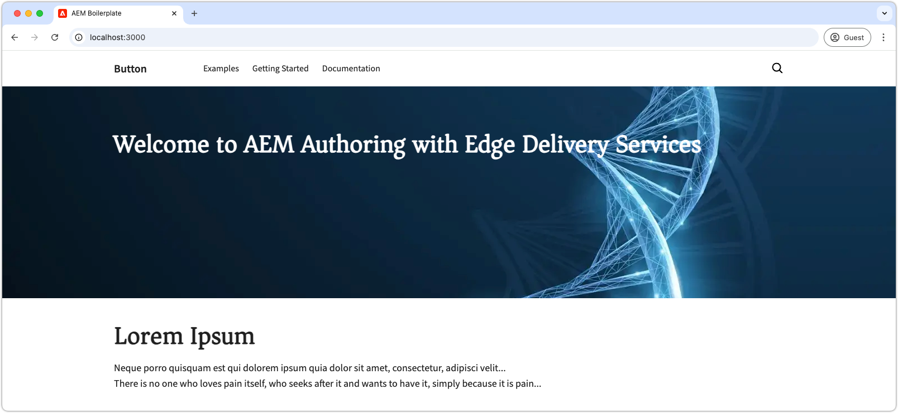

# 添加网站品牌

首先，通过更新全局样式、定义 CSS 变量和添加 Web 字体来建立整体品牌。这些基础元素可确保网站保持一致性和可维护性，应在整个网站中统一应用。

## 创建 GitHub 问题

为确保一切井然有序，使用 GitHub 来跟踪工作进展。首先，为这项工作创建一个 GitHub 问题：

1. 前往 GitHub 存储库（详情请参阅[创建代码项目](./1-new-code-project.md)章节）。
2. 点击&#x200B;**问题**&#x200B;选项卡，然后点击&#x200B;**新建问题**。
3. 为待完成的工作撰写&#x200B;**标题**&#x200B;和&#x200B;**描述**。
4. 点击&#x200B;**提交新问题**。

GitHub 问题稍后会在[创建拉取请求](#merge-code-changes)时使用。


## 创建一个工作分支

为了保持代码的组织性并确保代码质量，请为每个工作主体创建一个新的分支。这种做法可以防止新代码对性能产生负面影响，并确保更改在完成之前不会生效。

本章主要介绍网站的基本样式，请创建一个名为 `wknd-styles` 的分支。

```bash
# ~/Code/aem-wknd-eds-ue

$ git checkout -b wknd-styles
```

## 全局 CSS

Edge Delivery Services 使用位于 `styles/styles.css` 的全球 CSS 文件来设置整个网站的通用样式。`styles.css` 控制着颜色、字体和间距等各个方面，确保整个网站看起来一致。

全局 CSS 应不受区块等低级结构的影响，并专注于网站的整体外观和感觉，以及共享的视觉处理。

请记住，在需要时可以覆盖全局 CSS 样式。

### CSS 变量

[CSS 变量](https://developer.mozilla.org/en-US/docs/Web/CSS/Using_CSS_custom_properties)是存储颜色、字体和大小等设计设置的好方法。通过使用变量，你可以在一个地方更改这些元素，并使其在整个网站中更新。

要开始自定义 CSS 变量，请按照以下步骤操作：

1. 在代码编辑器中打开 `styles/styles.css` 文件。
2. 找到 `:root` 声明，全局 CSS 变量就存储在这里。
3. 修改颜色和字体变量，以符合 WKND 品牌风格。

以下是一个示例：


```css
/* styles/styles.css */

:root {
  /* colors */
  --primary-color: rgb(255, 234, 3); /* WKND primary color */
  --secondary-color: rgb(32, 32, 32); /* Secondary brand color */
  --background-color: white; /* Background color */
  --light-color: rgb(235, 235, 235); /* Light background color */
  --dark-color: var(--secondary-color); /* Dark text color */
  --text-color: var(--secondary-color); /* Default text color */
  --link-color: var(--text-color); /* Link color */
  --link-hover-color: black; /* Link hover color */

  /* fonts */
  --heading-font: 'Roboto', sans-serif; /* Heading font */
  --body-font: 'Open Sans', sans-serif; /* Body font */
  --base-font-size: 16px; /* Base font size */
}
```

探索 `:root` 部分中的其他变量，并查看默认设置。

在开发网站时，如果你发现自己重复使用相同的 CSS 值，可以考虑创建新的变量，以便更轻松地管理样式。其他可以从 CSS 变量中受益的 CSS 属性包括：`border-radius`、`padding`、`margin` 和 `box-shadow`。

### 裸元素

裸元素直接通过其元素名称进行样式设置，而不是使用 CSS 类。例如，不是对 `.page-heading` CSS 类进行样式设置，而是使用 `h1 { ... }` 将样式应用于 `h1` 元素。

在 `styles/styles.css` 文件中，有一组基础样式被应用于裸 HTML 元素。Edge Delivery Services 网站优先考虑使用裸元素，因为它们与 Edge Delivery Service 的原生语义 HTML 相一致。

为了与 WKND 品牌风格保持一致，让我们在 `styles.css` 中对一些基础元素进行样式设置：

```css
/* styles/styles.css */

...
h2 {
  font-size: var(--heading-font-size-xl); /* Set font size for h2 */
}

/* Add a partial yellow underline under H2 */
h2::after {
  border-bottom: 2px solid var(--primary-color); /* Yellow underline */
  content: "";
  display: block;
  padding-top: 8px;
  width: 84px;
}
...
```

这些样式确保 `h2` 元素（除非被覆盖）与 WKND 品牌风格保持一致，有助于创建清晰的视觉层次结构。每个 `h2` 下方的部分黄色下划线为标题增添了独特的风采。

### 推断元素

在 Edge Delivery Services 中，该项目的 `scripts.js` 和 `aem.js` 代码会根据 HTML 中特定裸 HTML 元素的上下文自动对其进行增强。

例如，如果锚点 (`<a>`) 元素单独占一行，而不是与周围文本内联，则根据上下文推断其为按钮。这些锚点会被自动包裹在一个带有 CSS 类 `button-container` 的容器 `div` 中，且锚点元素会添加一个 `button` CSS 类。

例如，当链接单独占一行时，Edge Delivery Services JavaScript 会将其 DOM 更新为以下内容：

```html
<p class="button-container">
  <a href="/authored/link" title="Click me" class="button">Click me</a>
</p>
```

这些按钮可以定制，以符合 WKND 品牌的要求——即按钮应呈现为黄色矩形，并带有黑色文字。

以下是在 `styles.css` 中如何为“推断按钮”设置样式的示例：

```css
/* styles/styles.css */

/* Buttons */
a.button:any-link,
button {
  box-sizing: border-box;
  display: inline-block;
  max-width: 100%;
  margin: 12px 0;
  border: 2px solid transparent;
  padding: 0.5em 1.2em;
  font-family: var(--body-font-family);
  font-style: normal;
  font-weight: 500;
  line-height: 1.25;
  text-align: center;
  text-decoration: none;
  cursor: pointer;
  overflow: hidden;
  text-overflow: ellipsis;
  white-space: nowrap;

  /* WKND specific treatments */
  text-transform: uppercase;
  background-color: var(--primary-color);
  color: var(--dark-color);
  border-radius: 0;
}
```

此 CSS 定义了基础按钮样式，并包含了针对 WKND 的特定处理，如大写文本、黄色背景和黑色文本。`background-color` 和 `color` 属性使用 CSS 变量，使按钮样式与品牌颜色保持一致。这种方法确保了按钮在整个网站中的样式保持一致，同时保持灵活性。

## Web 字体

Edge Delivery Services 项目优化了 Web 字体的使用，以保持高性能并最大限度地减少对 Lighthouse 分数的影响。这种方法可确保快速渲染，同时不损害网站的视觉识别度。以下是有效实现 Web 字体以获得最佳性能的方法。

### 字体外观

在 `styles/fonts.css` 文件中，使用 CSS `@font-face` 声明来添加自定义 Web 字体。将 `@font-faces` 添加到 `fonts.css` 中，可确保网络字体在最佳时间加载，从而有助于保持 Lighthouse 得分。

1. 打开 `styles/fonts.css`。
2. 添加以下 `@font-face` 声明以包含 WKND 品牌字体：`Asar` 和 `Source Sans Pro`。

```css
/* styles/fonts.css */

@font-face {
  font-family: Asar;
  font-style: normal;
  font-weight: 400;
  font-display: swap;
  src: url("https://fonts.gstatic.com/s/asar/v22/sZlLdRyI6TBIbkEaDZtQS6A.woff2") format('woff2');
  unicode-range: U+0000-00FF, U+0131, U+0152-0153, U+02BB-02BC, U+02C6, U+02DA, U+02DC, U+0304, U+0308, U+0329, U+2000-206F, U+20AC, U+2122, U+2191, U+2193, U+2212, U+2215, U+FEFF, U+FFFD;
}

@font-face {
  font-family: 'Source Sans Pro';
  font-style: italic;
  font-weight: 300;
  font-display: swap;
  src: url("https://fonts.gstatic.com/s/sourcesanspro/v22/6xKwdSBYKcSV-LCoeQqfX1RYOo3qPZZMkids18S0xR41.woff2") format('woff2');
  unicode-range: U+0000-00FF, U+0131, U+0152-0153, U+02BB-02BC, U+02C6, U+02DA, U+02DC, U+0304, U+0308, U+0329, U+2000-206F, U+20AC, U+2122, U+2191, U+2193, U+2212, U+2215, U+FEFF, U+FFFD;
}

@font-face {
  font-family: 'Source Sans Pro';
  font-style: italic;
  font-weight: 400;
  font-display: swap;
  src: url("https://fonts.gstatic.com/s/sourcesanspro/v22/6xK1dSBYKcSV-LCoeQqfX1RYOo3qPZ7nsDJB9cme.woff2") format('woff2');
  unicode-range: U+0000-00FF, U+0131, U+0152-0153, U+02BB-02BC, U+02C6, U+02DA, U+02DC, U+0304, U+0308, U+0329, U+2000-206F, U+20AC, U+2122, U+2191, U+2193, U+2212, U+2215, U+FEFF, U+FFFD;
}

@font-face {
  font-family: 'Source Sans Pro';
  font-style: italic;
  font-weight: 600;
  font-display: swap;
  src: url("https://fonts.gstatic.com/s/sourcesanspro/v22/6xKwdSBYKcSV-LCoeQqfX1RYOo3qPZY4lCds18S0xR41.woff2") format('woff2');
  unicode-range: U+0000-00FF, U+0131, U+0152-0153, U+02BB-02BC, U+02C6, U+02DA, U+02DC, U+0304, U+0308, U+0329, U+2000-206F, U+20AC, U+2122, U+2191, U+2193, U+2212, U+2215, U+FEFF, U+FFFD;
}

@font-face {
  font-family: 'Source Sans Pro';
  font-style: normal;
  font-weight: 300;
  font-display: swap;
  src: url("https://fonts.gstatic.com/s/sourcesanspro/v22/6xKydSBYKcSV-LCoeQqfX1RYOo3ik4zwlxdu3cOWxw.woff2") format('woff2');
  unicode-range: U+0000-00FF, U+0131, U+0152-0153, U+02BB-02BC, U+02C6, U+02DA, U+02DC, U+0304, U+0308, U+0329, U+2000-206F, U+20AC, U+2122, U+2191, U+2193, U+2212, U+2215, U+FEFF, U+FFFD;
}

@font-face {
  font-family: 'Source Sans Pro';
  font-style: normal;
  font-weight: 400;
  font-display: swap;
  src: url("https://fonts.gstatic.com/s/sourcesanspro/v22/6xK3dSBYKcSV-LCoeQqfX1RYOo3qOK7lujVj9w.woff2") format('woff2');
  unicode-range: U+0000-00FF, U+0131, U+0152-0153, U+02BB-02BC, U+02C6, U+02DA, U+02DC, U+0304, U+0308, U+0329, U+2000-206F, U+20AC, U+2122, U+2191, U+2193, U+2212, U+2215, U+FEFF, U+FFFD;
}

@font-face {
  font-family: 'Source Sans Pro';
  font-style: normal;
  font-weight: 600;
  font-display: swap;
  src: url("https://fonts.gstatic.com/s/sourcesanspro/v22/6xKydSBYKcSV-LCoeQqfX1RYOo3i54rwlxdu3cOWxw.woff2") format('woff2');
  unicode-range: U+0000-00FF, U+0131, U+0152-0153, U+02BB-02BC, U+02C6, U+02DA, U+02DC, U+0304, U+0308, U+0329, U+2000-206F, U+20AC, U+2122, U+2191, U+2193, U+2212, U+2215, U+FEFF, U+FFFD;
}
```

本教程中使用的字体来源于 Google Fonts，但 Web 字体可以从任何字体提供商处获取，其中包括 [Adobe Fonts](https://fonts.adobe.com/)。

+++ 使用本地 Web 字体文件

或者，将 Web 字体文件复制到 `/fonts` 文件夹中的项目，并在 `@font-face` 声明中引用。

本教程使用远程托管的 Web 字体，以便更容易跟进。

```css
/* styles/fonts.css */

@font-face { 
    font-family: Asar;
    ...
    src: url("/fonts/asar.woff2") format('woff2'),
    ...
}
```

+++

最后，更新 `styles/styles.css` 中的 CSS 变量以使用新字体：

```css
/* styles/styles.css */

:root {
    ...
    /* fonts */
    --body-font-family: 'Source Sans Pro', roboto-fallback, sans-serif;
    --heading-font-family: 'Asar', roboto-condensed-fallback, sans-serif;
    ...
}
```

 `roboto-fallback` 和 `roboto-condensed-fallback` 是后备字体，它们在[后备字体](#fallback-fonts)部分进行了更新，以支持自定义的 `Asar` 和 `Source Sans Pro` Web 字体。

### 后备字体

Web 字体因其大小通常会影响性能，并且可能会增加累积布局偏移 (Cumulative Layout Shift，CLS) 分数，并降低整体 Lighthouse 分数。为确保 Web 字体加载时文本能即时显示，Edge Delivery Services 项目会使用浏览器原生备用字体。这种方法有助于在应用所需字体时保持流畅的用户体验。

要选择最佳的后备字体，请使用 Adobe 的 [Helix Font Fallback Chrome 扩展程序](https://www.aem.live/developer/font-fallback)，该扩展程序会在自定义字体加载前确定一个与之紧密匹配的字体供浏览器使用。生成的后备字体声明应添加到 `styles/styles.css` 文件中，以提高性能并确保用户获得无缝体验。

{align=center}

要使用 [Helix Font Fallback Chrome 扩展程序](https://www.aem.live/developer/font-fallback)，请确保网页上应用的 Web 字体与 Edge Delivery Services 网站上使用的字体变体相同。本教程在 [wknd.site](http://wknd.site/us/en.html) 上演示了该扩展程序。在开发网站时，请将该扩展程序应用于正在开发的网站，而不是 [wknd.site](http://wknd.site/us/en.html)。

```css
/* styles/styles.css */
...

/* fallback fonts */

/* Fallback font for Asar (normal - 400) */
@font-face {
    font-family: "asar-normal-400-fallback";
    size-adjust: 95.7%;
    src: local("Arial");
}

/* Fallback font for Source Sans Pro (normal - 400) */
@font-face {
    font-family: "source-sans-pro-normal-400-fallback";
    size-adjust: 92.9%;
    src: local("Arial");
}

...
```

在 `styles/styles.css` 中的字体 CSS 变量中，将后备字体系列名称添加到“真实”字体系列名称之后。

```css
/* styles/styles.css */

:root {
    ...
    /* fonts */
    --body-font-family: 'Source Sans Pro', source-sans-pro-normal-400-fallback, sans-serif;
    --heading-font-family: 'Asar', asar-normal-400-fallback, sans-serif;
    ...
}
```

## 开发预览

当您添加 CSS 时，AEM CLI 的本地开发环境会自动重新加载更改，从而可以快速且轻松地查看 CSS 对区块的影响。




## 下载最终 CSS 文件

您可以从以下链接下载更新的 CSS 文件：

* [`styles.css`](https://raw.githubusercontent.com/davidjgonzalez/aem-wknd-eds-ue/refs/heads/main/styles/styles.css)
* [`fonts.css`](https://raw.githubusercontent.com/davidjgonzalez/aem-wknd-eds-ue/refs/heads/main/styles/fonts.css)

## 对 CSS 文件进行规范检查

请确保[经常对代码修改进行规范检查](./3-local-development-environment.md#linting)，以确保其整洁且风格一致。经常进行规范检查有助于及早发现问题，从而缩短整体开发周期。请记住，在所有规范检查问题得到解决之前，您无法将工作合并到主分支！

```bash
$ npm run lint:css
```

## 合并代码更改

将更改合并到 GitHub 的 `main` 分支中，以便在这些更新的基础上构建未来的工作。

```bash
$ git add .
$ git commit -m "Add global CSS, CSS variables, and web fonts"
$ git push origin wknd-styles
```

在将更改推送到 `wknd-styles` 分支后，请在 GitHub 上创建一个拉取请求，以将其合并到 `main` 分支中。

1. 从[创建新项目](./1-new-code-project.md)章节导航到 GitHub 存储库。
2. 点击&#x200B;**拉取请求**&#x200B;选项卡并选择&#x200B;**新建拉取请求**。
3. 将 `wknd-styles` 设置为源分支，将 `main` 设置为目标分支。
4. 检查更改并点击&#x200B;**创建拉取请求**。
5. 在拉取请求详细信息中，**添加以下内容**：

   ```
   Add basic global CSS, CSS variables, and web fonts (including fallback fonts) to support the WKND brand.
   
   Fix #1
   
   Test URLs:
   - Before: https://main--wknd-aem-eds-ue--davidjgonzalez.aem.live/
   - After: https://wknd-styles--wknd-aem-eds-ue--davidjgonzalez.aem.live/
   ```

   *  `Fix #1` 参考了之前创建的 GitHub 问题。
   * 测试 URL 会告知 AEM Code Sync 应使用哪些分支进行验证和比较。“之后”URL 使用工作分支 `wknd-styles`，以检查代码更改对网站性能的影响。

6. 点击&#x200B;**创建拉取请求**。
7. 等待 [AEM Code Sync GitHub 应用程序](./1-new-code-project.md)完成&#x200B;**质量检查**。如果检查失败，请解决错误并重新运行检查。
8. 检查通过后， **将拉取请求**&#x200B;合并到 `main`中。

随着变更被合并到 `main`，它们不会被视为已部署到生产环境，新的开发可以基于这些更新继续进行。
