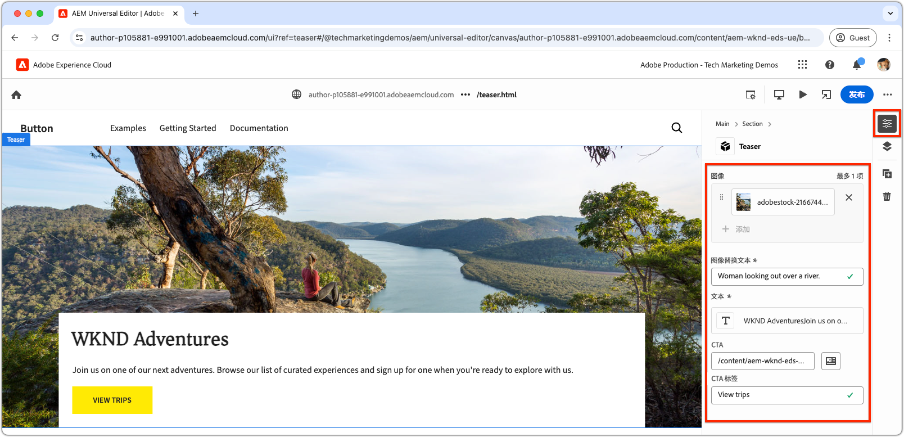
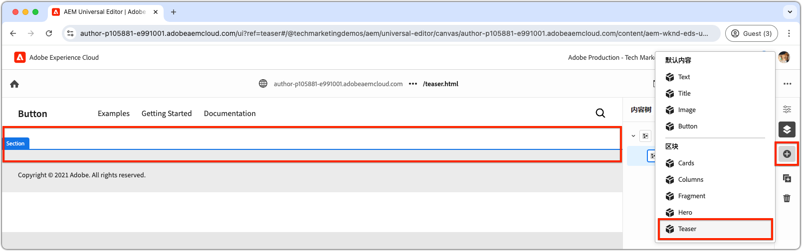

# 创建新块

本章介绍使用通用编辑器为Edge Delivery Services网站创建新的可编辑Teaser块的过程。


名为`teaser`的块显示了以下元素：

- **图像**：具有视觉吸引力的图像。
- **文本内容**：
   - **标题**：吸引注意力的标题。
   - **正文文本**：描述性内容，提供上下文或详细信息，包括可选的条款和条件。
   - **行动号召(CTA)按钮**：用于提示用户交互并引导他们进一步参与的链接。

`teaser`块的内容可在通用编辑器中编辑，从而确保整个网站的易用性和可重用性。

请注意，`teaser`块类似于样板的`hero`块；因此，`teaser`块仅用作说明开发概念的简单示例。

## 创建新的Git分支

要保持工作流简洁有序，请为每个特定的开发任务创建一个新分支。 这有助于避免将不完整或未测试的代码部署到生产时出现问题。

1. **从主分支开始**：使用最新的生产代码可确保坚实的基础。
2. **获取远程更改**：从GitHub获取最新更新可确保在开始开发之前有最新的代码可用。
   - 示例：将来自`wknd-styles`分支的更改合并到`main`后，获取最新更新。
3. **创建新分支**：

```bash
# ~/Code/aem-wknd-eds-ue

$ git fetch origin  
$ git checkout -b teaser origin/main  
```

创建`teaser`分支后，您就可以开始开发Teaser块了。

## 阻止文件夹

在项目的`blocks`目录中创建一个名为`teaser`的新文件夹。 此文件夹包含块的JSON、CSS和JavaScript文件，在一个位置组织块的文件：

```
# ~/Code/aem-wknd-eds-ue

/blocks/teaser
```

块文件夹名称将用作块的ID，并在整个块开发过程中用于引用块。

## 阻止JSON

块JSON定义了块的三个关键方面：

- **定义**：在通用编辑器中将块注册为可编辑组件，并将其链接到块模型和过滤器（可选）。
- **模型**：指定块的创作字段以及这些字段如何作为语义Edge Delivery Services HTML呈现。
- **筛选器**：配置筛选规则，以限制可以通过通用编辑器将块添加到哪些容器。 大多数块不是容器，而是将其ID添加到其他容器块的过滤器中。

在`/blocks/teaser/_teaser.json`处新建一个文件，其初始结构采用完全相同的顺序。 如果键顺序错误，则可能无法正确构建。

[!BADGE /blocks/teaser/_teaser.json]{type=Neutral tooltip="下面代码示例的文件名。"}

```json
{
    "definitions": [],
    "models": [],
    "filters": []
}
```

### 块模型

块模型是块配置的关键部分，因为它定义了：

1. 创作体验（通过定义可编辑的字段）。

   

2. 字段值如何渲染到Edge Delivery Services HTML中。

为模型分配了一个与[块的定义](#block-definition)相对应的`id`，并包含一个`fields`数组以指定可编辑的字段。

`fields`数组中的每个字段都有一个JSON对象，该对象包含以下必需属性：

| JSON属性 | 描述 |
|---------------|-----------------------------------------------------------------------------------------------------------------------|
| `component` | [字段类型](https://experienceleague.adobe.com/zh-hans/docs/experience-manager-cloud-service/content/implementing/developing/universal-editor/field-types#component-types)，如`text`、`reference`或`aem-content`。 |
| `name` | 字段的名称，映射到JCR属性，该值在该属性中存储在AEM中。 |
| `label` | 在通用编辑器中向作者显示的标签。 |

有关包括可选属性的完整列表，请查看[通用编辑器字段文档](https://experienceleague.adobe.com/zh-hans/docs/experience-manager-cloud-service/content/implementing/developing/universal-editor/field-types#fields)。

#### 块设计


Teaser块包含以下可编辑元素：

1. **图像**：表示Teaser的可视内容。
2. **文本内容**：包含标题、正文文本和行动号召按钮，并位于白色矩形中。
   - **title**&#x200B;和&#x200B;**正文文本**&#x200B;可以通过同一富文本编辑器创作。
   - 可以通过&#x200B;**标签**&#x200B;的`text`字段和&#x200B;**链接**&#x200B;的`aem-content`字段创作&#x200B;**CTA**。

Teaser块的设计分为两个逻辑组件（图像和文本内容），确保为用户提供结构化和直观的创作体验。

### 块字段

定义块所需的字段：图像、图像替换文本、文本、CTA标签和CTA链接。

>[!BEGINTABS]

>[!TAB 正确的方法]

**此选项卡说明了为Teaser块建模的正确方法。**

Teaser包含两个逻辑区域：图像和文本。 要简化将Edge Delivery Services HTML显示为所需Web体验所需的代码，块模型应反映此结构。

- 使用[字段折叠](https://experienceleague.adobe.com/zh-hans/docs/experience-manager-cloud-service/content/edge-delivery/wysiwyg-authoring/content-modeling#field-collapse)将&#x200B;**图像**&#x200B;和&#x200B;**图像替换文本**&#x200B;组合在一起。
- 使用[元素分组](https://experienceleague.adobe.com/zh-hans/docs/experience-manager-cloud-service/content/edge-delivery/wysiwyg-authoring/content-modeling#element-grouping)和CTA[&#128279;](https://experienceleague.adobe.com/zh-hans/docs/experience-manager-cloud-service/content/edge-delivery/wysiwyg-authoring/content-modeling#field-collapse)的字段折叠将文本内容字段分组在一起。

如果您不熟悉[字段折叠](https://experienceleague.adobe.com/zh-hans/docs/experience-manager-cloud-service/content/edge-delivery/wysiwyg-authoring/content-modeling#field-collapse)、[元素分组](https://experienceleague.adobe.com/zh-hans/docs/experience-manager-cloud-service/content/edge-delivery/wysiwyg-authoring/content-modeling#element-grouping)或[类型推断](https://experienceleague.adobe.com/zh-hans/docs/experience-manager-cloud-service/content/edge-delivery/wysiwyg-authoring/content-modeling#type-inference)，请在继续之前查看链接的文档，因为它们对于创建结构良好的块模型至关重要。

在以下示例中：

- [类型推断](https://experienceleague.adobe.com/zh-hans/docs/experience-manager-cloud-service/content/edge-delivery/wysiwyg-authoring/content-modeling#type-inference)用于从`image`字段自动创建``个HTML元素。 字段折叠与`image`和`imageAlt`字段一起使用来创建``个HTML元素。 `src`属性设置为`image`字段的值，而`alt`属性设置为`imageAlt`字段的值。
- `textContent`是用于分类字段的组名称。 它应该是语义的，但可以是此块特有的任何内容。 这会通知通用编辑器在最终HTML输出中，渲染同一`<div>`元素内具有此前缀的所有字段。
- 字段折叠也应用于行动号召(CTA)的`textContent`组。 CTA是通过[类型推断](https://experienceleague.adobe.com/zh-hans/docs/experience-manager-cloud-service/content/edge-delivery/wysiwyg-authoring/content-modeling#type-inference)创建为`<a>`的。 `cta`字段用于设置`<a>`元素的`href`属性，`ctaText`字段为`<a ...>`标记内的链接提供文本内容。

[!BADGE /blocks/teaser/_teaser.json]{type=Neutral tooltip="下面代码示例的文件名。"}

```json
{
    "definitions": [],
    "models": [
        {
            "id": "teaser", 
            "fields": [
                {
                    "component": "reference",
                    "valueType": "string",
                    "name": "image",
                    "label": "Image",
                    "multi": false
                },
                {
                    "component": "text",
                    "valueType": "string",
                    "name": "imageAlt",
                    "label": "Image alt text",
                    "required": true
                },
                {
                    "component": "richtext",
                    "name": "textContent_text",
                    "label": "Text",
                    "valueType": "string",
                    "required": true
                },
                {
                    "component": "aem-content",
                    "name": "textContent_cta",
                    "label": "CTA",
                    "valueType": "string"
                },
                {
                    "component": "text",
                    "name": "textContent_ctaText",
                    "label": "CTA label",
                    "valueType": "string"
                }
            ]
        }
    ],
    "filters": []
}
```

此模型在Universal Editor中为块定义创作输入。

为此块生成的Edge Delivery Services HTML将图像放入第一个div，将元素组`textContent`字段放入第二个div。

```html
<div>
    <div>
        <!-- This div contains the field-collapsed image fields  -->
        <picture>
            ...
            <source .../>            
            
        </picture>
    </div>
    <div>
        <!-- This div, via element grouping contains the textContent fields -->
        <h2>The authored title</h2>
        <p>The authored body text</p>
        <a href="/authored/cta/link">The authored CTA label</a>
    </div>
</div>        
```

如下一章[&#128279;](./7a-block-css.md)中的所示，此HTML结构将块样式简化为内聚单元。

要了解不使用字段折叠和元素分组的后果，请参阅上面的&#x200B;**错误方式**&#x200B;选项卡。

>[!TAB 错误的方式]

**此选项卡说明了Teaser块建模的次优方法，并且只与正确方法并置。**

在不使用[字段折叠](https://experienceleague.adobe.com/zh-hans/docs/experience-manager-cloud-service/content/edge-delivery/wysiwyg-authoring/content-modeling#field-collapse)和[元素分组](https://experienceleague.adobe.com/zh-hans/docs/experience-manager-cloud-service/content/edge-delivery/wysiwyg-authoring/content-modeling#element-grouping)的情况下，将每个字段定义为块模型中的独立字段似乎很有吸引力。 但是，这种疏忽使得将块定位为具有凝聚力的单元变得复杂。

例如，可以定义Teaser模型&#x200B;**而不使用**&#x200B;字段折叠或元素分组，如下所示：

[!BADGE /blocks/teaser/_teaser.json]{type=Neutral tooltip="下面代码示例的文件名。"}

```json
{
    "definitions": [],
    "models": [
        {
            "id": "teaser", 
            "fields": [
                {
                    "component": "reference",
                    "valueType": "string",
                    "name": "image",
                    "label": "Image",
                    "multi": false
                },
                {
                    "component": "text",
                    "valueType": "string",
                    "name": "alt",
                    "label": "Image alt text",
                    "required": true
                },
                {
                    "component": "richtext",
                    "name": "text",
                    "label": "Text",
                    "valueType": "string",
                    "required": true
                },
                {
                    "component": "aem-content",
                    "name": "link",
                    "label": "CTA",
                    "valueType": "string"
                },
                {
                    "component": "text",
                    "name": "label",
                    "label": "CTA label",
                    "valueType": "string"
                }
            ]
        }
    ],
    "filters": []
}
```

块的Edge Delivery Services HTML在单独的`div`中呈现每个字段的值，这会使内容理解、样式应用和HTML结构调整变得复杂，难以实现所需的设计。

```html
<div>
    <div>
        <!-- This div contains the field-collapsed image  -->
        <picture>
            ...
            <source .../>            
            
        </picture>
    </div>
    <div>
        <p>The authored alt text</p>
    </div>
    <div>
        <h2>The authored title</h2>
        <p>The authored body text</p>
    </div>
    <div>
        <a href="/authored/cta/link">/authored/cta/link</a>
    </div>
    <div>
        The authored CTA label
    </div>
</div>        
```

每个字段都隔离在自己的`div`中，因此很难将图像和文本内容设为粘性单位。 通过努力和创造力实现所需设计是可能的，但使用[元素分组](https://experienceleague.adobe.com/zh-hans/docs/experience-manager-cloud-service/content/edge-delivery/wysiwyg-authoring/content-modeling#element-grouping)对文本内容字段进行分组，使用[字段折叠](https://experienceleague.adobe.com/zh-hans/docs/experience-manager-cloud-service/content/edge-delivery/wysiwyg-authoring/content-modeling#field-collapse)添加创作值，因为元素属性更简单、更容易，并且语义更正确。

请参阅上面的&#x200B;**写入方式**&#x200B;选项卡，了解如何更好地为Teaser块建模。

>[!ENDTABS]


### 块定义

块定义在通用编辑器中注册该块。 以下是块定义中使用的JSON属性的明细：

| JSON属性 | 描述 |
|---------------|-------------|
| `definition.title` | 在通用编辑器的&#x200B;**添加**&#x200B;块中显示的块标题。 |
| `definition.id` | 块的唯一ID，用于控制其在`filters`中的使用。 |
| `definition.plugins.xwalk.page.resourceType` | 定义用于在通用编辑器中呈现组件的Sling资源类型。 始终使用`core/franklin/components/block/v#/block`资源类型。 |
| `definition.plugins.xwalk.page.template.name` | 块的名称。 它应该使用小写和连字符来匹配块的文件夹名称。 此值还用于在通用编辑器中标记块的实例。 |
| `definition.plugins.xwalk.page.template.model` | 将此定义链接到其`model`定义，该定义控制通用编辑器中为块显示的创作字段。 此处的值必须匹配`model.id`值。 |
| `definition.plugins.xwalk.page.template.classes` | 可选属性，其值将添加到块HTML元素的`class`属性。 这允许同一块的变体。 通过将[类字段](https://experienceleague.adobe.com/zh-hans/docs/experience-manager-cloud-service/content/edge-delivery/wysiwyg-authoring/create-block#block-options)添加到块的[模型](#block-model)，可以使`classes`值变为可编辑。 |


以下是块定义的JSON示例：

[!BADGE /blocks/teaser/_teaser.json]{type=Neutral tooltip="下面代码示例的文件名。"}

```json
{
    "definitions": [{
      "title": "Teaser",
      "id": "teaser",
      "plugins": {
        "xwalk": {
          "page": {
            "resourceType": "core/franklin/components/block/v1/block",
            "template": {
              "name": "Teaser",
              "model": "teaser",
              "textContent_text": "<h2>Enter a title</h2><p>...and body text here!</p>",
              "textContent_cta": "/",
              "textContent_ctaText": "Click me!"
            }
          }
        }
      }
    }],
    "models": [... from previous section ...],
    "filters": []
}
```

在此示例中：

- 该块名为“Teaser”，并使用`teaser`模型，该模型可确定哪些字段可在通用编辑器中编辑。
- 该块包括`textContent_text`字段的默认内容，该字段是标题和正文文本的RTF区域，以及CTA （行动号召）链接和标签的`textContent_cta`和`textContent_ctaText`。 模板包含初始内容的字段名称与[内容模型的字段数组](#block-model)中定义的字段名称匹配；

此结构确保在通用编辑器中设置块，并包含用于呈现的正确字段、内容模型和资源类型。

### 阻止筛选器

块的`filters`数组为[容器块](https://experienceleague.adobe.com/zh-hans/docs/experience-manager-cloud-service/content/edge-delivery/wysiwyg-authoring/content-modeling#container)定义了哪些其他块可以添加到容器中。 筛选器定义可添加到容器的块ID (`model.id`)列表。

[!BADGE /blocks/teaser/_teaser.json]{type=Neutral tooltip="下面代码示例的文件名。"}

```json
{
  "definitions": [... populated from previous section ...],
  "models": [... populated from previous section ...],
  "filters": []
}
```

Teaser组件不是[容器块](https://experienceleague.adobe.com/zh-hans/docs/experience-manager-cloud-service/content/edge-delivery/wysiwyg-authoring/content-modeling#container)，这意味着您无法向其添加其他块。 因此，其`filters`数组留空。 而是将Teaser的ID添加到分区块的过滤器列表，以便将Teaser添加到分区。



Adobe提供的块（如节块）将过滤器存储在项目的`models`文件夹中。 要进行调整，请找到Adobe提供的块的JSON文件（例如，`/models/_section.json`），并将Teaser的ID (`teaser`)添加到筛选器列表中。 该配置向通用编辑器发出信号，告知可以将Teaser组件添加到区域容器块中。

[!BADGE /models/_section.json]{type=Neutral tooltip="下面代码示例的文件名。"}

```json
{
  "definitions": [],
  "models": [],
  "filters": [
    {
      "id": "section",
      "components": [
        "text",
        "image",
        "button",
        "title",
        "hero",
        "cards",
        "columns",
        "fragment",
        "teaser"
      ]
    }
  ]
}
```

`teaser`的Teaser块定义ID已添加到`components`数组。

## Lint您的JSON文件

确保您[频繁lint](./3-local-development-environment.md#linting)您的更改，以确保它干净一致。 经常撒绒有助于及早发现问题，并缩短总体开发时间。 `npm run lint:js`命令还会链接JSON文件，并捕获任何语法错误。

```bash
# ~/Code/aem-wknd-eds-ue

$ npm run lint:js
```

## 构建项目JSON

配置块JSON文件（例如，`blocks/teaser/_teaser.json`、`models/_section.json`）后，将自动编译到项目的`component-models.json`、`component-definitions.json`和`component-filters.json`文件中。 此编译由[AEM样板XWalk项目模板](https://github.com/adobe-rnd/aem-boilerplate-xwalk)中包含的[Husky](https://typicode.github.io/husky/)预提交挂接自动处理。

也可以使用项目的[生成JSON](./3-local-development-environment.md#build-json-fragments) NPM脚本手动或以编程方式触发生成。

## 部署块JSON

要使块在通用编辑器中可用，必须将项目提交并推送到GitHub存储库的分支，在本例中为`teaser`分支。

可以通过通用编辑器的URL，按用户调整通用编辑器使用的确切分支名称。

```bash
# ~/Code/aem-wknd-eds-ue

$ git add .
$ git commit -m "Add teaser block JSON files so it is available in Universal Editor"
# JSON files are compiled automatically and added to the commit via a husky precommit hook
$ git push origin teaser
```

使用查询参数`?ref=teaser`打开通用编辑器时，新的`teaser`块会显示在块面板中。 请注意，该块没有样式；它将块的字段呈现为语义HTML，仅通过[全局CSS](./4-website-branding.md#global-css)设置样式。
