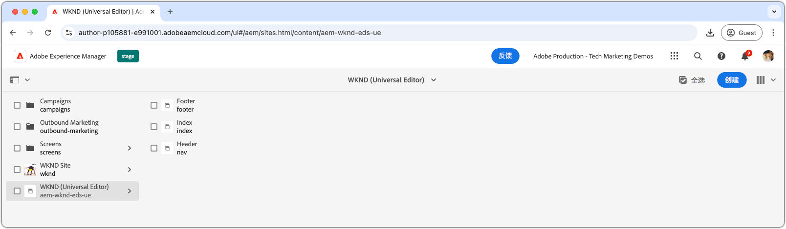
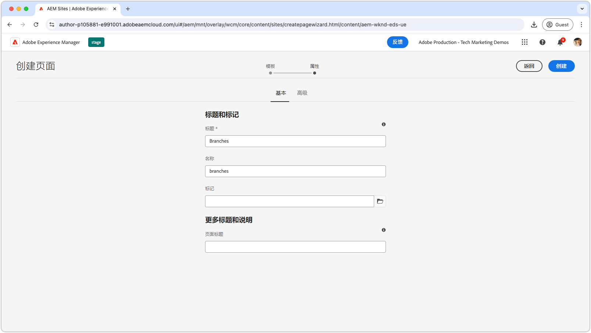
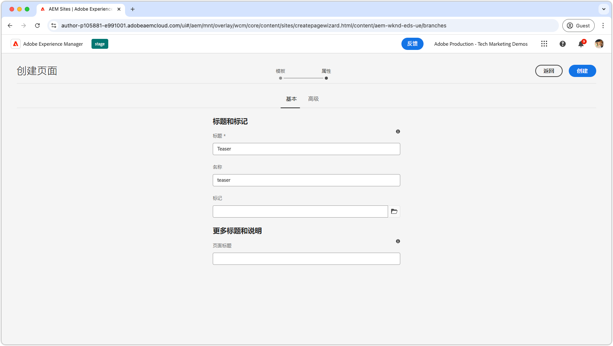
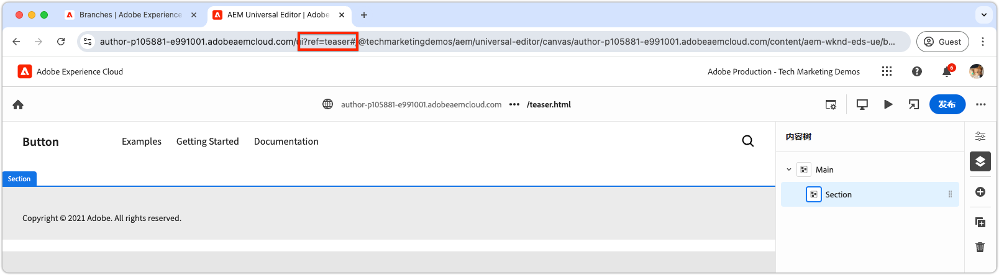
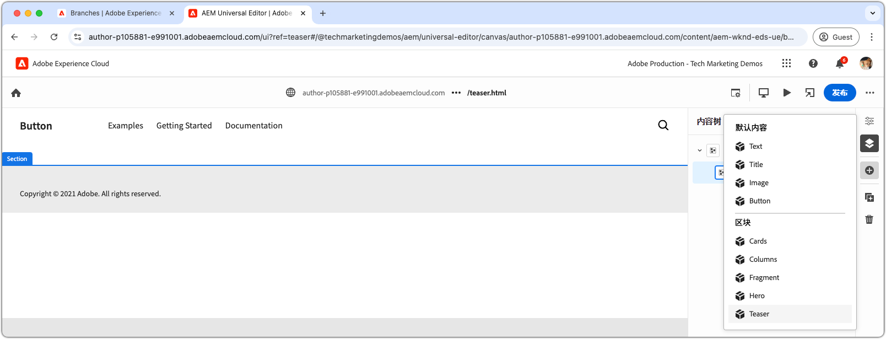
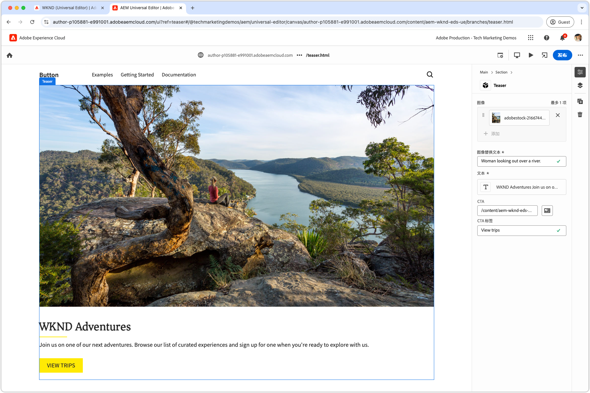
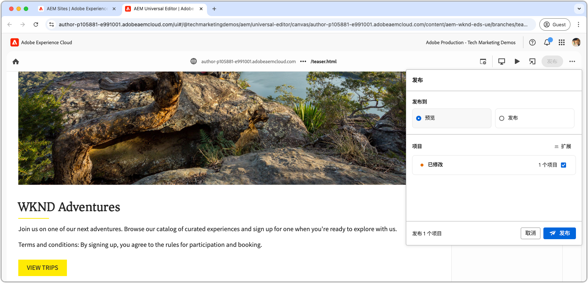
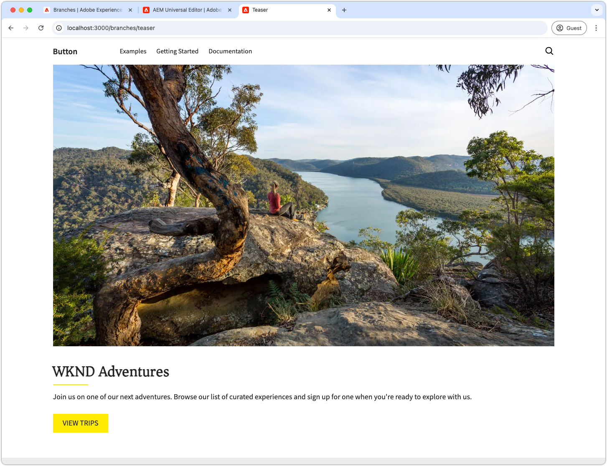

# 创作块

将[Teaser块的JSON](./5-new-block.md)推送到`teaser`分支后，该块将在AEM通用编辑器中变为可编辑。

出于以下几种原因，在开发环境中创作块很重要：

1. 验证了块定义和模型的正确性。
1. 它允许开发人员查看块的语义HTML，这是开发的基础。
1. 它支持将内容和语义HTML部署到预览环境，从而支持更快的块开发。

## 使用`teaser`分支中的代码打开通用编辑器

1. 登录到AEM Author。
2. 导航到&#x200B;**站点**&#x200B;并选择在[上一章](./2-new-aem-site.md)中创建的站点(WKND （通用编辑器）)。

   

3. 创建或编辑页面以添加新块，确保上下文可用于支持本地开发。 虽然可以在网站内的任何位置创建页面，但通常最好为每个新工作主体创建离散页面。 创建名为&#x200B;**分支**&#x200B;的新“文件夹”页面。 每个子页面都用于支持开发同名Git分支。

   

4. 在&#x200B;**分支**&#x200B;页面下，创建一个名为&#x200B;**Teaser**&#x200B;的新页面，该页面与开发分支名称匹配，然后单击&#x200B;**打开**&#x200B;以编辑该页面。

   

5. 通过将`?ref=teaser`添加到URL，更新通用编辑器以从`teaser`分支加载代码。 确保在&#x200B;**之前添加查询参数** BEFORE`#`符号。

   

6. 选择&#x200B;**Main**&#x200B;下的第一个部分，单击&#x200B;**添加**&#x200B;按钮，然后选择&#x200B;**Teaser**&#x200B;块。

   

7. 在画布上，选择新添加的Teaser并创作右侧的字段，或通过内联编辑功能进行编辑。

   

8. 完成创作后，选择通用编辑器右上角的&#x200B;**发布**&#x200B;按钮，选择发布到&#x200B;**预览**，然后将更改发布到预览环境。 然后将更改发布到网站的`aem.page`域。
   

9. 等待发布更改以进行预览，然后通过[http://localhost:3000/branches/teaser](http://localhost:3000/branches/teaser)上的[AEM CLI](./3-local-development-environment.md#install-the-aem-cli)打开网页。

   

现在，可在预览网站上找到所创作Teaser块的内容和语义HTML，以便在本地开发环境中使用AEM CLI进行开发。
