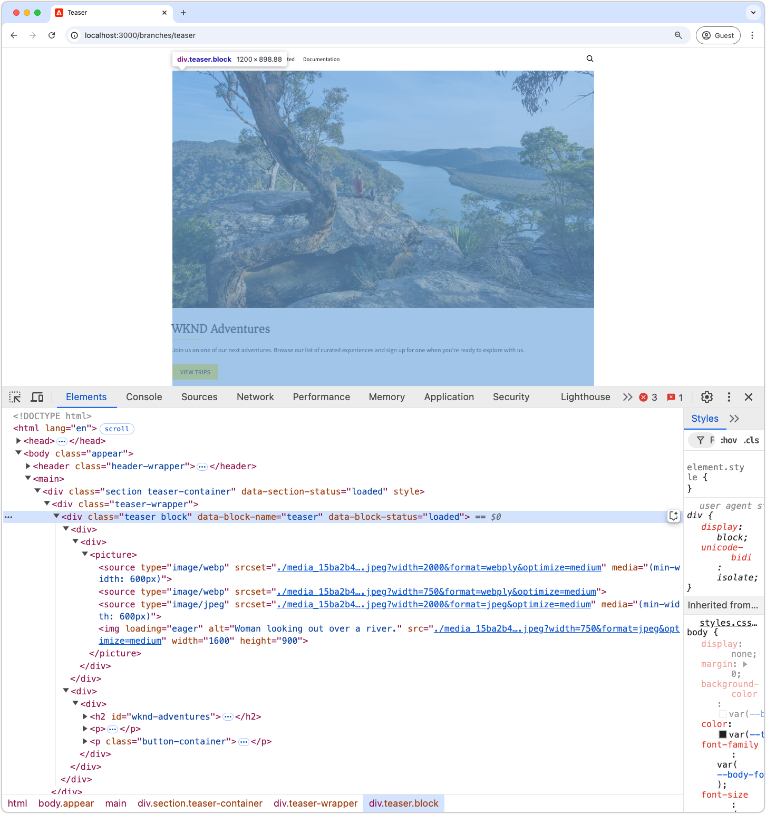
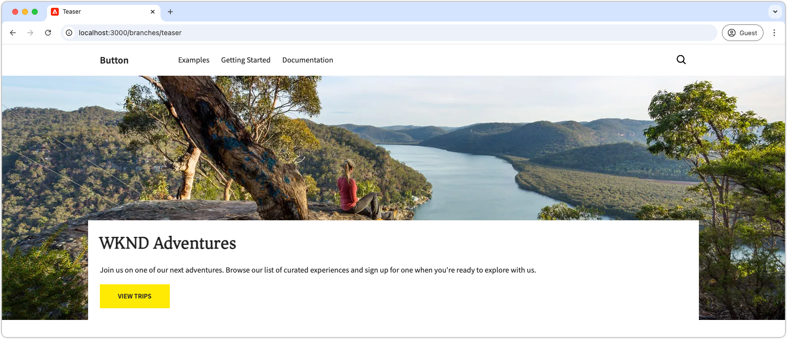
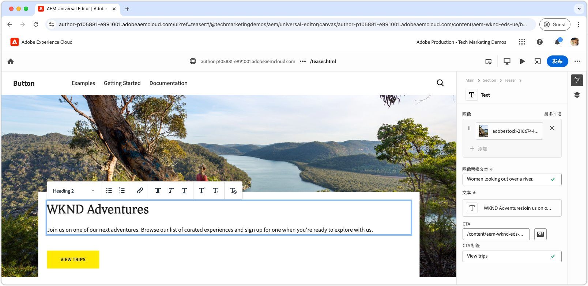

# 使用 CSS 开发一个区块

Edge Delivery Services 中的区块使用 CSS 进行样式设置。区块的 CSS 文件存储在该区块的目录中，文件名与区块名称相同。例如，名为 `teaser` 的区块对应的 CSS 文件位于 `blocks/teaser/teaser.css`。

理想情况下，区块仅需使用 CSS 进行样式设置，而不依赖 JavaScript 来修改 DOM 或添加 CSS 类。是否需要使用 JavaScript 取决于区块的[内容建模](./5-new-block.md#block-model)及其复杂程度。如有需要，可添加[区块 JavaScript](./7b-block-js-css.md)。

采用纯 CSS 方式，对区块中（大多是）简洁的语义化 HTML 元素进行定位和样式设计。

## 区块 HTML

要了解如何为区块设置样式，首先请查看 Edge Delivery Services 公开的 DOM，因为它可用于设置样式。通过检查 AEM CLI 本地开发环境提供的区块，可以找到 DOM。避免使用通用编辑器的 DOM，因为它略有不同。

>[!BEGINTABS]

>[!TAB 需设置样式的 DOM]

以下是作为样式设计目标的 Teaser 区块的 DOM。

请注意，`<p class="button-container">...` 被 Edge Delivery Services 的 JavaScript [自动增强](./4-website-branding.md#inferred-elements)，并作为推断元素添加。

```html
...
<body>
    <header/>
    <main>
        <div>
            <!-- Start block HTML -->
            <div class="teaser block" data-block-name="teaser" data-block-status="loaded">
                <div>
                    <div>
                        <picture>
                            <source type="image/webp" srcset="./media_15ba2b455e29aca38c1ca653d24c40acaec8a008f.jpeg?width=2000&amp;format=webply&amp;optimize=medium" media="(min-width: 600px)">
                            <source type="image/webp" srcset="./media_15ba2b455e29aca38c1ca653d24c40acaec8a008f.jpeg?width=750&amp;format=webply&amp;optimize=medium">
                            <source type="image/jpeg" srcset="./media_15ba2b455e29aca38c1ca653d24c40acaec8a008f.jpeg?width=2000&amp;format=jpeg&amp;optimize=medium" media="(min-width: 600px)">
                            
                        </picture>
                    </div>
                </div>
                <div>
                    <div>
                        <h2 id="wknd-adventures">WKND Adventures</h2>
                        <p>Join us on one of our next adventures. Browse our list of curated experiences and sign up for one when you're ready to explore with us.</p>
                        <p class="button-container"><a href="/" title="View trips" class="button">View trips</a></p>
                    </div>
                </div>
            </div>     
            <!-- End block HTML -->
        </div>
    </main>
    <footer/>
</body>
...
```

>[!TAB 如何找到 DOM]

要找到需要设置样式的 DOM 元素，请在本地开发环境中打开包含未设样式区块的页面，选中该区块，并检查其 DOM 结构。



>[!ENDTABS]

## 区块 CSS

在该区块的文件夹中创建一个新的 CSS 文件，其中文件名应与区块名称相同。例如，对于 **Teaser** 区块，文件位于 `/blocks/teaser/teaser.css`。

当 Edge Delivery Services 的 JavaScript 检测到页面上存在代表 Teaser 区块的 DOM 元素时，该 CSS 文件会被自动加载。

[!BADGE /blocks/teaser/teaser.css]{type=Neutral tooltip="下面是代码示例的文件名。"}

```css
/* /blocks/teaser/teaser.css */

/* Scope each selector in the block with `.block.teaser` using CSS nesting (https://developer.mozilla.org/en-US/docs/Web/CSS/CSS_nesting) to avoid accidental conflicts outside the block */
.block.teaser {
    animation: teaser-fade-in .6s;
    position: relative;
    width: 1600px;
    max-width: 100vw;
    left: 50%; 
    transform: translateX(-50%);
    height: 500px;
    overflow: hidden; 

    /* The image is rendered to the first div in the block */
    picture {
        position: absolute;
        z-index: -1;
        inset: 0;
        box-sizing: border-box;

        img {
            object-fit: cover;
            object-position: center;
            width: 100%;
            height: 100%;
        }
    }

    /** 
    The teaser's text is rendered to the second (also the last) div in the block.

    These styles are scoped to the second (also the last) div in the block (.block.teaser > div:last-child).

    This div order can be used to target different styles to the same semantic elements in the block. 
    For example, if the block has two images, we could target the first image with `.block.teaser > div:first-child img`, 
    and the second image with `.block.teaser > div:nth-child(2) img`.
    **/
    & > div:last-child {
        position: absolute;
        bottom: 0;
        left: 50%;
        transform: translateX(-50%);
        background: var(--background-color);
        padding: 1.5rem 1.5rem 1rem;
        width: 80vw;
        max-width: 1200px;

        /** 
        The following elements reside within `.block.teaser > div:last-child` and could be scoped as such, for example:

        .block.teaser > div:last-child p { .. }

        However since these element can only appear in the second/last div per our block's model, it's unnecessary to add this additional scope.
        **/

        /* Regardless of the authored heading level, we only want one style the heading */
        h1,
        h2,
        h3,
        h4,
        h5,
        h6 {
            font-size: var(--heading-font-size-xl);
            margin: 0;
        }

        h1::after,
        h2::after,
        h3::after,
        h4::after,
        h5::after,
        h6::after {
            border-bottom: 0;
        }

        p {
            font-size: var(--body-font-size-s);
            margin-bottom: 1rem;
        }

        /* Add underlines to links in the text */
        a:hover {
            text-decoration: underline;
        }

        /* Add specific spacing to buttons. These button CSS classes are automatically added by Edge Delivery Services. */
        .button-container {
            margin: 0;
            padding: 0;

            .button {
                background-color: var(--primary-color);
                border-radius: 0;
                color: var(--dark-color);
                font-size: var(--body-font-size-xs);
                font-weight: bold;
                padding: 1em 2.5em;
                margin: 0;
                text-transform: uppercase;
            }
        }
    }
}

/** Animations 
    Scope the @keyframes to the block (teaser) to avoid accidental conflicts outside the block

    Global @keyframes can defines in styles/styles.css and used in this file.
**/

@keyframes teaser-fade-in {
    from {
        opacity: 0;
    }

    to {
        opacity: 1;
    }
}
```

## 开发预览

由于 CSS 是在代码项目中创作的，AEM CLI 会热重载这些更改，以便你能够快速且直观地了解 CSS 对区块的影响。



## 对代码进行规范检查

请确保您[经常对代码修改进行规范检查](./3-local-development-environment.md#linting)，以确保其整洁且风格一致。经常进行规范检查有助于及早发现问题，从而缩短整体开发周期。请记住，在解决所有规范检查方面的问题之前，不能将开发工作合并到 `main`！

```bash
# ~/Code/aem-wknd-eds-ue

$ npm run lint:css
```

## 在通用编辑器中预览

要在 AEM 的通用编辑器中查看更改，请将更改添加、提交并推送到通用编辑器使用的 Git 存储库分支。此步骤有助于确保区块的实施不会破坏创作体验。

```bash
# ~/Code/aem-wknd-eds-ue

$ git add .
$ git commit -m "Add CSS-only implementation for teaser block"
$ git push origin teaser
```

现在，在添加 `?ref=teaser` 查询参数时，即可在通用编辑器中预览这些更改。


