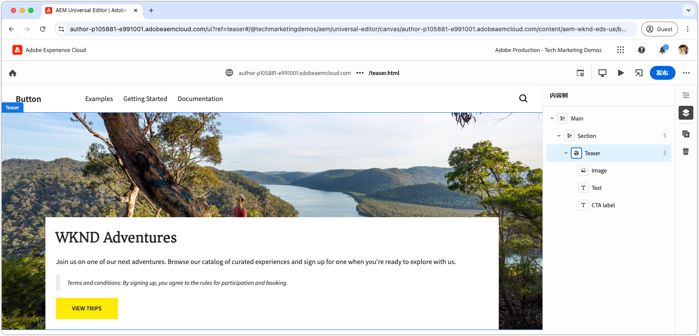

# 使用CSS和JavaScript开发块

在[上一章](./7b-block-js-css.md)中，涵盖了仅使用CSS来设置块的样式。 现在，焦点转移到了使用JavaScript和CSS开发块上。

此示例说明如何通过三种方式增强块：

1. 添加自定义CSS类。
1. 使用事件侦听器添加移动。
1. 处理可以选择包含在Teaser文本中的条款和条件。

## 常见用例

这种方法在以下情况下特别有用：

- **外部CSS管理：**&#x200B;当块的CSS在Edge Delivery Services外部被管理并且与其HTML结构不匹配时。
- **其他属性：**&#x200B;当需要其他属性（如用于辅助功能的[ARIA](https://developer.mozilla.org/en-US/docs/Web/Accessibility/ARIA)或[微数据](https://developer.mozilla.org/zh-CN/docs/Web/HTML/Microdata)）时。
- **JavaScript增强功能：**&#x200B;当需要交互功能（如事件侦听器）时。

此方法依赖于浏览器本机的JavaScript DOM操作，但在修改DOM时尤其需要谨慎移动元素。 此类更改可能会破坏通用编辑器的创作体验。 理想情况下，应该仔细设计块的[内容模型](./5-new-block.md#block-model)，以最大限度地减少大量DOM更改的需要。

## 阻止HTML

要接近块开发，请先查看Edge Delivery Services公开的DOM。 该结构通过JavaScript进行了增强并使用CSS进行了样式设置。

>[!BEGINTABS]
>[!TAB 要修饰的 DOM]

以下是使用JavaScript和CSS装饰的Teaser块的DOM。

```html
...
<body>
    <header/>
    <main>
        <div>
            <!-- Start block HTML -->
            <div class="teaser block" data-block-name="teaser" data-block-status="loaded">
                <div>
                    <div>
                    <picture>
                        <source type="image/webp" srcset="./media_15ba2b455e29aca38c1ca653d24c40acaec8a008f.jpeg?width=2000&amp;format=webply&amp;optimize=medium" media="(min-width: 600px)">
                        <source type="image/webp" srcset="./media_15ba2b455e29aca38c1ca653d24c40acaec8a008f.jpeg?width=750&amp;format=webply&amp;optimize=medium">
                        <source type="image/jpeg" srcset="./media_15ba2b455e29aca38c1ca653d24c40acaec8a008f.jpeg?width=2000&amp;format=jpeg&amp;optimize=medium" media="(min-width: 600px)">
                        
                    </picture>
                    </div>
                </div>
                <div>
                    <div>
                    <h2 id="wknd-adventures">WKND Adventures</h2>
                    <p>Join us on one of our next adventures. Browse our list of curated experiences and sign up for one when you're ready to explore with us.</p>
                    <p class="button-container"><a href="/" title="View trips" class="button">View trips</a></p>
                    </div>
                </div>
            </div>     
            <!-- End block HTML -->
        </div>
    </main>
    <footer/>
</body>
...
```

>[!TAB 如何查找DOM]

要查找要修饰的DOM，请在本地开发环境中打开包含未修饰块的页面，选择块，然后检查DOM。


>[!ENDTABS]


## 阻止JavaScript

要向块添加JavaScript功能，请在块的目录中创建一个与块同名的JavaScript文件，例如`/blocks/teaser/teaser.js`。

JavaScript文件应导出默认函数：

```javascript
export default function decorate(block) { ... }
```

默认函数采用表示Edge Delivery Services HTML中块的DOM元素/树，并包含在呈现块时执行的自定义JavaScript。

此示例JavaScript执行三个主要操作：

1. 将事件侦听器添加到CTA按钮，并在鼠标悬停时缩放图像。
1. 将语义CSS类添加到块的元素中，这在集成现有CSS设计系统时很有用。
1. 向以`Terms and conditions:`开头的段落添加特殊的CSS类。

[!BADGE /blocks/teaser/teaser.js]{type=Neutral tooltip="下面代码示例的文件名。"}

```javascript
/* /blocks/teaser/teaser.js */

/**
 * Adds a zoom effect to image using event listeners.
 *
 * When the CTA button is hovered over, the image zooms in.
 *
 * @param {HTMLElement} block represents the block's' DOM tree
 */
function addEventListeners(block) {
  block.querySelector('.button').addEventListener('mouseover', () => {
    block.querySelector('.image').classList.add('zoom');
  });

  block.querySelector('.button').addEventListener('mouseout', () => {
    block.querySelector('.image').classList.remove('zoom');
  });
}

/**
   * Entry point to block's JavaScript.
   * Must be exported as default and accept a block's DOM element.
   * This function is called by the project's style.js, and passed the block's element.
   *
   * @param {HTMLElement} block represents the block's' DOM element/tree
   */
export default function decorate(block) {
  /* This JavaScript makes minor adjustments to the block's DOM */

  // Dress the DOM elements with semantic CSS classes so it's obvious what they are.
  // If needed we could also add ARIA roles and attributes, or add/remove/move DOM elements.

  // Add a class to the first picture element to target it with CSS
  block.querySelector('picture').classList.add('image-wrapper');

  // Use previously applied classes to target new elements
  block.querySelector('.image-wrapper img').classList.add('image');

  // Mark the second/last div as the content area (white, bottom aligned box w/ text and cta)
  block.querySelector(':scope > div:last-child').classList.add('content');

  // Mark the first H1-H6 as a title
  block.querySelector('h1,h2,h3,h4,h5,h6').classList.add('title');

  // Process each paragraph and mark it as text or terms-and-conditions
  block.querySelectorAll('p').forEach((p) => {
    const innerHTML = p.innerHTML?.trim();

    // If the paragraph starts with Terms and conditions: then style it as such
    if (innerHTML?.startsWith("Terms and conditions:")) {
      /* If a paragraph starts with '*', add a special CSS class. */
      p.classList.add('terms-and-conditions');
    }
  });

  // Add event listeners to the block
  addEventListeners(block);
}
```

## 阻止CSS

如果您在[上一章](./7a-block-css.md)中创建了`teaser.css`，请将其删除或重命名为`teaser.css.bak`，因为本章为Teaser块实施了不同的CSS。

在块的文件夹中创建`teaser.css`文件。 此文件包含用于设置块样式的CSS代码。 此CSS代码以块的元素以及JavaScript在`teaser.js`中添加的特定语义CSS类为目标。

裸元素仍可以直接设置样式，或使用自定义应用的CSS类进行设置。 对于更复杂的块，应用语义CSS类有助于使CSS更易于理解和维护，尤其是在与较大的团队一起处理较长的时段时更是如此。

[与](./7a-block-css.md#develop-a-block-with-css)之前一样，使用[CSS嵌套](https://developer.mozilla.org/en-US/docs/Web/CSS/CSS_nesting)将CSS范围设置为`.block.teaser`以避免与其他块冲突。

[!BADGE /blocks/teaser/teaser.css]{type=Neutral tooltip="下面代码示例的文件名。"}

```css
/* /blocks/teaser/teaser.css */

/* Scope each selector in the block with `.block.teaser` to avoid accidental conflicts outside the block */
.block.teaser {
    animation: teaser-fade-in 1s;
    position: relative;
    width: 1600px;
    max-width: 100vw;
    left: 50%; 
    transform: translateX(-50%);
    height: 500px;
    overflow: hidden; 

    /* The teaser image */
    .image-wrapper {
        position: absolute;
        z-index: -1;
        inset: 0;
        box-sizing: border-box;
        overflow: hidden; 

        .image {
            object-fit: cover;
            object-position: center;
            width: 100%;
            height: 100%;
            transform: scale(1); 
            transition: transform 0.6s ease-in-out;

            .zoom {
                transform: scale(1.1);
            }            
        }
    }

    /* The teaser text content */
    .content {
        position: absolute;
        bottom: 0;
        left: 50%;
        transform: translateX(-50%);
        background: var(--background-color);
        padding: 1.5rem 1.5rem 1rem;
        width: 80vw;
        max-width: 1200px;
  
        .title {
            font-size: var(--heading-font-size-xl);
            margin: 0;
        }

        .title::after {
            border-bottom: 0;
        }

        p {
            font-size: var(--body-font-size-s);
            margin-bottom: 1rem;
            animation: teaser-fade-in .6s;
        
            &.terms-and-conditions {
                font-size: var(--body-font-size-xs);
                color: var(--secondary-color);
                padding: .5rem 1rem;
                font-style: italic;
                border: solid var(--light-color);
                border-width: 0 0 0 10px;
            }
        }

        /* Add underlines to links in the text */
        a:hover {
            text-decoration: underline;
        }

        /* Add specific spacing to buttons. These button CSS classes are automatically added by Edge Delivery Services. */
        .button-container {
            margin: 0;
            padding: 0;
        
            .button {   
                background-color: var(--primary-color);
                border-radius: 0;
                color: var(--dark-color);
                font-size: var(--body-font-size-xs);
                font-weight: bold;
                padding: 1em 2.5em;
                margin: 0;
                text-transform: uppercase;
            }
        }
    }
}

/** Animations 
    Scope the @keyframes to the block (teaser) to avoid accidental conflicts outside the block

    Global @keyframes can defines in styles/styles.css and used in this file.
**/
@keyframes teaser-fade-in {
    from {
        opacity: 0;
    }

    to {
        opacity: 1;
    }
}
```

## 添加条款和条件

上述实现添加了对以文本`Terms and conditions:`开头的特殊样式段落的支持。 要验证此功能，请在通用编辑器中更新Teaser块的文本内容以包含条款和条件。

按照[创作块](./6-author-block.md)中的步骤操作，并编辑文本以包含&#x200B;**条款和条件**&#x200B;末尾段落：

```
WKND Adventures

Join us on one of our next adventures. Browse our list of curated experiences and sign up for one when you're ready to explore with us.

Terms and conditions: By signing up, you agree to the rules for participation and booking.
```

验证段落是否使用本地开发环境中的条款和条件样式呈现。 请记住，在将这些代码更改[推送到GitHub](#preview-in-universal-editor)上的分支（已配置为Universal Editor使用）之前，它们不会反映在Universal Editor中。

## 开发预览

添加CSS和JavaScript后，AEM CLI的本地开发环境会热重新加载更改，从而快速轻松地可视化代码如何影响块。 将鼠标悬停在CTA上并验证Teaser的图像是否放大了图像。


## 嵌入代码

请确保[频繁lint](./3-local-development-environment.md#linting)您的代码更改以保持干净一致。 定期筛选有助于及早发现问题，从而缩短总体开发时间。 请记住，在解决所有链接问题之前，无法将开发工作合并到`main`分支！

```bash
# ~/Code/aem-wknd-eds-ue

$ npm run lint
```

## 在通用编辑器中预览

要在AEM的通用编辑器中查看更改，请添加、提交这些更改，并将其推送到通用编辑器使用的Git存储库分支。 这样做可确保块实施不会中断创作体验。

```bash
# ~/Code/aem-wknd-eds-ue

$ git add .
$ git commit -m "CSS and JavaScript implementation for teaser block"
$ git push origin teaser
```

现在，添加`?ref=teaser`查询参数时，您可以在通用编辑器中预览更改。

通用编辑器中的
