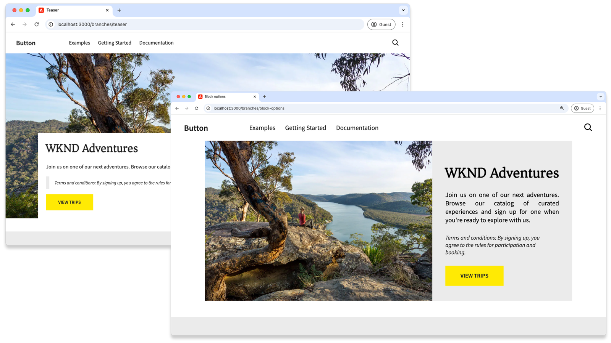
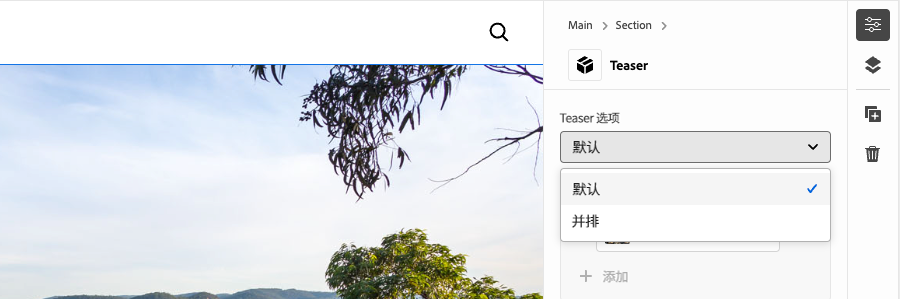
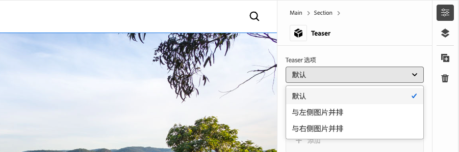
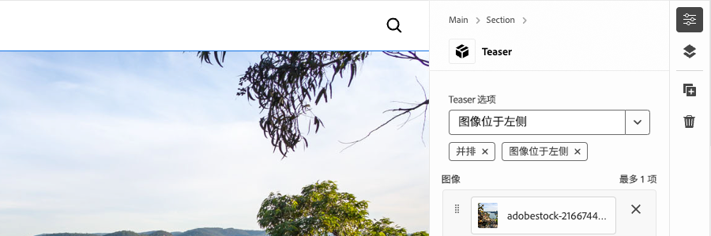
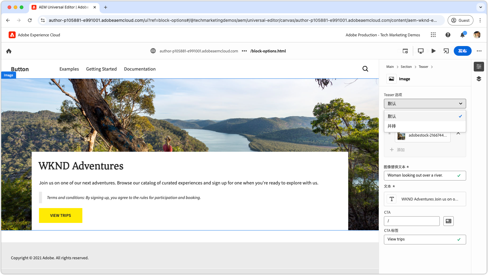
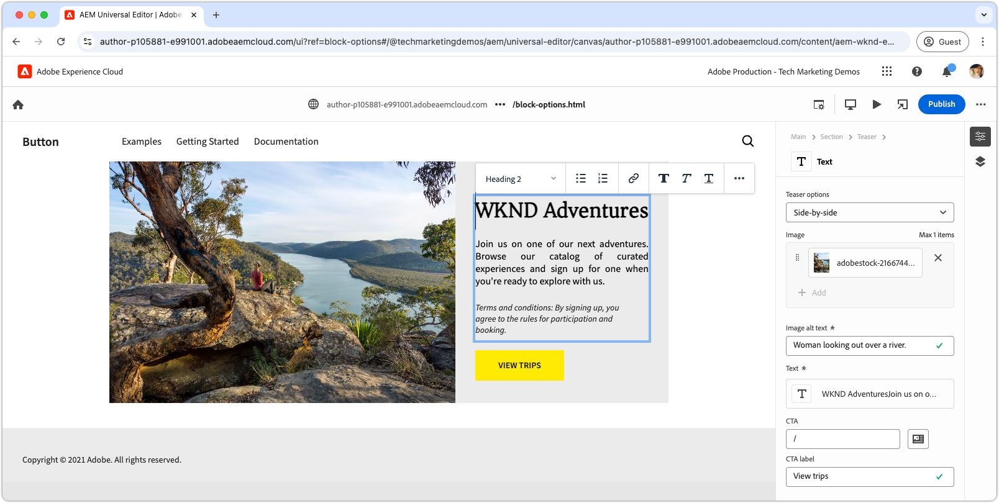

# 使用选项开发块

本教程以Edge Delivery Services和通用编辑器教程为基础，指导您完成将块选项添加到块的过程。 通过定义块选项，您可以自定义块的外观和功能，从而启用不同的变体来满足各种内容需求。 这允许您在网站的设计系统中实现更大的灵活性和可重用性。

{align="center"}

在本教程中，您将向Teaser块添加块选项，以允许作者在两个显示选项之间进行选择：**默认**&#x200B;和&#x200B;**并排显示**。 **默认**&#x200B;选项在文本上方和后面显示图像，而&#x200B;**并排**&#x200B;选项并排显示图像和文本。

## 常见用例

在&#x200B;**Edge Delivery Services**&#x200B;和&#x200B;**通用编辑器**&#x200B;开发中使用&#x200B;**块选项**&#x200B;的常见用例包括但不限于：

1. **布局变量：**&#x200B;可在布局之间轻松切换。 例如，水平与垂直或网格与列表。
2. **样式变化：**&#x200B;可在主题或视觉处理之间轻松切换。 例如，浅色与深色模式，或者大文本与小文本。
3. **内容显示控件：**&#x200B;切换元素的可见性或在内容样式之间切换（精简与详细）。

这些选项为构建动态和可调整的块提供了灵活性和效率。

本教程演示了布局变体用例，其中Teaser块可以两种不同的布局显示：**默认**&#x200B;和&#x200B;**并排显示**。

## 块模型

要将块选项添加到Teaser块，请在`/block/teaser/_teaser.json`处打开其JSON片段，并将新字段添加到模型定义中。 此字段将其`name`属性设置为`classes`，这是AEM用于存储块选项(应用于块的Edge Delivery Services HTML)的保护字段。

### 字段配置

以下选项卡说明了在块模型中配置块选项的各种方式，包括使用单个CSS类进行单选、使用多个CSS类进行单选以及使用多个CSS类进行多选。 本教程[通过单个CSS类&#x200B;**实现** select中使用的更简单方法](#field-configuration-for-this-tutorial)。

>[!BEGINTABS]

>[!TAB 选择单个CSS类]

本教程演示如何使用`select`（下拉列表）输入类型让作者选择单个块选项，然后将该选项作为单个对应的CSS类应用。

{align="center"}

#### 块模型

**Default**&#x200B;选项由空字符串(`""`)表示，而&#x200B;**并排**&#x200B;选项使用`"side-by-side"`。 选项的&#x200B;**名称**&#x200B;和&#x200B;**值**&#x200B;不必相同，但&#x200B;**值**&#x200B;确定应用于块HTML的CSS类。 例如，**并排**&#x200B;选项的值可以是`layout-10`而不是`side-by-side`。 但是，最好为CSS类使用语义上有意义的名称，以确保选项值的清晰性和一致性。

[!BADGE /blocks/teaser/_teaser.json]{type=Neutral tooltip="下面代码示例的文件名。"}

```json{highlight="4,8,9-18"}
...
"fields": [
    {
        "component": "select",
        "name": "classes",
        "value": "",
        "label": "Teaser options",
        "valueType": "string",
        "options": [
            {
                "name": "Default",
                "value": ""
            },
            {
                "name": "Side-by-side",
                "value": "side-by-side"
            }
        ]
    }
]
...
```

#### 阻止HTML

当作者选择一个选项时，相应的值将作为CSS类添加到块的HTML中：

- 如果选择&#x200B;**默认**：

  ```html
  <div class="block teaser">
      <!-- Block content here -->
  </div>
  ```

- 如果选择&#x200B;**并排**：

  ```html
  <div class="block teaser side-by-side">
      <!-- Block content here -->
  </div>
  ```

这允许根据所选打开应用不同的样式和条件JavaScript。


>[!TAB 选择多个CSS类]

**本教程中未使用此方法，但说明了替代方法和高级块选项。**

`select`输入类型允许作者选择单个块选项，该选项可以选择映射到多个CSS类。 要实现此目的，请将CSS类列为以空格分隔的值。

{align="center"}

#### 块模型

例如，**并排**&#x200B;选项可以支持图像在左侧(`side-by-side left`)或右侧(`side-by-side right`)出现的变体。

[!BADGE /blocks/teaser/_teaser.json]{type=Neutral tooltip="下面代码示例的文件名。"}

```json{highlight="4,8,9-21"}
...
"fields": [
    {
        "component": "select",
        "name": "classes",
        "value": "",
        "label": "Teaser options",
        "valueType": "string",
        "options": [
            {
                "name": "Default",
                "value": ""
            },
            {
                "name": "Side-by-side with Image on left",
                "value": "side-by-side left"
            },
            {
                "name": "Side-by-side with Image on right",
                "value": "side-by-side right"
            }
        ]
    }
]
...
```

#### 阻止HTML

当作者选择某个选项时，相应的值将用作块HTML中一组以空格分隔的CSS类：

- 如果选择&#x200B;**默认**：

  ```html
  <div class="block teaser">
      <!-- Block content here -->
  </div>
  ```

- 如果选择了&#x200B;**并排显示左侧图像**：

  ```html
  <div class="block teaser side-by-side left">
      <!-- Block content here -->
  </div>
  ```

- 如果选择&#x200B;**并排显示**&#x200B;右侧的图像：

  ```html
  <div class="block teaser side-by-side right">
      <!-- Block content here -->
  </div>
  ```

这允许根据所选选项应用不同的样式和条件JavaScript。


>[!TAB 使用多个CSS类进行多选]

**本教程中未使用此方法，但说明了替代方法和高级块选项。**

`"component": "multiselect"`的输入类型允许作者同时选择多个选项。 这通过结合多种设计选择实现了块外观的复杂排列。

{align="center"}

### 块模型

例如，**并排**、左侧&#x200B;**的**&#x200B;图像以及右侧&#x200B;**的**&#x200B;图像可以支持图像位于左侧(`side-by-side left`)或右侧(`side-by-side right`)的变体。

[!BADGE /blocks/teaser/_teaser.json]{type=Neutral tooltip="下面代码示例的文件名。"}

```json{highlight="4,6,8,10-21"}
...
"fields": [
    {
        "component": "multiselect",
        "name": "classes",
        "value": [],
        "label": "Teaser options",
        "valueType": "array",
        "options": [
            {
                "name": "Side-by-side",
                "value": "side-by-side"
            },
            {
                "name": "Image on left",
                "value": "left"
            },
            {
                "name": "Image on right",
                "value": "right"
            }
        ]
    }
]
...
```

#### 阻止HTML

当作者选择多个选项时，相应的值将在块的HTML中作为以空格分隔的CSS类应用：

- 如果选择了&#x200B;**并排**&#x200B;和左侧&#x200B;**图像**：

  ```html{highlight="1"}
  <div class="block teaser side-by-side left">
      <!-- Block content here -->
  </div>
  ```

- 如果选择了&#x200B;**并排**&#x200B;和&#x200B;**右侧**&#x200B;的图像：

  ```html{highlight="1"}
  <div class="block teaser side-by-side right">
      <!-- Block content here -->
  </div>
  ```

虽然多选功能提供了灵活性，但它在管理设计排列方面带来了复杂性。 如果没有限制，冲突的选择可能会导致体验中断或品牌外。

例如：

- **图像在左侧**&#x200B;或&#x200B;**图像在右侧**&#x200B;而未选择&#x200B;**并排**&#x200B;会隐式将它们应用到&#x200B;**默认值**，该默认值始终将图像设置为背景，因此左右对齐无关。
- 同时选择左侧&#x200B;**图像**&#x200B;和右侧&#x200B;**图像是矛盾的**。
- 选择&#x200B;**并排**&#x200B;而不选择&#x200B;**图像在左侧**&#x200B;或&#x200B;**图像在右侧**&#x200B;可能会被认为不明确，因为图像的位置未指定。

要防止出现问题并在使用多选时防止作者混淆，请确保已计划好选项并测试所有排列。 多选功能最适用于简单、无冲突的增强功能，如“大”或“高”，而不是更改版面的选项。


>[!TAB 默认选项]

**本教程中未使用此方法，但说明了替代方法和高级块选项。**

在Universal Editor中将新块实例添加到页面时，可以将块选项设置为默认值。 这是通过在[块的定义](../5-new-block.md#block-definition)中设置`classes`属性的默认值来完成的。

#### 块定义

在以下示例中，通过将`classes`字段的`value`属性分配给`side-by-side`，默认选项设置为&#x200B;**并排**。 块模型中相应的块选项输入是可选的。

您还可以为同一块定义多个条目，每个条目具有不同的名称和类。 这允许通用编辑器显示不同的块条目，每个条目均预配置了特定的块选项。 虽然这些代码在编辑器中显示为单独的块，但代码库包含根据所选选项动态呈现的单个块。

[!BADGE /blocks/teaser/_teaser.json]{type=Neutral tooltip="下面代码示例的文件名。"}

```json{highlight="12"}
{
    "definitions": [{
      "title": "Teaser",
      "id": "teaser",
      "plugins": {
        "xwalk": {
          "page": {
            "resourceType": "core/franklin/components/block/v1/block",
            "template": {
              "name": "Teaser",
              "model": "teaser",
              "classes": "side-by-side",
              "textContent_text": "<h2>Enter a title</h2><p>...and body text here!</p>",
              "textContent_cta": "/",
              "textContent_ctaText": "Click me!"
            }
          }
        }
      }
    }],
    "models": [... from previous section ...],
    "filters": []
}
```

>[!ENDTABS]


### 本教程的字段配置


在本教程中，我们将使用上面第一个选项卡中介绍的具有单个CSS类的select方法，该方法允许两个离散块选项：**Default**&#x200B;和&#x200B;**并排**。

在块的JSON片段的模型定义中，为块选项添加单个选择字段。 此字段允许作者在默认布局和并排布局之间进行选择。

[!BADGE /blocks/teaser/_teaser.json]{type=Neutral tooltip="下面代码示例的文件名。"}

```json{highlight="7-24"}
{
    "definitions": [...],
    "models": [
        {
            "id": "teaser", 
            "fields": [
                {
                    "component": "select",
                    "name": "classes",
                    "value": "",
                    "label": "Teaser options",
                    "description": "",
                    "valueType": "string",
                    "options": [
                        {
                            "name": "Default",
                            "value": ""
                        },
                        {
                            "name": "Side-by-side",
                            "value": "side-by-side"
                        }
                    ]
                },
                {
                    "component": "reference",
                    "valueType": "string",
                    "name": "image",
                    "label": "Image",
                    "multi": false
                },
                {
                    "component": "text",
                    "valueType": "string",
                    "name": "imageAlt",
                    "label": "Image alt text",
                    "required": true
                },
                {
                    "component": "richtext",
                    "name": "textContent_text",
                    "label": "Text",
                    "valueType": "string",
                    "required": true
                },
                {
                    "component": "aem-content",
                    "name": "textContent_cta",
                    "label": "CTA",
                    "valueType": "string"
                },
                {
                    "component": "text",
                    "name": "textContent_ctaText",
                    "label": "CTA label",
                    "valueType": "string"
                }
            ]
        }
    ],
    "filters": []
}
```

## 通用编辑器中的更新块

要使更新的块选项输入在通用编辑器中可用，请将JSON代码更改部署到GitHub，创建新页面，使用&#x200B;**并排**&#x200B;选项添加和创作Teaser块，然后发布页面以进行预览。 发布后，在本地开发环境中加载页面以进行编码。

### 将更改推送到GitHub

要使更新的块选项输入可在通用编辑器中用于设置块选项并针对生成的HTML进行开发，必须链接项目，并将更改推送到GitHub分支（在本例中为`block-options`分支）。

```bash
# ~/Code/aem-wknd-eds-ue

# Lint the changes to catch any syntax errors
$ npm run lint 

$ git add .
$ git commit -m "Add Teaser block option to JSON file so it is available in Universal Editor"
$ git push origin teaser
```

### 创建测试页面

在AEM Author服务中，创建一个新页面以添加用于开发的Teaser块。 按照[Edge Delivery Services和Universal Editor Developer教程](../0-overview.md)的[创作块](../6-author-block.md)章节中的约定，在`branches`页面下创建一个测试页面，用您正在处理的Git分支命名该页面 — 在本例中为`block-options`。

### 创作块

在通用编辑器中编辑新的&#x200B;**块选项**&#x200B;页并添加&#x200B;**Teaser**&#x200B;块。 确保将查询参数`?ref=block-options`添加到URL以使用`block-options` GitHub分支中的代码加载页面，

块对话框现在包含一个&#x200B;**Teaser选项**&#x200B;下拉列表，其中具有&#x200B;**默认值**&#x200B;和&#x200B;**并排选择**。 选择&#x200B;**并排显示**&#x200B;并完成其余内容的创作。

{align="center"}

或者，添加两个&#x200B;**Teaser**&#x200B;块 — 一个设置为&#x200B;**Default**，另一个设置为&#x200B;**并排**。 这允许您在开发期间并排预览这两个选项，并确保并排实施&#x200B;**不会影响**&#x200B;默认&#x200B;**选项。**

### 发布以预览

将Teaser块添加到页面后，[使用&#x200B;**发布**&#x200B;按钮并将页面发布到预览](../6-author-block.md)，然后在通用编辑器中选择发布到&#x200B;**预览**。

## 阻止HTML

要开始块开发，请先查看Edge Delivery Services预览所公开的DOM结构。 DOM通过JavaScript进行了增强并使用CSS进行了样式设置，为构建和自定义块奠定了基础。

>[!BEGINTABS]

>要修饰的[!TAB DOM]

以下是Teaser块的DOM，其中选定了&#x200B;**并排**&#x200B;块选项，即将使用JavaScript和CSS进行装饰的目标。

```html{highlight="7"}
...
<body>
    <header/>
    <main>
        <div>
            <!-- Start block HTML -->
            <div class="teaser block side-by-side" data-block-name="teaser" data-block-status="loaded">
                <div>
                    <div>
                    <picture>
                        <source type="image/webp" srcset="./media_15ba2b455e29aca38c1ca653d24c40acaec8a008f.jpeg?width=2000&amp;format=webply&amp;optimize=medium" media="(min-width: 600px)">
                        <source type="image/webp" srcset="./media_15ba2b455e29aca38c1ca653d24c40acaec8a008f.jpeg?width=750&amp;format=webply&amp;optimize=medium">
                        <source type="image/jpeg" srcset="./media_15ba2b455e29aca38c1ca653d24c40acaec8a008f.jpeg?width=2000&amp;format=jpeg&amp;optimize=medium" media="(min-width: 600px)">
                        
                    </picture>
                    </div>
                </div>
                <div>
                    <div>
                    <h2 id="wknd-adventures">WKND Adventures</h2>
                    <p>Join us on one of our next adventures. Browse our list of curated experiences and sign up for one when you're ready to explore with us.</p>
                    <p>Terms and conditions: By signing up, you agree to the rules for participation and booking.</p>
                    <p class="button-container"><a href="/" title="View trips" class="button">View trips</a></p>
                    </div>
                </div>
            </div>     
            <!-- End block HTML -->
        </div>
    </main>
    <footer/>
</body>
...
```

>[!TAB 如何查找DOM]

要查找要修饰的DOM，请在本地开发环境中打开包含块的页面，使用Web浏览器的开发人员工具选择块，然后检查DOM。 这将允许您标识要装饰的相关元素。

{align="center"}

>[!ENDTABS]

## 阻止CSS

编辑`blocks/teaser/teaser.css`以为&#x200B;**并排**&#x200B;选项添加特定的CSS样式。 此文件包含块的默认CSS。

要修改&#x200B;**并排显示**&#x200B;选项的样式，请在`teaser.css`文件中添加新的作用域CSS规则，以使用`side-by-side`类配置的Teaser块为目标。

```css
.block.teaser.side-by-side { ... }
```

或者，您可以使用CSS嵌套获取更简洁的版本：

```css
.block.teaser {
    ... Default teaser block styles ...

    &.side-by-side {
        ... Side-by-side teaser block styles ...
    }
}
```

在`&.side-by-side`规则内，添加必需的CSS属性以在应用`side-by-side`类时设置块的样式。

一种常见的方法是重置默认样式，方法是将`all: initial`应用于共享选择器，然后为`side-by-side`变体添加所需的样式。 如果大多数样式在选项之间共享，则覆盖特定属性可能会更容易。 但是，如果多个选择器需要更改，则重置所有样式并仅重新应用必要的样式可以使代码更清晰、更易于维护。
[!BADGE /blocks/teaser/teaser.css]{type=Neutral tooltip="下面代码示例的文件名。"}

```css
/* /blocks/teaser/teaser.css */

/* Scope each selector in the block with `.block.teaser` to avoid accidental conflicts outside the block */
.block.teaser {
    animation: teaser-fade-in 1s;
    position: relative;
    width: 1600px;
    max-width: 100vw;
    left: 50%; 
    transform: translateX(-50%);
    height: 500px;
    overflow: hidden; 


    /* The teaser image */
    .image-wrapper {
        position: absolute;
        z-index: -1;
        inset: 0;
        box-sizing: border-box;
        overflow: hidden; 

        .image {
            object-fit: cover;
            object-position: center;
            width: 100%;
            height: 100%;
            transform: scale(1); 
            transition: transform 0.6s ease-in-out;

            .zoom {
                transform: scale(1.1);
            }            
        }
    }

    /* The teaser text content */
    .content {
        position: absolute;
        bottom: 0;
        left: 50%;
        transform: translateX(-50%);
        background: var(--background-color);
        padding: 1.5rem 1.5rem 1rem;
        width: 80vw;
        max-width: 1200px;
  
        .title {
            font-size: var(--heading-font-size-xl);
            margin: 0;
        }

        .title::after {
            border-bottom: 0;
        }

        p {
            font-size: var(--body-font-size-s);
            margin-bottom: 1rem;
            animation: teaser-fade-in .6s;
        }

        p.terms-and-conditions {
            font-size: var(--body-font-size-xs);
            color: var(--secondary-color);
            padding: .5rem 1rem;
            font-style: italic;
            border: solid var(--light-color);
            border-width: 0 0 0 10px;
        }

        /* Add underlines to links in the text */
        a:hover {
            text-decoration: underline;
        }

        /* Add specific spacing to buttons. These button CSS classes are automatically added by Edge Delivery Services. */
        .button-container {
            margin: 0;
            padding: 0;        

            .button {   
                background-color: var(--primary-color);
                border-radius: 0;
                color: var(--dark-color);
                font-size: var(--body-font-size-xs);
                font-weight: bold;
                padding: 1em 2.5em;
                margin: 0;
                text-transform: uppercase;
            }
        }
    }

    /**
    *  Add styling for the side-by-side variant 
    **/

    /* This evaluates to .block.teaser.side-by-side */
    &.side-by-side {    
        /* Since this default teaser option doesn't have a style (such as `.default`), we use `all: initial` to reset styles rather than overriding individual styles. */
        all: initial;
        display: flex;
        margin: auto;
        max-width: 900px;

        .image-wrapper {
            all: initial;
            flex: 2;
            overflow: hidden;                 
            
            * {
                height: 100%;
            }        

            .image {
                object-fit: cover;
                object-position: center;
                width: 100%;
                height: 100%;
                transform: scale(1); 
                transition: transform 0.6s ease-in-out;                

                &.zoom {
                    /* This option has a different zoom level than the default */
                    transform: scale(1.5);
                }
            }
        }

        .content {
            all: initial;
            flex: 1;
            background-color: var(--light-color);
            padding: 3.5em 2em 2em;
            font-size: var(--body-font-size-s);
            font-family: var(--body-font-family);
            text-align: justify;
            text-justify: newspaper;
            hyphens: auto;

            p.terms-and-conditions {
                border: solid var(--text-color);
                border-width: 0;
                padding-left: 0;
                text-align: left;
            }
        }

        /* Media query for mobile devices */
        @media (width <= 900px) {
            flex-direction: column; /* Stack elements vertically on mobile */
        }
    }
}

/** Animations 
    Scope the @keyframes to the block (teaser) to avoid accidental conflicts outside the block

    Global @keyframes can defines in styles/styles.css and used in this file.
**/
@keyframes teaser-fade-in {
    from {
        opacity: 0;
    }

    to {
        opacity: 1;
    }
}
```


## 阻止JavaScript

通过检查应用于块元素的类，可以直接识别块的活动选项。 在此示例中，我们需要根据活动选项调整应用`.image-wrapper`样式的位置。

`getOptions`函数返回应用于块的类数组，不包括`block`和`teaser`（因为所有块都有`block`类，所有Teaser块都有`teaser`类）。 数组中任何剩余的类都指示活动选项。 如果数组为空，则应用默认选项。

```javascript
function getOptions(block) {
  // Get the block's classes, excluding 'block' and 'teaser'; anything remaining is a block option.
  return [...block.classList].filter((c) => !['block', 'teaser'].includes(c));
}
```

此选项列表可用于在块的JavaScript中有条件地执行自定义逻辑：

```javascript
if (getOptions(block).includes('side-by-side')) {
  /* For side-by-side teaser, add the image-wrapper to a higher-level div to support CSS */
  block.querySelector(':scope > div:first-child').classList.add('image-wrapper');
} else if (!getOptions(block)) {
  /* For the default option, add the image-wrapper to the picture element to support CSS */
  block.querySelector('picture').classList.add('image-wrapper');
}
```

具有默认和并排选项的Teaser块的完整更新JavaScript文件如下所示：

[!BADGE /blocks/teaser/teaser.js]{type=Neutral tooltip="下面代码示例的文件名。"}

```javascript
/* /blocks/teaser/teaser.js */

/**
 * Block options are applied as classes to the block's DOM element
 * alongside the `block` and `<block-name>` classes.
 *
 * @param {HTMLElement} block represents the block's DOM element/tree
 */
function getOptions(block) {
  // Get the block's classes, excluding 'block' and 'teaser'.
  return [...block.classList].filter((c) => !['block', 'teaser'].includes(c));
}

/**
 * Adds a zoom effect to the image using event listeners.
 *
 * When the CTA button is hovered over, the image zooms in.
 *
 * @param {HTMLElement} block represents the block's DOM tree
 */
function addEventListeners(block) {
  block.querySelector('.button').addEventListener('mouseover', () => {
    block.querySelector('.image').classList.add('zoom');
  });

  block.querySelector('.button').addEventListener('mouseout', () => {
    block.querySelector('.image').classList.remove('zoom');
  });
}

/**
 * Entry point to the block's JavaScript.
 * Must be exported as default and accept a block's DOM element.
 * This function is called by the project's style.js, passing the block's element.
 *
 * @param {HTMLElement} block represents the block's DOM element/tree
 */
export default function decorate(block) {
  /* Common treatments for all options */
  block.querySelector(':scope > div:last-child').classList.add('content');
  block.querySelector('h1,h2,h3,h4,h5,h6').classList.add('title');
  block.querySelector('img').classList.add('image');

  // Process each paragraph and mark it as text or terms-and-conditions
  block.querySelectorAll('p').forEach((p) => {
    const innerHTML = p.innerHTML?.trim();
    if (innerHTML?.startsWith('Terms and conditions:')) {
      p.classList.add('terms-and-conditions');
    }
  });

  /* Conditional treatments for specific options */
  if (getOptions(block).includes('side-by-side')) {
    /* For side-by-side teaser, add the image-wrapper to a higher-level div to support CSS */
    block.querySelector(':scope > div:first-child').classList.add('image-wrapper');
  } else if (!getOptions(block)) {
    /* For the default option, add the image-wrapper to the picture element to support CSS */
    block.querySelector('picture').classList.add('image-wrapper');
  }

  addEventListeners(block);
}
```

## 开发预览

添加CSS和JavaScript后，AEM CLI的本地开发环境会热重新加载更改，从而快速轻松地可视化代码如何影响块。 将鼠标悬停在CTA上并验证Teaser的图像是否放大了图像。


## 嵌入代码

请确保[频繁lint](../3-local-development-environment.md#linting)您的代码更改以保持干净一致。 定期筛选有助于及早发现问题，从而缩短总体开发时间。 请记住，在解决所有链接问题之前，无法将开发工作合并到`main`分支！

```bash
# ~/Code/aem-wknd-eds-ue

$ npm run lint
```

## 在通用编辑器中预览

要在AEM的通用编辑器中查看更改，请添加、提交这些更改，并将其推送到通用编辑器使用的Git存储库分支。 这样做可确保块实施不会中断创作体验。

```bash
# ~/Code/aem-wknd-eds-ue

$ git add .
$ git commit -m "CSS and JavaScript implementation for Teaser block option Side-by-side"
# JSON files are compiled automatically and added to the commit via a Husky pre-commit hook
$ git push origin block-options
```

现在，使用`?ref=block-options`查询参数时，更改在通用编辑器中可见。

通用编辑器中的{align="center"}


## 恭喜！

现在，您已探索Edge Delivery Services和通用编辑器中的块选项，为您提供了用于更灵活地自定义和简化内容编辑的工具。 开始在项目中应用这些选项以提高效率并维护一致性。

有关更多最佳实践和高级技术，请查看[通用编辑器文档](https://experienceleague.adobe.com/en/docs/experience-manager-cloud-service/content/edge-delivery/wysiwyg-authoring/create-block#block-options)。
