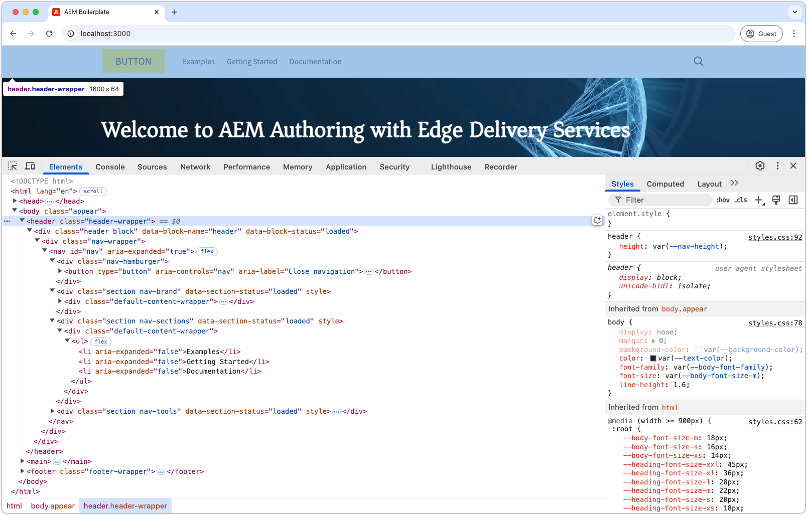

# 开发页眉和页脚

{align="center"}

页眉和页脚在Edge Delivery Services (EDS)中发挥独特的作用，因为它们直接绑定到HTML `<header>`和`<footer>`元素。 与常规页面内容不同，它们分开管理，并且无需清除整个页面缓存即可独立更新。 虽然其实现在`blocks/header`和`blocks/footer`下的代码项目中作为块，但作者可以通过可包含任意块组合的专用AEM页面编辑其内容。

## 标题块

{align="center"}

标头是绑定到Edge Delivery Services HTML `<header>`元素的特殊块。
`<header>`元素交付为空，并通过XHR (AJAX)填充到单独的AEM页面中。
这允许标头独立于页面内容进行管理，并且无需完全缓存清除所有页面即可更新。

标头块负责请求包含标头内容的AEM页面片段，并在`<header>`元素中呈现该片段。

[!BADGE /blocks/header/header.js]{type=Neutral tooltip="下面代码示例的文件名。"}

```javascript
import { getMetadata } from '../../scripts/aem.js';
import { loadFragment } from '../fragment/fragment.js';

...

export default async function decorate(block) {
  // load nav as fragment

  // Get the path to the AEM page fragment that defines the header content from the <meta name="nav"> tag. This is set via the site's Metadata file.
  const navMeta = getMetadata('nav');

  // If the navMeta is not defined, use the default path `/nav`.
  const navPath = navMeta ? new URL(navMeta, window.location).pathname : '/nav';

  // Make an XHR (AJAX) call to request the AEM page fragment and serialize it to a HTML DOM tree.
  const fragment = await loadFragment(navPath);
  
  // Add the content from the fragment HTML to the block and decorate it as needed
  ...
}
```

`loadFragment()`函数向`${navPath}.plain.html`发出XHR (AJAX)请求，该请求返回页面`<main>`标记中存在的AEM页面HTML的EDS HTML演绎版，使用可能包含的任何块处理其内容，并返回更新的DOM树。

## 创作标题页面

在开发标题块之前，首先在通用编辑器中创作其内容，以便针对其进行开发。

标题内容位于名为`nav`的专用AEM页面中。

{align="center"}

要创作标题，请执行以下操作：

1. 在通用编辑器中打开`nav`页面
1. 将默认按钮替换为包含WKND徽标的&#x200B;**图像块**
1. 通过以下方式更新&#x200B;**文本块**&#x200B;中的导航菜单：
   - 添加所需的导航链接
   - 根据需要创建子导航项目
   - 暂时设置指向主页(`/`)的所有链接

通用编辑器中的{align="center"}

### 发布以预览

更新页眉页后，[将页面发布到预览](../6-author-block.md)。

由于页眉内容位于其自身的页面（`nav`页面）上，因此您必须专门发布该页面，页眉更改才能生效。 发布使用标头的其他页面将不会更新Edge Delivery Services上的标头内容。

## 阻止HTML

要开始块开发，请先查看Edge Delivery Services预览所公开的DOM结构。 DOM通过JavaScript进行了增强并使用CSS进行了样式设置，为构建和自定义块奠定了基础。

由于标头是作为片段加载的，因此我们需要检查XHR请求返回的HTML，该标头在插入到DOM中并通过`loadFragment()`进行修饰之后。 可以通过检查浏览器开发人员工具中的DOM来完成此操作。


>[!BEGINTABS]

>要修饰的[!TAB DOM]

以下是标头页面在使用提供的`header.js`加载并插入到DOM中之后的HTML：

```html
<header class="header-wrapper">
  <div class="header block" data-block-name="header" data-block-status="loaded">
    <div class="nav-wrapper">
      <nav id="nav" aria-expanded="true">
        <div class="nav-hamburger">
          <button type="button" aria-controls="nav" aria-label="Close navigation">
            <span class="nav-hamburger-icon"></span>
          </button>
        </div>
        <div class="section nav-brand" data-section-status="loaded" style="">
          <div class="default-content-wrapper">
            <p class="">
              <a href="#" title="Button" class="">Button</a>
            </p>
          </div>
        </div>
        <div class="section nav-sections" data-section-status="loaded" style="">
          <div class="default-content-wrapper">
            <ul>
              <li aria-expanded="false">Examples</li>
              <li aria-expanded="false">Getting Started</li>
              <li aria-expanded="false">Documentation</li>
            </ul>
          </div>
        </div>
        <div class="section nav-tools" data-section-status="loaded" style="">
          <div class="default-content-wrapper">
            <p>
              <span class="icon icon-search">
                
              </span>
            </p>
          </div>
        </div>
      </nav>
    </div>
  </div>
</header>
```

>[!TAB 如何查找DOM]

在Web浏览器的开发人员工具中查找并检查页面的`<header>`元素。

{align="center"}

>[!ENDTABS]


## 阻止JavaScript

[AEM样板XWalk项目模板](https://github.com/adobe-rnd/aem-boilerplate-xwalk)中的`/blocks/header/header.js`文件提供了JavaScript以进行导航，包括下拉菜单和响应式移动设备视图。

虽然`header.js`脚本经常经过大量自定义以匹配站点的设计，但必须保留`decorate()`中的第一行，这些行用于检索和处理标题页面片段。

[!BADGE /blocks/header/header.js]{type=Neutral tooltip="下面代码示例的文件名。"}

```javascript
export default async function decorate(block) {
  // load nav as fragment
  const navMeta = getMetadata('nav');
  const navPath = navMeta ? new URL(navMeta, window.location).pathname : '/nav';
  const fragment = await loadFragment(navPath);
  ...
```

可以修改剩余的代码以满足项目的需求。

根据标题要求，可以调整或删除样板代码。 在本教程中，我们将使用提供的代码并通过在第一个创作的图像周围添加超链接，并将其链接到网站的主页来增强代码。

模板的代码处理页眉页面片段，假定它按以下顺序包含三个部分：

1. **品牌部分** — 包含徽标，且样式为`.nav-brand`类。
2. **节节** — 定义网站的主菜单并设置了`.nav-sections`的样式。
3. **工具部分** — 包括搜索、登录/注销和配置文件等元素，样式为`.nav-tools`。

为了将徽标图像超链接至主页，我们更新了块JavaScript，如下所示：

>[!BEGINTABS]

>[!TAB 已更新JavaScript]

下面显示了将徽标图像与指向网站主页(`/`)的链接包装在一起的更新代码：

[!BADGE /blocks/header/header.js]{type=Neutral tooltip="下面代码示例的文件名。"}

```javascript
export default async function decorate(block) {

  ...
  const navBrand = nav.querySelector('.nav-brand');
  
  // WKND: Turn the picture (image) into a linked site logo
  const logo = navBrand.querySelector('picture');
  
  if (logo) {
    // Replace the first section's contents with the authored image wrapped with a link to '/' 
    navBrand.innerHTML = `<a href="/" aria-label="Home" title="Home" class="home">${logo.outerHTML}</a>`;
    // Make sure the logo is not lazy loaded as it's above the fold and can affect page load speed
    navBrand.querySelector('img').settAttribute('loading', 'eager');
  }

  const navSections = nav.querySelector('.nav-sections');
  if (navSections) {
    // WKND: Remove Edge Delivery Services button containers and buttons from the nav sections links
    navSections.querySelectorAll('.button-container, .button').forEach((button) => {
      button.classList = '';
    });

    ...
  }
  ...
}
```

>[!TAB 原始JavaScript]

以下是从模板生成的原始`header.js`：

[!BADGE /blocks/header/header.js]{type=Neutral tooltip="下面代码示例的文件名。"}

```javascript
export default async function decorate(block) {
  ...
  const navBrand = nav.querySelector('.nav-brand');
  const brandLink = navBrand.querySelector('.button');
  if (brandLink) {
    brandLink.className = '';
    brandLink.closest('.button-container').className = '';
  }

  const navSections = nav.querySelector('.nav-sections');
  if (navSections) {
    navSections.querySelectorAll(':scope .default-content-wrapper > ul > li').forEach((navSection) => {
      if (navSection.querySelector('ul')) navSection.classList.add('nav-drop');
      navSection.addEventListener('click', () => {
        if (isDesktop.matches) {
          const expanded = navSection.getAttribute('aria-expanded') === 'true';
          toggleAllNavSections(navSections);
          navSection.setAttribute('aria-expanded', expanded ? 'false' : 'true');
        }
      });
    });
  }
  ...
}
```

>[!ENDTABS]


## 阻止CSS

更新`/blocks/header/header.css`以根据WKND的品牌设置其样式。

我们将在`header.css`的底部添加自定义CSS，以使教程更改更易于查看和理解。 虽然可以将这些样式直接集成到模板的CSS规则中，但将它们保持独立有助于说明修改的内容。

由于我们是在原始集之后添加新规则，因此我们将使用`header .header.block nav` CSS选择器来封装它们，以确保它们优先于模板规则。

[!BADGE /blocks/header/header.css]{type=Neutral tooltip="下面代码示例的文件名。"}

```css
/* /blocks/header/header.css */

... Existing CSS generated by the template ...

/* Add the following CSS to the end of the header.css */

/** 
* WKND customizations to the header 
* 
* These overrides can be incorporated into the provided CSS,
* however they are included discretely in thus tutorial for clarity and ease of addition.
* 
* Because these are added discretely
* - They are added to the bottom to override previous styles.
* - They are wrapped in a header .header.block nav selector to ensure they have more specificity than the provided CSS.
* 
**/

header .header.block nav {
  /* Set the height of the logo image.
     Chrome natively sets the width based on the images aspect ratio */
  .nav-brand img {
    height: calc(var(--nav-height) * .75);
    width: auto;
    margin-top: 5px;
  }
  
  .nav-sections {
    /* Update menu items display properties */
    a {
      text-transform: uppercase;
      background-color: transparent;
      color: var(--text-color);
      font-weight: 500;
      font-size: var(--body-font-size-s);
    
      &:hover {
        background-color: auto;
      }
    }

    /* Adjust some spacing and positioning of the dropdown nav */
    .nav-drop {
      &::after {
        transform: translateY(-50%) rotate(135deg);
      }
      
      &[aria-expanded='true']::after {
        transform: translateY(50%) rotate(-45deg);
      }

      & > ul {
        top: 2rem;
        left: -1rem;      
       }
    }
  }
```

## 开发预览

在开发CSS和JavaScript时，AEM CLI的本地开发环境会热重新加载更改，从而允许快速轻松地可视化代码如何影响块。 将鼠标悬停在CTA上并验证Teaser的图像是否放大了图像。

{align="center"}

## 嵌入代码

请确保[频繁lint](../3-local-development-environment.md#linting)您的代码更改以保持干净一致。 定期筛选有助于及早发现问题，从而缩短总体开发时间。 请记住，在解决所有链接问题之前，无法将开发工作合并到`main`分支！

```bash
# ~/Code/aem-wknd-eds-ue

$ npm run lint
```

## 在通用编辑器中预览

要在AEM的通用编辑器中查看更改，请添加、提交这些更改，并将其推送到通用编辑器使用的Git存储库分支。 这样做可确保块实施不会中断创作体验。

```bash
# ~/Code/aem-wknd-eds-ue

$ git add .
$ git commit -m "CSS and JavaScript implementation for Header block"
# JSON files are compiled automatically and added to the commit via a Husky pre-commit hook
$ git push origin header-and-footer
```

现在，使用`?ref=header-and-footer`查询参数时，更改在通用编辑器中可见。

通用编辑器中的{align="center"}

## 页脚

与页眉一样，页脚内容是在专用的AEM页面上创作的，在本例中是页脚页面(`footer`)。 页脚遵循与片段加载相同的模式，并使用CSS和JavaScript进行修饰。

>[!BEGINTABS]

>[!TAB 页脚]

页脚应采用三列布局实施，其中包含：

- 包含促销活动（图像和文本）的左列
- 带有导航链接的中间列
- 包含社交媒体链接的右列
- 位于底部的横跨所有三列的行，版权所有

{align="center"}

>[!TAB 创作页脚]

使用“页脚”页中的列块可创建三列效果。

| 列1 | 列2 | 列3 |
| ---------|----------------|---------------|
| 图像 | 标题 3 | 标题 3 |
| 文本 | 链接列表 | 链接列表 |

{align="center"}

>[!TAB 页脚代码]

下面的CSS使用三列布局、一致的间距和排版规则来设置页脚块的样式。 页脚实施仅使用模板提供的JavaScript。

[!BADGE /blocks/footer/footer.css]{type=Neutral tooltip="下面代码示例的文件名。"}

```css
/* /blocks/footer/footer.css */

footer {
  background-color: var(--light-color);

  .block.footer {
    border-top: solid 1px var(--dark-color);
    font-size: var(--body-font-size-s);

    a { 
      all: unset;
      
      &:hover {
        text-decoration: underline;
        cursor: pointer;
      }
    }

    img {
      width: 100%;
      height: 100%;
      object-fit: cover;
      border: solid 1px white;
    }

    p {
      margin: 0;
    }

    ul {
      list-style: none;
      padding: 0;
      margin: 0;

      li {
        padding-left: .5rem;
      }
    }

    & > div {
      margin: auto;
      max-width: 1200px;
    }

    .columns > div {
      gap: 5rem;
      align-items: flex-start;

      & > div:first-child {
        flex: 2;
      }
    }

    .default-content-wrapper {
      padding-top: 2rem;
      margin-top: 2rem;
      font-style: italic;
      text-align: right;
    }
  }
}

@media (width >= 900px) {
  footer .block.footer > div {
    padding: 40px 32px 24px;
  }
}
```


>[!ENDTABS]

## 恭喜！

您现在已了解如何在Edge Delivery Services和通用编辑器中管理和开发页眉和页脚。 您已了解它们的具体情况：

- 在独立于主内容的专用AEM页面上创作
- 以片段形式异步加载以启用独立更新
- 用JavaScript和CSS修饰以创建响应式导航体验
- 与通用编辑器无缝集成，便于内容管理

此模式为实施站点范围的导航组件提供了一种灵活的可维护方法。

有关更多最佳实践和高级技术，请查看[通用编辑器文档](https://experienceleague.adobe.com/en/docs/experience-manager-cloud-service/content/edge-delivery/wysiwyg-authoring/create-block#block-options)。
