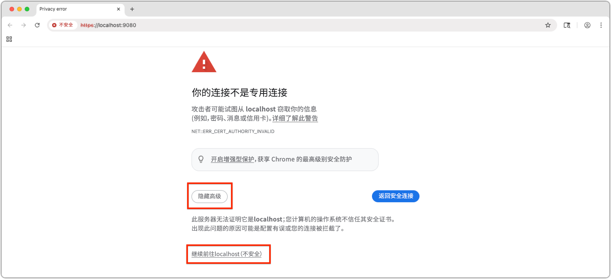
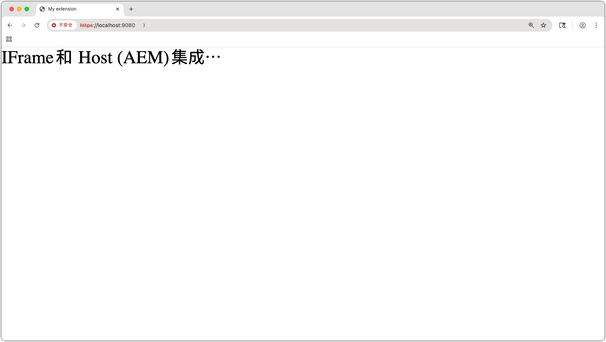
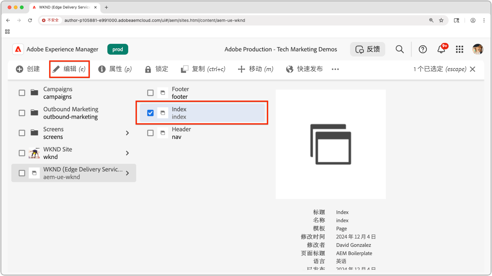
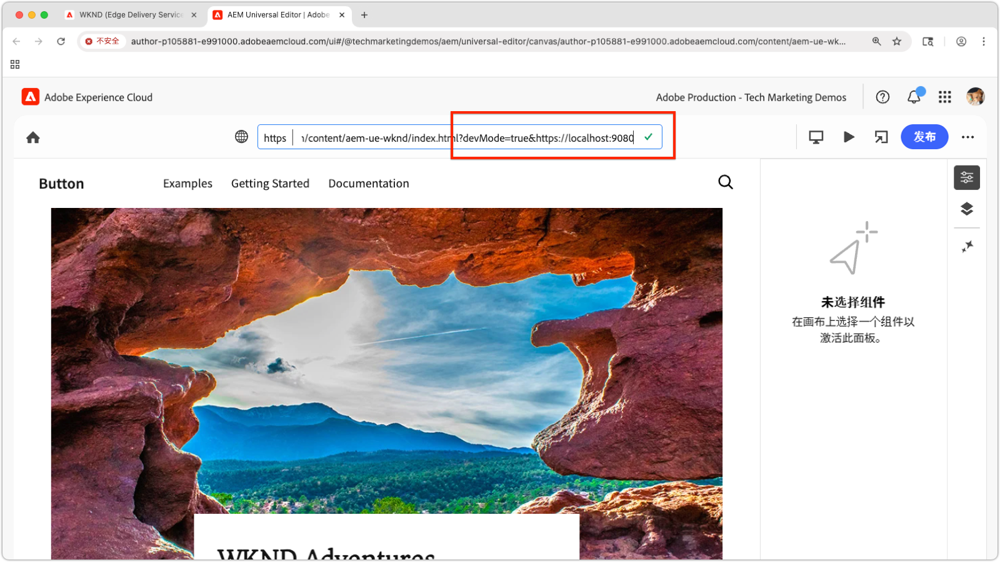

# 预览一个本地的通用编辑器扩展

>[!TIP]
> 了解如何[创建通用编辑器扩展](https://developer.adobe.com/uix/docs/services/aem-universal-editor/)。

要在开发过程中预览通用编辑器扩展，您需要：

1. 在本地运行扩展。
2. 接受自签名证书。
3. 在通用编辑器中打开一个页面。
4. 更新位置 URL 以加载本地扩展。

## 在本地运行扩展

前提是您已经创建了一个[通用编辑器扩展](https://developer.adobe.com/uix/docs/services/aem-universal-editor/)，并希望在本地测试和开发时预览此扩展。

通过以下方法启动通用编辑器扩展：

```bash
$ aio app run
```

您将看到如下输出：

```
To view your local application:
  -> https://localhost:9080
To view your deployed application in the Experience Cloud shell:
  -> https://experience.adobe.com/?devMode=true#/custom-apps/?localDevUrl=https://localhost:9080
```

默认情况下，您的扩展会在 `https://localhost:9080` 运行。


## 接受自签名证书

通用编辑器需要 HTTPS 加载扩展。由于本地开发使用自签名证书，因此您的浏览器必须明确信任此证书。

打开一个新的浏览器选项卡，然后导航到 `aio app run` 命令输出的本地扩展 URL：

```
https://localhost:9080
```

您的浏览器将显示一个证书警告。接受证书，然后继续。



接受后，您将看到本地扩展的占位符页面：




## 在通用编辑器中打开一个页面

通过[通用编辑器控制台](https://experience.adobe.com/#/@myOrg/aem/editor/canvas/)或者在使用通用编辑器的 AEM Sites 中编辑一个页面，由此打开通用编辑器：




## 加载扩展

在通用编辑器中，找到界面顶部中央的&#x200B;**位置**&#x200B;字段。将其展开，更新&#x200B;**位置字段中的 URL**，注意&#x200B;**不是浏览器地址栏**。

附加以下查询参数：

* `devMode=true` – 启用通用编辑器的开发模式。
* `ext=https://localhost:9080` – 加载本地运行的扩展。

示例：

```
https://author-pXXX-eXXX.adobeaemcloud.com/content/aem-ue-wknd/index.html?devMode=true&ext=https://localhost:9080
```




## 预览扩展

执行浏览器的&#x200B;**强制重新加载**，确保使用更新后的 URL。

通用编辑器现在将加载您的本地扩展 - 只是在您的浏览器会话中。

您在本地所做的任何代码更改都将立即反映出来。


