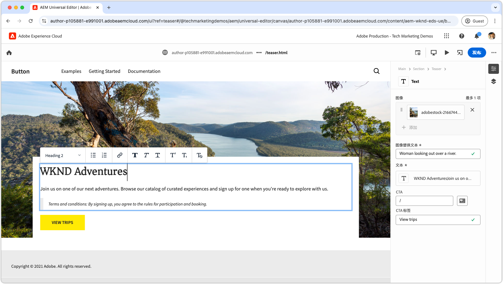

# Edge Delivery Services 视频

了解如何用 Edge Delivery Services 提高网站的访问速度。

>[!VIDEO](https://video.tv.adobe.com/v/3453464/?learn=on&captions=chi_hans)

请查阅[文档](https://experienceleague.adobe.com/zh-hans/docs/experience-manager-cloud-service/content/edge-delivery/overview)，以获取 Edge Delivery Services 及其功能的完整详情。

## Edge Delivery Services 开发人员教程

<!-- CARDS 

* https://experienceleague.adobe.com/zh-hans/docs/experience-manager-cloud-service/content/edge-delivery/build/tutorial
  {title = Document-based authoring and Edge Delivery Services tutorial}
  {description = Learn how to create Edge Delivery Services web sites authored using Document-based authoring.}
  {cta = Start the tutorial}

* ./developing/universal-editor/0-overview.md
  {title = Universal Editor and Edge Delivery Services tutorial}
  {description = Learn the basics of creating an Edge Delivery Services web sites authored with Universal Editor.}
  {cta = Start the tutorial}

-->
<!-- START CARDS HTML - DO NOT MODIFY BY HAND -->

    

        

            

                <figure class="image x-is-16by9">
                    
                </figure>
            

            

                

                    

                        <a href="https://experienceleague.adobe.com/zh-hans/docs/experience-manager-cloud-service/content/edge-delivery/build/tutorial" target="_blank" rel="referrer" title="基于文档的创作和 Edge Delivery Services 教程">基于文档的创作和 Edge Delivery Services 教程</a>
                    

                    
了解如何创建使用基于文档的创作方式创作的 Edge Delivery Services 网站。

                

                <a href="https://experienceleague.adobe.com/zh-hans/docs/experience-manager-cloud-service/content/edge-delivery/build/tutorial" target="_blank" rel="referrer" class="spectrum-Button spectrum-Button--outline spectrum-Button--primary spectrum-Button--sizeM" style="align-self: flex-start; margin-top: 1rem;">
                    开始学习教程
                </a>
            

        

    

    

        

            

                <figure class="image x-is-16by9">
                    
                </figure>
            

            

                

                    

                        <a href="./developing/universal-editor/0-overview.md" target="_blank" rel="referrer" title="通用编辑器和 Edge Delivery Services 教程">通用编辑器和 Edge Delivery Services 教程</a>
                    

                    
学习使用通用编辑器创建 Edge Delivery Services 网站的基础知识。

                

                <a href="./developing/universal-editor/0-overview.md" target="_blank" rel="referrer" class="spectrum-Button spectrum-Button--outline spectrum-Button--primary spectrum-Button--sizeM" style="align-self: flex-start; margin-top: 1rem;">
                    开始学习教程
                </a>
            

        

    

<!-- END CARDS HTML - DO NOT MODIFY BY HAND -->

## Edge Delivery Services 快速入门

    <!-- Prerequisites -->
    

      

        

          <figure class="image is-16by9">
            
          </figure>
        

        

          

            
5 分钟

            

              <a href="./developing/prerequisites.md" title="先决条件">开发人员先决条件</a>
            

            
开始使用 Edge Delivery Services 进行开发需要什么。

            <a href="./developing/prerequisites.md" class="spectrum-Button
              spectrum-Button--outline spectrum-Button--primary
              spectrum-Button--sizeM">
              观看该视频
            </a>
          

        

      

    
 
    <!-- Setting up your Repository-->
    

      

        

          <figure class="image is-16by9">
            
          </figure>
        

        

          

            
1 分钟

            

              <a href="./developing/aem-boilerplate.md" title="使用样板模板">AEM 样板</a>
            

            
使用 AEM 样本模板设置代码存储库。

            <a href="./developing/aem-boilerplate.md" class="spectrum-Button
              spectrum-Button--outline spectrum-Button--primary
              spectrum-Button--sizeM">
              观看该视频
            </a>
          

        

      

    

    <!-- Linking Google Drive -->
    

      

        

          <figure class="image is-16by9">
            
          </figure>
        

        

          

            
1 分钟

            

              <a href="./developing/content-repository.md" title="链接 Google Drive">链接 Google Drive</a>
            

            
将 Google Drive 用作所有内容的存储库。

            <a href="./developing/content-repository.md" class="spectrum-Button
              spectrum-Button--outline spectrum-Button--primary
              spectrum-Button--sizeM">
              观看该视频
            </a>
          

        

      

    

    <!-- Link Sharepoint --->
    

      

        

          <figure class="image is-16by9">
            
          </figure>
        

        

          

            
1 分钟

            

              <a href="./developing/content-repository.md" title="链接 SharePoint">链接 SharePoint</a>
            

            
将 SharePoint 用作所有内容的存储库。

            <a href="./developing/content-repository.md"
              class="spectrum-Button spectrum-Button--outline
              spectrum-Button--primary spectrum-Button--sizeM">
              观看该视频
            </a>
          

        

      

    

    <!-- Previewing and Publishing Content -->
    

      

        

          <figure class="image is-16by9">
            
          </figure>
        

        

          

            
1 分钟

            

              <a href="./developing/preview-and-publish.md" title="预览和发布内容">预览和发布内容</a>
            

            
使用 AEM Sidekick 预览和发布内容。

            <a href="./developing/preview-and-publish.md" class="spectrum-Button
              spectrum-Button--outline spectrum-Button--primary
              spectrum-Button--sizeM">
              观看该视频
            </a>
          

        

      

    

    <!-- Using the Sidekick -->
    

      

        

          <figure class="image is-16by9">
            
          </figure>
        

        

          

            
1 分钟

            

              <a href="./developing/sidekick.md" title="使用 Sidekick">使用 AEM Sidekick</a>
            

            
了解如何使用 AEM Sidekick

            <a href="./developing/sidekick.md" class="spectrum-Button
              spectrum-Button--outline spectrum-Button--primary
              spectrum-Button--sizeM">
              观看该视频
            </a>
          

        

      

    

 <!-- Document Structure -->
    

      

        

          <figure class="image is-16by9">
            
          </figure>
        

        

          

            
1 分钟

            

              <a href="./developing/document-structure.md" title="文档结构">文档结构</a>
            

            
探索文档结构，包括默认内容、章节和区块 

            <a href="./developing/document-structure.md" class="spectrum-Button
              spectrum-Button--outline spectrum-Button--primary
              spectrum-Button--sizeM">
              观看该视频
            </a>
          

        

      

    
  
     <!--Local Development -->
    

      

        

          <figure class="image is-16by9">
            
          </figure>
        

        

          

            
2 分钟

            

              <a href="./developing/local-development.md" title="本地开发">本地开发</a>
            

            
配置您的本地开发环境。

            <a href="./developing/local-development.md" class="spectrum-Button
              spectrum-Button--outline spectrum-Button--primary
              spectrum-Button--sizeM">
              观看该视频
            </a>
          

        

      

    

    <!--Integrate with Git -->
    

      

        

          <figure class="image is-16by9">
            
          </figure>
        

        

          

            
2 分钟

            

              <a href="./developing/git.md" title="与 Git 集成">与 Git 集成</a>
            

            
配置 Git 和 Edge Delivery Services。

            <a href="./developing/git.md" class="spectrum-Button
              spectrum-Button--outline spectrum-Button--primary
              spectrum-Button--sizeM">
              观看该视频
            </a>
          

        

      

    

## 操作方法视频

    <!--Create RSS Feeds -->
    

      

        

          <figure class="image is-16by9">
            
          </figure>
        

        

          

            
2 分钟

            

              <a href="./how-to/rss.md" title="创建 RSS 源">创建 RSS 源</a>
            

            
了解如何创建 RSS 源。

            <a href="./how-to/rss.md" class="spectrum-Button
              spectrum-Button--outline spectrum-Button--primary
              spectrum-Button--sizeM">
              观看该视频
            </a>
          

        

      

    

    <!--Social Media Sharing -->
    

      

        

          <figure class="image is-16by9">
            
          </figure>
        

        

          

            
2 分钟

            

              <a href="./how-to/social-media-sharing.md" title="社交媒体共享">社交媒体共享</a>
            

            
了解如何优化您的内容，以便在社交媒体上分享。

            <a href="./how-to/social-media-sharing.md" class="spectrum-Button
              spectrum-Button--outline spectrum-Button--primary
              spectrum-Button--sizeM">
              观看该视频
            </a>
          

        

      

    

    <!--Delete a Page -->
    

      

        

          <figure class="image is-16by9">
            
          </figure>
        

        

          

            
2 分钟

            

              <a href="./how-to/delete-page.md" title="删除页面">删除页面</a>
            

            
了解如何删除页面。

            <a href="./how-to/delete-page.md" class="spectrum-Button
              spectrum-Button--outline spectrum-Button--primary
              spectrum-Button--sizeM">
              观看该视频
            </a>
          

        

      

    
    
  

