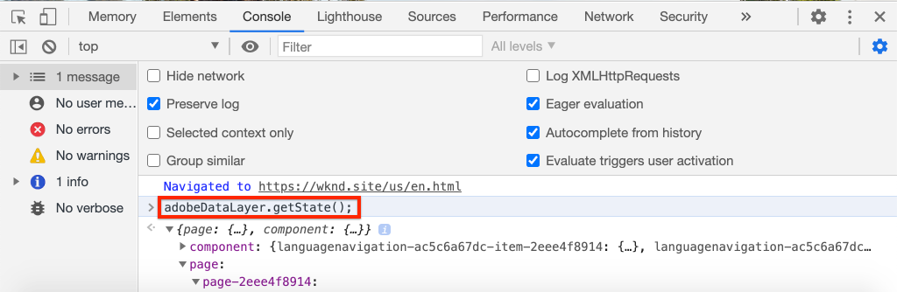

# 将Adobe客户端数据层与AEM核心组件结合使用 {#overview}

Adobe客户端数据层引入了一种标准方法，用于收集和存储有关访客在网页上的体验数据，然后使访问这些数据更容易。 Adobe Client Data Layer 与平台无关，而是与核心组件完全集成以用于 AEM。

>[!VIDEO](https://video.tv.adobe.com/v/41195?quality=12&learn=on)

>[!NOTE]
>
> 想要在AEM站点上启用Adobe客户端数据层？ [请在此处查看说明](https://experienceleague.adobe.com/docs/experience-manager-core-components/using/developing/data-layer/overview.html?lang=zh-Hans#installation-activation)。

## 探索Data Layer

只需使用浏览器和Adobe[WKND实时参考站点](https://wknd.site/us/en.html)的开发人员工具，即可了解浏览器客户端数据层的内置功能。

>[!NOTE]
>
> 以下屏幕截图摘自Chrome浏览器。

1. 导航到[https://wknd.site/us/en.html](https://wknd.site/us/en.html)
1. 在&#x200B;**控制台**&#x200B;中打开开发人员工具并输入以下命令：

   ```js
   window.adobeDataLayer.getState();
   ```

   要查看AEM站点上数据层的当前状态，请检查响应。 您应该会看到有关页面和各个组件的信息。

   

1. 通过在控制台中输入以下内容，将数据对象推送到数据层：

   ```js
   window.adobeDataLayer.push({
       "component": {
           "training-data": {
               "title": "Learn More",
               "link": "learn-more.html"
           }
       }
   });
   ```

1. 再次运行命令`adobeDataLayer.getState()`并找到`training-data`的条目。
1. 接下来，添加一个路径参数，以仅返回组件的特定状态：

   ```js
   window.adobeDataLayer.getState('component.training-data');
   ```

   

## 使用事件

最佳实践是根据数据层中的事件触发任何自定义代码。 接下来，探索如何注册和侦听不同的事件。

1. 在控制台中输入以下帮助程序方法：

   ```js
   function getDataObjectHelper(event, filter) {
       if (event.hasOwnProperty("eventInfo") && event.eventInfo.hasOwnProperty("path")) {
           var dataObject = window.adobeDataLayer.getState(event.eventInfo.path);
           if (dataObject != null) {
               for (var property in filter) {
                   if (!dataObject.hasOwnProperty(property) || (filter[property] !== null && filter[property] !== dataObject[property])) {
                       return;
                   }
                   return dataObject;
               }
           }
       }
       return;
   }
   ```

   上述代码检查`event`对象并使用`adobeDataLayer.getState`方法获取触发事件的对象的当前状态。 然后，帮助程序方法检查`filter`，并且仅当当前`dataObject`满足筛选条件时才返回它。

   >[!CAUTION]
   >
   > 在整个练习中刷新浏览器时，**而不是**&#x200B;很重要，否则控制台JavaScript将丢失。

1. 接下来，输入在&#x200B;**轮播**&#x200B;中显示&#x200B;**Teaser**&#x200B;组件时调用的事件处理程序。

   ```js
   function teaserShownHandler(event) {
       var dataObject = getDataObjectHelper(event, {"@type": "wknd/components/carousel/item"});
       if(dataObject != null) {
           console.log("Teaser Shown: " + dataObject['dc:title']);
           console.log(dataObject);
       }
   }
   ```

   `teaserShownHandler`函数调用`getDataObjectHelper`函数并传递`wknd/components/carousel/item`的筛选器作为`@type`，以筛选掉由其他组件触发的事件。

1. 接下来，将事件侦听器推送到数据层上以侦听`cmp:show`事件。

   ```js
   window.adobeDataLayer.push(function (dl) {
        dl.addEventListener("cmp:show", teaserShownHandler);
   });
   ```

   `cmp:show`事件由许多不同的组件触发，例如，在&#x200B;**轮播**&#x200B;中显示新幻灯片时，或者在&#x200B;**选项卡**&#x200B;组件中选择新选项卡时。

1. 在页面上，切换轮播幻灯片并观察控制台语句：

   

1. 要停止侦听`cmp:show`事件，请从数据层中删除事件侦听器

   ```js
   window.adobeDataLayer = window.adobeDataLayer || [];
   window.adobeDataLayer.push(function(dl) {
       dl.removeEventListener("cmp:show", teaserShownHandler);
   });
   ```

1. 返回页面并切换轮播幻灯片。 请注意，不再记录任何语句，并且事件未被侦听。

1. 接下来，创建在触发“页面显示”事件时调用的事件处理程序：

   ```js
   function pageShownHandler(event) {
       var dataObject = getDataObjectHelper(event, {"@type": "wknd/components/page"});
       if(dataObject != null) {
           console.log("Page Shown: " + dataObject['dc:title']);
           console.log(dataObject);
       }
   }
   ```

   请注意，资源类型`wknd/components/page`用于筛选事件。

1. 接下来，将事件侦听器推送到数据层以侦听`cmp:show`事件，并调用`pageShownHandler`。

   ```js
   window.adobeDataLayer = window.adobeDataLayer || [];
   window.adobeDataLayer.push(function (dl) {
        dl.addEventListener("cmp:show", pageShownHandler);
   });
   ```

1. 此时，您应该会立即看到随页面数据触发的控制台语句：

   

   页面的`cmp:show`事件在页面顶部的每次页面加载时触发。 您可能会问，当页面显然已加载时，为什么会触发事件处理程序？

   Adobe客户端数据层的独特功能之一是，您可以在&#x200B;**之前**&#x200B;或&#x200B;**之后**&#x200B;注册事件侦听器。数据层已初始化，这有助于避免出现争用情况。

   Data Layer维护一个队列数组，其中包含按顺序发生的所有事件。 默认情况下，Data Layer将触发在&#x200B;**过去**&#x200B;发生的事件以及&#x200B;**未来**&#x200B;发生的事件的事件回调。 可以从过去或将来筛选事件。 [在文档中可找到更多信息](https://github.com/adobe/adobe-client-data-layer/wiki#addeventlistener)。


## 后续步骤

有两个选项可供您继续学习：第一，查看[收集页面数据并将其发送到Adobe Analytics](../analytics/collect-data-analytics.md)教程，以演示如何使用Adobe客户端数据层。 第二个选项是，了解如何[使用AEM组件自定义Adobe客户端数据层](./data-layer-customize.md)


## 其他资源 {#additional-resources}

* [Adobe的客户端数据层文档](https://github.com/adobe/adobe-client-data-layer/wiki)
* [使用Adobe客户端数据层和核心组件文档](https://experienceleague.adobe.com/docs/experience-manager-core-components/using/developing/data-layer/overview.html?lang=zh-Hans)
