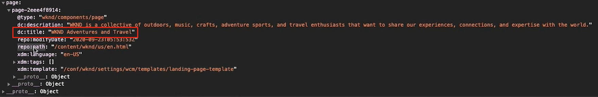

# 加载和触发Target调用 {#load-fire-target}

了解如何使用标记规则从网站页面加载、将参数传递到页面请求以及触发Target调用。 使用Adobe客户端数据层可检索网页信息并将其作为参数进行传递，这样您便可以收集和存储有关访客在网页上的体验数据，然后轻松访问这些数据。

>[!VIDEO](https://video.tv.adobe.com/v/41243?quality=12&learn=on)

## 页面加载规则

Adobe Client Data Layer是事件驱动的数据层。 加载AEM页面数据层时，将触发事件`cmp:show` 。 在视频中，使用自定义事件调用`tags Library Loaded`规则。 在下面，您可以找到视频中用于自定义事件和数据元素的代码片段。

### 自定义页面显示事件{#page-event}


在Tags属性中，向&#x200B;**规则**&#x200B;添加新的&#x200B;**事件**

+ __扩展：__&#x200B;核心
+ __事件类型：__&#x200B;自定义代码
+ __名称：__&#x200B;页面显示事件处理程序（或描述性内容）

点按&#x200B;__打开编辑器__&#x200B;按钮并粘贴以下代码片段。 此代码&#x200B;__必须__&#x200B;添加到&#x200B;__事件配置__&#x200B;和后续的&#x200B;__操作__。

```javascript
// Define the event handler function
var pageShownEventHandler = function(coreComponentEvent) {

    // Check to ensure event trigger via AEM Core Components is shaped correctly
    if (coreComponentEvent.hasOwnProperty("eventInfo") && 
        coreComponentEvent.eventInfo.hasOwnProperty("path")) {
    
        // Debug the AEM Component path the show event is associated with
        console.debug("cmp:show event: " + coreComponentEvent.eventInfo.path);

        // Create the tags Event object
        var launchEvent = {
            // Include the ID of the AEM Component that triggered the event
            id: coreComponentEvent.eventInfo.path,
            // Get the state of the AEM Component that triggered the event           
            component: window.adobeDataLayer.getState(coreComponentEvent.eventInfo.path)
        };

        // Trigger the tags Rule, passing in the new `event` object
        // the `event` obj can now be referenced by the reserved name `event` by other tags data elements
        // i.e `event.component['someKey']`
        trigger(launchEvent);
   }
}

// With the AEM Core Component event handler, that proxies the event and relevant information to Data Collection, defined above...

// Initialize the adobeDataLayer global object in a safe way
window.adobeDataLayer = window.adobeDataLayer || [];

// Push the event custom listener onto the Adobe Data Layer
window.adobeDataLayer.push(function (dataLayer) {
   // Add event listener for the `cmp:show` event, and the custom `pageShownEventHandler` function as the callback
   dataLayer.addEventListener("cmp:show", pageShownEventHandler);
});
```

自定义函数定义`pageShownEventHandler`，并侦听AEM核心组件发出的事件，派生核心组件的相关信息，将其打包到事件对象中，并在其有效负荷处使用派生的事件信息触发标记事件。

标记规则是使用标记的`trigger(...)`函数触发的，该函数仅在规则事件的自定义代码段定义中提供&#x200B;__only__。

`trigger(...)`函数将事件对象作为参数，该参数依次显示在标记数据元素中，由名为`event`的标记中的另一个保留名称显示。 标记中的数据元素现在可以使用语法（如`event.component['someKey']`）引用`event`对象中此事件对象的数据。

如果在事件的Custom Code事件类型的上下文之外使用`trigger(...)`（例如，在操作中），则在与tags属性集成的网站上抛出JavaScript错误`trigger is undefined`。


### 数据元素


标记数据元素通过核心扩展的Custom Code数据元素类型，将在自定义页面显示事件](#page-event)中触发的事件对象[中的数据映射到Adobe Target中可用的变量。

#### 页面ID数据元素

```
if (event && event.id) {
    return event.id;
}
```

此代码返回核心组件的生成唯一ID。


### 页面路径数据元素

```
if (event && event.component && event.component.hasOwnProperty('repo:path')) {
    return event.component['repo:path'];
}
```

此代码返回AEM页面的路径。


### 页面标题数据元素

```
if (event && event.component && event.component.hasOwnProperty('dc:title')) {
    return event.component['dc:title'];
}
```

此代码返回AEM页面的标题。



## 疑难解答

### 为何mbox没有在我的网页上触发？

#### 未设置mboxDisable Cookie时的错误消息


```
> AT: [page-init] Adobe Target content delivery is disabled. Ensure that you can save cookies to your current domain, there is no "mboxDisable" cookie and there is no "mboxDisable" parameter in the query string.
```

#### 解决方案

客户有时会将基于云的实例与Target结合使用来进行测试或简单的概念验证。 这些域以及许多其他域均包含在公共后缀列表中。
除非使用`targetGlobalSettings()`自定义`cookieDomain`设置，否则在使用这些域时，新式浏览器不会保存Cookie。

```
window.targetGlobalSettings = {  
   cookieDomain: 'your-domain' //set the cookie directly on this subdomain, for example: 'publish-p1234-e5678.adobeaemcloud.com'
};
```

## 后续步骤

+ [导出Experience Fragment到Adobe Target](./export-experience-fragment-target.md)

## 支持链接

+ [Adobe客户端数据层文档](https://github.com/adobe/adobe-client-data-layer/wiki)
+ [Adobe Experience Cloud Debugger - Chrome](https://chrome.google.com/webstore/detail/adobe-experience-platform/bfnnokhpnncpkdmbokanobigaccjkpob)
+ [使用Adobe客户端数据层和核心组件文档](https://experienceleague.adobe.com/docs/experience-manager-core-components/using/developing/data-layer/overview.html)
+ [Adobe Experience Platform Debugger简介](https://experienceleague.adobe.com/docs/platform-learn/data-collection/debugger/overview.html)
