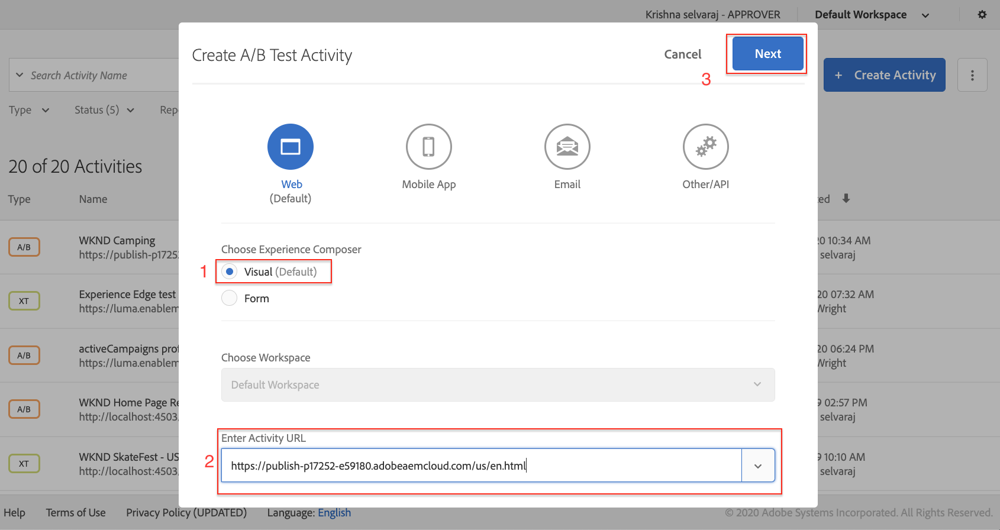

# 使用可视化体验编辑器进行个性化 {#personalization-vec}

了解如何使用可视化体验编辑器(VEC)创建A/B测试Target活动。

## 前提条件

要在AEM网站上使用VEC，必须完成以下设置：

1. [将Adobe Target添加到您的AEM网站](./add-target-launch-extension.md)
1. [从Launch触发Adobe Target调用](./load-and-fire-target.md)

## 方案概述

WKND站点主页以信息卡的形式显示本地活动或城市周围的最佳做法。 作为营销人员，您已被分配了修改主页的任务，方法是更改冒险部分Teaser的文本并了解它如何提高转化率。

## 使用可视化体验编辑器(VEC)创建A/B测试的步骤

1. 登录 [Adobe Experience Cloud](https://experience.adobe.com/)，点按 __Target__，导航到 __活动__ 选项卡

   + 如果您没有看到 __Target__ 在Experience Cloud功能板上，确保在右上角的Adobe切换器中选择了正确的组织组织，并且已授予您在中访问Target的权限。 [Adobe Admin Console](https://adminconsole.adobe.com/).

1. 单击 **创建活动** 按钮，然后选择 **A/B测试** 活动

   

1. 选择 **可视化体验编辑器** 选项，提供活动URL，然后单击 **下一个**

   

1. 创建新活动后，可视化体验编辑器在左侧显示两个选项卡： *体验A* 和 *体验B*. 从列表中选择体验。 您可以使用向列表中添加新体验 **添加体验** 按钮。

   

1. 在页面上选择图像或文本以开始进行修改，或者使用代码编辑器选取和HTML元素。

   

1. 更改文本 *西澳大利亚露营* 到 *澳大利亚历险记*. 添加到体验的更改列表显示在修改下。 您可以单击并编辑修改后的项目，以查看其CSS选择器以及添加到该项目的新内容。

   

1. 重命名 *体验A* 到 *冒险*
1. 同样，更新上的文本 *体验B* 起始日期 *西澳大利亚露营* 到 *探索澳大利亚荒野*.

   

1. 单击 **下一个** 以转到定位，让我们将两个体验之间的手动流量分配保持为50-50。

   

1. 对于“目标”和设置，选择报表源作为Adobe Target，然后选择“目标”量度作为具有页面查看操作的转化。

   

1. 提供活动的名称并保存。
1. 激活保存的活动以实时推送更改。

   

1. 在新选项卡中打开您的网站页面（步骤3中的活动URL），您应该能够从A/B测试活动中查看任一体验（探索或探索）。

   

## 摘要

在本章中，营销人员能够通过拖放、交换和修改网页的布局和内容来创建使用可视化体验编辑器的体验，而无需更改任何代码来运行测试。

## 支持链接

+ [Adobe Experience Cloud Debugger - Chrome](https://chrome.google.com/webstore/detail/adobe-experience-cloud-de/ocdmogmohccmeicdhlhhgepeaijenapj)
+ [Adobe Experience Cloud Debugger - Firefox](https://addons.mozilla.org/en-US/firefox/addon/adobe-experience-platform-dbg/)
