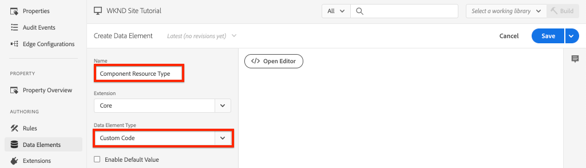
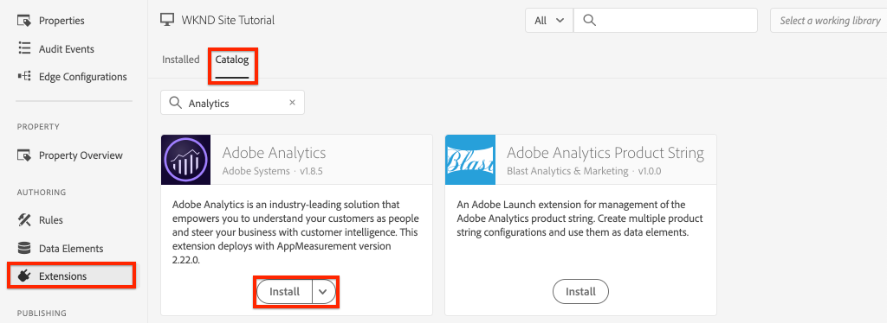
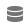
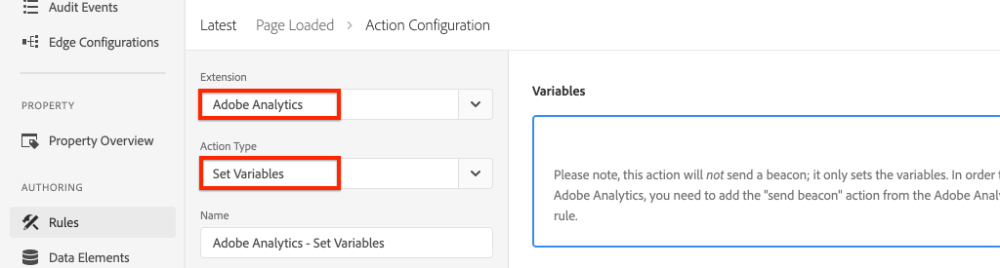
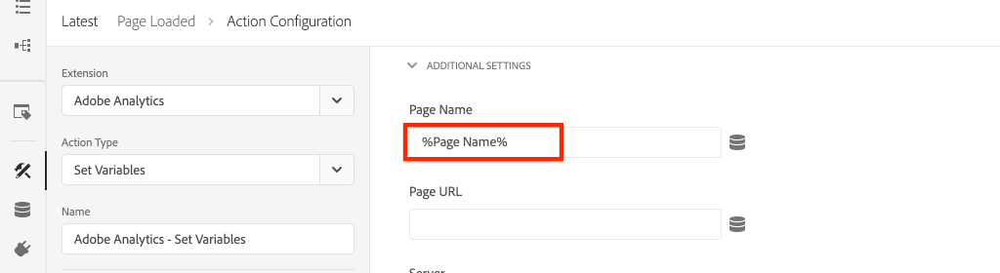

# 集成AEM Sites和Adobe Analytics

了解如何使用[AEM Sites客户端数据层与Adobe Analytics核心组件](https://experienceleague.adobe.com/docs/experience-manager-core-components/using/developing/data-layer/overview.html)的内置功能将AEM和Adobe与Adobe Analytics标记扩展集成，以收集有关Adobe Experience Manager Sites中某个页面的数据。 Experience Platform[&#128279;](https://experienceleague.adobe.com/docs/experience-platform/tags/home.html)中的标记和[Adobe Analytics扩展](https://experienceleague.adobe.com/docs/experience-platform/tags/extensions/client/analytics/overview.html)用于创建规则以将页面数据发送到Adobe Analytics。

## 您即将构建的内容 {#what-build}


在本教程中，您将根据Adobe客户端数据层中的事件触发标记规则。 此外，为应触发规则的时间添加条件，然后将AEM页面的&#x200B;**Page Name**&#x200B;和&#x200B;**Page Template**&#x200B;值发送到Adobe Analytics。

### 目标 {#objective}

1. 在tag属性中创建事件驱动规则，以从数据层捕获更改
1. 将页面数据层属性映射到标记属性中的数据元素
1. 使用页面查看信标收集页面数据并将这些数据发送到Adobe Analytics中

## 先决条件

需要以下各项：

* Experience Platform中的&#x200B;**标记属性**
* **Adobe Analytics**&#x200B;测试/开发报表包ID和跟踪服务器。 请参阅以下有关[创建报表包](https://experienceleague.adobe.com/docs/analytics/admin/admin-tools/manage-report-suites/c-new-report-suite/new-report-suite.html)的文档。
* [Experience Platform调试器](https://experienceleague.adobe.com/docs/platform-learn/data-collection/debugger/overview.html)浏览器扩展。 从Chrome浏览器捕获了本教程中的屏幕截图。
* （可选）启用了[Adobe客户端数据层的AEM站点](https://experienceleague.adobe.com/docs/experience-manager-core-components/using/developing/data-layer/overview.html#installation-activation)。 本教程使用面向公众的[WKND](https://wknd.site/us/en.html)网站，但欢迎您使用自己的网站。

>[!NOTE]
>
> 需要有关集成标记属性和AEM网站的帮助？ [观看此视频系列](../experience-platform/data-collection/tags/overview.md)。

## 切换WKND站点的标记环境

[WKND](https://wknd.site/us/en.html)是面向公众的站点，它基于[开放源代码项目](https://github.com/adobe/aem-guides-wknd)以及[AEM实施教程](https://experienceleague.adobe.com/docs/experience-manager-learn/getting-started-wknd-tutorial-develop/overview.html?lang=zh-Hans)而构建，该项目设计作为参考。

您可以使用Experience Platform Debugger将实时[WKND站点](https://wknd.site/us/en.html)切换到&#x200B;*您的*&#x200B;标记属性，而不是设置AEM环境并安装WKND代码库。**切换** 但是，如果您自己的AEM站点已经启用了[Adobe客户端数据层](https://experienceleague.adobe.com/docs/experience-manager-core-components/using/developing/data-layer/overview.html#installation-activation)，则可以使用它。

1. 登录到Experience Platform并[创建标记属性](https://experienceleague.adobe.com/docs/platform-learn/implement-in-websites/configure-tags/create-a-property.html)（如果尚未创建）。
1. 确保已创建初始标记JavaScript [库](https://experienceleague.adobe.com/docs/experience-platform/tags/publish/libraries.html#create-a-library)并将其提升到标记[环境](https://experienceleague.adobe.com/docs/experience-platform/tags/publish/environments/environments.html#)。
1. 从库已发布到的标记环境中复制JavaScript嵌入代码。

   

1. 在浏览器中，打开新选项卡并导航到[WKND站点](https://wknd.site/us/en.html)
1. 打开Experience Platform Debugger浏览器扩展

   

1. 导航到&#x200B;**Experience Platform Tags** > **配置**，并在&#x200B;**嵌入的嵌入代码**&#x200B;下使用从步骤3复制的&#x200B;*您的*&#x200B;嵌入代码替换现有嵌入代码。

   

1. 在WKND选项卡上启用&#x200B;**控制台日志记录**&#x200B;和&#x200B;**锁定**&#x200B;调试器。

   

## 验证WKND网站上的Adobe客户端数据层

[WKND参考项目](https://github.com/adobe/aem-guides-wknd)是使用AEM核心组件生成的，默认情况下已启用[Adobe客户端数据层](https://experienceleague.adobe.com/docs/experience-manager-core-components/using/developing/data-layer/overview.html#installation-activation)。 接下来，验证是否已启用Adobe Client Data Layer。

1. 导航到[WKND站点](https://wknd.site/us/en.html)。
1. 打开浏览器的开发人员工具并导航到&#x200B;**控制台**。 运行以下命令：

   ```js
   adobeDataLayer.getState();
   ```

   上述代码会返回Adobe Client Data Layer的当前状态。

   

1. 展开响应并检查`page`条目。 您应该会看到类似以下的数据架构：

   ```json
   page-2eee4f8914:
       @type: "wknd/components/page"
       dc:description: WKND is a collective of outdoors, music, crafts, adventure sports, and travel enthusiasts that want to share our experiences, connections, and expertise with the world.
       dc:title: "WKND Adventures and Travel"
       repo:modifyDate: "2020-08-31T21:02:21Z"
       repo:path: "/content/wknd/us/en.html"
       xdm:language: "en-US"
       xdm:tags: ["Attract"]
       xdm:template: "/conf/wknd/settings/wcm/templates/landing-page-template"
   ```

   若要将页面数据发送到Adobe Analytics，请使用数据层的`dc:title`、`xdm:language`和`xdm:template`等标准属性。

   有关详细信息，请查看核心组件数据架构中的[页面架构](https://experienceleague.adobe.com/docs/experience-manager-core-components/using/developing/data-layer/overview.html#page)。

   >[!NOTE]
   >
   > 如果您没有看到`adobeDataLayer` JavaScript对象？ 确保您的网站上已启用[Adobe客户端数据层](https://experienceleague.adobe.com/docs/experience-manager-core-components/using/developing/data-layer/overview.html#installation-activation)。

## 创建Page Loaded规则

Adobe客户端数据层是&#x200B;**事件驱动的**&#x200B;数据层。 加载AEM Page Data Layer时，它将触发`cmp:show`事件。 创建一个规则，该规则在从页面数据层触发`cmp:show`事件时触发。

1. 导航到Experience Platform并进入与AEM站点集成的标记属性。
1. 导航到标记属性UI中的&#x200B;**规则**&#x200B;部分，然后单击&#x200B;**创建新规则**。

   

1. 将规则&#x200B;**命名为已加载的页面**。
1. 在&#x200B;**事件**&#x200B;子部分中，单击&#x200B;**添加**&#x200B;以打开&#x200B;**事件配置**&#x200B;向导。
1. 对于&#x200B;**事件类型**&#x200B;字段，请选择&#x200B;**自定义代码**。

   

1. 在主面板中单击&#x200B;**打开编辑器**，然后输入以下代码片段：

   ```js
   var pageShownEventHandler = function(evt) {
      // defensive coding to avoid a null pointer exception
      if(evt.hasOwnProperty("eventInfo") && evt.eventInfo.hasOwnProperty("path")) {
         //trigger the Tag Rule and pass event
         console.log("cmp:show event: " + evt.eventInfo.path);
         var event = {
            //include the path of the component that triggered the event
            path: evt.eventInfo.path,
            //get the state of the component that triggered the event
            component: window.adobeDataLayer.getState(evt.eventInfo.path)
         };
   
         //Trigger the Tag Rule, passing in the new `event` object
         // the `event` obj can now be referenced by the reserved name `event` by other Tag data elements
         // i.e `event.component['someKey']`
         trigger(event);
      }
   }
   
   //set the namespace to avoid a potential race condition
   window.adobeDataLayer = window.adobeDataLayer || [];
   //push the event listener for cmp:show into the data layer
   window.adobeDataLayer.push(function (dl) {
      //add event listener for `cmp:show` and callback to the `pageShownEventHandler` function
      dl.addEventListener("cmp:show", pageShownEventHandler);
   });
   ```

   上述代码段通过[将函数](https://github.com/adobe/adobe-client-data-layer/wiki#pushing-a-function)推入数据层来添加事件侦听器。 触发`cmp:show`事件时，将调用`pageShownEventHandler`函数。 在此函数中，添加了一些健全性检查，并为触发事件的组件使用数据层[&#128279;](https://github.com/adobe/adobe-client-data-layer/wiki#getstate)的最新状态构造了一个新`event`。

   最后调用`trigger(event)`函数。 `trigger()`函数是标记属性中的保留名称，它会&#x200B;**触发规则**。 `event`对象作为参数传递，而该参数又由标记属性中的另一个保留名称公开。 标记属性中的数据元素现在可以使用代码段（如`event.component['someKey']`）引用各种属性。

1. 保存更改。
1. 接下来，在&#x200B;**操作**&#x200B;下，单击&#x200B;**添加**&#x200B;以打开&#x200B;**操作配置**&#x200B;向导。
1. 对于&#x200B;**操作类型**&#x200B;字段，请选择&#x200B;**自定义代码**。

   

1. 在主面板中单击&#x200B;**打开编辑器**，然后输入以下代码片段：

   ```js
   console.log("Page Loaded ");
   console.log("Page name: " + event.component['dc:title']);
   console.log("Page type: " + event.component['@type']);
   console.log("Page template: " + event.component['xdm:template']);
   ```

   `event`对象是从自定义事件中调用的`trigger()`方法传递的。 此处，`component`是从自定义事件中的数据层`getState`派生的当前页面。

1. 保存更改并在标记属性中运行[内部版本](https://experienceleague.adobe.com/docs/experience-platform/tags/publish/builds.html)，以将代码提升到您的AEM网站上使用的[环境](https://experienceleague.adobe.com/docs/experience-platform/tags/publish/environments/environments.html#)。

   >[!NOTE]
   >
   > 使用[Adobe Experience Platform Debugger](https://experienceleague.adobe.com/docs/platform-learn/data-collection/debugger/overview.html)将嵌入代码切换到&#x200B;**开发**&#x200B;环境可能很有用。

1. 导航到您的AEM站点，然后打开开发人员工具以查看控制台。 刷新页面，您应该会看到控制台消息已被记录：


## 创建数据元素

接下来，创建多个数据元素以从Adobe Client Data Layer捕获不同的值。 如上一个练习所示，可以直接通过自定义代码访问数据层的属性。 使用数据元素的优势在于它们可以在标记规则中重用。

数据元素映射到`@type`、`dc:title`和`xdm:template`属性。

### 组件资源类型

1. 导航到Experience Platform并进入与AEM站点集成的标记属性。
1. 导航到&#x200B;**数据元素**&#x200B;部分，然后单击&#x200B;**创建新数据元素**。
1. 对于&#x200B;**Name**&#x200B;字段，请输入&#x200B;**组件资源类型**。
1. 对于&#x200B;**数据元素类型**&#x200B;字段，请选择&#x200B;**自定义代码**。

   

1. 单击&#x200B;**打开编辑器**&#x200B;按钮，然后在自定义代码编辑器中输入以下内容：

   ```js
   if(event && event.component && event.component.hasOwnProperty('@type')) {
       return event.component['@type'];
   }
   ```

1. 保存更改。

   >[!NOTE]
   >
   > 请注意，`event`对象已变得可用，并根据在标记属性中触发&#x200B;**规则**&#x200B;的事件设定了作用域。 在数据元素在规则中为&#x200B;*引用*&#x200B;之前，不会设置数据元素的值。 因此，可以安全地在诸如上一步骤&#x200B;*中创建的&#x200B;**Page Loaded**&#x200B;规则内使用此数据元素，但*&#x200B;在其他上下文中使用是不安全的。

### 页面名称

1. 单击&#x200B;**添加数据元素**&#x200B;按钮
1. 对于&#x200B;**Name**&#x200B;字段，请输入&#x200B;**Page Name**。
1. 对于&#x200B;**数据元素类型**&#x200B;字段，请选择&#x200B;**自定义代码**。
1. 单击&#x200B;**打开编辑器**&#x200B;按钮，然后在自定义代码编辑器中输入以下内容：

   ```js
   if(event && event.component && event.component.hasOwnProperty('dc:title')) {
       return event.component['dc:title'];
   }
   ```

1. 保存更改。

### 页面模板

1. 单击&#x200B;**添加数据元素**&#x200B;按钮
1. 对于&#x200B;**Name**&#x200B;字段，请输入&#x200B;**Page Template**。
1. 对于&#x200B;**数据元素类型**&#x200B;字段，请选择&#x200B;**自定义代码**。
1. 单击&#x200B;**打开编辑器**&#x200B;按钮，然后在自定义代码编辑器中输入以下内容：

   ```js
   if(event && event.component && event.component.hasOwnProperty('xdm:template')) {
       return event.component['xdm:template'];
   }
   ```

1. 保存更改。

1. 规则中现在应包含三个数据元素：

   规则中的数据元素

## 添加Analytics扩展

接下来，将Analytics扩展添加到您的标记属性，以将数据发送到报表包中。

1. 导航到Experience Platform并进入与AEM站点集成的标记属性。
1. 转到&#x200B;**扩展** > **目录**
1. 找到&#x200B;**Adobe Analytics**&#x200B;扩展并单击&#x200B;**安装**

   

1. 在&#x200B;**库管理** > **报表包**&#x200B;下，输入要在每个标记环境中使用的报表包ID。

   

   >[!NOTE]
   >
   > 在本教程中，您可以为所有环境使用一个报表包，但在现实工作中，您会希望为不同的环境使用不同的报表包，如下图所示

   >[!TIP]
   >
   >我们建议使用&#x200B;*为我管理库选项*&#x200B;作为库管理设置，因为这样可以更加轻松地使`AppMeasurement.js`库保持最新。

1. 选中该框以启用&#x200B;**使用Activity Map**。

   

1. 在&#x200B;**常规** > **跟踪服务器**&#x200B;下，输入您的跟踪服务器，例如`tmd.sc.omtrdc.net`。 如果您的网站支持`https://`，请输入SSL跟踪服务器

   

1. 点击&#x200B;**保存**&#x200B;即可保存更改。

## 向Page Loaded规则添加条件

接下来，更新&#x200B;**Page Loaded**&#x200B;规则以使用&#x200B;**组件资源类型**&#x200B;数据元素，以确保该规则仅在`cmp:show`事件针对&#x200B;**Page**&#x200B;时触发。 其他组件可以触发`cmp:show`事件，例如，轮盘组件会在幻灯片更改时触发该事件。 因此，请务必为此规则添加条件。

1. 在标记属性UI中，导航到之前创建的&#x200B;**已加载页面**&#x200B;规则。
1. 在&#x200B;**条件**&#x200B;下，单击&#x200B;**添加**&#x200B;以打开&#x200B;**条件配置**&#x200B;向导。
1. 对于&#x200B;**条件类型**&#x200B;字段，请选择&#x200B;**值比较**&#x200B;选项。
1. 将表单字段中的第一个值设置为`%Component Resource Type%`。 您可以使用数据元素图标来选择&#x200B;**组件资源类型**&#x200B;数据元素。 将比较器保留设置为`Equals`。
1. 将第二个值设置为`wknd/components/page`。

   页面加载规则的

   >[!NOTE]
   >
   > 可以将此条件添加到自定义代码函数中，该函数用于侦听在教程中前面创建的`cmp:show`事件。 但是，将其添加到UI中，可让可能需要更改规则的其他用户更清楚地查看这些内容。 此外，我们还能够使用数据元素！

1. 保存更改。

## 设置Analytics变量并触发页面查看信标

当前&#x200B;**Page Loaded**&#x200B;规则只输出控制台语句。 接下来，使用数据元素和Analytics扩展将Analytics变量设置为&#x200B;**Page Loaded**&#x200B;规则中的&#x200B;**操作**。 我们还设置了额外的操作来触发&#x200B;**页面查看信标**，并将收集的数据发送到Adobe Analytics。

1. 在Page Loaded规则中，**删除** **Core - Custom Code**&#x200B;操作（控制台语句）：

   

1. 在“操作”子部分下，单击&#x200B;**添加**&#x200B;以添加新操作。

1. 将&#x200B;**扩展**&#x200B;类型设置为&#x200B;**Adobe Analytics**&#x200B;并将&#x200B;**操作类型**&#x200B;设置为&#x200B;**设置变量**

   

1. 在主面板中，选择一个可用的&#x200B;**eVar**，并将其设置为数据元素&#x200B;**页面模板**&#x200B;的值。 使用数据元素图标选择&#x200B;**页面模板**&#x200B;元素。

   

1. 向下滚动，在&#x200B;**其他设置**&#x200B;下，将&#x200B;**页面名称**&#x200B;设置为数据元素&#x200B;**页面名称**：

   

1. 保存更改。

1. 接下来，通过点按&#x200B;**加上**&#x200B;图标，在&#x200B;**Adobe Analytics — 设置变量**&#x200B;的右侧添加一个额外的操作：

   

1. 将&#x200B;**扩展**&#x200B;类型设置为&#x200B;**Adobe Analytics**，并将&#x200B;**操作类型**&#x200B;设置为&#x200B;**发送信标**。 由于此操作被视为页面查看，因此将默认跟踪保留设置为&#x200B;**`s.t()`**。

   

1. 保存更改。 **Page Loaded**&#x200B;规则现在应具有以下配置：

   

   * **1。**&#x200B;收听`cmp:show`事件。
   * **2。**&#x200B;检查事件是否由页面触发。
   * **3。**&#x200B;为&#x200B;**页面名称**&#x200B;和&#x200B;**页面模板**&#x200B;设置Analytics变量
   * **4。**&#x200B;发送Analytics页面查看信标

1. 保存所有更改并构建标记库，提升到适当的环境。

## 验证页面查看信标和Analytics调用

现在&#x200B;**Page Loaded**&#x200B;规则发送了Analytics信标，您应该能够使用Experience Platform Debugger查看Analytics跟踪变量。

1. 在浏览器中打开[WKND网站](https://wknd.site/us/en.html)。
1. 单击Debugger图标以打开Experience Platform Debugger。
1. 如前面所述，确保Debugger将标记属性映射到&#x200B;*您的*&#x200B;开发环境，并检查&#x200B;**控制台日志记录**。
1. 打开Analytics菜单，并确认已将报表包设置为&#x200B;*您的*&#x200B;报表包。 此外，还应填充页面名称：

   

1. 向下滚动并展开&#x200B;**网络请求**。 您应该能够找到为&#x200B;**页面模板**&#x200B;设置的&#x200B;**evar**：

   

1. 返回浏览器并打开开发人员控制台。 单击页面顶部的&#x200B;**轮播**。

   

1. 在浏览器控制台中观察控制台语句：

   

   这是因为轮播确实触发了`cmp:show`事件&#x200B;*，但由于我们对&#x200B;**组件资源类型**&#x200B;的检查，*，因此没有触发任何事件。

   >[!NOTE]
   >
   > 如果您没有看到任何控制台日志，请确保在Experience Platform Debugger的&#x200B;**Experience Platform标记**&#x200B;下选中&#x200B;**控制台日志记录**。

1. 导航到类似[Western Australia](https://wknd.site/us/en/magazine/western-australia.html)的文章页面。 观察页面名称和模板类型的变化。

## 恭喜！

您刚刚在Experience Platform中使用事件驱动的Adobe客户端数据层和Tags从AEM Site中收集数据页面数据并将这些数据发送到Adobe Analytics。

### 后续步骤

请查看以下教程，了解如何使用事件驱动的Adobe客户端数据层来[跟踪Adobe Experience Manager站点上特定组件的单击情况](track-clicked-component.md)。
