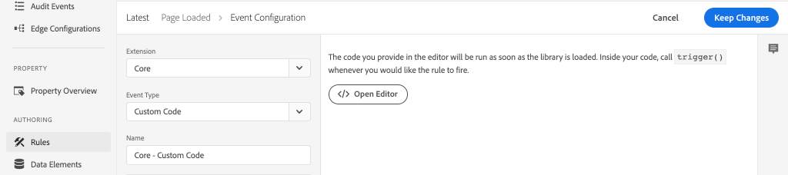

# 使用Adobe Analytics收集页面数据

了解如何将[Adobe客户端数据层的内置功能与AEM核心组件](https://experienceleague.adobe.com/docs/experience-manager-core-components/using/developing/data-layer/overview.html)一起使用来收集有关Adobe Experience Manager Sites中某个页面的数据。 [Experience Platform](https://www.adobe.com/experience-platform/launch.html) Launch和Adobe Analytics [扩](https://experienceleague.adobe.com/docs/experience-platform/tags/extensions/adobe/analytics/overview.html) 展将用于创建规则以将页面数据发送到Adobe Analytics。

## 将构建的内容


在本教程中，您将根据Adobe客户端数据层中的事件触发Launch规则，为应何时触发规则添加条件，并将AEM页面的&#x200B;**页面名称**&#x200B;和&#x200B;**页面模板**&#x200B;发送到Adobe Analytics。

### 目标 {#objective}

1. 根据对数据层所做的更改，在Launch中创建事件驱动规则
1. 在Launch中将页面数据层属性映射到数据元素
1. 收集页面数据并通过页面查看信标发送到Adobe Analytics

## 前提条件

需要满足以下条件：

* **Experience Platform** LaunchProperty
* **Adobe** Analyticst/dev报表包ID和跟踪服务器。有关[创建新报表包](https://experienceleague.adobe.com/docs/analytics/admin/manage-report-suites/new-report-suite/new-report-suite.html)的信息，请参阅以下文档。
* [Experience Platform](https://experienceleague.adobe.com/docs/debugger-learn/tutorials/experience-platform-debugger/introduction-to-the-experience-platform-debugger.html) Debuggerbrowser扩展。本教程中的屏幕截图是从Chrome浏览器捕获的。
* （可选）启用[Adobe客户端数据层的AEM Site](https://experienceleague.adobe.com/docs/experience-manager-core-components/using/developing/data-layer/overview.html#installation-activation)。 本教程将使用面向公众的站点[https://wknd.site/us/en.html](https://wknd.site/us/en.html)，但欢迎您使用自己的站点。

>[!NOTE]
>
> 需要将Launch与您的AEM网站集成的帮助？ [请观看此视频系列](../experience-platform-launch/overview.md)。

## 为WKND站点切换Launch环境

[https://wknd.sites](https://wknd.site) 基于开源项目构建的面向公众 [的站点，](https://github.com/adobe/aem-guides-wknd) 该项目设计为AEM实施的 [](https://experienceleague.adobe.com/docs/experience-manager-learn/getting-started-wknd-tutorial-develop/overview.html) 参考和教程。

您可以使用Experience Platform调试器将实时[https://wknd.site/](https://wknd.site/)切换到&#x200B;*您的* Launch资产，而不是设置AEM环境并安装WKND代码库。 ****&#x200B;当然，如果您自己的AEM站点已启用[Adobe客户端数据层](https://experienceleague.adobe.com/docs/experience-manager-core-components/using/developing/data-layer/overview.html#installation-activation)，则可以使用该站点

1. 登录Experience Platform Launch并[创建Launch资产](https://experienceleague.adobe.com/docs/launch-learn/implementing-in-websites-with-launch/configure-launch/launch.html)（如果尚未登录）。
1. 确保已创建初始的Launch [库](https://experienceleague.adobe.com/docs/experience-platform/tags/publish/libraries.html#create-a-library)并将其提升到Launch [环境](https://experienceleague.adobe.com/docs/experience-platform/tags/publish/environments/environments.html)。
1. 从库已发布到的环境中复制Launch嵌入代码。

   

1. 在您的浏览器中打开一个新选项卡，然后导航到[https://wknd.site/](https://wknd.site/)
1. 打开Experience Platform调试器浏览器扩展

   

1. 导航到&#x200B;**Launch** > **配置**，并在&#x200B;**插入的嵌入代码**&#x200B;下，将现有的Launch嵌入代码替换为从步骤3复制的&#x200B;*嵌入代码。*

   

1. 在WKND选项卡上启用&#x200B;**控制台日志记录**&#x200B;和&#x200B;**锁定**&#x200B;调试器。

   

## 验证WKND站点上的Adobe客户端数据层

[WKND引用项目](https://github.com/adobe/aem-guides-wknd)是使用AEM核心组件构建的，默认情况下启用[Adobe客户端数据层](https://experienceleague.adobe.com/docs/experience-manager-core-components/using/developing/data-layer/overview.html#installation-activation)。 接下来，验证Adobe客户端数据层是否已启用。

1. 导航到[https://wknd.site](https://wknd.site)。
1. 打开浏览器的开发人员工具并导航到&#x200B;**Console**。 运行以下命令：

   ```js
   adobeDataLayer.getState();
   ```

   这会返回Adobe客户端数据层的当前状态。

   

1. 展开响应并检查`page`条目。 您应会看到如下数据架构：

   ```json
   page-2eee4f8914:
       @type: "wknd/components/page"
       dc:description: WKND is a collective of outdoors, music, crafts, adventure sports, and travel enthusiasts that want to share our experiences, connections, and expertise with the world.
       dc:title: "WKND Adventures and Travel"
       repo:modifyDate: "2020-08-31T21:02:21Z"
       repo:path: "/content/wknd/us/en.html"
       xdm:language: "en-US"
       xdm:tags: ["Attract"]
       xdm:template: "/conf/wknd/settings/wcm/templates/landing-page-template"
   ```

   我们将使用从数据层的[页面架构](https://experienceleague.adobe.com/docs/experience-manager-core-components/using/developing/data-layer/overview.html#page)、`dc:title`、`xdm:language`和`xdm:template`派生的标准属性，将页面数据发送到Adobe Analytics。

   >[!NOTE]
   >
   > 没有看到`adobeDataLayer` javascript对象？ 确保在您的网站上启用了[Adobe客户端数据层](https://experienceleague.adobe.com/docs/experience-manager-core-components/using/developing/data-layer/overview.html#installation-activation)。

## 创建Page Loaded规则

Adobe客户端数据层是一个&#x200B;**事件**&#x200B;驱动的数据层。 加载AEM **Page**&#x200B;数据层时，将触发事件`cmp:show`。 创建将基于`cmp:show`事件触发的规则。

1. 导航到Experience Platform Launch，并导航到与AEM Site集成的Web属性。
1. 导航到Launch UI中的&#x200B;**Rules**&#x200B;部分，然后单击&#x200B;**创建新规则**。

   

1. 将规则命名为&#x200B;**Page Loaded**。
1. 单击&#x200B;**Events** **Add**&#x200B;以打开&#x200B;**Event Configuration**&#x200B;向导。
1. 在&#x200B;**事件类型**&#x200B;下，选择&#x200B;**自定义代码**。

   

1. 单击主面板中的&#x200B;**Open Editor** ，然后输入以下代码片段：

   ```js
   var pageShownEventHandler = function(evt) {
      // defensive coding to avoid a null pointer exception
      if(evt.hasOwnProperty("eventInfo") && evt.eventInfo.hasOwnProperty("path")) {
         //trigger Launch Rule and pass event
         console.debug("cmp:show event: " + evt.eventInfo.path);
         var event = {
            //include the path of the component that triggered the event
            path: evt.eventInfo.path,
            //get the state of the component that triggered the event
            component: window.adobeDataLayer.getState(evt.eventInfo.path)
         };
   
         //Trigger the Launch Rule, passing in the new `event` object
         // the `event` obj can now be referenced by the reserved name `event` by other Launch data elements
         // i.e `event.component['someKey']`
         trigger(event);
      }
   }
   
   //set the namespace to avoid a potential race condition
   window.adobeDataLayer = window.adobeDataLayer || [];
   //push the event listener for cmp:show into the data layer
   window.adobeDataLayer.push(function (dl) {
      //add event listener for `cmp:show` and callback to the `pageShownEventHandler` function
      dl.addEventListener("cmp:show", pageShownEventHandler);
   });
   ```

   上述代码片段将通过[将函数](https://github.com/adobe/adobe-client-data-layer/wiki#pushing-a-function)推送到数据层来添加事件侦听器。 触发`cmp:show`事件时，将调用`pageShownEventHandler`函数。 在此函数中，添加了一些健全性检查，并使用触发事件的组件的数据层[最新状态构建了新的`event`。](https://github.com/adobe/adobe-client-data-layer/wiki#getstate)

   之后调用`trigger(event)`。 `trigger()` 是Launch中的保留名称，将“触发”Launch规则。我们将`event`对象作为参数进行传递，该参数又将在Launch中由名为`event`的其他保留名称公开。 Launch中的数据元素现在可以引用各种属性，如下所示：`event.component['someKey']`。

1. 保存更改。
1. 接下来，在&#x200B;**Actions**&#x200B;下，单击&#x200B;**Add**&#x200B;以打开&#x200B;**Action Configuration**&#x200B;向导。
1. 在&#x200B;**Action Type**&#x200B;下，选择&#x200B;**Custom Code**。

   

1. 单击主面板中的&#x200B;**Open Editor** ，然后输入以下代码片段：

   ```js
   console.debug("Page Loaded ");
   console.debug("Page name: " + event.component['dc:title']);
   console.debug("Page type: " + event.component['@type']);
   console.debug("Page template: " + event.component['xdm:template']);
   ```

   `event`对象从自定义事件中调用的`trigger()`方法传递。 `component` 是从自定义事件中的数据层派 `getState` 生的当前页面。回顾之前由数据层公开的[页面架构](https://experienceleague.adobe.com/docs/experience-manager-core-components/using/developing/data-layer/overview.html#page)，以查看现成公开的各种键值。

1. 在Launch中保存更改并运行[build](https://experienceleague.adobe.com/docs/experience-platform/tags/publish/builds.html)，以将代码提升到AEM Site上使用的[environment](https://experienceleague.adobe.com/docs/experience-platform/tags/publish/environments/environments.html)。

   >[!NOTE]
   >
   > 使用[Adobe Experience Platform Debugger](https://experienceleague.adobe.com/docs/debugger-learn/tutorials/experience-platform-debugger/introduction-to-the-experience-platform-debugger.html)将嵌入代码切换到&#x200B;**Development**&#x200B;环境会非常有用。

1. 导航到您的AEM站点并打开开发人员工具以查看控制台。 刷新页面，此时您应会看到控制台消息已记录：

   

## 创建数据元素

接下来，创建多个数据元素以从Adobe客户端数据层捕获不同的值。 如上一个练习中所示，我们已经看到可以通过自定义代码直接访问数据层的属性。 使用数据元素的优势在于，可以在Launch规则中重复使用这些数据元素。

从之前的数据层公开的[页面架构](https://experienceleague.adobe.com/docs/experience-manager-core-components/using/developing/data-layer/overview.html#page)中回顾：

数据元素将映射到`@type`、`dc:title`和`xdm:template`属性。

### 组件资源类型

1. 导航到Experience Platform Launch，并导航到与AEM Site集成的Web属性。
1. 导航到&#x200B;**数据元素**&#x200B;部分，然后单击&#x200B;**新建数据元素**。
1. 对于&#x200B;**名称**，输入&#x200B;**组件资源类型**。
1. 对于&#x200B;**数据元素类型**，选择&#x200B;**自定义代码**。

   

1. 单击&#x200B;**Open Editor**&#x200B;并在自定义代码编辑器中输入以下内容：

   ```js
   if(event && event.component && event.component.hasOwnProperty('@type')) {
       return event.component['@type'];
   }
   ```

   保存更改。

   >[!NOTE]
   >
   > 请记住，`event`对象已可用，其范围基于在Launch中触发&#x200B;**Rule**&#x200B;的事件。 只有在规则中引用了&#x200B;*referenced*&#x200B;数据元素后，才会设置数据元素的值。 因此，在规则（如在上一步&#x200B;*中创建的&#x200B;**Page Loaded**规则）中使用此数据元素是安全的，但在其他上下文中使用*&#x200B;则不安全。

### 页面名称

1. 单击&#x200B;**Add Data Element**。
1. 对于&#x200B;**名称**，输入&#x200B;**页面名称**。
1. 对于&#x200B;**数据元素类型**，选择&#x200B;**自定义代码**。
1. 单击&#x200B;**Open Editor**&#x200B;并在自定义代码编辑器中输入以下内容：

   ```js
   if(event && event.component && event.component.hasOwnProperty('dc:title')) {
       return event.component['dc:title'];
   }
   ```

   保存更改。

### 页面模板

1. 单击&#x200B;**Add Data Element**。
1. 对于&#x200B;**名称**，输入&#x200B;**页面模板**。
1. 对于&#x200B;**数据元素类型**，选择&#x200B;**自定义代码**。
1. 单击&#x200B;**Open Editor**&#x200B;并在自定义代码编辑器中输入以下内容：

   ```js
   if(event && event.component && event.component.hasOwnProperty('xdm:template')) {
       return event.component['xdm:template'];
   }
   ```

   保存更改。

1. 现在，您的规则中应包含三个数据元素：

   

## 添加Analytics扩展

接下来，将Analytics扩展添加到您的Launch资产中。 我们需要将此数据发送到某处！

1. 导航到Experience Platform Launch，并导航到与AEM Site集成的Web属性。
1. 转到&#x200B;**Extensions** > **Catalog**
1. 找到&#x200B;**Adobe Analytics**&#x200B;扩展，然后单击&#x200B;**Install**

   

1. 在&#x200B;**库管理** > **报表包**&#x200B;下，输入要在每个Launch环境中使用的报表包ID。

   

   >[!NOTE]
   >
   > 在本教程中，您可以为所有环境使用一个报表包，但在现实工作中，您会希望使用单独的报表包，如下图所示

   >[!TIP]
   >
   >我们建议使用&#x200B;*Manage the library for me选项*&#x200B;作为库管理设置，因为这样可以更轻松地使`AppMeasurement.js`库保持为最新。

1. 选中方框以启用&#x200B;**使用Activity Map**。

   

1. 在&#x200B;**General** > **Tracking Server**&#x200B;下，输入您的跟踪服务器，例如`tmd.sc.omtrdc.net`。 如果您的网站支持`https://`，请输入SSL跟踪服务器

   

1. 单击&#x200B;**Save**&#x200B;以保存更改。

## 向Page Loaded规则添加条件

接下来，更新&#x200B;**Page Loaded**&#x200B;规则以使用&#x200B;**组件资源类型**&#x200B;数据元素，以确保规则仅在&#x200B;**Page**&#x200B;的`cmp:show`事件发生时触发。 其他组件可以触发`cmp:show`事件，例如，当幻灯片发生更改时，轮播组件将触发该事件。 因此，为此规则添加条件很重要。

1. 在Launch UI中，导航到之前创建的&#x200B;**Page Loaded**&#x200B;规则。
1. 在&#x200B;**Conditions**&#x200B;下，单击&#x200B;**Add**&#x200B;以打开&#x200B;**Condition Configuration**&#x200B;向导。
1. 对于&#x200B;**条件类型**，选择&#x200B;**值比较**。
1. 将表单字段中的第一个值设置为`%Component Resource Type%`。 可以使用数据元素图标选择&#x200B;**组件资源类型**&#x200B;数据元素。 将比较器设置为`Equals`。
1. 将第二个值设置为`wknd/components/page`。

   

   >[!NOTE]
   >
   > 可以在自定义代码函数中添加此条件，该函数用于侦听在教程前面创建的`cmp:show`事件。 但是，在UI中添加该规则，可让可能需要更改规则的其他用户看到更多内容。 此外，我们还可以使用数据元素！

1. 保存更改。

## 设置Analytics变量并触发页面查看信标

当前，**Page Loaded**&#x200B;规则只输出控制台语句。 接下来，使用数据元素和Analytics扩展将Analytics变量设置为&#x200B;**Page Loaded**&#x200B;规则中的&#x200B;**action**。 我们还将设置其他操作以触发&#x200B;**页面查看信标**&#x200B;并将收集的数据发送到Adobe Analytics。

1. 在&#x200B;**Page Loaded**&#x200B;规则&#x200B;**remove** **Core - Custom Code**&#x200B;操作（控制台语句）中：

   

1. 在Actions下，单击&#x200B;**Add**&#x200B;以添加新操作。
1. 将&#x200B;**Extension**&#x200B;类型设置为&#x200B;**Adobe Analytics**，并将&#x200B;**Action Type**&#x200B;设置为&#x200B;**Set Variables**

   

1. 在主面板中，选择一个可用的&#x200B;**eVar**&#x200B;并将其设置为数据元素&#x200B;**页面模板**&#x200B;的值。 使用“数据元素”图标选择&#x200B;**页面模板**&#x200B;元素。

   

1. 向下滚动，在&#x200B;**其他设置**&#x200B;下，将&#x200B;**页面名称**&#x200B;设置为数据元素&#x200B;**页面名称**:

   

   保存更改。

1. 接下来，通过点按&#x200B;**加号**&#x200B;图标，在&#x200B;**Adobe Analytics - Set Variables**&#x200B;的右侧添加一个额外的操作：

   

1. 将&#x200B;**Extension**&#x200B;类型设置为&#x200B;**Adobe Analytics**，并将&#x200B;**Action Type**&#x200B;设置为&#x200B;**Send Beacon**。 由于这被视为页面查看，因此请将默认跟踪设置保留为&#x200B;**`s.t()`**。

   

1. 保存更改。**Page Loaded**&#x200B;规则现在应具有以下配置：

   

   * **1.** 监听事 `cmp:show` 件。
   * **2.** 检查事件是否由页面触发。
   * **3.** 为页面名称和页面模 **板** 设置 **Analytics变量**
   * **4.** 发送Analytics页面查看信标
1. 保存所有更改并构建Launch库，然后将其提升到相应的环境。

## 验证页面查看信标和Analytics调用

现在，**Page Loaded**&#x200B;规则发送了Analytics信标，您应该能够使用Experience Platform调试器查看Analytics跟踪变量。

1. 在浏览器中打开[WKND Site](https://wknd.site/us/en.html)。
1. 单击Debugger图标以打开Experience PlatformDebugger。
1. 如前面所述，确保Debugger将Launch资产映射到&#x200B;*您的*&#x200B;开发环境，并选中&#x200B;**控制台日志记录**。
1. 打开Analytics菜单，并验证报表包是否设置为&#x200B;*您的*&#x200B;报表包。 还应填充页面名称：

   

1. 向下滚动并展开&#x200B;**网络请求**。 您应该能够找到为&#x200B;**页面模板**&#x200B;设置的&#x200B;**evar**:

   

1. 返回到浏览器并打开开发人员控制台。 单击页面顶部的&#x200B;**轮播**。

   

1. 在浏览器控制台中，观察控制台语句：

   

   这是因为轮播会触发`cmp:show`事件&#x200B;*，但是*&#x200B;由于我们对&#x200B;**组件资源类型**&#x200B;进行了检查，因此不会触发任何事件。

   >[!NOTE]
   >
   > 如果看不到任何控制台日志，请确保在Experience Platform调试器的&#x200B;**Launch**&#x200B;下选中&#x200B;**控制台日志记录**。

1. 导航到[Western Australia](https://wknd.site/us/en/magazine/western-australia.html)之类的文章页面。 观察页面名称和模板类型更改。

## 恭喜！

您刚刚使用事件驱动的Adobe客户端数据层和Experience Platform Launch从AEM网站收集数据页面数据，并将其发送到Adobe Analytics。

### 后续步骤

请参阅以下教程，了解如何使用事件驱动的Adobe客户端数据层[跟踪Adobe Experience Manager站点上特定组件的单击](track-clicked-component.md)。
