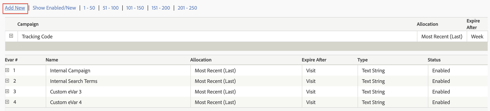
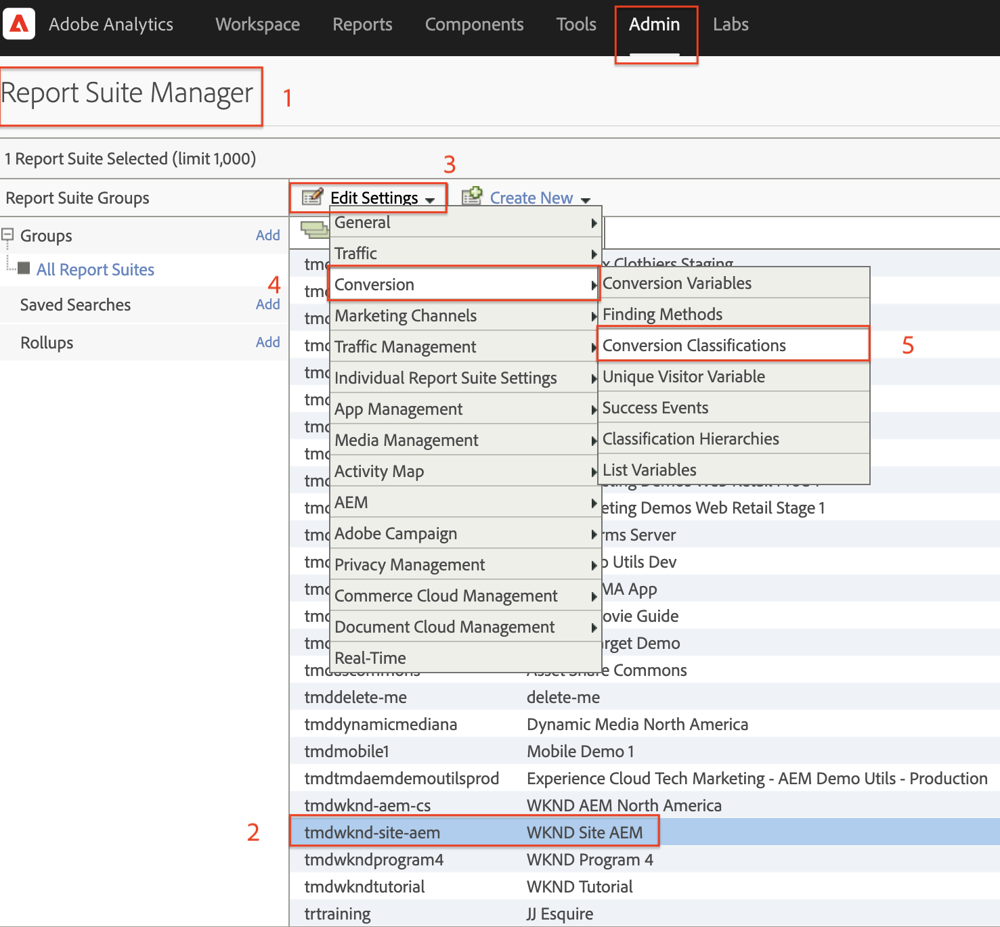
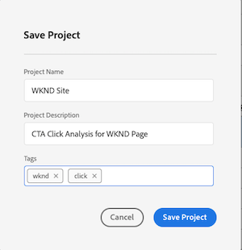
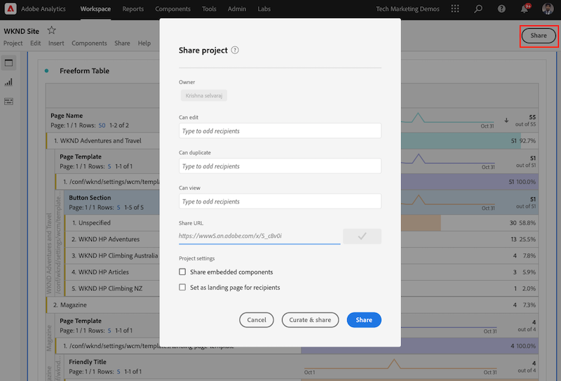

# 使用Analysis Workspace分析数据

了解如何将从Adobe Experience Manager网站捕获的数据映射到Adobe Analytics报表包中的量度和维度。 了解如何使用Adobe Analytics的Analysis Workspace功能构建详细的报表仪表板。

## 您即将构建的内容 {#what-build}

WKND营销团队有兴趣了解 `Call to Action (CTA)` 按钮在主页上表现最佳。 在本教程中，在中创建一个项目 **Analysis Workspace** 可视化不同CTA按钮的性能并了解用户在网站上的行为。 当用户单击WKND主页上的行动号召(CTA)按钮时，使用Adobe Analytics捕获以下信息。

**Analytics变量**

以下是当前正在跟踪的Analytics变量：

* `eVar5` -  `Page template`
* `eVar6` - `Page Id`
* `eVar7` - `Page last modified date`
* `eVar8` - `CTA Button Id`
* `eVar9` - `Page Name`
* `event8` - `CTA Button Click event`
* `prop8` - `CTA Button Id`

### 目标 {#objective}

1. 创建报表包或使用现有报表包。
1. 配置 [转化变量(eVar)](https://experienceleague.adobe.com/docs/analytics/admin/admin-tools/manage-report-suites/edit-report-suite/conversion-variables/conversion-var-admin.html) 和 [成功事件（事件）](https://experienceleague.adobe.com/docs/analytics/admin/admin-tools/manage-report-suites/edit-report-suite/conversion-variables/success-events/success-event.html) 在报表包中。
1. 创建 [Analysis Workspace项目](https://experienceleague.adobe.com/docs/analytics/analyze/analysis-workspace/home.html) 借助允许您快速构建、分析和共享洞察的工具来分析数据。
1. 与其他团队成员共享Analysis Workspace项目。

## 前提条件

本教程是 [使用Adobe Analytics跟踪已单击的组件](./track-clicked-component.md) 并假设您拥有：

* A **标记属性** 使用 [Adobe Analytics扩展](https://experienceleague.adobe.com/docs/experience-platform/tags/extensions/client/analytics/overview.html) 已启用
* **Adobe Analytics** 测试/开发报表包ID和跟踪服务器。 请参阅以下文档 [创建报表包](https://experienceleague.adobe.com/docs/analytics/admin/admin-tools/manage-report-suites/c-new-report-suite/new-report-suite.html).
* [Experience Platform调试程序](https://experienceleague.adobe.com/docs/platform-learn/data-collection/debugger/overview.html) 浏览器扩展配置了在 [WKND站点](https://wknd.site/us/en.html) 或启用了Adobe数据层的AEM站点。

## 转化变量(eVar)和成功事件（事件）

Custom Insight转化变量(或eVar)会放置在网站选定网页的Adobe代码中。 其主要目的是在自定义营销报表中细分转化成功量度。 eVar可以基于访问，其功能与Cookie类似。 传递给eVar变量的值会跟随用户一段预定的时间。

当eVar设置为访客的值时，Adobe会自动记住该值，直到它过期为止。 eVar值有效期间，访客遇到的任何成功事件将计入该eVar值。

eVar最适合用于衡量原因和结果，例如：

* 哪些内部活动影响了收入
* 最终导致注册的横幅广告
* 订单前使用内部搜索的次数

成功事件是可跟踪的操作。 成功事件由您决定。 例如，如果访客点击了CTA按钮，则该点击事件可被视为成功事件。

### 配置eVar

1. 从Adobe Experience Cloud主页中，选择您的组织，然后启动Adobe Analytics。

   

1. 在Analytics工具栏中，单击 **管理员** > **报表包** 并查找您的报表包。

   

1. 选择报表包> **编辑设置** > **转化** > **转化变量**

   

1. 使用 **新增** 选项，让我们创建转化变量来映射架构，如下所示：

   * `eVar5` -  `Page Template`
   * `eVar6` - `Page ID`
   * `eVar7` - `Last Modified Date`
   * `eVar8` - `Button Id`
   * `eVar9` - `Page Name`

   

1. 为每个eVar提供适当的名称和描述，并 **保存** 您所做的更改。 在Analysis Workspace项目中，使用具有适当名称的eVar，因此，用户友好型名称使变量易于发现。

   

### 配置成功事件

接下来，让我们创建一个事件来跟踪CTA按钮的点击情况。

1. 从 **报表包管理器** 窗口中，选择 **报表包Id** 并单击 **编辑设置**.
1. 单击 **转化** > **成功事件**
1. 使用 **新增** 选项，创建一个自定义成功事件以跟踪CTA按钮单击，然后 **保存** 您所做的更改。
   * `Event` ： `event8`
   * `Name`：`CTA Click`
   * `Type`：`Counter`

   

## 在Analysis Workspace中创建项目 {#workspace-project}

Analysis Workspace是一款灵活的浏览器工具，可让您快速构建分析和共享见解。 您可以使用拖放界面进行分析、添加可视化图表以便直观地呈现数据、策划数据集、与组织中的任何人共享项目并设置共享计划。

接下来，创建 [项目](https://experienceleague.adobe.com/docs/analytics/analyze/analysis-workspace/build-workspace-project/freeform-overview.html#analysis-workspace) 构建一个仪表板以分析整个站点中CTA按钮的表现。

1. 从Analytics工具栏中，选择 **工作区** 并单击 **创建新项目**.

   

1. 选择以从 **空白项目** 或者，选择一个由Adobe提供的预建模板或您的组织创建的自定义模板。 根据您所考虑的分析或用例，可以使用多个模板。 [了解详情](https://experienceleague.adobe.com/docs/analytics/analyze/analysis-workspace/build-workspace-project/starter-projects.html) 关于可用的不同模板选项。

   在Workspace项目中，从左边栏访问“面板、表格、可视化和组件” 。 它们构成了项目的构建块。

   * **[组件](https://experienceleague.adobe.com/docs/analytics/analyze/analysis-workspace/components/analysis-workspace-components.html)**  — 组件包含维度、量度、区段或日期范围，所有这些组件都可以合并到一个自由格式表中，以便开始回答您的业务问题。 请务必先熟悉每个组件类型，然后再开始投入分析。 掌握组件术语后，即可开始拖放至自由格式表以构建分析。
   * **[可视化图表](https://experienceleague.adobe.com/docs/analytics/analyze/analysis-workspace/visualizations/freeform-analysis-visualizations.html)**  — 接下来，将可视化图表（例如条形图或折线图）添加到数据的顶部，以便更加直观地将数据呈现出来。 在最左侧的边栏中，选择中间的可视化图表图标，以查看所有可用的可视化图表。
   * **[面板](https://experienceleague.adobe.com/docs/analytics/analyze/analysis-workspace/panels/panels.html)**  — 面板是表格和可视化图表的集合。 您可以从工作区左上角的图标访问面板。 当您要根据时段、报表包或分析用例组织您的项目时，面板非常有用。 Analysis Workspace中有以下面板类型：

   

### 使用Analysis Workspace添加数据可视化

接下来，构建一个表以创建用户如何与进行交互的可视表示形式 `Call to Action (CTA)` WKND站点主页上的按钮。 要构建此表示法，我们使用在 [使用Adobe Analytics跟踪已单击的组件](./track-clicked-component.md). 下面是用户与WKND网站的行动号召按钮进行交互时跟踪的数据快速摘要。

* `eVar5` -  `Page template`
* `eVar6` - `Page Id`
* `eVar7` - `Page last modified date`
* `eVar8` - `CTA Button Id`
* `eVar9` - `Page Name`
* `event8` - `CTA Button Click event`
* `prop8` - `CTA Button Id`

1. 拖放 **页面** 将维度组件放置到自由格式表中。 现在，您应该能够查看一个可视化图表，该可视化图表显示表格中显示的页面名称(eVar9)和相应的页面查看次数（发生次数）。

   

1. 拖放 **CTA点击** (event8)将量度置于“发生次数”量度中并将其替换。 您现在可以查看一个可视化图表，该可视化图表显示页面名称(eVar9)和页面上CTA点击事件的相应计数。

   

1. 让我们按照页面的模板类型来划分页面。 从组件中选择页面模板度量，并将“页面模板”度量拖放到页面名称维上。 您现在可以查看按模板类型划分的页面名称。

   * **早于**
     

   * **之后**
     

1. 要了解用户如何与WKND网站页面上的CTA按钮进行交互，需要通过添加按钮ID (eVar8)指标进一步细分。

   

1. 在下方，您可以看到WKND网站的可视化呈现形式，它按页面模板划分，并进一步按用户与WKND网站点击操作(CTA)按钮的交互进行划分。

   

1. 您可以使用“Adobe Analytics分类”将按钮ID值替换为更加用户友好的名称。 您可以阅读有关如何为特定量度创建分类的更多信息 [此处](https://experienceleague.adobe.com/docs/analytics/components/classifications/c-classifications.html). 在这种情况下，我们有一个分类量度 `Button Section (Button ID)` 设置 `eVar8` 将按钮id映射到用户友好名称。

   

## 向分析变量添加分类

### 转化分类

Analytics分类是在生成报表时对Analytics变量数据进行分类，然后以不同的方式显示数据的方法。 为了改进按钮ID在Analytics Workspace报表中的显示方式，让我们为按钮ID (eVar8)创建一个分类变量。 分类时，您会在变量和与该变量相关的元数据之间建立关系。

接下来，让我们为Analytics变量创建分类。

1. 从 **管理员** 工具栏菜单，选择 **报表包**
1. 选择 **报表包Id** 从 **报表包管理器** 窗口，然后单击 **编辑设置** > **转化** > **转化分类**

   

1. 从 **选择分类类型** 从下拉列表中，选择变量(eVar8-Button ID)以添加分类。
1. 单击“分类”部分下列出的分类变量旁边的右箭头可添加新分类。

   

1. 在 **编辑分类** 对话框中，为文本分类提供合适的名称。 将创建一个具有文本分类名称的维度组件。

   

1. **保存** 您所做的更改。

### 分类导入器

使用导入器将分类上传到Adobe Analytics。 您也可以在导入之前导出要更新的数据。 使用导入工具导入的数据必须使用特定格式。 通过Adobe，您可以选择下载数据模板，并在以制表符分隔的数据文件中提供所有正确的标头详细信息。 您可以将新数据添加到此模板，然后使用FTP在浏览器中导入数据文件。

#### 分类模板

在将分类导入营销报表之前，您可以下载模板来帮助您创建分类数据文件。 数据文件会将您所需的分类用作列标题，然后将报表数据集整理在相应的分类标题下。

接下来，让我们下载按钮ID (eVar8)变量的分类模板

1. 导航到 **管理员** > **分类导入器**
1. 让我们从以下网站下载转化变量的分类模板 **下载模板** 选项卡。
   

1. 在下载模板选项卡上，指定数据模板配置。
   * **选择报表包** ：在模板中选择要使用的报表包。 报表包和数据集必须匹配。
   * **要分类的数据集** ：选择数据文件的数据类型。 该菜单包含报表包中针对分类配置的所有报表。
   * **编码** ：选择数据文件的字符编码。 默认编码格式为UTF-8。

1. 单击 **下载** 并将模板文件保存到本地系统中。 模板文件是大多数电子表格应用程序支持的以制表符分隔的数据文件（文件扩展名为.tab）。
1. 使用您选择的编辑器打开以制表符分隔的数据文件。
1. 在部分中，将按钮ID (eVar9)和相应的按钮名称添加到以制表符分隔的文件中，供步骤9中的每个eVar9值使用。

   

1. **保存** 制表符分隔的文件。
1. 导航至 **导入文件** 选项卡。
1. 为文件导入配置目标。
   * **选择报表包** ： WKND Site AEM（报表包）
   * **要分类的数据集** ：按钮Id(转化变量eVar8)
1. 单击 **选择文件** 选项，以便从系统上传制表符分隔的文件，然后单击 **导入文件**

   

   >[!NOTE]
   >
   > 成功的导入会立即在导出中显示相应的更改。 但是，使用浏览器导入时，报表中的数据更改最多需要4小时，使用FTP导入时，的数据更改最多需要24小时。

#### 将转化变量替换为分类变量

1. 从Analytics工具栏中，选择 **工作区** 并打开在中创建的工作区 [在Analysis Workspace中创建项目](#create-a-project-in-analysis-workspace) 部分。

   

1. 接下来，替换 **按钮ID** 工作区中的量度，用于显示具有上一步中创建的分类名称的行动号召(CTA)按钮的ID。

1. 在组件查找器中，搜索 **WKND CTA按钮** 并拖放 **WKND CTA按钮（按钮Id）** 维度到按钮ID量度中并将其替换。

   * **早于**
     
   * **之后**
     

1. 您可以注意到，包含行动号召(CTA)按钮的按钮ID量度现已替换为分类模板中提供的相应名称。
1. 让我们将Analytics Workspace表与WKND主页进行比较，了解CTA按钮点击计数及其分析。 根据工作区自由格式表数据，很显然，用户单击了 **立即滑雪** WKND主页在西澳大利亚露营的按钮和四次 **了解更多** 按钮。

   

1. 确保保存您的Adobe Analytics Workspace项目并提供适当的名称和描述。 或者，您也可以将标记添加到Workspace项目。

   

1. 成功保存项目后，您可以使用“共享”选项与其他同事或队友共享您的工作区项目。

   

## 恭喜！

您刚刚了解如何将从Adobe Experience Manager网站捕获的数据映射到Adobe Analytics报表包中的量度和维度。 此外，还对量度执行了分类，并使用Adobe Analytics的Analysis Workspace功能构建了一个详细的报表仪表板。
