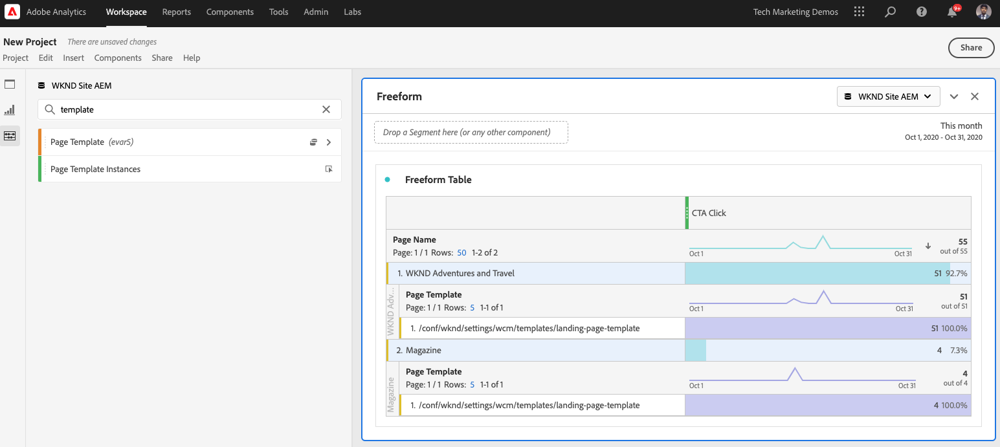

# 使用Analysis Workspace分析数据

了解如何将从Adobe Experience Manager网站捕获的数据映射到Adobe Analytics报表包中的量度和维度。 了解如何使用Adobe Analytics的Analysis Workspace功能构建详细的报表功能板。

## 将构建的内容

WKND营销团队希望了解哪个行动动员(CTA)按钮在主页上的效果最佳。 在本教程中，我们将在Analysis Workspace中创建一个新项目，以可视化不同CTA按钮的性能并了解用户在网站上的行为。 当用户单击WKND主页上的行动动员(CTA)按钮时，将使用Adobe Analytics捕获以下信息。

**Analytics变量**

以下是当前正在跟踪的Analytics变量：

* `eVar5` -  `Page template`
* `eVar6` - `Page Id`
* `eVar7` - `Page last modified date`
* `eVar8` - `CTA Button Id`
* `eVar9` - `Page Name`
* `event8` - `CTA Button Click event`
* `prop8` - `CTA Button Id`

### 目标 {#objective}

1. 创建新报表包或使用现有报表包。
1. 配置 [转化变量(eVar)](https://experienceleague.adobe.com/docs/analytics/admin/admin-tools/conversion-variables/conversion-var-admin.html) 和 [成功事件（事件）](https://experienceleague.adobe.com/docs/analytics/admin/admin-tools/success-events/success-event.html) 中。
1. 创建 [Analysis Workspace项目](https://experienceleague.adobe.com/docs/analytics/analyze/analysis-workspace/home.html) 借助工具分析数据，可让您快速构建、分析和共享分析。
1. 与其他团队成员共享Analysis Workspace项目。

## 前提条件

本教程是 [使用Adobe Analytics跟踪已单击的组件](./track-clicked-component.md) 并假定您具有：

* A **Launch资产** 和 [Adobe Analytics扩展](https://experienceleague.adobe.com/docs/experience-platform/tags/extensions/adobe/analytics/overview.html) 已启用
* **Adobe Analytics** 测试/开发报表包ID和跟踪服务器。 请参阅以下文档以了解 [创建新报表包](https://experienceleague.adobe.com/docs/analytics/admin/manage-report-suites/new-report-suite/new-report-suite.html).
* [Experience Platform调试器](https://experienceleague.adobe.com/docs/debugger-learn/tutorials/experience-platform-debugger/introduction-to-the-experience-platform-debugger.html) 在上加载的Launch资产中配置的浏览器扩展 [https://wknd.site/us/en.html](https://wknd.site/us/en.html) 或启用了Adobe数据层的AEM网站。

## 转化变量(eVar)和成功事件（事件）

Custom Insight转化变量(或eVar)放置在网站选定网页上的Adobe代码中。 其主要目的是对自定义市场营销报告中的转化成功量度进行细分。 eVar可以基于访问，且功能与Cookie类似。 传递到eVar变量的值会在预定时间段内始终跟随用户。

将eVar设置为访客的值后，Adobe会自动记住该值直到它过期。 访客在eVar值处于活动状态时遇到的任何成功事件将计入eVar值。

eVar最适用于衡量原因和影响，例如：

* 哪些内部促销活动影响了收入
* 哪些横幅广告最终导致注册
* 下订单前使用内部搜索的次数

成功事件是可跟踪的操作。 您可决定什么是成功事件。 例如，如果访客点击了CTA按钮，则该点击事件可能会被视为成功事件。

### 配置eVar

1. 从Adobe Experience Cloud主页中，选择您的组织并启动Adobe Analytics。

   

1. 在Analytics工具栏中，单击 **管理员** > **报表包** 并找到您的报表包。

   

1. 选择报表包> **编辑设置** > **转化** > **转化变量**

   

1. 使用 **新增** ，让我们创建转化变量来映射架构，如下所示：

   * `eVar5` -  `Page Template`
   * `eVar6` - `Page ID`
   * `eVar7` - `Last Modified Date`
   * `eVar8` - `Button Id`
   * `eVar9` - `Page Name`

   

1. 为每个eVar和 **保存** 您的更改。 我们使用这些eVar在下一部分中创建Analysis Workspace项目。 因此，用户友好的名称使变量易于被发现。

   

### 配置成功事件

接下来，我们创建一个用于跟踪CTA按钮单击的事件。

1. 从 **报表包管理器** 窗口，选择 **报表包Id** 单击 **编辑设置**.
1. 单击 **转化** > **成功事件**
1. 使用 **新增** 选项，可创建新的自定义成功事件以跟踪CTA按钮的单击，然后 **保存** 您的更改。
   * `Event` : `event8`
   * `Name`:`CTA Click`
   * `Type`:`Counter`

   

## 在Analysis Workspace中创建新项目 {#workspace-project}

Analysis Workspace是一个灵活的浏览器工具，允许您快速构建分析并共享分析。 使用拖放界面，您可以进行分析、添加可视化图表以生动呈现数据、组织数据集、与组织中的任何人共享项目并安排其时间。

接下来，创建新 [项目](https://experienceleague.adobe.com/docs/analytics/analyze/analysis-workspace/build-workspace-project/freeform-overview.html#analysis-workspace) 构建功能板以分析整个网站中CTA按钮的性能。

1. 从Analytics工具栏中，选择 **工作区** 单击 **创建新项目**.

   

1. 选择从 **空白项目** 或选择一个预建模板，由Adobe提供或由您的组织创建的自定义模板。 根据您所考虑的分析或用例，可以使用多个模板。 [了解更多](https://experienceleague.adobe.com/docs/analytics/analyze/analysis-workspace/build-workspace-project/starter-projects.html) 关于可用的不同模板选项。

   在工作区项目中，从左边栏访问面板、表格、可视化图表和组件。 这些是您的项目构建基块。

   * **[组件](https://experienceleague.adobe.com/docs/analytics/analyze/analysis-workspace/components/analysis-workspace-components.html)**  — 组件包括维度、量度、区段或日期范围，所有这些组件都可以合并到自由格式表中，以开始回答您的业务问题。 请务必先熟悉每个组件类型，然后再开始投入分析。 掌握组件术语后，即可开始拖放到自由格式表中以构建分析。
   * **[可视化图表](https://experienceleague.adobe.com/docs/analytics/analyze/analysis-workspace/visualizations/freeform-analysis-visualizations.html)**  — 然后，在数据的顶部添加可视化图表（如条形图或折线图），以便使其更加直观地呈现。 在最左侧的边栏中，选择中间的可视化图标，以查看所有可用的可视化图表。
   * **[面板](https://experienceleague.adobe.com/docs/analytics/analyze/analysis-workspace/panels/panels.html)**  — 面板是表格和可视化图表的集合。 您可以从工作区的左上角图标访问面板。 当您想要根据时间段、报表包或分析用例来组织项目时，面板会很有帮助。 Analysis Workspace中提供了以下面板类型：

   

### 使用Analysis Workspace添加数据可视化

接下来，构建一个表格，以直观地表示用户如何与WKND网站主页上的行动动员(CTA)按钮进行交互。 要构建此类表示形式，让我们使用 [使用Adobe Analytics跟踪已单击的组件](./track-clicked-component.md). 以下是与WKND网站的行动动员按钮进行用户交互时跟踪的数据的快速摘要。

* `eVar5` -  `Page template`
* `eVar6` - `Page Id`
* `eVar7` - `Page last modified date`
* `eVar8` - `CTA Button Id`
* `eVar9` - `Page Name`
* `event8` - `CTA Button Click event`
* `prop8` - `CTA Button Id`

1. 拖放 **页面** 维度组件关联到自由格式表。 现在，您应该能够查看一个可视化，该可视化显示表格中显示的页面名称(eVar9)和相应的页面查看次数（发生次数）。

   

1. 拖放 **CTA点击** (event8)量度中的“发生次数”量度并替换它。 您现在可以查看一个可视化图表，其中显示页面名称(eVar9)和页面上相应的CTA点击事件计数。

   

1. 让我们按页面的模板类型来划分。 从组件中选择页面模板量度，然后将页面模板量度拖放到页面名称维度上。 您现在可以查看按其模板类型划分的页面名称。

   * **之前**

      

   * **之后**

      

1. 要了解用户在WKND网站页面上与CTA按钮进行交互时，我们需要通过添加按钮ID(eVar8)量度来进一步划分“页面模板”量度。

   

1. 在下方，您可以看到WKND网站的可视呈现形式，它按其页面模板进行划分，并进一步按用户与WKND网站点击操作(CTA)按钮的交互进行划分。

   

1. 您可以使用Adobe Analytics分类将按钮ID值替换为更易用的名称。 您可以阅读有关如何为特定量度创建分类的更多信息 [此处](https://experienceleague.adobe.com/docs/analytics/components/classifications/c-classifications.html). 在这种情况下，我们有一个分类量度 `Button Section (Button ID)` 设置 `eVar8` 将按钮id映射到用户友好名称。

   

## 将分类添加到分析变量

### 转化分类

Analytics分类是一种在生成报表时对Analytics变量数据进行分类，然后以不同方式显示数据的方法。 要改进按钮ID在Analytics工作区报表中的显示方式，让我们为按钮ID创建一个分类变量(eVar8)。 在分类时，您是在变量和与该变量相关的元数据之间建立关系。

接下来，让我们为Analytics变量创建一个分类。

1. 从 **管理员** 工具栏菜单，选择 **报表包**
1. 选择 **报表包Id** 从 **报表包管理器** 窗口，单击 **编辑设置** > **转化** > **转化分类**

   

1. 从 **选择分类类型** 下拉列表中，选择变量(eVar8按钮ID)以添加分类。
1. 单击分类部分下列出的分类变量旁边的箭头可添加新分类。

   

1. 在 **编辑分类** ，请为文本分类提供合适的名称。 将创建具有文本分类名称的维度组件。

   

1. **保存** 您的更改。

### 分类导入器

使用导入器将分类上载到Adobe Analytics。 您还可以在导入之前导出要更新的数据。 使用导入工具导入的数据必须采用特定格式。 Adobe为您提供了以下选项：下载以制表符分隔的数据文件中包含所有正确标题详细信息的数据模板。 您可以将新数据添加到此模板，然后使用FTP在浏览器中导入数据文件。

#### 分类模板

在将分类导入市场营销报告之前，您可以下载有助于创建分类数据文件的模板。 数据文件将您所需的分类用作列标题，然后在相应的分类标题下组织报表数据集。

接下来，让我们下载按钮ID(eVar8)变量的分类模板

1. 导航到 **管理员** > **分类导入器**
1. 让我们从 **下载模板** 选项卡。
   

1. 在下载模板选项卡中，指定数据模板配置。
   * **选择报表包** :选择要在模板中使用的报表包。 报表包和数据集必须匹配。
   * **要分类的数据集** :为数据文件选择数据类型。 该菜单包含您的报表包中针对分类配置的所有报表。
   * **编码** :为数据文件选择字符编码。 默认编码格式为UTF-8。

1. 单击 **下载** 并将模板文件保存到本地系统。 模板文件是大多数电子表格应用程序支持的以制表符分隔的数据文件（文件扩展名为.tab）。
1. 使用您选择的编辑器打开以制表符分隔的数据文件。
1. 将按钮ID(eVar9)和相应的按钮名称添加到部分中步骤9中每个eVar9值的以制表符分隔的文件中。

   

1. **保存** 以制表符分隔的文件。
1. 导航到 **导入文件** 选项卡。
1. 配置文件导入的目标。
   * **选择报表包** :WKND Site AEM（报表包）
   * **要分类的数据集** :按钮Id(转化变量eVar8)
1. 单击 **选择文件** 选项，以从系统上传以制表符分隔的文件，然后单击 **导入文件**

   

   >[!NOTE]
   >
   > 成功的导入会立即在导出中显示相应的更改。 但是，使用浏览器导入时，报表中的数据更改最长需要四个小时，使用FTP导入时最长需要24个小时。

#### 将转化变量替换为分类变量

1. 从Analytics工具栏中，选择 **工作区** 并打开我们在中创建的工作区 [在Analysis Workspace中创建新项目](#workspace-project) 部分。

   

1. 接下来，将 **按钮Id** 量度，该量度会显示行动动员(CTA)按钮的ID，该按钮的分类名称在上一步中创建。

1. 从组件查找器中，搜索 **WKND CTA按钮** 拖放 **WKND CTA按钮（按钮Id）** 维度上的按钮ID量度并替换它。

   * **之前**

      
   * **之后**

      

1. 您可以注意到按钮ID量度中包含行动动员(CTA)按钮的按钮ID现在已替换为分类模板中提供的相应名称。
1. 让我们将Analytics Workspace表与WKND主页进行比较，并了解CTA按钮点击计数及其分析。 根据工作区自由格式表数据，显然用户在 **立即滑雪** WKND Home Page Camping在西澳大利亚的四次 **了解更多** 按钮。

   

1. 确保保存Adobe Analytics工作区项目并提供正确的名称和描述。 或者，您也可以向工作区项目添加标记。

   

1. 成功保存项目后，您可以使用“共享”选项与其他同事或队友共享您的工作区项目。

   

## 恭喜！

您刚刚学习了如何将从Adobe Experience Manager网站捕获的数据映射到Adobe Analytics报表包中的量度和维度，对量度执行分类，以及使用Adobe Analytics的Analysis Workspace功能构建详细的报表功能板。
