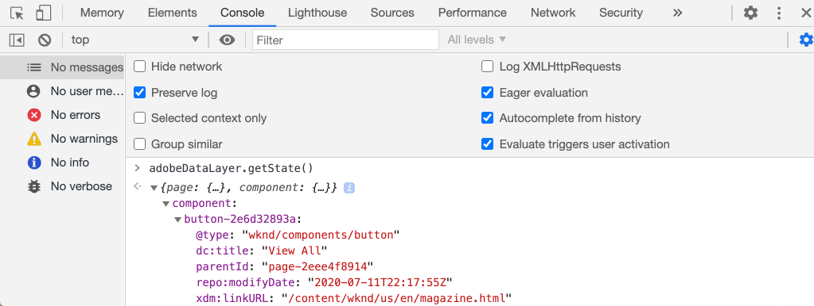
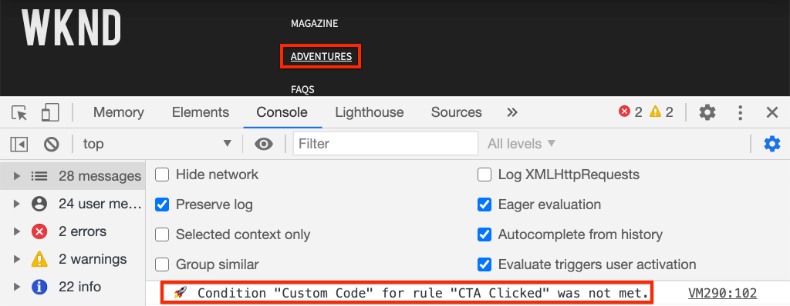

# 使用Adobe Analytics跟踪已单击的组件

使用带Adobe核心组件的事件驱动型[AEM客户端数据层](https://experienceleague.adobe.com/docs/experience-manager-core-components/using/developing/data-layer/overview.html)跟踪Adobe Experience Manager站点上特定组件的单击情况。 了解如何使用tag属性中的规则来侦听单击事件，按组件进行筛选，以及使用跟踪链接信标将数据发送到Adobe Analytics。

## 您即将构建的内容 {#what-build}

WKND营销团队有兴趣了解哪些`Call to Action (CTA)`按钮在主页上的表现最佳。 在本教程中，让我们向标记属性添加一个规则，用于侦听&#x200B;**Teaser**&#x200B;和&#x200B;**Button**&#x200B;组件中的`cmp:click`事件。 然后，将组件ID和新的事件与跟踪链接信标一起发送到Adobe Analytics。


### 目标 {#objective}

1. 在标记属性中创建一个事件驱动规则，以捕获`cmp:click`事件。
1. 按组件资源类型筛选不同的事件。
1. 设置组件ID并使用跟踪链接信标将事件发送到Adobe Analytics。

## 先决条件

本教程是[使用Adobe Analytics收集页面数据](./collect-data-analytics.md)的延续，并假定您拥有：

* 启用了[Adobe Analytics扩展](https://experienceleague.adobe.com/docs/experience-platform/tags/extensions/client/analytics/overview.html)的&#x200B;**标记属性**
* **Adobe Analytics**&#x200B;测试/开发报表包ID和跟踪服务器。 请参阅以下有关[创建报表包](https://experienceleague.adobe.com/docs/analytics/admin/admin-tools/manage-report-suites/c-new-report-suite/new-report-suite.html)的文档。
* [Experience Platform Debugger](https://experienceleague.adobe.com/docs/platform-learn/data-collection/debugger/overview.html)浏览器扩展配置了在[WKND网站](https://wknd.site/us/en.html)或启用了Adobe数据层的AEM网站上加载的标记属性。

## 检查按钮和Teaser架构

在标记属性中创建规则之前，请检查Button和Teaser[&#128279;](https://experienceleague.adobe.com/docs/experience-manager-core-components/using/developing/data-layer/overview.html#item)的架构并在数据层实施中检查它们，这很有用。

1. 导航到[WKND主页](https://wknd.site/us/en.html)
1. 打开浏览器的开发人员工具并导航到&#x200B;**控制台**。 运行以下命令：

   ```js
   adobeDataLayer.getState();
   ```

   上述代码会返回Adobe Client Data Layer的当前状态。

   通过浏览器控制台

1. 展开响应并查找以`button-`和`teaser-xyz-cta`条目为前缀的条目。 您应该会看到类似以下的数据架构：

   按钮架构：

   ```json
   button-2e6d32893a:
       @type: "wknd/components/button"
       dc:title: "View All"
       parentId: "page-2eee4f8914"
       repo:modifyDate: "2020-07-11T22:17:55Z"
       xdm:linkURL: "/content/wknd/us/en/magazine.html"
   ```

   Teaser架构：

   ```json
   teaser-da32481ec8-cta-adf3c09db9:
       @type: "wknd/components/teaser/cta"
       dc:title: "Surf's Up"
       parentId: "teaser-da32481ec8"
       xdm:linkURL: "/content/wknd/us/en/magazine/san-diego-surf.html"
   ```

   上述数据详细信息基于[组件/容器项架构](https://experienceleague.adobe.com/docs/experience-manager-core-components/using/developing/data-layer/overview.html#item)。 新标记规则将使用此架构。

## 创建CTA点击规则

Adobe客户端数据层是&#x200B;**事件**&#x200B;驱动的数据层。 无论何时单击任何核心组件，都会通过数据层调度`cmp:click`事件。 要监听`cmp:click`事件，让我们创建一个规则。

1. 导航到Experience Platform并进入与AEM站点集成的标记属性。
1. 导航到标记属性UI中的&#x200B;**规则**&#x200B;部分，然后单击&#x200B;**添加规则**。
1. 将CTA单击的规则&#x200B;**命名为**。
1. 单击&#x200B;**事件** > **添加**&#x200B;以打开&#x200B;**事件配置**&#x200B;向导。
1. 对于&#x200B;**事件类型**&#x200B;字段，请选择&#x200B;**自定义代码**。

   

1. 在主面板中单击&#x200B;**打开编辑器**，然后输入以下代码片段：

   ```js
   var componentClickedHandler = function(evt) {
      // defensive coding to avoid a null pointer exception
      if(evt.hasOwnProperty("eventInfo") && evt.eventInfo.hasOwnProperty("path")) {
         //trigger Tag Rule and pass event
         console.debug("cmp:click event: " + evt.eventInfo.path);
         var event = {
            //include the path of the component that triggered the event
            path: evt.eventInfo.path,
            //get the state of the component that triggered the event
            component: window.adobeDataLayer.getState(evt.eventInfo.path)
         };
   
         //Trigger the Tag Rule, passing in the new `event` object
         // the `event` obj can now be referenced by the reserved name `event` by other Tag Property data elements
         // i.e `event.component['someKey']`
         trigger(event);
      }
   }
   
   //set the namespace to avoid a potential race condition
   window.adobeDataLayer = window.adobeDataLayer || [];
   //push the event listener for cmp:click into the data layer
   window.adobeDataLayer.push(function (dl) {
      //add event listener for `cmp:click` and callback to the `componentClickedHandler` function
      dl.addEventListener("cmp:click", componentClickedHandler);
   });
   ```

   上述代码段通过[将函数](https://github.com/adobe/adobe-client-data-layer/wiki#pushing-a-function)推入数据层来添加事件侦听器。 每当触发`cmp:click`事件时，都会调用`componentClickedHandler`函数。 在此函数中，添加了一些健全性检查，并为触发事件的组件使用数据层[&#128279;](https://github.com/adobe/adobe-client-data-layer/wiki#getstate)的最新状态构造了一个新的`event`对象。

   最后调用`trigger(event)`函数。 `trigger()`函数是标记属性中的保留名称，它会&#x200B;**触发规则**。 `event`对象作为参数传递，而该参数又由标记属性中的另一个保留名称公开。 标记属性中的数据元素现在可以使用代码段（如`event.component['someKey']`）引用各种属性。

1. 保存更改。
1. 接下来，在&#x200B;**操作**&#x200B;下，单击&#x200B;**添加**&#x200B;以打开&#x200B;**操作配置**&#x200B;向导。
1. 对于&#x200B;**操作类型**&#x200B;字段，请选择&#x200B;**自定义代码**。

   

1. 在主面板中单击&#x200B;**打开编辑器**，然后输入以下代码片段：

   ```js
   console.debug("Component Clicked");
   console.debug("Component Path: " + event.path);
   console.debug("Component type: " + event.component['@type']);
   console.debug("Component text: " + event.component['dc:title']);
   ```

   `event`对象是从自定义事件中调用的`trigger()`方法传递的。 `component`对象是从数据层`getState()`方法派生的组件的当前状态，是触发点击的元素。

1. 保存更改并在标记属性中运行[内部版本](https://experienceleague.adobe.com/docs/experience-platform/tags/publish/builds.html)，以将代码提升到您的AEM网站上使用的[环境](https://experienceleague.adobe.com/docs/experience-platform/tags/publish/environments/environments.html#)。

   >[!NOTE]
   >
   > 使用[Adobe Experience Platform Debugger](https://experienceleague.adobe.com/docs/platform-learn/data-collection/debugger/overview.html)将嵌入代码切换到&#x200B;**开发**&#x200B;环境可能很有用。

1. 导航到[WKND站点](https://wknd.site/us/en.html)并打开开发人员工具以查看控制台。 另外，选中&#x200B;**保留日志**&#x200B;复选框。

1. 单击&#x200B;**Teaser**&#x200B;或&#x200B;**按钮** CTA按钮之一导航到其他页面。

   要单击的

1. 在开发人员控制台中观察到&#x200B;**CTA Clicked**&#x200B;规则已触发：

   已单击

## 创建数据元素

接下来，创建一个数据元素以捕获已单击的组件ID和标题。 回想一下，在上一个练习中，`event.path`的输出类似于`component.button-b6562c963d`，`event.component['dc:title']`的值类似于“查看行程”。

### 组件 ID

1. 导航到Experience Platform并进入与AEM站点集成的标记属性。
1. 导航到&#x200B;**数据元素**&#x200B;部分，然后单击&#x200B;**添加新数据元素**。
1. 对于&#x200B;**Name**&#x200B;字段，请输入&#x200B;**组件ID**。
1. 对于&#x200B;**数据元素类型**&#x200B;字段，请选择&#x200B;**自定义代码**。

   

1. 单击&#x200B;**打开编辑器**&#x200B;按钮，然后在自定义代码编辑器中输入以下内容：

   ```js
   if(event && event.path && event.path.includes('.')) {
       // split on the `.` to return just the component ID
       return event.path.split('.')[1];
   }
   ```

1. 保存更改。

   >[!NOTE]
   >
   > 请注意，`event`对象已变得可用，并根据在标记属性中触发&#x200B;**规则**&#x200B;的事件设定了作用域。 在数据元素在规则中为&#x200B;*引用*&#x200B;之前，不会设置数据元素的值。 因此，可以安全地在诸如上一步骤&#x200B;*中创建的&#x200B;**Page Loaded**&#x200B;规则内使用此数据元素，但*&#x200B;在其他上下文中使用是不安全的。


### 组件标题

1. 导航到&#x200B;**数据元素**&#x200B;部分，然后单击&#x200B;**添加新数据元素**。
1. 对于&#x200B;**Name**&#x200B;字段，请输入&#x200B;**组件标题**。
1. 对于&#x200B;**数据元素类型**&#x200B;字段，请选择&#x200B;**自定义代码**。
1. 单击&#x200B;**打开编辑器**&#x200B;按钮，然后在自定义代码编辑器中输入以下内容：

   ```js
   if(event && event.component && event.component.hasOwnProperty('dc:title')) {
       return event.component['dc:title'];
   }
   ```

1. 保存更改。

## 向CTA点击规则添加条件

接下来，更新&#x200B;**CTA Clicked**&#x200B;规则以确保该规则仅在&#x200B;**Teaser**&#x200B;或&#x200B;**Button**&#x200B;触发`cmp:click`事件时触发。 由于Teaser的CTA在数据层中被视为单独的对象，因此检查父对象以验证它是否来自Teaser非常重要。

1. 在标记属性UI中，导航到之前创建的&#x200B;**CTA Clicked**&#x200B;规则。
1. 在&#x200B;**条件**&#x200B;下，单击&#x200B;**添加**&#x200B;以打开&#x200B;**条件配置**&#x200B;向导。
1. 对于&#x200B;**条件类型**&#x200B;字段，请选择&#x200B;**自定义代码**。

   

1. 单击&#x200B;**打开编辑器**，然后在自定义代码编辑器中输入以下内容：

   ```js
   if(event && event.component && event.component.hasOwnProperty('@type')) {
       // console.log("Event Type: " + event.component['@type']);
       //Check for Button Type OR Teaser CTA type
       if(event.component['@type'] === 'wknd/components/button' ||
          event.component['@type'] === 'wknd/components/teaser/cta') {
           return true;
       }
   }
   
   // none of the conditions are met, return false
   return false;
   ```

   上述代码首先检查资源类型是否来自&#x200B;**Button**，或者资源类型是否来自&#x200B;**Teaser**&#x200B;中的CTA。

1. 保存更改。

## 设置Analytics变量并触发跟踪链接信标

当前，**CTA Clicked**&#x200B;规则只输出一个控制台语句。 接下来，使用数据元素和Analytics扩展将Analytics变量设置为&#x200B;**操作**。 让我们再设置一个额外的操作来触发&#x200B;**跟踪链接**，并将收集的数据发送到Adobe Analytics。

1. 在&#x200B;**CTA Clicked**&#x200B;规则中，**删除** **Core - Custom Code**&#x200B;操作（控制台语句）：

   

1. 在“操作”下，单击&#x200B;**添加**&#x200B;以创建操作。
1. 将&#x200B;**扩展**&#x200B;类型设置为&#x200B;**Adobe Analytics**&#x200B;并将&#x200B;**操作类型**&#x200B;设置为&#x200B;**设置变量**。

1. 为&#x200B;**eVars**、**Props**&#x200B;和&#x200B;**Events**&#x200B;设置以下值：

   * `evar8` - `%Component ID%`
   * `prop8` - `%Component ID%`
   * `event8`

   

   >[!NOTE]
   >
   > 使用了此处`%Component ID%`，因为它保证了所单击CTA的唯一标识符。 使用`%Component ID%`的潜在缺点是Analytics报表包含诸如`button-2e6d32893a`之类的值。 使用`%Component Title%`会提供一个更人性化的名称，但值可能不是唯一的。

1. 接下来，通过点按&#x200B;**加上**&#x200B;图标，在&#x200B;**Adobe Analytics — 设置变量**&#x200B;的右侧添加一个额外的操作：

   

1. 将&#x200B;**扩展**&#x200B;类型设置为&#x200B;**Adobe Analytics**，并将&#x200B;**操作类型**&#x200B;设置为&#x200B;**发送信标**。
1. 在&#x200B;**跟踪**&#x200B;下，将单选按钮设置为&#x200B;**`s.tl()`**。
1. 对于&#x200B;**链接类型**&#x200B;字段，请选择&#x200B;**自定义链接**，对于&#x200B;**链接名称**，将值设置为： **`%Component Title%: CTA Clicked`**：

   

   上述配置将来自数据元素&#x200B;**组件标题**&#x200B;的动态变量与静态字符串&#x200B;**CTA Clicked**&#x200B;的组合在一起。

1. 保存更改。 **CTA Clicked**&#x200B;规则现在应具有以下配置：

   

   * **1。**&#x200B;收听`cmp:click`事件。
   * **2。**&#x200B;检查该事件是否由&#x200B;**Button**&#x200B;或&#x200B;**Teaser**&#x200B;触发。
   * **3。**&#x200B;将Analytics变量设置为以&#x200B;**eVar**、**prop**&#x200B;和&#x200B;**event**&#x200B;的形式跟踪&#x200B;**组件ID**。
   * **4。**&#x200B;发送Analytics跟踪链接信标（并&#x200B;**不**&#x200B;将其视为页面查看）。

1. 保存所有更改并构建标记库，提升到适当的环境。

## 验证跟踪链接信标和Analytics调用

现在&#x200B;**CTA Clicked**&#x200B;规则发送了Analytics信标，您应该能够使用Experience Platform Debugger查看Analytics跟踪变量。

1. 在浏览器中打开[WKND网站](https://wknd.site/us/en.html)。
1. 单击Debugger图标以打开Experience Platform Debugger。
1. 如前面所述，确保Debugger将标记属性映射到&#x200B;*您的*&#x200B;开发环境，并检查&#x200B;**控制台日志记录**。
1. 打开Analytics菜单，并确认已将报表包设置为&#x200B;*您的*&#x200B;报表包。

   

1. 在浏览器中，单击&#x200B;**Teaser**&#x200B;或&#x200B;**按钮** CTA按钮之一以导航到其他页面。

   要单击的

1. 返回Experience Platform Debugger，向下滚动并展开&#x200B;**网络请求** > *您的报表包*。 您应该能够找到&#x200B;**eVar**、**prop**&#x200B;和&#x200B;**event**&#x200B;集。

   

1. 返回浏览器并打开开发人员控制台。 导航到站点的页脚，然后单击其中一个导航链接：

   

1. 在浏览器控制台中观察到，未满足规则“CTA已单击”的消息&#x200B;*“自定义代码”*。

   出现上述消息是因为导航组件确实触发了`cmp:click`事件&#x200B;*但*，因为检查资源类型的规则[&#128279;](#add-a-condition-to-the-cta-clicked-rule)的条件未执行任何操作。

   >[!NOTE]
   >
   > 如果您没有看到任何控制台日志，请确保在Experience Platform Debugger的&#x200B;**Experience Platform标记**&#x200B;下选中&#x200B;**控制台日志记录**。

## 恭喜！

您刚刚在Experience Platform中使用了事件驱动的Adobe Client Data Layer和Tag来跟踪AEM网站上特定组件的单击情况。
