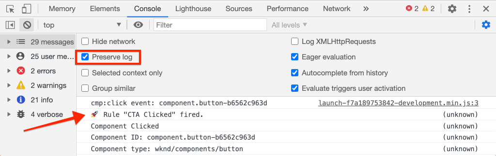

# 使用Adobe Analytics跟踪已点击的组件

将事件驱动的 [Adobe客户端数据层与AEM核心组件结合使用](https://docs.adobe.com/content/help/zh-Hans/experience-manager-core-components/using/developing/data-layer/overview.html) ，跟踪Adobe Experience Manager站点上特定组件的点击量。 了解如何在Experience Platform Launch中使用规则来监听单击事件、按组件进行筛选，以及使用跟踪链接信标将数据发送到Adobe Analytics。

## 您将构建的内容

WKND营销团队希望了解哪个行动动员(CTA)按钮在主页中效果最佳。 在本教程中，我们将在Experience Platform Launch中添加一条新规则，该规 `cmp:click` 则监听 **Teaser** 和Button组 **** 件的事件，并将组件ID和新事件与跟踪链接信标一起发送到Adobe Analytics。


### 目标 {#objective}

1. 根据事件在启动中创建事件驱动的规 `cmp:click` 则。
1. 按组件资源类型筛选不同事件。
1. 设置已点击的组件ID并使用跟踪链接信标发送事件Adobe Analytics。

## 前提条件

本教程是与Adobe Analytics [一起收集页面数据](./collect-data-analytics.md) ，并假定您具有：

* 启 **用了Adobe Analytics** 扩展的 [启动属性](https://docs.adobe.com/content/help/en/launch/using/extensions-ref/adobe-extension/analytics-extension/overview.html)
* **Adobe Analytics** 测试／开发报告套件ID和跟踪服务器。 请参阅以下文档 [以创建新报表包](https://docs.adobe.com/content/help/en/analytics/admin/manage-report-suites/new-report-suite/new-report-suite.html)。
* [Experience Platform调试器](https://docs.adobe.com/content/help/en/platform-learn/tutorials/data-ingestion/web-sdk/introduction-to-the-experience-platform-debugger.html) ，浏览器扩展配置为在https://wknd.site/us/en.html或AEM站 [点上加载Launch属性](https://wknd.site/us/en.html) ，并启用Adobe数据层。

## Inspect的按钮和戏弄者模式

在启动中制定规则之前，请检查“按 [钮”和“Teaser”的模式](https://docs.adobe.com/content/help/en/experience-manager-core-components/using/developing/data-layer/overview.html#item) ，并在数据层实现中检查它们。

1. 导航到 [https://wknd.site/us/en.html](https://wknd.site/us/en.html)
1. 打开浏览器的开发人员工具并导航到控 **制台**。 运行以下命令：

   ```js
   adobeDataLayer.getState();
   ```

   这会返回Adobe客户端数据层的当前状态。

   

1. 展开响应并查找以和条目为前缀 `button-` 的 `teaser-xyz-cta` 条目。 您应当看到如下数据模式:

   按钮模式:

   ```json
   button-2e6d32893a:
       @type: "wknd/components/button"
       dc:title: "View All"
       parentId: "page-2eee4f8914"
       repo:modifyDate: "2020-07-11T22:17:55Z"
       xdm:linkURL: "/content/wknd/us/en/magazine.html"
   ```

   戏弄者模式:

   ```json
   teaser-da32481ec8-cta-adf3c09db9:
       @type: "nt:unstructured"
       dc:title: "Surf's Up"
       parentId: "teaser-da32481ec8"
       xdm:linkURL: "/content/wknd/us/en/magazine/san-diego-surf.html"
   ```

   这些属性基于 [组件/容器项模式](https://docs.adobe.com/content/help/en/experience-manager-core-components/using/developing/data-layer/overview.html#item)。 我们将在Launch中创建的规则将使用此模式。

## 创建CTA已点击规则

Adobe客户端数据层是 **事件** 驱动的数据层。 单击任何核心组件时， `cmp:click` 事件将通过数据层调度。 然后创建一个规则来监听 `cmp:click` 事件。

1. 导航到Experience Platform Launch并进入与AEM站点集成的Web属性。
1. 导航到启 **动UI** 中的“规则”部分，然后单击 **添加规则**。
1. 将规则命 **名为“已单击**”。
1. 单击 **事件** > **添加** ，以打开 **** 事件配置向导。
1. 在“ **事件类型** ”下 **选择“自定义代码**”。

   

1. 在主 **面板中** ，单击“打开编辑器”，然后输入以下代码片断：

   ```js
   var componentClickedHandler = function(evt) {
      // defensive coding to avoid a null pointer exception
      if(evt.hasOwnProperty("eventInfo") && evt.eventInfo.hasOwnProperty("path")) {
         //trigger Launch Rule and pass event
         console.debug("cmp:click event: " + evt.eventInfo.path);
         var event = {
            //include the path of the component that triggered the event
            path: evt.eventInfo.path,
            //get the state of the component that triggered the event
            component: window.adobeDataLayer.getState(evt.eventInfo.path)
         };
   
         //Trigger the Launch Rule, passing in the new `event` object
         // the `event` obj can now be referenced by the reserved name `event` by other Launch data elements
         // i.e `event.component['someKey']`
         trigger(event);
      }
   }
   
   //set the namespace to avoid a potential race condition
   window.adobeDataLayer = window.adobeDataLayer || [];
   //push the event listener for cmp:click into the data layer
   window.adobeDataLayer.push(function (dl) {
      //add event listener for `cmp:click` and callback to the `componentClickedHandler` function
      dl.addEventListener("cmp:click", componentClickedHandler);
   });
   ```

   上述代码片断将通过将函数推 [入事件层](https://github.com/adobe/adobe-client-data-layer/wiki#pushing-a-function) ，添加侦听器。 触发 `cmp:click` 事件时，将 `componentClickedHandler` 调用函数。 在该函数中，添加一些完整性检查，并 `event` 使用触发事件的 [组件的数据层的最新状态](https://github.com/adobe/adobe-client-data-layer/wiki#getstate) ，构建一个新对象。

   之后 `trigger(event)` 就叫了。 `trigger()` 是启动项中的保留名称，将“触发”启动规则。 我们将该 `event` 对象作为参数进行传递，而该参数又将由名为的Launch中的另一个保留名称公开 `event`。 Launch中的数据元素现在可以引用各种属性，如： `event.component['someKey']`.

1. 保存更改。
1. 接下来，在“ **操作** ”下 **单击** “添加 **”以打开“操** 作配置”向导。
1. 在“操 **作类型** ”下 **选择“自定义代码**”。

   

1. 在主 **面板中** ，单击“打开编辑器”，然后输入以下代码片断：

   ```js
   console.debug("Component Clicked");
   console.debug("Component Path: " + event.path);
   console.debug("Component type: " + event.component['@type']);
   console.debug("Component text: " + event.component['dc:title']);
   ```

   对象 `event` 从自定义事件 `trigger()` 中调用的方法进行传递。 `component` 是从触发单击的数据层派生的组 `getState` 件的当前状态。

1. 在启动项中保存更 [改并运](https://docs.adobe.com/content/help/en/launch/using/reference/publish/builds.html) 行内部版本，以将代码提升 [到AEM](https://docs.adobe.com/content/help/en/launch/using/reference/publish/environments.html) 站点上使用的环境。

   >[!NOTE]
   >
   > 使用Adobe Experience Platform调试器将嵌 [入代码](https://docs.adobe.com/content/help/en/platform-learn/tutorials/data-ingestion/web-sdk/introduction-to-the-experience-platform-debugger.html) 切换到开发 **环境** 。

1. 导航到WKND [站点](https://wknd.site/us/en.html) ，然后打开开发人员工具以视图控制台。 选择 **保留日志**。

1. 单击Teaser或 **Button** CTA **按钮** ，导航到其他页面。

   

1. 在开发人员控制台中， **观察已触发** CTA单击规则：

   

## 创建数据元素

然后创建一个数据元素，以捕获已单击的组件ID和标题。 回想一下，在上一项练习中， `event.path` 产出与 `component.button-b6562c963d` “视图之旅”类 `event.component['dc:title']` 似，价值也类似。

### 组件ID

1. 导航到Experience Platform Launch并进入与AEM站点集成的Web属性。
1. 导航到“数 **据元素** ”部分，然 **后单击“添加新数据元素”**。
1. 在名 **称** 中 **输入组件ID**。
1. 对于 **数据元素类型** ，选 **择自定义代码**。

   

1. 单击 **打开编辑** 器，并在自定义代码编辑器中输入以下内容：

   ```js
   if(event && event.path && event.path.includes('.')) {
       // split on the `.` to return just the component ID
       return event.path.split('.')[1];
   }
   ```

   保存更改。

   >[!NOTE]
   >
   > 重新调 `event` 用对象，其作用域基于在启动中触发规则的 **事件** 。 只有在规则中引用数据元素后，才会设置数 *据元* 素的值。 因此，在规则内使用此数据元素是安全的，就像在上一个练习中 **创建的** CTA已点击规 *则一样* ，但在其他上下文中使用则不安全。

### 组件标题

1. 导航到“数 **据元素** ”部分，然 **后单击“添加新数据元素”**。
1. 对于 **名称** ，输 **入组件标题**。
1. 对于 **数据元素类型** ，选 **择自定义代码**。
1. 单击 **打开编辑** 器，并在自定义代码编辑器中输入以下内容：

   ```js
   if(event && event.component && event.component.hasOwnProperty('dc:title')) {
       return event.component['dc:title'];
   }
   ```

   保存更改。

## 向CTA单击规则添加条件

接下来，更新 **CTA已点击规则** ，以确保仅在为Teaser或Button触发 `cmp:click` 事件时才 **触发规** 则 **。**&#x200B;由于Teaser的CTA在数据层中被视为一个单独的对象，因此检查父级以验证它是否来自Teaser很重要。

1. 在启动UI中，导航到之前创 **建的页面** 加载规则。
1. 在条 **件下** ，单 **击添加** ，以打开 **条件配置向导** 。
1. 对于“ **条件类型** ”，选 **择“自定义代码**”。

   

1. 单击 **打开编辑** 器，并在自定义代码编辑器中输入以下内容：

   ```js
   if(event && event.component && event.component.hasOwnProperty('@type')) {
       //Check for Button Type
       if(event.component['@type'] === 'wknd/components/button') {
           return true;
       } else if (event.component['@type'] == 'nt:unstructured') {
           // Check for CTA inside a Teaser
           var parentComponentId = event.component['parentId'];
           var parentComponent = window.adobeDataLayer.getState('component.' + parentComponentId);
   
           if(parentComponent['@type'] === 'wknd/components/teaser') {
               return true;
           }
       }
   }
   
   return false;
   ```

   上面的代码首先检查资源类型是否来自 **Button** ，然后检查资源类型是否来自Teaser中的 **CTA**。

1. 保存更改。

## 设置分析变量并触发跟踪链接信标

目前， **CTA已单击规** 则只输出控制台语句。 接下来，使用数据元素和Analytics扩展将Analytics变量设置为 **操作**。 我们还将设置其他操作以触发 **跟踪链接** ，并将收集的数据发送到Adobe Analytics。

1. 在页面 **加载规** 则 **中，删** 除核心——自定 **义代码操作** （控制台语句）:

   

1. 在“操作”下， **单击** “添加”以添加新操作。
1. 将“扩展 **类型** ”设置为 **Adobe Analytics** ，将“操 **作类型** ”设置为 **“设置变**&#x200B;量”。

1. 为eVar、Prop和 **事件****设**&#x200B;置以 **下值**:

   * `evar8` - `%Component ID%`
   * `prop8` - `%Component ID%`
   * `event8` - `CTA Clicked`

   

1. 接下来，在Adobe Analytics的右侧添加一个附加的“操 **作”-通过点按加号** ，设置 **变量** :

   

1. 将“扩 **展** ”类型设 **置为** Adobe Analytics **，将“操** 作类型 **”设置**&#x200B;为“发送信标”。
1. 在“ **跟踪** ”下，将单选按钮设置为 **`s.tl()`**。
1. 对于 **链接类型** ，选择 **自定义链接** ，对于链 **接名称，请将值设置为数据元素******&#x200B;组件标题：

   

1. 保存更改。CTA **单击规** 则现在应具有以下配置：

   

   * **1.** 听事件 `cmp:click` 吧。
   * **2.** 检查事件是由Button或 **Teaser** 触 **发的**。
   * **3.** 将Analytics变量设置为以跟 **踪组件** ID **为****eVar**、 **prop**&#x200B;和事件。
   * **4.** 发送分析跟踪链接信标( **不** 要将其视为页面视图)。

1. 保存所有更改并构建启动库，提升到相应的环境。

## 验证跟踪链接信标和分析调用

既然CTA已 **点击规则发送** “分析”信标，您应能使用Experience Platform调试器查看“分析”跟踪变量。

1. 在浏览 [器中打开](https://wknd.site/us/en.html) WKND站点。
1. 单击“调试器”图  ”图标以打开Experience Platform调试器。
1. 确保调试器将启动属性映射到您 *的开发* 环境，如前所述，并 **且已选中控** 制台日志。
1. 打开“Analytics（分析）”菜单并验证报表包已设置 *到您* 的报表包。

   

1. 在浏览器中，单击其中一个 **Teaser** 或 **Button** CTA按钮导航到其他页面。

   

1. 返回Experience Platform调试器，向下滚动并展开“网 **络请求** ”> *“您的报表包*”。 您应该能够找到 **eVar**、 **prop****和** 事件集。

   

1. 返回浏览器并打开开发人员控制台。 导航到站点的页脚，然后单击其中一个导航链接：

   

1. 在浏览器控制台中， *未满足规则“CTA已点击”的消息“自定义代码”*。

   这是因为导航组件触发了 `cmp:click` 事件 *，但* 由于我们根据资源类型检查了该组件，因此不会执行任何操作。

   >[!NOTE]
   >
   > 如果看不到任何控制台日志，请确保在Experience Platform调 **试器中的** “启动” **下选中** “控制台日志记录”。

## 恭喜！

您刚刚使用事件驱动的Adobe客户端数据层和Experience Platform Launch跟踪Adobe Experience Manager站点上特定组件的点击。