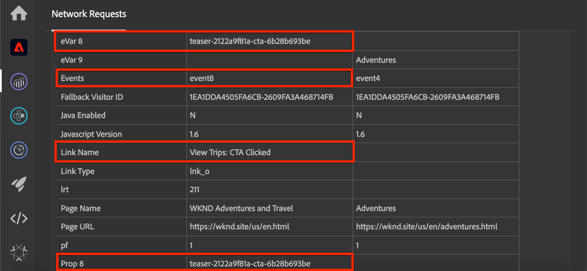

# 使用Adobe Analytics跟踪已单击的组件

将事件驱动的[Adobe客户端数据层与AEM核心组件](https://experienceleague.adobe.com/docs/experience-manager-core-components/using/developing/data-layer/overview.html)结合使用，跟踪Adobe Experience Manager网站上特定组件的单击情况。 了解如何在Experience Platform Launch中使用规则来监听点击事件、按组件进行过滤，以及通过跟踪链接信标将数据发送到Adobe Analytics。

## 将构建的内容

WKND营销团队希望了解哪个行动动员(CTA)按钮在主页上的表现最佳。 在本教程中，我们将在Experience Platform Launch中添加一个新规则，该规则监听&#x200B;**Teaser**&#x200B;和&#x200B;**Button**&#x200B;组件中的`cmp:click`事件，并将组件ID和新事件与跟踪链接信标一起发送到Adobe Analytics。


### 目标 {#objective}

1. 在Launch中根据`cmp:click`事件创建事件驱动的规则。
1. 按组件资源类型筛选不同事件。
1. 设置已单击的组件ID，并使用跟踪链接信标发送事件Adobe Analytics。

## 前提条件

本教程将继续[使用Adobe Analytics](./collect-data-analytics.md)收集页面数据，并假定您具有：

* 启用了[Adobe Analytics扩展](https://experienceleague.adobe.com/docs/experience-platform/tags/extensions/adobe/analytics/overview.html)的&#x200B;**Launch属性**
* **Adobe** Analyticst/dev报表包ID和跟踪服务器。有关[创建新报表包](https://experienceleague.adobe.com/docs/analytics/admin/manage-report-suites/new-report-suite/new-report-suite.html)的信息，请参阅以下文档。
* [Experience Platform](https://experienceleague.adobe.com/docs/debugger-learn/tutorials/experience-platform-debugger/introduction-to-the-experience-platform-debugger.html) Debuggerbrowser扩展配置了您的Launch资产，该资产 [在https://wknd.site/us/en.](https://wknd.site/us/en.html) html或AEM网站上加载，并且启用了Adobe数据层。

## Inspect按钮和Teaser架构

在Launch中制定规则之前，请查看[ Button和Teaser](https://experienceleague.adobe.com/docs/experience-manager-core-components/using/developing/data-layer/overview.html#item)的架构，并在数据层实施中检查它们。

1. 导航到[https://wknd.site/us/en.html](https://wknd.site/us/en.html)
1. 打开浏览器的开发人员工具并导航到&#x200B;**Console**。 运行以下命令：

   ```js
   adobeDataLayer.getState();
   ```

   这会返回Adobe客户端数据层的当前状态。

   

1. 展开响应并查找前缀为`button-`和`teaser-xyz-cta`条目的条目。 您应会看到如下数据架构：

   按钮架构：

   ```json
   button-2e6d32893a:
       @type: "wknd/components/button"
       dc:title: "View All"
       parentId: "page-2eee4f8914"
       repo:modifyDate: "2020-07-11T22:17:55Z"
       xdm:linkURL: "/content/wknd/us/en/magazine.html"
   ```

   Teaser架构：

   ```json
   teaser-da32481ec8-cta-adf3c09db9:
       @type: "wknd/components/teaser/cta"
       dc:title: "Surf's Up"
       parentId: "teaser-da32481ec8"
       xdm:linkURL: "/content/wknd/us/en/magazine/san-diego-surf.html"
   ```

   这些参数基于[组件/容器项目架构](https://experienceleague.adobe.com/docs/experience-manager-core-components/using/developing/data-layer/overview.html#item)。 我们将在Launch中创建的规则将使用此架构。

## 创建已单击CTA的规则

Adobe客户端数据层是一个&#x200B;**事件**&#x200B;驱动的数据层。 单击任何核心组件后，将通过数据层调度`cmp:click`事件。 接下来，创建一个规则来监听`cmp:click`事件。

1. 导航到Experience Platform Launch，并导航到与AEM Site集成的Web属性。
1. 导航到Launch UI中的&#x200B;**Rules**&#x200B;部分，然后单击&#x200B;**Add Rule**。
1. 将规则命名为&#x200B;**CTA Clicked**。
1. 单击&#x200B;**事件** > **添加**&#x200B;以打开&#x200B;**事件配置**&#x200B;向导。
1. 在&#x200B;**事件类型**&#x200B;下，选择&#x200B;**自定义代码**。

   

1. 单击主面板中的&#x200B;**Open Editor** ，然后输入以下代码片段：

   ```js
   var componentClickedHandler = function(evt) {
      // defensive coding to avoid a null pointer exception
      if(evt.hasOwnProperty("eventInfo") && evt.eventInfo.hasOwnProperty("path")) {
         //trigger Launch Rule and pass event
         console.debug("cmp:click event: " + evt.eventInfo.path);
         var event = {
            //include the path of the component that triggered the event
            path: evt.eventInfo.path,
            //get the state of the component that triggered the event
            component: window.adobeDataLayer.getState(evt.eventInfo.path)
         };
   
         //Trigger the Launch Rule, passing in the new `event` object
         // the `event` obj can now be referenced by the reserved name `event` by other Launch data elements
         // i.e `event.component['someKey']`
         trigger(event);
      }
   }
   
   //set the namespace to avoid a potential race condition
   window.adobeDataLayer = window.adobeDataLayer || [];
   //push the event listener for cmp:click into the data layer
   window.adobeDataLayer.push(function (dl) {
      //add event listener for `cmp:click` and callback to the `componentClickedHandler` function
      dl.addEventListener("cmp:click", componentClickedHandler);
   });
   ```

   上述代码片段将通过[将函数](https://github.com/adobe/adobe-client-data-layer/wiki#pushing-a-function)推送到数据层来添加事件侦听器。 触发`cmp:click`事件时，将调用`componentClickedHandler`函数。 在此函数中，添加了一些健全性检查，并使用触发事件的组件的数据层[状态的最新](https://github.com/adobe/adobe-client-data-layer/wiki#getstate)构建了新的`event`对象。

   之后调用`trigger(event)`。 `trigger()` 是Launch中的保留名称，将“触发”Launch规则。我们将`event`对象作为参数进行传递，该参数又将在Launch中由名为`event`的其他保留名称公开。 Launch中的数据元素现在可以引用各种属性，如下所示：`event.component['someKey']`。

1. 保存更改。
1. 接下来，在&#x200B;**Actions**&#x200B;下，单击&#x200B;**Add**&#x200B;以打开&#x200B;**Action Configuration**&#x200B;向导。
1. 在&#x200B;**Action Type**&#x200B;下，选择&#x200B;**Custom Code**。

   

1. 单击主面板中的&#x200B;**Open Editor** ，然后输入以下代码片段：

   ```js
   console.debug("Component Clicked");
   console.debug("Component Path: " + event.path);
   console.debug("Component type: " + event.component['@type']);
   console.debug("Component text: " + event.component['dc:title']);
   ```

   `event`对象从自定义事件中调用的`trigger()`方法传递。 `component` 是从触发单击的数据层派生的组件 `getState` 的当前状态。

1. 在Launch中保存更改并运行[build](https://experienceleague.adobe.com/docs/experience-platform/tags/publish/builds.html)，以将代码提升到AEM Site上使用的[environment](https://experienceleague.adobe.com/docs/experience-platform/tags/publish/environments/environments.html)。

   >[!NOTE]
   >
   > 使用[Adobe Experience Platform Debugger](https://experienceleague.adobe.com/docs/debugger-learn/tutorials/experience-platform-debugger/introduction-to-the-experience-platform-debugger.html)将嵌入代码切换到&#x200B;**Development**&#x200B;环境会非常有用。

1. 导航到[WKND Site](https://wknd.site/us/en.html)并打开开发人员工具以查看控制台。 选择&#x200B;**保留日志**。

1. 单击&#x200B;**Teaser**&#x200B;或&#x200B;**Button** CTA按钮之一可导航到其他页面。

   

1. 在开发人员控制台中，观察是否已触发&#x200B;**CTA Clicked**&#x200B;规则：

   

## 创建数据元素

接下来，创建一个数据元素以捕获已单击的组件ID和标题。 回想一下，在上一次练习中，`event.path`的输出与`component.button-b6562c963d`类似，而`event.component['dc:title']`的值与“查看行程”类似。

### 组件ID

1. 导航到Experience Platform Launch，并导航到与AEM Site集成的Web属性。
1. 导航到&#x200B;**数据元素**&#x200B;部分，然后单击&#x200B;**添加新数据元素**。
1. 对于&#x200B;**名称**，输入&#x200B;**组件ID**。
1. 对于&#x200B;**数据元素类型**，选择&#x200B;**自定义代码**。

   

1. 单击&#x200B;**Open Editor**&#x200B;并在自定义代码编辑器中输入以下内容：

   ```js
   if(event && event.path && event.path.includes('.')) {
       // split on the `.` to return just the component ID
       return event.path.split('.')[1];
   }
   ```

   保存更改。

   >[!NOTE]
   >
   > 请记住，`event`对象已可用，其范围基于在Launch中触发&#x200B;**Rule**&#x200B;的事件。 只有在规则中引用了&#x200B;*referenced*&#x200B;数据元素后，才会设置数据元素的值。 因此，在诸如在上一个练习&#x200B;*中创建的&#x200B;**CTA Clicked**规则（但在其他上下文中使用*）之类的规则中使用此数据元素是安全的。

### 组件标题

1. 导航到&#x200B;**数据元素**&#x200B;部分，然后单击&#x200B;**添加新数据元素**。
1. 对于&#x200B;**名称**，输入&#x200B;**组件标题**。
1. 对于&#x200B;**数据元素类型**，选择&#x200B;**自定义代码**。
1. 单击&#x200B;**Open Editor**&#x200B;并在自定义代码编辑器中输入以下内容：

   ```js
   if(event && event.component && event.component.hasOwnProperty('dc:title')) {
       return event.component['dc:title'];
   }
   ```

   保存更改。

## 向“已单击CTA”规则添加条件

接下来，更新&#x200B;**CTA Clicked**&#x200B;规则，以确保规则仅在为&#x200B;**Teaser**&#x200B;或&#x200B;**Button**&#x200B;触发`cmp:click`事件时触发。 由于Teaser的CTA在数据层中被视为单独的对象，因此务必检查父级以验证它是否来自Teaser。

1. 在Launch UI中，导航到之前创建的&#x200B;**CTA已单击**&#x200B;规则。
1. 在&#x200B;**Conditions**&#x200B;下，单击&#x200B;**Add**&#x200B;以打开&#x200B;**Condition Configuration**&#x200B;向导。
1. 对于&#x200B;**条件类型**，选择&#x200B;**自定义代码**。

   

1. 单击&#x200B;**Open Editor**&#x200B;并在自定义代码编辑器中输入以下内容：

   ```js
   if(event && event.component && event.component.hasOwnProperty('@type')) {
       // console.log("Event Type: " + event.component['@type']);
       //Check for Button Type OR Teaser CTA type
       if(event.component['@type'] === 'wknd/components/button' ||
          event.component['@type'] === 'wknd/components/teaser/cta') {
           return true;
       }
   }
   
   // none of the conditions are met, return false
   return false;
   ```

   上述代码首先检查资源类型是否来自&#x200B;**Button**，然后检查资源类型是否来自&#x200B;**Teaser**&#x200B;内的CTA。

1. 保存更改。

## 设置Analytics变量并触发跟踪链接信标

当前，**CTA Clicked**&#x200B;规则只输出控制台语句。 接下来，使用数据元素和Analytics扩展将Analytics变量设置为&#x200B;**action**。 我们还将设置其他操作来触发&#x200B;**跟踪链接**，并将收集的数据发送到Adobe Analytics。

1. 在&#x200B;**CTA Clicked**&#x200B;规则&#x200B;**删除** **Core - Custom Code**&#x200B;操作（控制台语句）中：

   

1. 在Actions下，单击&#x200B;**Add**&#x200B;以添加新操作。
1. 将&#x200B;**Extension**&#x200B;类型设置为&#x200B;**Adobe Analytics**，并将&#x200B;**Action Type**&#x200B;设置为&#x200B;**Set Variables**。

1. 为&#x200B;**eVars**、**Props**&#x200B;和&#x200B;**Events**&#x200B;设置以下值：

   * `evar8` - `%Component ID%`
   * `prop8` -  `%Component ID%`
   * `event8`

   

   >[!NOTE]
   >
   > 此处使用`%Component ID%`，因为它将获取已单击CTA的唯一标识符。 使用`%Component ID%`的潜在缺点是Analytics报表将包含`button-2e6d32893a`等值。 使用`%Component Title%`可提供更人性化的友好名称，但值可能不唯一。

1. 接下来，通过点按&#x200B;**加号**&#x200B;图标，在&#x200B;**Adobe Analytics - Set Variables**&#x200B;的右侧添加一个额外的操作：

   

1. 将&#x200B;**Extension**&#x200B;类型设置为&#x200B;**Adobe Analytics**，并将&#x200B;**Action Type**&#x200B;设置为&#x200B;**Send Beacon**。
1. 在&#x200B;**Tracking**&#x200B;下，将单选按钮设置为&#x200B;**`s.tl()`**。
1. 对于&#x200B;**链接类型**，选择&#x200B;**自定义链接**，对于&#x200B;**链接名称**，将值设置为：**`%Component Title%: CTA Clicked`**:

   

   这将合并数据元素&#x200B;**组件标题**&#x200B;中的动态变量和静态字符串&#x200B;**CTA Clicked**&#x200B;中的动态变量。

1. 保存更改。现在，**CTA Clicked**&#x200B;规则应具有以下配置：

   

   * **1.** 监听事 `cmp:click` 件。
   * **2.** 检查事件是否由Buttonor  **** Teaser **触发**。
   * **3.** 将Analytics变量设置为以 **跟** 踪组件ID **、eVar** **、属性**&#x200B;和 **事件**。
   * **4.** 发送Analytics跟踪链接信标(并且不 **** 要将其视为页面查看)。

1. 保存所有更改并构建Launch库，然后将其提升到相应的环境。

## 验证跟踪链接信标和Analytics调用

现在，**CTA已单击**&#x200B;规则发送Analytics信标，您应该能够使用Experience Platform调试器查看Analytics跟踪变量。

1. 在浏览器中打开[WKND Site](https://wknd.site/us/en.html)。
1. 单击Debugger图标以打开Experience PlatformDebugger。
1. 如前面所述，确保Debugger将Launch资产映射到&#x200B;*您的*&#x200B;开发环境，并选中&#x200B;**控制台日志记录**。
1. 打开Analytics菜单，并验证报表包是否设置为&#x200B;*您的*&#x200B;报表包。

   

1. 在浏览器中，单击&#x200B;**Teaser**&#x200B;或&#x200B;**Button** CTA按钮之一以导航到另一个页面。

   

1. 返回Experience Platform调试器并向下滚动到&#x200B;**网络请求** > *您的报表包*。 您应该能够找到&#x200B;**eVar**、**prop**&#x200B;和&#x200B;**事件**&#x200B;集。

   

1. 返回到浏览器并打开开发人员控制台。 导航到网站的页脚，然后单击其中一个导航链接：

   

1. 在浏览器控制台中，观察未满足规则“已单击CTA”的消息&#x200B;*&quot;Custom Code&quot;*。

   这是因为导航组件确实会触发`cmp:click`事件&#x200B;*，但*，因为我们根据资源类型检查了，因此不会执行任何操作。

   >[!NOTE]
   >
   > 如果看不到任何控制台日志，请确保在Experience Platform调试器的&#x200B;**Launch**&#x200B;下选中&#x200B;**控制台日志记录**。

## 恭喜！

您刚刚使用事件驱动的Adobe客户端数据层和Experience Platform Launch来跟踪Adobe Experience Manager网站上特定组件的单击次数。