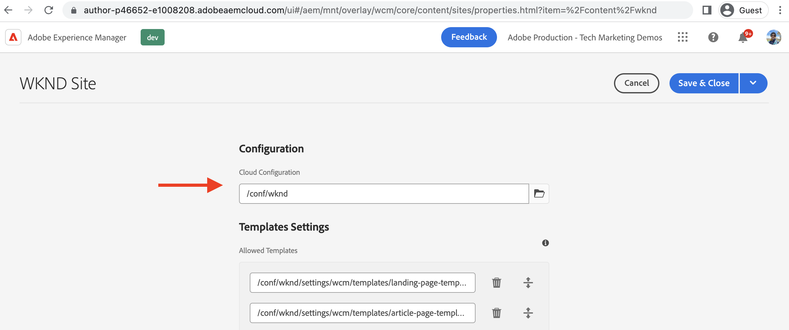

# 在AEM中创建LaunchCloud Service配置 {#create-launch-cloud-service}

>[!NOTE]
>
>在AEM产品UI、内容和文档中正在实施将Adobe Experience Platform Launch重命名为一组数据收集技术的过程，因此此处仍在使用术语Launch。

了解如何在Adobe Experience Manager中创建LaunchCloud Service配置。 然后，可以将AEM LaunchCloud Service配置应用于现有站点，并且可以在创作和发布环境中观察标记库的加载情况。

## 创建Launch云服务

使用以下步骤创建Launch云服务配置。

1. 从 **工具** 菜单，选择 **Cloud Services** 部分，单击 **AdobeLaunch配置**

1. 选择您网站的配置文件夹或选择 **WKND站点** （如果使用WKND指南项目）并单击 **创建**

1. 从 _常规_ 选项卡，使用 **标题** 字段，然后选择 **Adobe启动** 从 _关联的Adobe IMS配置_ 下拉列表。 然后，从 _公司_ 下拉菜单，然后从中选择之前创建的属性 _属性_ 下拉列表。

1. 从 _暂存_ 和 _生产_ 选项卡保留默认配置。 但是，建议您查看并更改实际生产设置的配置，特别是 _异步加载库_ 根据您的性能和优化要求进行切换。 另请注意， _库URI_ 暂存和生产的值不同。

1. 最后，单击 **创建** 以完成Launch云服务。

   

## 将Launch云服务应用到站点

要将标记属性及其库加载到AEM网站，会将Launch云服务配置应用到该网站。 在上一步中，云服务配置是在站点名称文件夹（WKND站点）下创建的，因此应自动应用该配置，让我们对其进行验证。

1. 从 **导航** 菜单，选择 **站点** 图标。

1. 选择AEM站点的根页面，然后单击 **属性**. 然后，导航到 **高级** 选项卡和下方 **配置** 部分，验证云配置值是否指向特定于您的站点 `conf` 文件夹。

   

## 验证“创作”和“发布”页面上标记属性的加载情况

现在，该验证标记属性及其库是否已加载到AEM网站页面上。

1. 在 **查看已发布的项目** 模式下，您应会在浏览器控制台中看到日志消息。 它与标记属性规则的JavaScript代码片段中的消息相同，当 _Library Loaded(Page Top)_ 事件。

1. 要在发布时进行验证，请首先发布 **Launch云服务** 配置并在Publish实例上打开站点页面。

   

恭喜！您已完成AEM和数据收集标记集成，该集成可将JavaScript代码插入您的AEM网站，而无需更新AEM项目代码。

## 挑战 — 更新和发布标记属性中的规则

使用从前一个 [创建标记属性](./create-tag-property.md) 要完成简单的质询，请更新现有规则以添加其他控制台语句，并使用 _发布流程_ 将其部署到AEM网站。

## 后续步骤

[调试标记实施](debug-tags-implementation.md)
