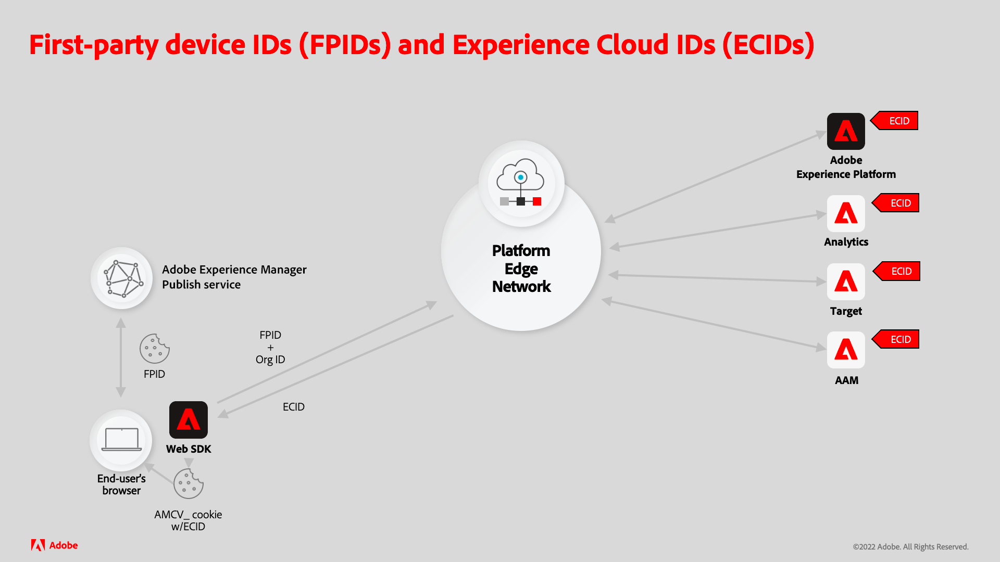

# 使用AEM Sites生成Experience PlatformFPID

将通过AEM Publish交付的Adobe Experience Manager (AEM)站点与Adobe Experience Platform (AEP)集成需要AEM生成和维护唯一的第一方设备ID (FPID) Cookie，以便唯一跟踪用户活动。

FPID Cookie应由服务器(AEM Publish)设置，而不是使用JavaScript创建客户端Cookie。 这是因为现代浏览器（如Safari和Firefox）可能会阻止由JavaScript生成的Cookie或使其快速过期。

阅读支持文档，以便[了解第一部分设备ID和Experience CloudID如何协同工作的详细信息](https://experienceleague.adobe.com/docs/platform-learn/data-collection/edge-network/generate-first-party-device-ids.html?lang=en)。

以下是使用AEM作为Web主机时FPID的工作方式概述。

使用AEM的

## 使用AEM生成并保留FPID

AEM Publish服务通过尽可能多地在CDN和AEM Dispatcher缓存中缓存请求来优化性能。

绝不会缓存生成每用户独特FPID Cookie并返回FPID值的HTTP请求并直接从AEM Publish提供服务，后者可以实施逻辑来保证唯一性，这一点至关重要。

避免在网页或其他可缓存资源的请求中生成FPID Cookie，因为FPID的唯一性要求组合会导致这些资源无法缓存。

下图描述了AEM Publish服务如何管理FPID。


1. Web浏览器请求由AEM托管的网页。 可以使用来自CDN或AEM Dispatcher缓存的网页缓存副本来提供请求。
1. 如果网页无法从CDN或AEM Dispatcher缓存提供服务，则该请求将发送到AEM Publish服务，该服务将生成所请求的网页。
1. 随后，该网页将返回到Web浏览器，并填充无法为请求提供服务的缓存。 使用AEM时，预计CDN和AEM Dispatcher缓存命中率将大于90%。
1. 该网页包含JavaScript，用于向AEM Publish服务中的自定义FPID servlet发出不可缓存的异步XHR (AJAX)请求。 由于这是一个不可缓存的请求（由于其随机查询参数和缓存控制标头），因此CDN或AEM Dispatcher从不缓存它，并且始终会访问AEM Publish服务以生成响应。
1. AEM Publish服务中的自定义FPID servlet处理该请求，在没有找到现有FPID Cookie时生成新的FPID，或者延长任何现有FPID Cookie的生命周期。 此servlet还会返回响应正文中的FPID，以供客户端JavaScript使用。 幸运的是，自定义FPID servlet逻辑是轻量级的，防止此请求影响AEM Publish服务性能。
1. XHR请求的响应将返回给浏览器，并在响应正文中将FPID Cookie和FPID作为JSON，以供Platform Web SDK使用。

## 代码示例

以下代码和配置可以部署到AEM Publish服务，以创建端点，该端点生成或延长现有FPID Cookie的生命周期，并将FPID作为JSON返回。

### AEM Publish FPID Cookie servlet

必须创建AEM Publish HTTP终结点，以使用[Sling servlet](https://sling.apache.org/documentation/the-sling-engine/servlets.html#registering-a-servlet-using-java-annotations-1)生成或扩展FPID Cookie。

+ 此servlet已绑定到`/bin/aem/fpid`，因为访问它不需要身份验证。 如果需要进行身份验证，请绑定到Sling资源类型。
+ 此servlet接受HTTPGET请求。 响应标有`Cache-Control: no-store`以防止缓存，但还应使用唯一的缓存无效查询参数请求此端点。

当HTTP请求到达servlet时，此servlet检查请求上是否存在FPID Cookie：

+ 如果存在FPID Cookie，请延长Cookie的生命周期，并收集其值以写入响应。
+ 如果FPID Cookie不存在，请生成新的FPID Cookie并保存该值以写入响应。

然后，Servlet将FPID作为JSON对象写入响应，格式为： `{ fpid: "<FPID VALUE>" }`。

在正文中向客户端提供FPID很重要，因为FPID Cookie标记为`HttpOnly`，这意味着只有服务器才能读取其值，而客户端JavaScript则不能。 为了避免在每次加载页面时不必要地重新获取FPID，系统还设置了`FPID_CLIENT` Cookie，以指示已生成FPID并将值公开给客户端JavaScript以供使用。

FPID值可用于通过Platform Web SDK将调用参数化。

以下是AEM servlet端点（通过`HTTP GET /bin/aep/fpid`提供）的示例代码，该端点生成或刷新FPID Cookie，并将FPID作为JSON返回。

+ `core/src/main/java/com/adobe/aem/guides/wkndexamples/core/aep/impl/FpidServlet.java`

```java
package com.adobe.aem.guides.wkndexamples.core.aep.impl;

import com.google.gson.JsonObject;
import org.apache.sling.api.SlingHttpServletRequest;
import org.apache.sling.api.SlingHttpServletResponse;
import org.apache.sling.api.servlets.SlingAllMethodsServlet;
import org.osgi.service.component.annotations.Component;
import org.slf4j.Logger;
import org.slf4j.LoggerFactory;

import javax.servlet.Servlet;
import javax.servlet.http.Cookie;
import java.io.IOException;
import java.util.UUID;

import static org.apache.sling.api.servlets.ServletResolverConstants.SLING_SERVLET_PATHS;
import static org.apache.sling.api.servlets.ServletResolverConstants.SLING_SERVLET_METHODS;

@Component(
        service = {Servlet.class},
        property = {
                SLING_SERVLET_PATHS + "=/bin/aep/fpid",
                SLING_SERVLET_METHODS + "=GET"
        }
)
public class FpidServlet extends SlingAllMethodsServlet {
    private static final Logger log = LoggerFactory.getLogger(FpidServlet.class);
    private static final String COOKIE_NAME = "FPID";
    private static final String CLIENT_COOKIE_NAME = "FPID_CLIENT";
    private static final String COOKIE_PATH = "/";
    private static final int COOKIE_MAX_AGE = 60 * 60 * 24 * 30 * 13; // 13 months
    private static final String JSON_KEY = "fpid";

    @Override
    protected final void doGet(SlingHttpServletRequest request, SlingHttpServletResponse response) throws IOException {
        // Try to get an existing FPID cookie, this will give us the user's current FPID if it exists
        final Cookie existingCookie = request.getCookie(COOKIE_NAME);

        String cookieValue;

        if (existingCookie == null) {
            //  If no FPID cookie exists, create a new FPID UUID
            cookieValue = UUID.randomUUID().toString();
        } else {
            // If a FPID cookie exists, get its FPID UUID so its life can be extended
            cookieValue = existingCookie.getValue();
        }

        // Add the FPID value to the response, either newly generated or the extended one
        // This can be read by the Server (AEM Publish) due to HttpOnly flag.
        response.addHeader("Set-Cookie",
                COOKIE_NAME + "=" + cookieValue + "; " +
                        "Max-Age=" + COOKIE_MAX_AGE + "; " +
                        "Path=" + COOKIE_PATH + "; " +
                        "HttpOnly; " +
                        "Secure; " +
                        "SameSite=Lax");

        // Also set FPID_CLIENT cookie to avoid further server-side FPID generation
        // This can be read by the client-side JavaScript to check if FPID is already generated
        // or if it needs to be requested from server (AEM Publish)
        response.addHeader("Set-Cookie",
                CLIENT_COOKIE_NAME + "=" + cookieValue + "; " +
                        "Max-Age=" + COOKIE_MAX_AGE + "; " +
                        "Path=" + COOKIE_PATH + "; " +
                        "Secure; " + 
                        "SameSite=Lax");

        // Avoid caching the response
        response.addHeader("Cache-Control", "no-store");

        // Return FPID in the response as JSON for client-side access
        final JsonObject json = new JsonObject();
        json.addProperty(JSON_KEY, cookieValue);

        response.setContentType("application/json");
        response.getWriter().write(json.toString());
```

### HTML脚本

必须向页面添加自定义客户端JavaScript才能异步调用servlet，生成或刷新FPID Cookie并在响应中返回FPID。

通常使用下列方法之一将此JavaScript脚本添加到页面中：

+ Adobe Experience Platform中的[标记](https://experienceleague.adobe.com/docs/experience-platform/tags/home.html)
+ [AEM客户端库](https://experienceleague.adobe.com/docs/experience-manager-cloud-service/content/implementing/developing/full-stack/clientlibs.html?lang=en)

对自定义AEM FPID servlet的XHR调用非常快（尽管是异步调用），因此用户可能会访问AEM提供的网页，并在请求完成之前导航离开。
如果发生这种情况，在从AEM加载网页的下一页时，将重新尝试执行相同的过程。

AEM FPID servlet (`/bin/aep/fpid`)的HTTPGET使用随机查询参数进行参数化，以确保浏览器和AEM Publish服务之间的任何基础结构都不会缓存请求的响应。
同样，添加`Cache-Control: no-store`请求标头以支持避免缓存。

调用AEM FPID servlet时，将从JSON响应中检索FPID，并由[平台Web SDK](https://experienceleague.adobe.com/docs/platform-learn/implement-web-sdk/tags-configuration/install-web-sdk.html?lang=en)用来将其发送到Experience PlatformAPI。

有关在identityMap](https://experienceleague.adobe.com/docs/experience-platform/edge/identity/first-party-device-ids.html#identityMap)中使用FPID的[的更多信息，请参阅Experience Platform文档

```javascript
...
<script>
    // Wrap in anonymous function to avoid global scope pollution

    (function() {
        // Utility function to get a cookie value by name
        function getCookie(name) {
            const value = `; ${document.cookie}`;
            const parts = value.split(`; ${name}=`);
            if (parts.length === 2) return parts.pop().split(';').shift();
        }

        // Async function to handle getting the FPID via fetching from AEM, or reading an existing FPID_CLIENT cookie
        async function getFpid() {
            let fpid = getCookie('FPID_CLIENT');
            
            // If FPID can be retrieved from FPID_CLIENT then skip fetching FPID from server
            if (!fpid) {
                // Fetch FPID from the server if no FPID_CLIENT cookie value is present
                try {
                    const response = await fetch(`/bin/aep/fpid?_=${new Date().getTime() + '' + Math.random()}`, {
                        method: 'GET',
                        headers: {
                            'Cache-Control': 'no-store'
                        }
                    });
                    const data = await response.json();
                    fpid = data.fpid;
                } catch (error) {
                    console.error('Error fetching FPID:', error);
                }
            }

            console.log('My FPID is: ', fpid);
            return fpid;
        }

        // Invoke the async function to fetch or skip FPID
        const fpid = await getFpid();

        // Add the fpid to the identityMap in the Platform Web SDK
        // and/or send to AEP via AEP tags or direct AEP Web SDK calls (alloy.js)
    })();
</script>
```

### Dispatcher允许过滤器

最后，必须通过AEM Dispatcher的`filter.any`配置允许对自定义FPID servlet的HTTPGET请求。

如果未正确实施此Dispatcher配置，则对`/bin/aep/fpid`的HTTPGET请求会导致404错误。

+ `dispatcher/src/conf.dispatcher.d/filters/filters.any`

```
/1099 { /type "allow" /method "GET" /url "/bin/aep/fpid" }
```

## Experience Platform资源

请查看以下Experience Platform文档，了解第一方设备ID (FPID)以及如何通过Platform Web SDK管理身份数据。

+ [生成第一方设备ID](https://experienceleague.adobe.com/docs/platform-learn/data-collection/edge-network/generate-first-party-device-ids.html)
+ Platform Web SDK中的[第一方设备ID](https://experienceleague.adobe.com/docs/experience-platform/edge/identity/first-party-device-ids.html)
+ Platform Web SDK中的[身份数据](https://experienceleague.adobe.com/docs/experience-platform/edge/identity/overview.html)
