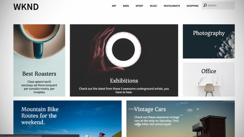

# AEM Sites视频和教程 {#overview}

{{edge-delivery-services}}

Adobe Experience Manager (AEM) Sites是一个领先的体验管理平台。 本用户指南包含有关AEM Sites的众多特性和功能的视频和教程。

## 新增功能

* **[将启动项与AEM Sites结合使用（视频）](./page-authoring/launches.md)**
  *了解AEM Sites的启动项以及如何使用它们为未来发布准备网站内容。*

* **[使用AEM组件自定义Adobe客户端数据层（教程）](./integrations/adobe-client-data-layer/data-layer-customize.md)**
  *了解如何使用自定义AEM组件中的内容更新Adobe客户端数据层。*

* **[AEM Headless GraphQL快速入门（教程）](https://experienceleague.adobe.com/docs/experience-manager-learn/getting-started-with-aem-headless/graphql/overview.html)**
  *如何使用AEM GraphQL API公开要由本机移动设备应用程序使用的AEM中的内容。*

* **[使用内容片段（视频系列）](./content-fragments/content-fragments-feature-video-use.md)**
  *内容片段是与渠道无关且可以重复使用的内容片段。*

* **[使用SPA编辑器（视频）](./spa-editor/spa-editor-framework-feature-video-use.md)**
  *了解针对单页应用程序(SPA)的AEM编辑功能。*

## 员工精选

<table>
<tr>
  <td>
    
    

      <a href="https://experienceleague.adobe.com/docs/experience-manager-learn/getting-started-wknd-tutorial-develop/overview.html?lang=zh-Hans">
    <strong>AEM Sites快速入门</strong>
    </a>
    

    

    <em>面向希望实施AEM Sites的开发人员的快速入门指南。</em>
    

  </td>
  <td>
    
    

    <a href="https://experienceleague.adobe.com/docs/experience-manager-learn/getting-started-with-aem-headless/overview.html?lang=zh-Hans">
    <strong>AEM Headless 快速入门</strong>
    </a>
    

    

    <em>面向希望使用AEM作为Headless CMS的开发人员的快速入门指南。</em>
    

  </td>
  <td>
    
     

      <a href="https://experienceleague.adobe.com/docs/experience-manager-learn/getting-started-with-aem-headless/spa-editor/react/overview.html">
        <strong>AEM SPA编辑器快速入门</strong>
      </a>
    

    

    <em>面向开发人员的快速入门指南，用于将单页应用程序(SPA)与AEM集成。</em>
    

  </td>
</tr>
</table>

## 其他资源

* [AEM Sites创作文档](https://experienceleague.adobe.com/docs/experience-manager-65/authoring/home.html)
* [AEM Sites开发文档](https://experienceleague.adobe.com/docs/experience-manager-65/developing/home.html)
* [AEM Sites管理文档](https://experienceleague.adobe.com/docs/experience-manager-65/administering/home.html)
* [AEM Sites部署文档](https://experienceleague.adobe.com/docs/experience-manager-65/deploying/home.html)
* [AEMas a Cloud Service教程](/help/cloud-service/overview.md)
* [AEM Assets教程](/help/assets/overview.md)
* [AEM Forms教程](/help/forms/overview.md)
* [AEM Foundation教程](/help/foundation/overview.md)
