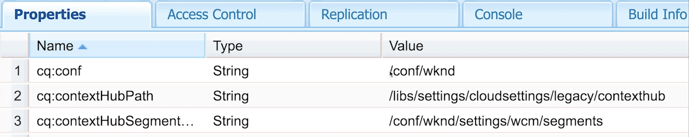

# 设置适用于Personalization的ContextHub {#set-up-contexthub}

ContextHub是一个用于存储、操作和呈现上下文数据的框架。 通过ContextHub Javascript API，您可以访问存储，以根据需要创建、更新和删除数据。 因此，ContextHub表示页面上的数据层。 本页介绍如何将Context Hub添加到AEM站点页面。

>[!VIDEO](https://video.tv.adobe.com/v/38094?quality=12&learn=on&captions=chi_hans)

>[!NOTE]
>
>我们对此视频使用WKND引用站点，它不是AEM版本的一部分。 您可以在此处下载[最新版本](https://github.com/adobe/aem-guides-wknd/releases)。

将ContextHub添加到您的页面以启用ContextHub功能并链接到ContextHub JavaScript库。 ContextHub JavaScript API提供了对ContextHub管理的上下文数据的访问权限。

## 将ContextHub添加到页面组件 {#adding-contexthub-to-a-page-component}

要启用ContextHub功能并链接到ContextHub JavaScript库，请在网页的`<head>`部分中包含`contexthub`组件。 页面组件的HTL代码类似于以下示例：

```java
<!--/* Include Context Hub */-->
<sly data-sly-resource="${'contexthub' @ resourceType='granite/contexthub/components/contexthub'}"/>
```

## 站点配置和ContextHub区段 {#site-configuration-and-contexthub-segments}

ContextHub包括管理区段并确定当前上下文解析哪些区段的分段引擎。 定义了多个区段。 您可以使用Javascript API [确定已解析的区段](https://helpx.adobe.com/cn/experience-manager/6-5/sites/developing/using/ch-adding.html#DeterminingResolvedContextHubSegments)。 在[[!UICONTROL 配置浏览器]](https://experienceleague.adobe.com/docs/experience-manager-cloud-service/implementing/developing/configurations.html?lang=zh-Hans)下启用网站的ContextHub区段。

## 创建区段 {#create-segments}

创建用作Teaser规则的AEM区段。 即，它们定义Teaser中的内容何时显示在网页上。 然后，可以根据访客的需要和兴趣专门定位内容，具体取决于他们匹配的区段。

## 为网站分配云配置、区段路径和ContextHub路径 {#assigning-cloud-configuration-segment-path-and-contexthub-path-to-your-site}

将云配置路径、分段路径和ContextHub路径分配给站点根节点，以便您可以为受众创建个性化体验。 使用ContextHub，您可以处理上下文数据并测试已解析的区段。



您可以阅读以下有关ContextHub和分段的更多信息：

* [ContextHub](https://helpx.adobe.com/cn/experience-manager/6-5/sites/developing/using/contexthub.html)
* [将上下文中心添加到页面并访问存储](https://helpx.adobe.com/cn/experience-manager/6-5/sites/developing/using/ch-adding.html)
* [了解分段](https://helpx.adobe.com/cn/experience-manager/6-5/sites/classic-ui-authoring/using/classic-personalization-campaigns-segmentation.html)
* [使用 ContextHub 配置分段](https://helpx.adobe.com/cn/experience-manager/6-5/sites/administering/using/segmentation.html)
