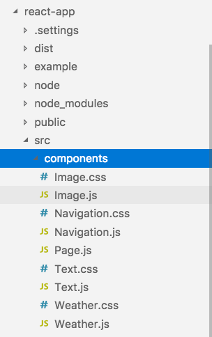
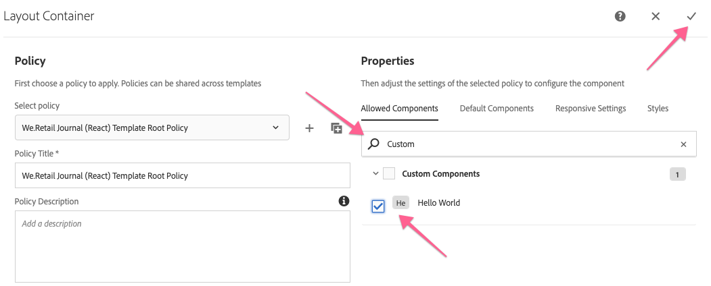

# 使用AEM SPA编辑器进行开发 — Hello World教程 {#developing-with-the-aem-spa-editor-hello-world-tutorial}

>[!WARNING]
>
> 本教程是 **已弃用**. 建议遵循以下任一操作： [AEM SPA Editor和Angular快速入门](https://experienceleague.adobe.com/docs/experience-manager-learn/getting-started-with-aem-headless/spa-editor/angular/overview.html) 或 [AEM SPA Editor和React快速入门](https://experienceleague.adobe.com/docs/experience-manager-learn/getting-started-with-aem-headless/spa-editor/react/overview.html)

AEM SPA Editor支持对单页应用程序或SPA进行上下文内编辑。 本教程将介绍如何与SPA Editor JS SDK一起使用AEM SPA开发。 本教程将通过添加自定义Hello World组件来扩展We.Retail Journal应用程序。 用户可以使用React或Angular框架完成教程。

>[!NOTE]
>
> 单页应用程序(SPA)编辑器功能需要AEM 6.4 Service Pack 2或更高版本。
>
> 对于需要基于SPA框架的客户端渲染(例如，React或Angular)的项目，推荐使用SPA编辑器解决方案。

## 先决条件读取 {#prereq}

本教程旨在重点介绍将SPA组件映射到AEM组件以启用上下文内编辑所需的步骤。 启动本教程的用户应该熟悉Adobe Experience Manager、AEM以及使用Angular框架的React进行开发的基本概念。 本教程涵盖后端和前端开发任务。

建议在开始本教程之前先审核以下资源：

* [SPA编辑器功能视频](spa-editor-framework-feature-video-use.md)  — 有关SPA Editor和We.Retail Journal应用程序的视频概述。
* [React.js教程](https://reactjs.org/tutorial/tutorial.html)  — 介绍使用React框架进行开发。
* [Angular教程](https://angular.io/tutorial)  — 介绍使用Angular进行开发

## 本地开发环境 {#local-dev}

本教程旨在：

[Adobe Experience Manager 6.5](https://helpx.adobe.com/cn/experience-manager/6-5/release-notes.html) 或 [Adobe Experience Manager 6.4](https://helpx.adobe.com/cn/experience-manager/6-4/sites/deploying/using/technical-requirements.html) + [Service Pack 5](https://helpx.adobe.com/cn/experience-manager/6-4/release-notes/sp-release-notes.html)

在本教程中，应安装以下技术和工具：

1. [Java 11](https://downloads.experiencecloud.adobe.com/content/software-distribution/en/general.html)
2. [Apache Maven - 3.3.1+](https://maven.apache.org/)
3. [Node.js - 8.11.1+](https://nodejs.org/en/) 和npm 5.6.0+（npm随node.js一起安装）

通过打开新终端并运行以下命令，再次检查上述工具的安装：

```shell
$ java -version
java version "11 +"

$ mvn -version
Apache Maven 3.3.9

$ node --version
v8.11.1

$ npm --version
6.1.0
```

## 概述 {#overview}

基本概念是将SPA组件映射到AEM组件。 AEM组件（运行服务器端）以JSON格式导出内容。 SPA会使用JSON内容，并在浏览器中运行客户端。 将创建SPA组件与AEM组件之间的1:1映射。


常用框架 [React JS](https://reactjs.org/) 和 [Angular](https://angular.io/) 开箱即用支持。 用户可以在Angular或React中完成本教程，无论这两个框架是他们最熟悉的。

## 项目设置 {#project-setup}

SPA开发只涉及AEM开发，而涉及到其他方面。 其目标是允许SPA开发独立进行，并且（大多）与AEM无关。

* SPA项目在前端开发过程中可以独立于AEM项目运行。
* 前端构建工具和技术，如Webpack、NPM、 [!DNL Grunt] 和 [!DNL Gulp]继续使用。
* 要为AEM构建，将编译SPA项目并自动将其包含在AEM项目中。
* 用于将SPA部署到AEM的标准AEM包。


*SPA开发只涉及AEM开发，而涉及到其他方面 — 允许SPA开发独立进行，并且（大多）与AEM无关。*

本教程的目标是使用新组件扩展We.Retail Journal应用程序。 首先，下载We.Retail Journal应用程序的源代码，并将其部署到本地AEM。

1. **下载** 最新 [GitHub中的We.Retail日志代码](https://github.com/adobe/aem-sample-we-retail-journal).

   或从命令行中克隆存储库：

   ```shell
   $ git clone git@github.com:adobe/aem-sample-we-retail-journal.git
   ```

   >[!NOTE]
   >
   >本教程将针对 **主控** 分支 **1.2.1 — 快照** 项目版本。

1. 以下结构应该可见：

   

   项目包含以下Maven模块：

   * `all`:将整个项目嵌入并安装到单个包中。
   * `bundles`:包含两个OSGi包：包含的commons和core [!DNL Sling Models] 和其他Java代码。
   * `ui.apps`:包含项目的/apps部分，即JS和CSS客户端库、组件、特定于运行模式的配置。
   * `ui.content`:包含结构内容和配置(`/content`, `/conf`)
   * `react-app`:We.Retail Journal React应用程序。 这既是Maven模块，也是Webpack项目。
   * `angular-app`:We.Retail JournalAngular应用程序。 这两个都是 [!DNL Maven] 模块和WebPack项目。

1. 打开新的“终端”窗口并运行以下命令以构建整个应用程序并将其部署到运行的本地AEM实例 [http://localhost:4502](http://localhost:4502).

   ```shell
   $ cd <src>/aem-sample-we-retail-journal
   $ mvn -PautoInstallSinglePackage clean install
   ```

   >[!NOTE]
   >
   > 在此项目中，用于构建和打包整个项目的Maven配置文件是 `autoInstallSinglePackage`

1. 导航至：

   * [http://localhost:4502/editor.html/content/we-retail-journal/react/en/home.html](http://localhost:4502/editor.html/content/we-retail-journal/react/en/home.html)
   * [http://localhost:4502/editor.html/content/we-retail-journal/angular/en/home.html](http://localhost:4502/editor.html/content/we-retail-journal/angular/en/home.html)

   We.Retail Journal应用程序应显示在AEM Sites编辑器中。

1. 在 [!UICONTROL 编辑] 模式下，选择要编辑并更新内容的组件。

   

1. 选择 [!UICONTROL 页面属性] 图标以打开 [!UICONTROL 页面属性]. 选择 [!UICONTROL 编辑模板] 以打开页面的模板。

   

1. 在最新版本的SPA编辑器中， [可编辑的模板](https://helpx.adobe.com/cn/experience-manager/6-5/sites/developing/using/page-templates-editable.html) 可以与传统Sites实施相同的方式使用。 稍后将使用我们的自定义组件重新查看此内容。

   >[!NOTE]
   >
   > 仅AEM 6.5和AEM 6.4 + **Service Pack 5** 支持可编辑的模板。

## 开发概述 {#development-overview}


SPA开发迭代次数与AEM无关。 当SPA准备好部署到AEM中时，将执行以下高级步骤（如上图所示）。

1. 将调用AEM项目内部版本，这反过来会触发SPA项目的内部版本。 We.Retail Journal使用 [**frontend-maven-plugin**](https://github.com/eirslett/frontend-maven-plugin).
1. SPA项目的 [**aem-clientlib-generator**](https://www.npmjs.com/package/aem-clientlib-generator) 将编译的SPA作为AEM客户端库嵌入到AEM项目中。
1. AEM项目会生成一个AEM包，包括已编译的SPA，以及任何其他支持AEM代码。

## 创建AEM组件 {#aem-component}

**角色：AEM开发人员**

将首先创建AEM组件。 AEM组件负责呈现React组件读取的JSON属性。 AEM组件还负责为组件的任何可编辑属性提供一个对话框。

使用 [!DNL Eclipse]或其他 [!DNL IDE]，导入We.Retail Journal Maven项目。

1. 更新反应堆 **pom.xml** 删除 [!DNL Apache Rat] 插件。 此插件会检查每个文件，以确保存在许可证标头。 出于我们的目的，我们无需关注此功能。

   在 **aem-sample-we-retail-journal/pom.xml** 删除 **apache-rate-plugin**:

   ```xml
   <!-- Remove apache-rat-plugin -->
   <plugin>
           <groupId>org.apache.rat</groupId>
           <artifactId>apache-rat-plugin</artifactId>
           <configuration>
               <excludes combine.children="append">
                   <exclude>*</exclude>
                       ...
               </excludes>
           </configuration>
           <executions>
                   <execution>
                       <phase>verify</phase>
                       <goals>
                           <goal>check</goal>
                       </goals>
               </execution>
           </executions>
       </plugin>
   ```

1. 在 **we-retail-journal-content** (`<src>/aem-sample-we-retail-journal/ui.apps`)模块在下面创建新节点 `ui.apps/jcr_root/apps/we-retail-journal/components` 已命名 **螺旋世界** 类型 **cq：组件**.
1. 将以下属性添加到 **螺旋世界** 组件，以XML表示(`/helloworld/.content.xml`)如下：

   ```xml
   <?xml version="1.0" encoding="UTF-8"?>
   <jcr:root xmlns:cq="http://www.day.com/jcr/cq/1.0" xmlns:jcr="http://www.jcp.org/jcr/1.0"
       jcr:description="Hello World Component for We.Retail Journal"
       jcr:primaryType="cq:Component"
       jcr:title="Hello World"
       componentGroup="We.Retail Journal" />
   ```

   

   >[!NOTE]
   >
   > 为了说明可编辑的模板功能，我们有意将 `componentGroup="Custom Components"`. 在真实项目中，最好将组件组的数量减到最少，这样一个更好的组就是“[!DNL We.Retail Journal]”来匹配其他内容组件。
   >
   > 仅AEM 6.5和AEM 6.4 + **Service Pack 5** 支持可编辑的模板。

1. 接下来将创建一个对话框，以允许为 **《你好世界》** 组件。 下 `/apps/we-retail-journal/components/helloworld` 添加节点名称 **cq:dialog** of **nt：非结构化**.
1. 的 **cq:dialog** 将显示一个文本字段，该字段将文本保留为名为的属性 **[!DNL message]**. 在新创建的 **cq:dialog** 添加以下节点和属性，如下面的XML所示(`helloworld/_cq_dialog/.content.xml`):

   ```xml
   <?xml version="1.0" encoding="UTF-8"?>
   <jcr:root xmlns:sling="http://sling.apache.org/jcr/sling/1.0" xmlns:cq="http://www.day.com/jcr/cq/1.0" xmlns:jcr="http://www.jcp.org/jcr/1.0" xmlns:nt="http://www.jcp.org/jcr/nt/1.0"
       jcr:primaryType="nt:unstructured"
       jcr:title="We.Retail Journal - Hello World"
       sling:resourceType="cq/gui/components/authoring/dialog">
       <content
           jcr:primaryType="nt:unstructured"
           sling:resourceType="granite/ui/components/coral/foundation/container">
           <items jcr:primaryType="nt:unstructured">
               <tabs
                   jcr:primaryType="nt:unstructured"
                   sling:resourceType="granite/ui/components/coral/foundation/tabs"
                   maximized="{Boolean}true">
                   <items jcr:primaryType="nt:unstructured">
                       <properties
                           jcr:primaryType="nt:unstructured"
                           jcr:title="Properties"
                           sling:resourceType="granite/ui/components/coral/foundation/container"
                           margin="{Boolean}true">
                           <items jcr:primaryType="nt:unstructured">
                               <columns
                                   jcr:primaryType="nt:unstructured"
                                   sling:resourceType="granite/ui/components/coral/foundation/fixedcolumns"
                                   margin="{Boolean}true">
                                   <items jcr:primaryType="nt:unstructured">
                                       <column
                                           jcr:primaryType="nt:unstructured"
                                           sling:resourceType="granite/ui/components/coral/foundation/container">
                                           <items jcr:primaryType="nt:unstructured">
                                               <message
                                                   jcr:primaryType="nt:unstructured"
                                                   sling:resourceType="granite/ui/components/coral/foundation/form/textfield"
                                                   fieldLabel="Message"
                                                   name="./message"
                                                   required="{Boolean}true"/>
                                           </items>
                                       </column>
                                   </items>
                               </columns>
                           </items>
                       </properties>
                   </items>
               </tabs>
           </items>
       </content>
   </jcr:root>
   ```

   

   上述XML节点定义将创建一个对话框，其中包含一个文本字段，用户可以输入“消息”。 记下属性 `name="./message"` 在 `<message />` 节点。 此名称是将存储在AEM JCR中的属性的名称。

1. 接下来将创建空策略对话框(`cq:design_dialog`)。 需要使用策略对话框才能在模板编辑器中查看组件。 对于此简单用例，它将是一个空对话框。

   下 `/apps/we-retail-journal/components/helloworld` 添加节点名称 `cq:design_dialog` of `nt:unstructured`.

   配置以下XML表示(`helloworld/_cq_design_dialog/.content.xml`)

   ```xml
   <?xml version="1.0" encoding="UTF-8"?>
   <jcr:root xmlns:sling="http://sling.apache.org/jcr/sling/1.0" xmlns:cq="http://www.day.com/jcr/cq/1.0" xmlns:jcr="http://www.jcp.org/jcr/1.0" xmlns:nt="http://www.jcp.org/jcr/nt/1.0"
   jcr:primaryType="nt:unstructured" />
   ```

1. 从命令行将代码库部署到AEM:

   ```shell
   $ cd <src>/aem-sample-we-retail-journal/content
   $ mvn -PautoInstallPackage clean install
   ```

   在 [CRXDE Lite](http://localhost:4502/crx/de/index.jsp#/apps/we-retail-journal/global/components/helloworld) 通过检查下的文件夹验证组件是否已部署 `/apps/we-retail-journal/components:`

   

## 创建Sling模型 {#create-sling-model}

**角色：AEM开发人员**

下一个 [!DNL Sling Model] 创建以返回 [!DNL Hello World] 组件。 在传统的WCM用例中， [!DNL Sling Model] 实施任何业务逻辑，服务器端渲染脚本(HTL)将对 [!DNL Sling Model]. 这样可使渲染脚本变得相对简单。

[!DNL Sling Models] 在SPA用例中，还会使用来实施服务器端业务逻辑。 区别在于 [!DNL SPA] 用例， [!DNL Sling Models] 会将其方法公开为序列化JSON。

>[!NOTE]
>
>作为最佳实践，开发人员应希望使用 [AEM核心组件](https://experienceleague.adobe.com/docs/experience-manager-core-components/using/introduction.html?lang=zh-Hans) （如果可能）。 核心组件提供的其他功能包括 [!DNL Sling Models] 具有“SPA就绪”的JSON输出，使开发人员能够将更多精力放在前端演示上。

1. 在您选择的编辑器中，打开 **we-retail-journal-commons** 项目( `<src>/aem-sample-we-retail-journal/bundles/commons`)。
1. 在包中 `com.adobe.cq.sample.spa.commons.impl.models`:
   * 创建一个名为 `HelloWorld`.
   * 为添加实施接口 `com.adobe.cq.export.json.ComponentExporter.`

   

   的 `ComponentExporter` 必须实现接口，以便 [!DNL Sling Model] 与AEM Content Services兼容。

   ```java
    package com.adobe.cq.sample.spa.commons.impl.models;
   
    import com.adobe.cq.export.json.ComponentExporter;
   
    public class HelloWorld implements ComponentExporter {
   
        @Override
        public String getExportedType() {
            return null;
        }
    }
   ```

1. 添加名为的静态变量 `RESOURCE_TYPE` 识别 [!DNL HelloWorld] 组件的资源类型：

   ```java
    ...
    public class HelloWorld implements ComponentExporter {
   
        static final String RESOURCE_TYPE = "we-retail-journal/components/helloworld";
   
        ...
    }
   ```

1. 为添加OSGi注释 `@Model` 和 `@Exporter`. 的 `@Model` 注释将类注册为 [!DNL Sling Model]. 的 `@Exporter` 注释将使用 [!DNL Jackson Exporter] 框架。

   ```java
   import org.apache.sling.api.SlingHttpServletRequest;
   import org.apache.sling.models.annotations.Exporter;
   import org.apache.sling.models.annotations.Model;
   import com.adobe.cq.export.json.ExporterConstants;
   ...
   
   @Model(
           adaptables = SlingHttpServletRequest.class,
           adapters = {ComponentExporter.class},
           resourceType = HelloWorld.RESOURCE_TYPE
   )
   @Exporter(
           name = ExporterConstants.SLING_MODEL_EXPORTER_NAME, 
           extensions = ExporterConstants.SLING_MODEL_EXTENSION
   )
   public class HelloWorld implements ComponentExporter {
   
   ...
   ```

1. 实现方法 `getDisplayMessage()` 返回JCR属性 `message`. 使用 [!DNL Sling Model] 注释 `@ValueMapValue` 以便轻松检索资产 `message` 存储在组件下方。 的 `@Optional` 注释很重要，因为组件首次添加到页面时，  `message`  将不会填充。

   作为业务逻辑的一部分，字符串“**Hello**“，将附加到消息的前面。

   ```java
   import org.apache.sling.models.annotations.injectorspecific.ValueMapValue;
   import org.apache.sling.models.annotations.Optional;
   
   ...
   
   public class HelloWorld implements ComponentExporter {
   
      static final String RESOURCE_TYPE = "we-retail-journal/components/helloworld";
   
      private static final String PREPEND_MSG = "Hello";
   
       @ValueMapValue @Optional
       private String message;
   
       public String getDisplayMessage() {
           if(message != null && message.length() > 0) {
               return PREPEND_MSG + " "  + message;
           }
           return null;
       }
   
   ...
   ```

   >[!NOTE]
   >
   > 方法名称 `getDisplayMessage` 很重要。 当 [!DNL Sling Model] 序列化为 [!DNL Jackson Exporter] 它将作为JSON资产公开： `displayMessage`. 的 [!DNL Jackson Exporter] 将序列化和公开所有 `getter` 不采用参数的方法（除非明确标记为忽略）。 稍后在React /Angular应用程序中，我们将读取此属性值并将其显示为应用程序的一部分。

   方法 `getExportedType` 也很重要。 组件的值 `resourceType` 将用于将JSON数据“映射”到前端组件(Angular/React)。 我们将在下一节中探讨此内容。

1. 实现方法 `getExportedType()` 返回的资源类型 `HelloWorld` 组件。

   ```java
    @Override
       public String getExportedType() {
           return RESOURCE_TYPE;
       }
   ```

   的完整代码 [**HelloWorld.java** 可在此处找到。](https://github.com/Adobe-Marketing-Cloud/aem-guides/blob/master/spa-helloworld-guide/src/bundles/commons/HelloWorld.java)

1. 使用Apache Maven将代码部署到AEM:

   ```shell
   $ cd <src>/sample-we-retail-spa-content/bundles/commons
   $ mvn -PautoInstallPackage clean install
   ```

   验证的部署和注册 [!DNL Sling Model] 导航至 [[!UICONTROL 状态] > [!UICONTROL Sling模型]](http://localhost:4502/system/console/status-slingmodels) 在OSGi控制台中。

   您应该看到 `HelloWorld` Sling模型绑定到 `we-retail-journal/components/helloworld` Sling资源类型，并将其注册为 [!DNL Sling Model Exporter Servlet]:

   ```shell
   com.adobe.cq.sample.spa.commons.impl.models.HelloWorld - we-retail-journal/components/helloworld
   com.adobe.cq.sample.spa.commons.impl.models.HelloWorld exports 'we-retail-journal/components/helloworld' with selector 'model' and extension '[Ljava.lang.String;@6480f3e5' with exporter 'jackson'
   ```

## 创建React组件 {#react-component}

**角色：前端开发人员**

接下来，将创建React组件。 打开 **react-app** 模块( `<src>/aem-sample-we-retail-journal/react-app`)。

>[!NOTE]
>
> 如果您只对 [Angular开发](#angular-component).

1. 内部 `react-app` 文件夹导航到其src文件夹。 展开组件文件夹可查看现有的React组件文件。

   

1. 在名为的components文件夹下添加新文件 `HelloWorld.js`.
1. 打开 `HelloWorld.js`. 添加import语句以导入React组件库。 添加第二个import语句以导入 `MapTo` 由Adobe提供的助手。 的 `MapTo` 帮助程序将React组件映射到AEM组件的JSON。

   ```js
   import React, {Component} from 'react';
   import {MapTo} from '@adobe/cq-react-editable-components';
   ```

1. 在import语句下面创建一个名为 `HelloWorld` 扩展了React `Component` 界面。 添加所需 `render()` 方法 `HelloWorld` 类。

   ```js
   import React, {Component} from 'react';
   import {MapTo} from '@adobe/cq-react-editable-components';
   
   class HelloWorld extends Component {
   
       render() {
   
       }
   }
   ```

1. 的 `MapTo` 帮助程序自动包含名为的对象 `cqModel` 作为React组件prop的一部分。 的 `cqModel` 包括公开的所有属性 [!DNL Sling Model].

   记住 [!DNL Sling Model] 之前创建的包含方法 `getDisplayMessage()`. `getDisplayMessage()` 被转换为名为的JSON键 `displayMessage` 时。

   实施 `render()` 输出方法 `h1` 包含值的标记 `displayMessage`. [JSX](https://reactjs.org/docs/introducing-jsx.html)，这是JavaScript的语法扩展，用于返回组件的最终标记。

   ```js
   ...
   
   class HelloWorld extends Component {
       render() {
   
           if(this.props.displayMessage) {
               return (
                   <div className="cmp-helloworld">
                       <h1 className="cmp-helloworld_message">{this.props.displayMessage}</h1>
                   </div>
               );
           }
           return null;
       }
   }
   ```

1. 实施编辑配置方法。 此方法通过 `MapTo` 帮助程序和向AEM编辑器提供在组件为空时显示占位符的信息。 在将组件添加到SPA但尚未创作时，会发生这种情况。 在 `HelloWorld` 类：

   ```js
   ...
   
   class HelloWorld extends Component {
       ...
   }
   
   const HelloWorldEditConfig = {
   
       emptyLabel: 'Hello World',
   
       isEmpty: function(props) {
           return !props || !props.displayMessage || props.displayMessage.trim().length < 1;
       }
   };
   
   ...
   ```

1. 在文件末尾，调用 `MapTo` 助手，传递 `HelloWorld` 类和 `HelloWorldEditConfig`. 这将根据AEM组件的资源类型将React组件映射到React组件： `we-retail-journal/components/helloworld`.

   ```js
   MapTo('we-retail-journal/components/helloworld')(HelloWorld, HelloWorldEditConfig);
   ```

   的已完成代码 [**HelloWorld.js** 可在此处找到。](https://github.com/Adobe-Marketing-Cloud/aem-guides/blob/master/spa-helloworld-guide/src/react-app/components/HelloWorld.js)

1. 打开文件 `ImportComponents.js`. 可在 `<src>/aem-sample-we-retail-journal/react-app/src/ImportComponents.js`.

   添加行以要求 `HelloWorld.js` 与编译的JavaScript包中的其他组件一起使用：

   ```js
   ...
     require('./components/Text');
     require('./components/Image');
     require('./components/HelloWorld');
   ...
   ```

1. 在  `components`  文件夹创建名为 `HelloWorld.css` 作为 `HelloWorld.js.` 使用以下内容填充文件，以便为 `HelloWorld` 组件：

   ```css
   /* HelloWorld.css to style HelloWorld component */
   
   .cmp-helloworld_message {
       text-align: center;
       color: #ff505e;
       text-transform: unset;
       letter-spacing: unset;
   }
   ```

1. 重新打开 `HelloWorld.js` 并更新以下import语句，以要求 `HelloWorld.css`:

   ```js
   import React, {Component} from 'react';
   import {MapTo} from '@adobe/cq-react-editable-components';
   
   require('./HelloWorld.css');
   
   ...
   ```

1. 使用Apache Maven将代码部署到AEM:

   ```shell
   $ cd <src>/sample-we-retail-spa-content
   $ mvn -PautoInstallSinglePackage clean install
   ```

1. 在 [CRXDE-Lite](http://localhost:4502/crx/de/index.jsp#/apps/we-retail-journal/react/clientlibs/we-retail-journal-react/js/app.js) open `/apps/we-retail-journal/react/clientlibs/we-retail-journal-react/js/app.js`. 在app.js中快速搜索HelloWorld，以验证React组件是否已包含在编译的应用程序中。

   >[!NOTE]
   >
   > **app.js** 是捆绑的React应用程序。 该代码不再为人类可读。 的 `npm run build` 命令已触发优化内部版本，该内部版本可输出可供现代浏览器解释的编译的JavaScript。


## 创建Angular组件 {#angular-component}

**角色：前端开发人员**

>[!NOTE]
>
> 如果您只对React开发感兴趣，请跳过此部分。

接下来，将创建Angular组件。 打开 **angular应用程序** 模块(`<src>/aem-sample-we-retail-journal/angular-app`)。

1. 内部 `angular-app` 文件夹导航到其 `src` 文件夹。 展开组件文件夹可查看现有的Angular组件文件。

   

1. 在名为的组件文件夹下添加新文件夹 `helloworld`. 在 `helloworld` 文件夹会添加新文件（已命名） `helloworld.component.css, helloworld.component.html, helloworld.component.ts`.

   ```plain
   /angular-app
       /src
           /app
               /components
   +                /helloworld
   +                    helloworld.component.css
   +                    helloworld.component.html
   +                    helloworld.component.ts
   ```

1. 打开 `helloworld.component.ts`. 添加import语句以导入Angular `Component` 和 `Input` 类。 创建新组件，并指向 `styleUrls` 和 `templateUrl` to `helloworld.component.css` 和 `helloworld.component.html`. 最后导出类 `HelloWorldComponent` 的预期输入 `displayMessage`.

   ```js
   //helloworld.component.ts
   
   import { Component, Input } from '@angular/core';
   
   @Component({
     selector: 'app-helloworld',
     host: { 'class': 'cmp-helloworld' },
     styleUrls:['./helloworld.component.css'],
     templateUrl: './helloworld.component.html',
   })
   
   export class HelloWorldComponent {
     @Input() displayMessage: string;
   }
   ```

   >[!NOTE]
   >
   > 如果你记得 [!DNL Sling Model] 之前创建的方法 **getDisplayMessage()**. 此方法的序列化JSON将为 **displayMessage**，我们现在在Angular应用程序中阅读这些内容。

1. 打开 `helloworld.component.html` 要包含 `h1` 将打印的标记 `displayMessage` 属性：

   ```html
   <h1 *ngIf="displayMessage" class="cmp-helloworld_message">
       {{displayMessage}}
   </h1>
   ```

1. 更新 `helloworld.component.css` 以包含组件的一些基本样式。

   ```css
   :host-context {
       display: block;
   };
   
   .cmp-helloworld {
       display:block;
   }
   .cmp-helloworld_message {
       text-align: center;
       color: #ff505e;
       text-transform: unset;
       letter-spacing: unset;
   }
   ```

1. 更新 `helloworld.component.spec.ts` 通过以下测试台：

   ```js
   import { async, ComponentFixture, TestBed } from '@angular/core/testing';
   
   import { HelloWorldComponent } from './helloworld.component';
   
       describe('HelloWorld', () => {
       let component: HelloWorldComponent;
       let fixture: ComponentFixture<HelloWorldComponent>;
   
       beforeEach(async(() => {
           TestBed.configureTestingModule({
           declarations: [ HelloWorldComponent ]
           })
           .compileComponents();
       }));
   
       beforeEach(() => {
           fixture = TestBed.createComponent(HelloWorldComponent);
           component = fixture.componentInstance;
           fixture.detectChanges();
       });
   
       it('should create', () => {
           expect(component).toBeTruthy();
       });
   });
   ```

1. 下次更新 `src/components/mapping.ts` 包含 `HelloWorldComponent`. 添加 `HelloWorldEditConfig` 在配置组件之前，在AEM编辑器中标记占位符。 最后，添加一行，以将AEM组件映射到Angular组件，并且 `MapTo` 帮手。

   ```js
   // src/components/mapping.ts
   
   import { HelloWorldComponent } from "./helloworld/helloworld.component";
   
   ...
   
   const HelloWorldEditConfig = {
   
       emptyLabel: 'Hello World',
   
       isEmpty: function(props) {
           return !props || !props.displayMessage || props.displayMessage.trim().length < 1;
       }
   };
   
   ...
   
   MapTo('we-retail-journal/components/helloworld')(HelloWorldComponent, HelloWorldEditConfig);
   ```

   的完整代码 [**mapping.ts** 可在此处找到。](https://github.com/Adobe-Marketing-Cloud/aem-guides/blob/master/spa-helloworld-guide/src/angular-app/mapping.ts)

1. 更新 `src/app.module.ts` 更新 **NgModule**. 添加 **`HelloWorldComponent`** as a **声明** 属于 **AppModule**. 另外，在 `HelloWorldComponent` as **entryComponent** 以便在处理JSON模型时，将其编译并动态包含在应用程序中。

   ```js
   import { HelloWorldComponent } from './components/helloworld/helloworld.component';
   
   ...
   
   @NgModule({
     imports: [BrowserModule.withServerTransition({ appId: 'we-retail-sample-angular' }),
       SpaAngularEditableComponentsModule,
     AngularWeatherWidgetModule.forRoot({
       key: "37375c33ca925949d7ba331e52da661a",
       name: WeatherApiName.OPEN_WEATHER_MAP,
       baseUrl: 'http://api.openweathermap.org/data/2.5'
     }),
       AppRoutingModule,
       BrowserTransferStateModule],
     providers: [ModelManagerService,
       { provide: APP_BASE_HREF, useValue: '/' }],
     declarations: [AppComponent,
       TextComponent,
       ImageComponent,
       WeatherComponent,
       NavigationComponent,
       MenuComponent,
       MainContentComponent,
       HelloWorldComponent],
     entryComponents: [TextComponent,
       ImageComponent,
       WeatherComponent,
       NavigationComponent,
       MainContentComponent,
       HelloWorldComponent],
     bootstrap: [AppComponent]
    })
   ```

   的已完成代码 [**app.module.ts** 可在此处找到。](https://github.com/Adobe-Marketing-Cloud/aem-guides/blob/master/spa-helloworld-guide/src/angular-app/app.module.ts)

1. 使用Maven将代码部署到AEM:

   ```shell
   $ cd <src>/sample-we-retail-spa-content
   $ mvn -PautoInstallSinglePackage clean install
   ```

1. 在 [CRXDE-Lite](http://localhost:4502/crx/de/index.jsp#/apps/we-retail-journal/angular/clientlibs/we-retail-journal-angular/js/main.js) open `/apps/we-retail-journal/angular/clientlibs/we-retail-journal-angular/js/main.js`. 执行快速搜索 **HelloWorld** in `main.js` 以验证是否包含Angular组件。

   >[!NOTE]
   >
   > **main.js** 是捆绑的Angular应用程序。 该代码不再为人类可读。 npm run build命令已触发优化内部版本，该内部版本可输出可供现代浏览器解释的编译的JavaScript。

## 更新模板 {#template-update}

1. 导航到React和/或Angular版本的可编辑模板：

   * (Angular) [http://localhost:4502/editor.html/conf/we-retail-journal/angular/settings/wcm/templates/we-retail-angular-weather-template/structure.html](http://localhost:4502/editor.html/conf/we-retail-journal/angular/settings/wcm/templates/we-retail-angular-weather-template/structure.html)
   * (React) [http://localhost:4502/editor.html/conf/we-retail-journal/react/settings/wcm/templates/we-retail-react-weather-template/structure.html](http://localhost:4502/editor.html/conf/we-retail-journal/react/settings/wcm/templates/we-retail-react-weather-template/structure.html)

1. 选择主 [!UICONTROL 布局容器] ，然后选择 [!UICONTROL 策略] 图标以打开其策略：

   

   在 **[!UICONTROL 属性]** > **[!UICONTROL 允许的组件]**，执行搜索 **[!DNL Custom Components]**. 您应会看到 **[!DNL Hello World]** 组件，将其选中。 单击右上角的复选框以保存更改。

   

1. 保存后，您应会看到 **[!DNL HelloWorld]** 组件作为 [!UICONTROL 布局容器].

   

   >[!NOTE]
   >
   > 只有AEM 6.5和AEM 6.4.5支持SPA编辑器的可编辑模板功能。 如果使用AEM 6.4，则需要通过CRXDE Lite手动配置允许的组件的策略： `/conf/we-retail-journal/react/settings/wcm/policies/wcm/foundation/components/responsivegrid/default` 或 `/conf/we-retail-journal/angular/settings/wcm/policies/wcm/foundation/components/responsivegrid/default`

   CRXDE Lite显示 [!UICONTROL 允许的组件] 在 [!UICONTROL 布局容器]:

   

## 融于一起 {#putting-together}

1. 导航到Angular或React页面：

   * [http://localhost:4502/editor.html/content/we-retail-journal/react/en/home.html](http://localhost:4502/editor.html/content/we-retail-journal/react/en/home.html)
   * [http://localhost:4502/editor.html/content/we-retail-journal/angular/en/home.html](http://localhost:4502/editor.html/content/we-retail-journal/angular/en/home.html)

1. 查找 **[!DNL Hello World]** 组件，并拖放 **[!DNL Hello World]** 组件。

   

   应会显示占位符。

   

1. 选择组件并在对话框中添加消息，即“World”或“Your Name”。 保存更改。

   

   请注意，字符串“Hello”始终附加到消息的前面。 这是 `HelloWorld.java` [!DNL Sling Model].

## 后续步骤 {#next-steps}

[HelloWorld组件的完成解决方案](assets/spa-editor-helloworld-tutorial-use/aem-sample-we-retail-journal-HelloWorldSolution.zip)

* 的完整源代码 [[!DNL We.Retail Journal] 在GitHub上](https://github.com/adobe/aem-sample-we-retail-journal)
* 查看有关使用开发React的更详细教程 [[!DNL Getting Started with the AEM SPA Editor - WKND Tutorial]](https://helpx.adobe.com/cn/experience-manager/kt/sites/using/getting-started-spa-wknd-tutorial-develop.html)

## 疑难解答 {#troubleshooting}

### 无法在Eclipse中构建项目 {#unable-to-build-project-in-eclipse}

**错误：** 导入 [!DNL We.Retail Journal] 项目到Eclipse中，以执行无法识别的目标：

`Execution npm install, Execution npm run build, Execution default-analyze-classes*`


**分辨率**:单击“完成”以稍后解决这些问题。 这不应妨碍教程的完成。

**错误**:React模块， `react-app`，无法在Maven生成期间成功生成。

**解决办法：** 尝试删除 `node_modules` 文件夹下 **react-app**. 重新运行Apache Maven命令 `mvn  clean install -PautoInstallSinglePackage` 从项目的根目录访问。

### AEM中未满足的依赖项 {#unsatisfied-dependencies-in-aem}


如果不满足AEM依赖项，则在 **[!UICONTROL AEM包管理器]** 或 **[!UICONTROL AEM Web Console]** (Felix Console)，这表示SPA编辑器功能不可用。

### 组件未显示

**错误**:即使在成功部署并验证React/Angular应用程序的编译版本是否已更新之后， `helloworld` 组件将组件拖动到页面时，未显示组件。 我可以在AEM UI中查看组件。

**分辨率**:清除浏览器的历史记录/缓存和/或打开新浏览器或使用隐身模式。 如果这不起作用，则使本地AEM实例上的客户端库缓存失效。 AEM会尝试缓存大型clientlibraries以提高效率。 有时，需要手动使缓存失效来修复缓存过期代码的问题。

导航到： [http://localhost:4502/libs/granite/ui/content/dumplibs.rebuild.html](http://localhost:4502/libs/granite/ui/content/dumplibs.rebuild.html) 并单击无效缓存。 返回到您的React/Angular页面并刷新该页面。


