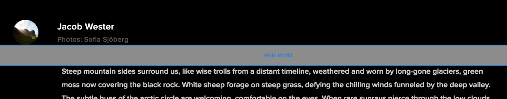
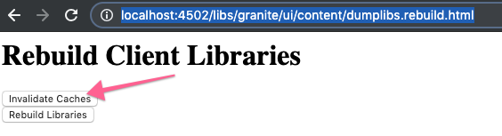

# 使用AEM SPA编辑器进行开发 — Hello World教程 {#developing-with-the-aem-spa-editor-hello-world-tutorial}

>[!WARNING]
>
> 本教程为&#x200B;**已弃用**。 建议遵循以下任一操作：[AEM SPA Editor和Angular入门](https://experienceleague.adobe.com/docs/experience-manager-learn/getting-started-with-aem-headless/spa-editor/angular/overview.html)或[AEM SPA Editor和React](https://experienceleague.adobe.com/docs/experience-manager-learn/getting-started-with-aem-headless/spa-editor/react/overview.html)快速入门

AEM SPA Editor支持对单页应用程序或SPA进行上下文内编辑。 本教程将介绍如何与SPA Editor JS SDK一起使用AEM SPA开发。 本教程将通过添加自定义Hello World组件来扩展We.Retail Journal应用程序。 用户可以使用React或Angular框架完成教程。

>[!NOTE]
>
> 单页应用程序(SPA)编辑器功能需要AEM 6.4 Service Pack 2或更高版本。
>
> 对于需要基于SPA框架的客户端渲染(例如，React或Angular)的项目，推荐使用SPA编辑器解决方案。

## 先决条件读取 {#prereq}

本教程旨在重点介绍将SPA组件映射到AEM组件以启用上下文内编辑所需的步骤。 启动本教程的用户应该熟悉Adobe Experience Manager、AEM以及使用Angular框架的React进行开发的基本概念。 本教程涵盖后端和前端开发任务。

建议在开始本教程之前先审核以下资源：

* [SPA编辑器功能视频](spa-editor-framework-feature-video-use.md)  — 有关SPA Editor和We.Retail Journal应用程序的视频概述。
* [React.js教程](https://reactjs.org/tutorial/tutorial.html)  — 介绍如何使用React框架进行开发。
* [Angular教程](https://angular.io/tutorial)  — 有关使用Angular进行开发的简介

## 本地开发环境 {#local-dev}

本教程旨在：

[Adobe Experience Manager 6.5](https://helpx.adobe.com/cn/experience-manager/6-5/release-notes.html) 或 [Adobe Experience Manager 6.4](https://helpx.adobe.com/experience-manager/6-4/sites/deploying/using/technical-requirements.html) +  [Service Pack 5](https://helpx.adobe.com/cn/experience-manager/6-4/release-notes/sp-release-notes.html)

在本教程中，应安装以下技术和工具：

1. [Java 11](https://downloads.experiencecloud.adobe.com/content/software-distribution/en/general.html)
2. [Apache Maven - 3.3.1+](https://maven.apache.org/)
3. [Node.js - 8.11.1+](https://nodejs.org/en/) 和npm 5.6.0+（npm随node.js一起安装）

通过打开新终端并运行以下命令，再次检查上述工具的安装：

```shell
$ java -version
java version "11 +"

$ mvn -version
Apache Maven 3.3.9

$ node --version
v8.11.1

$ npm --version
6.1.0
```

## 概述 {#overview}

基本概念是将SPA组件映射到AEM组件。 AEM组件（运行服务器端）以JSON格式导出内容。 SPA会使用JSON内容，并在浏览器中运行客户端。 将创建SPA组件与AEM组件之间的1:1映射。


开箱即用地支持常用框架[React JS](https://reactjs.org/)和[Angular](https://angular.io/)。 用户可以在Angular或React中完成本教程，无论这两个框架是他们最熟悉的。

## 项目设置 {#project-setup}

SPA开发只涉及AEM开发，而涉及到其他方面。 其目标是允许SPA开发独立进行，并且（大多）与AEM无关。

* SPA项目在前端开发过程中可以独立于AEM项目运行。
* 前端构建工具和技术（如Webpack、NPM、[!DNL Grunt]和[!DNL Gulp]）将继续使用。
* 要为AEM构建，将编译SPA项目并自动将其包含在AEM项目中。
* 用于将SPA部署到AEM的标准AEM包。


*SPA开发只涉及AEM开发，而涉及到其他方面 — 允许SPA开发独立进行，并且（大多）与AEM无关。*

本教程的目标是使用新组件扩展We.Retail Journal应用程序。 首先，下载We.Retail Journal应用程序的源代码，并将其部署到本地AEM。

1. **** 从GitHub下 [载最新的We.Retail日志代码](https://github.com/adobe/aem-sample-we-retail-journal)。

   或从命令行中克隆存储库：

   ```shell
   $ git clone git@github.com:adobe/aem-sample-we-retail-journal.git
   ```

   >[!NOTE]
   >
   >本教程将针对包含项目&#x200B;**1.2.1-SNAPSHOT**&#x200B;版本的&#x200B;**主控**&#x200B;分支进行操作。

1. 以下结构应该可见：

   

   项目包含以下Maven模块：

   * `all`:将整个项目嵌入并安装到单个包中。
   * `bundles`:包含两个OSGi包：包含和其他Java代码 [!DNL Sling Models] 的公用和核心。
   * `ui.apps`:包含项目的/apps部分，即JS和CSS客户端库、组件、特定于运行模式的配置。
   * `ui.content`:包含结构内容和配置(`/content`、  `/conf`)
   * `react-app`:We.Retail Journal React应用程序。这既是Maven模块，也是Webpack项目。
   * `angular-app`:We.Retail JournalAngular应用程序。这既是[!DNL Maven]模块，也是Webpack项目。

1. 打开新的终端窗口并运行以下命令来构建整个应用程序并将其部署到运行在[http://localhost:4502](http://localhost:4502)上的本地AEM实例。

   ```shell
   $ cd <src>/aem-sample-we-retail-journal
   $ mvn -PautoInstallSinglePackage clean install
   ```

   >[!NOTE]
   >
   > 在此项目中，用于构建和打包整个项目的Maven配置文件是`autoInstallSinglePackage`

   >[!CAUTION]
   >
   > 如果在生成过程中收到错误，请[确保Maven settings.xml文件包含Adobe的Maven对象存储库](https://helpx.adobe.com/experience-manager/kb/SetUpTheAdobeMavenRepository.html)。

1. 导航至:

   * [http://localhost:4502/editor.html/content/we-retail-journal/react/en/home.html](http://localhost:4502/editor.html/content/we-retail-journal/react/en/home.html)
   * [http://localhost:4502/editor.html/content/we-retail-journal/angular/en/home.html](http://localhost:4502/editor.html/content/we-retail-journal/angular/en/home.html)

   We.Retail Journal应用程序应显示在AEM Sites编辑器中。

1. 在[!UICONTROL 编辑]模式下，选择要编辑的组件并对内容进行更新。

   

1. 选择[!UICONTROL 页面属性]图标以打开[!UICONTROL 页面属性]。 选择[!UICONTROL 编辑模板]以打开页面的模板。

   

1. 在最新版本的SPA Editor中，可编辑的模板](https://helpx.adobe.com/cn/experience-manager/6-5/sites/developing/using/page-templates-editable.html)的使用方式与传统Sites实施相同。 [稍后将使用我们的自定义组件重新查看此内容。

   >[!NOTE]
   >
   > 只有AEM 6.5和AEM 6.4 + **Service Pack 5**&#x200B;支持可编辑的模板。

## 开发概述 {#development-overview}


SPA开发迭代次数与AEM无关。 当SPA准备好部署到AEM中时，将执行以下高级步骤（如上图所示）。

1. 将调用AEM项目内部版本，这反过来会触发SPA项目的内部版本。 We.Retail Journal使用&#x200B;[**frontend-maven-plugin**](https://github.com/eirslett/frontend-maven-plugin)。
1. SPA项目的&#x200B;[**aem-clientlib-generator**](https://www.npmjs.com/package/aem-clientlib-generator)将编译的SPA作为AEM客户端库嵌入到AEM项目中。
1. AEM项目会生成一个AEM包，包括已编译的SPA，以及任何其他支持AEM代码。

## 创建AEM组件 {#aem-component}

**角色：AEM开发人员**

将首先创建AEM组件。 AEM组件负责呈现React组件读取的JSON属性。 AEM组件还负责为组件的任何可编辑属性提供一个对话框。

使用[!DNL Eclipse]或其他[!DNL IDE]导入We.Retail Journal Maven项目。

1. 更新反应器&#x200B;**pom.xml**&#x200B;以删除[!DNL Apache Rat]插件。 此插件会检查每个文件，以确保存在许可证标头。 出于我们的目的，我们无需关注此功能。

   在&#x200B;**aem-sample-we-retail-journal/pom.xml**&#x200B;中，删除&#x200B;**apache-rate-plugin**:

   ```xml
   <!-- Remove apache-rat-plugin -->
   <plugin>
           <groupId>org.apache.rat</groupId>
           <artifactId>apache-rat-plugin</artifactId>
           <configuration>
               <excludes combine.children="append">
                   <exclude>*</exclude>
                       ...
               </excludes>
           </configuration>
           <executions>
                   <execution>
                       <phase>verify</phase>
                       <goals>
                           <goal>check</goal>
                       </goals>
               </execution>
           </executions>
       </plugin>
   ```

1. 在&#x200B;**we-retail-journal-content**(`<src>/aem-sample-we-retail-journal/ui.apps`)模块中，在`ui.apps/jcr_root/apps/we-retail-journal/components`下方创建一个名为&#x200B;**helloworld**&#x200B;的类型为&#x200B;**cq:Component**&#x200B;的新节点。
1. 将以下属性添加到&#x200B;**helloworld**&#x200B;组件中，该组件以下XML(`/helloworld/.content.xml`)表示：

   ```xml
   <?xml version="1.0" encoding="UTF-8"?>
   <jcr:root xmlns:cq="http://www.day.com/jcr/cq/1.0" xmlns:jcr="http://www.jcp.org/jcr/1.0"
       jcr:description="Hello World Component for We.Retail Journal"
       jcr:primaryType="cq:Component"
       jcr:title="Hello World"
       componentGroup="We.Retail Journal" />
   ```

   

   >[!NOTE]
   >
   > 为了说明可编辑的模板功能，我们有意设置了`componentGroup="Custom Components"`。 在真实项目中，最好尽量减少组件组的数量，这样一个更好的组就是“[!DNL We.Retail Journal]”，以匹配其他内容组件。
   >
   > 只有AEM 6.5和AEM 6.4 + **Service Pack 5**&#x200B;支持可编辑的模板。

1. 接下来将创建一个对话框，以允许为&#x200B;**Hello World**&#x200B;组件配置自定义消息。 在`/apps/we-retail-journal/components/helloworld`下添加节点名称&#x200B;**cq:dialog**，共&#x200B;**nt:unstructured**。
1. **cq:dialog**&#x200B;将显示一个文本字段，该字段将文本保留到名为&#x200B;**[!DNL message]**&#x200B;的属性。 在新创建的&#x200B;**cq:dialog**&#x200B;下，添加以下节点和属性，如下面的XML(`helloworld/_cq_dialog/.content.xml`)所示：

   ```xml
   <?xml version="1.0" encoding="UTF-8"?>
   <jcr:root xmlns:sling="http://sling.apache.org/jcr/sling/1.0" xmlns:cq="http://www.day.com/jcr/cq/1.0" xmlns:jcr="http://www.jcp.org/jcr/1.0" xmlns:nt="http://www.jcp.org/jcr/nt/1.0"
       jcr:primaryType="nt:unstructured"
       jcr:title="We.Retail Journal - Hello World"
       sling:resourceType="cq/gui/components/authoring/dialog">
       <content
           jcr:primaryType="nt:unstructured"
           sling:resourceType="granite/ui/components/coral/foundation/container">
           <items jcr:primaryType="nt:unstructured">
               <tabs
                   jcr:primaryType="nt:unstructured"
                   sling:resourceType="granite/ui/components/coral/foundation/tabs"
                   maximized="{Boolean}true">
                   <items jcr:primaryType="nt:unstructured">
                       <properties
                           jcr:primaryType="nt:unstructured"
                           jcr:title="Properties"
                           sling:resourceType="granite/ui/components/coral/foundation/container"
                           margin="{Boolean}true">
                           <items jcr:primaryType="nt:unstructured">
                               <columns
                                   jcr:primaryType="nt:unstructured"
                                   sling:resourceType="granite/ui/components/coral/foundation/fixedcolumns"
                                   margin="{Boolean}true">
                                   <items jcr:primaryType="nt:unstructured">
                                       <column
                                           jcr:primaryType="nt:unstructured"
                                           sling:resourceType="granite/ui/components/coral/foundation/container">
                                           <items jcr:primaryType="nt:unstructured">
                                               <message
                                                   jcr:primaryType="nt:unstructured"
                                                   sling:resourceType="granite/ui/components/coral/foundation/form/textfield"
                                                   fieldLabel="Message"
                                                   name="./message"
                                                   required="{Boolean}true"/>
                                           </items>
                                       </column>
                                   </items>
                               </columns>
                           </items>
                       </properties>
                   </items>
               </tabs>
           </items>
       </content>
   </jcr:root>
   ```

   

   上述XML节点定义将创建一个对话框，其中包含一个文本字段，用户可以输入“消息”。 请注意`<message />`节点中的属性`name="./message"`。 此名称是将存储在AEM JCR中的属性的名称。

1. 接下来将创建空策略对话框(`cq:design_dialog`)。 需要使用策略对话框才能在模板编辑器中查看组件。 对于此简单用例，它将是一个空对话框。

   在`/apps/we-retail-journal/components/helloworld`下添加`nt:unstructured`的节点名称`cq:design_dialog`。

   配置以下XML形式表示(`helloworld/_cq_design_dialog/.content.xml`)

   ```xml
   <?xml version="1.0" encoding="UTF-8"?>
   <jcr:root xmlns:sling="http://sling.apache.org/jcr/sling/1.0" xmlns:cq="http://www.day.com/jcr/cq/1.0" xmlns:jcr="http://www.jcp.org/jcr/1.0" xmlns:nt="http://www.jcp.org/jcr/nt/1.0"
   jcr:primaryType="nt:unstructured" />
   ```

1. 从命令行将代码库部署到AEM:

   ```shell
   $ cd <src>/aem-sample-we-retail-journal/content
   $ mvn -PautoInstallPackage clean install
   ```

   在[CRXDE Lite](http://localhost:4502/crx/de/index.jsp#/apps/we-retail-journal/global/components/helloworld)中，通过检查`/apps/we-retail-journal/components:`下的文件夹来验证组件是否已部署

   

## 创建Sling模型 {#create-sling-model}

**角色：AEM开发人员**

接下来将创建[!DNL Sling Model]以支持[!DNL Hello World]组件。 在传统WCM用例中， [!DNL Sling Model]实施任何业务逻辑，服务器端渲染脚本(HTL)将调用[!DNL Sling Model]。 这样可使渲染脚本变得相对简单。

[!DNL Sling Models] 在SPA用例中，还会使用来实施服务器端业务逻辑。区别在于，在[!DNL SPA]用例中，[!DNL Sling Models]会将其方法公开为序列化JSON。

>[!NOTE]
>
>作为最佳实践，开发人员应尽可能使用[AEM核心组件](https://experienceleague.adobe.com/docs/experience-manager-core-components/using/introduction.html?lang=zh-Hans)。 核心组件提供的JSON输出“SPA就绪”，具有其他功能，其中[!DNL Sling Models]提供了一些JSON输出，使开发人员能够将更多精力放在前端演示上。

1. 在您选择的编辑器中，打开&#x200B;**we-retail-journal-commons**&#x200B;项目(`<src>/aem-sample-we-retail-journal/bundles/commons`)。
1. 在包`com.adobe.cq.sample.spa.commons.impl.models`中：
   * 创建一个名为`HelloWorld`的新类。
   * 为`com.adobe.cq.export.json.ComponentExporter.`添加实现接口

   

   必须实施`ComponentExporter`接口，才能使[!DNL Sling Model]与AEM Content Services兼容。

   ```java
    package com.adobe.cq.sample.spa.commons.impl.models;
   
    import com.adobe.cq.export.json.ComponentExporter;
   
    public class HelloWorld implements ComponentExporter {
   
        @Override
        public String getExportedType() {
            return null;
        }
    }
   ```

1. 添加名为`RESOURCE_TYPE`的静态变量以标识[!DNL HelloWorld]组件的资源类型：

   ```java
    ...
    public class HelloWorld implements ComponentExporter {
   
        static final String RESOURCE_TYPE = "we-retail-journal/components/helloworld";
   
        ...
    }
   ```

1. 为`@Model`和`@Exporter`添加OSGi注释。 `@Model`注释将类注册为[!DNL Sling Model]。 `@Exporter`注释将使用[!DNL Jackson Exporter]框架以序列化JSON形式显示这些方法。

   ```java
   import org.apache.sling.api.SlingHttpServletRequest;
   import org.apache.sling.models.annotations.Exporter;
   import org.apache.sling.models.annotations.Model;
   import com.adobe.cq.export.json.ExporterConstants;
   ...
   
   @Model(
           adaptables = SlingHttpServletRequest.class,
           adapters = {ComponentExporter.class},
           resourceType = HelloWorld.RESOURCE_TYPE
   )
   @Exporter(
           name = ExporterConstants.SLING_MODEL_EXPORTER_NAME, 
           extensions = ExporterConstants.SLING_MODEL_EXTENSION
   )
   public class HelloWorld implements ComponentExporter {
   
   ...
   ```

1. 实施方法`getDisplayMessage()`以返回JCR属性`message`。 使用`@ValueMapValue`的[!DNL Sling Model]注释，可轻松检索存储在组件下方的属性`message`。 `@Optional`注释很重要，因为首次将组件添加到页面时，将不会填充`message`。

   作为业务逻辑的一部分，字符串“**Hello**”将附加到消息的前面。

   ```java
   import org.apache.sling.models.annotations.injectorspecific.ValueMapValue;
   import org.apache.sling.models.annotations.Optional;
   
   ...
   
   public class HelloWorld implements ComponentExporter {
   
      static final String RESOURCE_TYPE = "we-retail-journal/components/helloworld";
   
      private static final String PREPEND_MSG = "Hello";
   
       @ValueMapValue @Optional
       private String message;
   
       public String getDisplayMessage() {
           if(message != null && message.length() > 0) {
               return PREPEND_MSG + " "  + message;
           }
           return null;
       }
   
   ...
   ```

   >[!NOTE]
   >
   > 方法名称`getDisplayMessage`很重要。 使用[!DNL Jackson Exporter]序列化[!DNL Sling Model]后，它将作为JSON属性显示：`displayMessage`。 [!DNL Jackson Exporter]将序列化并公开所有不采用参数的`getter`方法（除非明确标记为忽略）。 稍后在React /Angular应用程序中，我们将读取此属性值并将其显示为应用程序的一部分。

   方法`getExportedType`也很重要。 组件`resourceType`的值将用于将JSON数据“映射”到前端组件(Angular/React)。 我们将在下一节中探讨此内容。

1. 实施方法`getExportedType()`以返回`HelloWorld`组件的资源类型。

   ```java
    @Override
       public String getExportedType() {
           return RESOURCE_TYPE;
       }
   ```

   可在此处找到&#x200B;[**HelloWorld.java**&#x200B;的完整代码。](https://github.com/Adobe-Marketing-Cloud/aem-guides/blob/master/spa-helloworld-guide/src/bundles/commons/HelloWorld.java)

1. 使用Apache Maven将代码部署到AEM:

   ```shell
   $ cd <src>/sample-we-retail-spa-content/bundles/commons
   $ mvn -PautoInstallPackage clean install
   ```

   在OSGi控制台中，导航到[[!UICONTROL Status] > [!UICONTROL Sling模型]](http://localhost:4502/system/console/status-slingmodels)，以验证[!DNL Sling Model]的部署和注册。

   您应会看到`HelloWorld` Sling模型已绑定到`we-retail-journal/components/helloworld` Sling资源类型，并且已将其注册为[!DNL Sling Model Exporter Servlet]:

   ```shell
   com.adobe.cq.sample.spa.commons.impl.models.HelloWorld - we-retail-journal/components/helloworld
   com.adobe.cq.sample.spa.commons.impl.models.HelloWorld exports 'we-retail-journal/components/helloworld' with selector 'model' and extension '[Ljava.lang.String;@6480f3e5' with exporter 'jackson'
   ```

## 创建React组件 {#react-component}

**角色：前端开发人员**

接下来，将创建React组件。 使用您选择的编辑器打开&#x200B;**react-app**&#x200B;模块(`<src>/aem-sample-we-retail-journal/react-app`)。

>[!NOTE]
>
> 如果您只对[Angular开发](#angular-component)感兴趣，请跳过此部分。

1. 在`react-app`文件夹内，导航到其src文件夹。 展开组件文件夹可查看现有的React组件文件。

   

1. 在名为`HelloWorld.js`的components文件夹下添加新文件。
1. 打开 `HelloWorld.js`. 添加import语句以导入React组件库。 添加第二个import语句以导入由Adobe提供的`MapTo`帮助程序。 `MapTo`帮助程序提供React组件到AEM组件JSON的映射。

   ```js
   import React, {Component} from 'react';
   import {MapTo} from '@adobe/cq-react-editable-components';
   ```

1. 在import语句下方，创建一个名为`HelloWorld`的新类，该类用于扩展React `Component`接口。 将所需的`render()`方法添加到`HelloWorld`类中。

   ```js
   import React, {Component} from 'react';
   import {MapTo} from '@adobe/cq-react-editable-components';
   
   class HelloWorld extends Component {
   
       render() {
   
       }
   }
   ```

1. `MapTo`帮助程序自动将名为`cqModel`的对象包含在React组件的prop中。 `cqModel`包含[!DNL Sling Model]公开的所有属性。

   请记住之前创建的[!DNL Sling Model]包含方法`getDisplayMessage()`。 `getDisplayMessage()` 在输出时将转换为名为 `displayMessage` 的JSON键。

   实施`render()`方法以输出包含`displayMessage`值的`h1`标记。 [JSX](https://reactjs.org/docs/introducing-jsx.html)（JavaScript的语法扩展）用于返回组件的最终标记。

   ```js
   ...
   
   class HelloWorld extends Component {
       render() {
   
           if(this.props.displayMessage) {
               return (
                   <div className="cmp-helloworld">
                       <h1 className="cmp-helloworld_message">{this.props.displayMessage}</h1>
                   </div>
               );
           }
           return null;
       }
   }
   ```

1. 实施编辑配置方法。 此方法通过`MapTo`帮助程序进行传递，并为AEM编辑器提供在组件为空时显示占位符的信息。 在将组件添加到SPA但尚未创作时，会发生这种情况。 在`HelloWorld`类下添加以下内容：

   ```js
   ...
   
   class HelloWorld extends Component {
       ...
   }
   
   const HelloWorldEditConfig = {
   
       emptyLabel: 'Hello World',
   
       isEmpty: function(props) {
           return !props || !props.displayMessage || props.displayMessage.trim().length < 1;
       }
   };
   
   ...
   ```

1. 在文件末尾，调用`MapTo`帮助程序，并传递`HelloWorld`类和`HelloWorldEditConfig`。 这将根据AEM组件的资源类型将React组件映射到React组件：`we-retail-journal/components/helloworld`。

   ```js
   MapTo('we-retail-journal/components/helloworld')(HelloWorld, HelloWorldEditConfig);
   ```

   可在此处找到&#x200B;[**HelloWorld.js**&#x200B;的已完成代码。](https://github.com/Adobe-Marketing-Cloud/aem-guides/blob/master/spa-helloworld-guide/src/react-app/components/HelloWorld.js)

1. 打开文件`ImportComponents.js`。 可在`<src>/aem-sample-we-retail-journal/react-app/src/ImportComponents.js`找到。

   添加一行，以要求在编译的JavaScript包中使用包含其他组件的`HelloWorld.js`:

   ```js
   ...
     require('./components/Text');
     require('./components/Image');
     require('./components/HelloWorld');
   ...
   ```

1. 在`components`文件夹中，创建一个名为`HelloWorld.css`的新文件，作为`HelloWorld.js.`的同级文件。使用以下内容填充该文件，为`HelloWorld`组件创建一些基本样式：

   ```css
   /* HelloWorld.css to style HelloWorld component */
   
   .cmp-helloworld_message {
       text-align: center;
       color: #ff505e;
       text-transform: unset;
       letter-spacing: unset;
   }
   ```

1. 重新打开`HelloWorld.js`并在import语句下方更新，以要求`HelloWorld.css`:

   ```js
   import React, {Component} from 'react';
   import {MapTo} from '@adobe/cq-react-editable-components';
   
   require('./HelloWorld.css');
   
   ...
   ```

1. 使用Apache Maven将代码部署到AEM:

   ```shell
   $ cd <src>/sample-we-retail-spa-content
   $ mvn -PautoInstallSinglePackage clean install
   ```

1. 在[CRXDE-Lite](http://localhost:4502/crx/de/index.jsp#/apps/we-retail-journal/react/clientlibs/we-retail-journal-react/js/app.js)中，打开`/apps/we-retail-journal/react/clientlibs/we-retail-journal-react/js/app.js`。 在app.js中快速搜索HelloWorld，以验证React组件是否已包含在编译的应用程序中。

   >[!NOTE]
   >
   > **app.js** 捆绑的React应用程序。该代码不再为人类可读。 `npm run build`命令已触发优化内部版本，该内部版本可输出可供现代浏览器解释的编译的JavaScript。


## 创建Angular组件 {#angular-component}

**角色：前端开发人员**

>[!NOTE]
>
> 如果您只对React开发感兴趣，请跳过此部分。

接下来，将创建Angular组件。 使用您选择的编辑器打开&#x200B;**angular应用程序**&#x200B;模块(`<src>/aem-sample-we-retail-journal/angular-app`)。

1. 在`angular-app`文件夹内，导航到其`src`文件夹。 展开组件文件夹可查看现有的Angular组件文件。

   

1. 在名为`helloworld`的组件文件夹下添加一个新文件夹。 在`helloworld`文件夹下，添加名为`helloworld.component.css, helloworld.component.html, helloworld.component.ts`的新文件。

   ```plain
   /angular-app
       /src
           /app
               /components
   +                /helloworld
   +                    helloworld.component.css
   +                    helloworld.component.html
   +                    helloworld.component.ts
   ```

1. 打开 `helloworld.component.ts`. 添加import语句以导入Angular`Component`和`Input`类。 创建新组件，将`styleUrls`和`templateUrl`指向`helloworld.component.css`和`helloworld.component.html`。 最后，导出类`HelloWorldComponent`，预期输入为`displayMessage`。

   ```js
   //helloworld.component.ts
   
   import { Component, Input } from '@angular/core';
   
   @Component({
     selector: 'app-helloworld',
     host: { 'class': 'cmp-helloworld' },
     styleUrls:['./helloworld.component.css'],
     templateUrl: './helloworld.component.html',
   })
   
   export class HelloWorldComponent {
     @Input() displayMessage: string;
   }
   ```

   >[!NOTE]
   >
   > 如果回想一下之前创建的[!DNL Sling Model]，会发现一个方法&#x200B;**getDisplayMessage()**。 此方法的序列化JSON将为&#x200B;**displayMessage**，我们现在在Angular应用程序中读取它。

1. 打开`helloworld.component.html`以包含将打印`displayMessage`属性的`h1`标记：

   ```html
   <h1 *ngIf="displayMessage" class="cmp-helloworld_message">
       {{displayMessage}}
   </h1>
   ```

1. 更新`helloworld.component.css`以包含组件的一些基本样式。

   ```css
   :host-context {
       display: block;
   };
   
   .cmp-helloworld {
       display:block;
   }
   .cmp-helloworld_message {
       text-align: center;
       color: #ff505e;
       text-transform: unset;
       letter-spacing: unset;
   }
   ```

1. 使用以下测试台更新`helloworld.component.spec.ts`:

   ```js
   import { async, ComponentFixture, TestBed } from '@angular/core/testing';
   
   import { HelloWorldComponent } from './helloworld.component';
   
       describe('HelloWorld', () => {
       let component: HelloWorldComponent;
       let fixture: ComponentFixture<HelloWorldComponent>;
   
       beforeEach(async(() => {
           TestBed.configureTestingModule({
           declarations: [ HelloWorldComponent ]
           })
           .compileComponents();
       }));
   
       beforeEach(() => {
           fixture = TestBed.createComponent(HelloWorldComponent);
           component = fixture.componentInstance;
           fixture.detectChanges();
       });
   
       it('should create', () => {
           expect(component).toBeTruthy();
       });
   });
   ```

1. 下次更新`src/components/mapping.ts`以包含`HelloWorldComponent`。 添加`HelloWorldEditConfig`，该将在配置组件之前在AEM编辑器中标记占位符。 最后，添加一行，以使用`MapTo`帮助程序将AEM组件映射到Angular组件。

   ```js
   // src/components/mapping.ts
   
   import { HelloWorldComponent } from "./helloworld/helloworld.component";
   
   ...
   
   const HelloWorldEditConfig = {
   
       emptyLabel: 'Hello World',
   
       isEmpty: function(props) {
           return !props || !props.displayMessage || props.displayMessage.trim().length < 1;
       }
   };
   
   ...
   
   MapTo('we-retail-journal/components/helloworld')(HelloWorldComponent, HelloWorldEditConfig);
   ```

   可在此处找到&#x200B;[**mapping.ts**&#x200B;的完整代码。](https://github.com/Adobe-Marketing-Cloud/aem-guides/blob/master/spa-helloworld-guide/src/angular-app/mapping.ts)

1. 更新`src/app.module.ts`以更新&#x200B;**NgModule**。 将&#x200B;**`HelloWorldComponent`**&#x200B;添加为&#x200B;**声明**，它属于&#x200B;**AppModule**。 另外，将`HelloWorldComponent`添加为&#x200B;**entryComponent**，以便在处理JSON模型时对其进行编译并动态包含在应用程序中。

   ```js
   import { HelloWorldComponent } from './components/helloworld/helloworld.component';
   
   ...
   
   @NgModule({
     imports: [BrowserModule.withServerTransition({ appId: 'we-retail-sample-angular' }),
       SpaAngularEditableComponentsModule,
     AngularWeatherWidgetModule.forRoot({
       key: "37375c33ca925949d7ba331e52da661a",
       name: WeatherApiName.OPEN_WEATHER_MAP,
       baseUrl: 'http://api.openweathermap.org/data/2.5'
     }),
       AppRoutingModule,
       BrowserTransferStateModule],
     providers: [ModelManagerService,
       { provide: APP_BASE_HREF, useValue: '/' }],
     declarations: [AppComponent,
       TextComponent,
       ImageComponent,
       WeatherComponent,
       NavigationComponent,
       MenuComponent,
       MainContentComponent,
       HelloWorldComponent],
     entryComponents: [TextComponent,
       ImageComponent,
       WeatherComponent,
       NavigationComponent,
       MainContentComponent,
       HelloWorldComponent],
     bootstrap: [AppComponent]
    })
   ```

   可在此处找到&#x200B;[**app.module.ts**&#x200B;的已完成代码。](https://github.com/Adobe-Marketing-Cloud/aem-guides/blob/master/spa-helloworld-guide/src/angular-app/app.module.ts)

1. 使用Maven将代码部署到AEM:

   ```shell
   $ cd <src>/sample-we-retail-spa-content
   $ mvn -PautoInstallSinglePackage clean install
   ```

1. 在[CRXDE-Lite](http://localhost:4502/crx/de/index.jsp#/apps/we-retail-journal/angular/clientlibs/we-retail-journal-angular/js/main.js)中，打开`/apps/we-retail-journal/angular/clientlibs/we-retail-journal-angular/js/main.js`。 在`main.js`中对&#x200B;**HelloWorld**&#x200B;执行快速搜索，以验证是否包含Angular组件。

   >[!NOTE]
   >
   > **main.js** 捆绑的Angular应用程序。该代码不再为人类可读。 npm run build命令已触发优化内部版本，该内部版本可输出可供现代浏览器解释的编译的JavaScript。

## 更新模板 {#template-update}

1. 导航到React和/或Angular版本的可编辑模板：

   * (Angular)[http://localhost:4502/editor.html/conf/we-retail-journal/angular/settings/wcm/templates/we-retail-angular-weather-template/structure.html](http://localhost:4502/editor.html/conf/we-retail-journal/angular/settings/wcm/templates/we-retail-angular-weather-template/structure.html)
   * (React)[http://localhost:4502/editor.html/conf/we-retail-journal/react/settings/wcm/templates/we-retail-react-weather-template/structure.html](http://localhost:4502/editor.html/conf/we-retail-journal/react/settings/wcm/templates/we-retail-react-weather-template/structure.html)

1. 选择主[!UICONTROL 布局容器]，然后选择[!UICONTROL 策略]图标以打开其策略：

   

   在&#x200B;**[!UICONTROL 属性]** > **[!UICONTROL 允许的组件]**&#x200B;下，搜索&#x200B;**[!DNL Custom Components]**。 您应会看到&#x200B;**[!DNL Hello World]**&#x200B;组件，请选择它。 单击右上角的复选框以保存更改。

   

1. 保存后，您应会在[!UICONTROL 布局容器]中看到&#x200B;**[!DNL HelloWorld]**&#x200B;组件是允许的组件。

   

   >[!NOTE]
   >
   > 只有AEM 6.5和AEM 6.4.5支持SPA编辑器的可编辑模板功能。 如果使用AEM 6.4，则需要通过CRXDE Lite手动配置允许的组件的策略：`/conf/we-retail-journal/react/settings/wcm/policies/wcm/foundation/components/responsivegrid/default`或`/conf/we-retail-journal/angular/settings/wcm/policies/wcm/foundation/components/responsivegrid/default`

   CRXDE Lite显示[!UICONTROL 布局容器]中[!UICONTROL 允许的组件]的更新策略配置：

   

## 把它们整合起来 {#putting-together}

1. 导航到Angular或React页面：

   * [http://localhost:4502/editor.html/content/we-retail-journal/react/en/home.html](http://localhost:4502/editor.html/content/we-retail-journal/react/en/home.html)
   * [http://localhost:4502/editor.html/content/we-retail-journal/angular/en/home.html](http://localhost:4502/editor.html/content/we-retail-journal/angular/en/home.html)

1. 找到&#x200B;**[!DNL Hello World]**&#x200B;组件，然后将&#x200B;**[!DNL Hello World]**&#x200B;组件拖放到页面上。

   

   应会显示占位符。

   

1. 选择组件并在对话框中添加消息，即“World”或“Your Name”。 保存更改。

   

   请注意，字符串“Hello”始终附加到消息的前面。 这是`HelloWorld.java` [!DNL Sling Model]中逻辑的结果。

## 后续步骤 {#next-steps}

[HelloWorld组件的完成解决方案](assets/spa-editor-helloworld-tutorial-use/aem-sample-we-retail-journal-HelloWorldSolution.zip)

* GitHub上[[!DNL We.Retail Journal] 的完整源代码](https://github.com/adobe/aem-sample-we-retail-journal)
* 请查看有关使用[[!DNL Getting Started with the AEM SPA Editor - WKND Tutorial]](https://helpx.adobe.com/experience-manager/kt/sites/using/getting-started-spa-wknd-tutorial-develop.html)开发React的更详细教程

## 疑难解答 {#troubleshooting}

### 无法在Eclipse中构建项目 {#unable-to-build-project-in-eclipse}

**错误：** 将项目导入Eclipse以执行 [!DNL We.Retail Journal] 无法识别的目标时出错：

`Execution npm install, Execution npm run build, Execution default-analyze-classes*`


**解决办法**:单击“完成”以稍后解决这些问题。这不应妨碍教程的完成。

**错误**:在Maven生成过 `react-app`程中， React模块无法成功生成。

**解决办法：** 尝试删除 `node_modules` react-app **下的文件夹**。从项目的根中重新运行Apache Maven命令`mvn  clean install -PautoInstallSinglePackage`。

### AEM中未满足的依赖项 {#unsatisfied-dependencies-in-aem}


如果不满足AEM依赖关系，则在&#x200B;**[!UICONTROL AEM包管理器]**&#x200B;或&#x200B;**[!UICONTROL AEM Web Console]**(Felix Console)中，这表示SPA编辑器功能不可用。

### 组件未显示

**错误**:即使成功部署并验证编译的React/Angular应用程序版本是否具有更新的组 `helloworld` 件，当我将组件拖动到页面时，组件仍不显示。我可以在AEM UI中查看组件。

**解决办法**:清除浏览器的历史记录/缓存和/或打开新浏览器或使用隐身模式。如果这不起作用，则使本地AEM实例上的客户端库缓存失效。 AEM会尝试缓存大型clientlibraries以提高效率。 有时，需要手动使缓存失效来修复缓存过期代码的问题。

导航到：[http://localhost:4502/libs/granite/ui/content/dumplibs.rebuild.html](http://localhost:4502/libs/granite/ui/content/dumplibs.rebuild.html)并单击无效缓存。 返回到您的React/Angular页面并刷新该页面。


