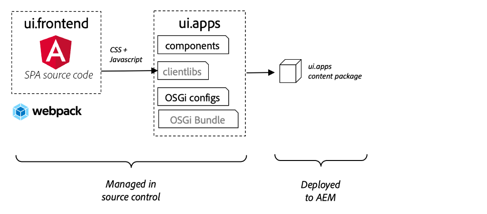
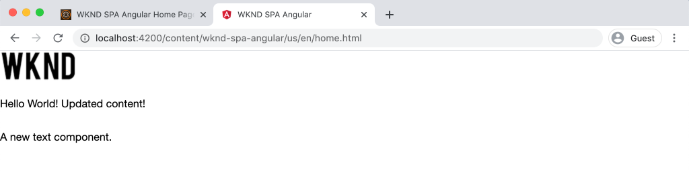

# 集成SPA {#integrate-spa}

了解如何将用Angular编写的单页应用程序(SPA)的源代码与Adobe Experience Manager(AEM)项目集成。 了解如何使用现代前端工具（如webpack dev服务器）快速开发SPA与AEM JSON模型API。

## 目标

1. 了解SPA项目如何与AEM与客户端库集成。
2. 了解如何使用本地开发服务器进行专用前端开发。
3. 探索使用&#x200B;**proxy**&#x200B;和静态&#x200B;**mock**&#x200B;文件根据AEM JSON模型API进行开发

## 您将构建的内容

本章将向SPA添加一个简单的`Header`组件。 在构建此静态`Header`组件的过程中，将使用若干方法进行AEM SPA开发。


*SPA经过扩展以添加静态组 `Header` 件*

## 前提条件

查看设置[本地开发环境](overview.md#local-dev-environment)所需的工具和说明。

### 获取代码

1. 通过Git下载本教程的起点：

   ```shell
   $ git clone git@github.com:adobe/aem-guides-wknd-spa.git
   $ cd aem-guides-wknd-spa
   $ git checkout Angular/integrate-spa-start
   ```

2. 使用Maven将代码库部署到本地AEM实例：

   ```shell
   $ mvn clean install -PautoInstallSinglePackage
   ```

   如果使用[AEM 6.x](overview.md#compatibility) ，则添加`classic`用户档案:

   ```shell
   $ mvn clean install -PautoInstallSinglePackage -Pclassic
   ```

您始终可以在[GitHub](https://github.com/adobe/aem-guides-wknd-spa/tree/Angular/integrate-spa-solution)上视图完成的代码，或通过切换到分支`Angular/integrate-spa-solution`在本地签出代码。

## 集成方法{#integration-approach}

作为AEM项目的一部分创建了两个模块：`ui.apps`和`ui.frontend`。

`ui.frontend`模块是[webpack](https://webpack.js.org/)项目，它包含所有SPA源代码。 大多数SPA开发和测试都将在webpack项目中完成。 触发生产生成后，将使用webpack构建和编译SPA。 编译的对象（CSS和Javascript）被复制到`ui.apps`模块中，然后部署到AEM运行时。



*SPA集成的高级描述。*

有关前端构建的其他信息，可在此[找到。](https://docs.adobe.com/content/help/en/experience-manager-core-components/using/developing/archetype/uifrontend-angular.html)

## InspectSPA集成{#inspect-spa-integration}

接下来，检查`ui.frontend`模块，了解由[AEM项目原型](https://docs.adobe.com/content/help/en/experience-manager-core-components/using/developing/archetype/uifrontend-angular.html)自动生成的SPA。

1. 在您选择的IDE中，为WKND SPA打开AEM项目。 本教程将使用[ Visual Studio代码IDE](https://docs.adobe.com/content/help/en/experience-manager-learn/cloud-service/local-development-environment-set-up/development-tools.html#microsoft-visual-studio-code)。

   

2. 展开并检查`ui.frontend`文件夹。 打开文件`ui.frontend/package.json`

3. 在`dependencies`下，您应看到与`@angular`相关的几个：

   ```json
   "@angular/animations": "~9.1.11",
   "@angular/common": "~9.1.11",
   "@angular/compiler": "~9.1.11",
   "@angular/core": "~9.1.11",
   "@angular/forms": "~9.1.10",
   "@angular/platform-browser": "~9.1.10",
   "@angular/platform-browser-dynamic": "~9.1.10",
   "@angular/router": "~9.1.10",
   ```

   `ui.frontend`模块是使用包含路由的[角度CLI工具](https://angular.io/cli)生成的[角度应用程序](https://angular.io)。

4. 还有三个以`@adobe`为前缀的依赖关系：

   ```json
   "@adobe/cq-angular-editable-components": "^2.0.2",
   "@adobe/cq-spa-component-mapping": "^1.0.3",
   "@adobe/cq-spa-page-model-manager": "^1.1.3",
   ```

   上述模块组成了[AEM SPA Editor JS SDK](https://docs.adobe.com/content/help/en/experience-manager-65/developing/headless/spas/spa-blueprint.html)并提供功能，使SPA组件能够映射到AEM组件。

5. 在`package.json`文件中，定义了几个`scripts`:

   ```json
   "scripts": {
       "start": "ng serve --open --proxy-config ./proxy.conf.json",
       "build": "ng lint && ng build && clientlib",
       "build:production": "ng lint && ng build --prod && clientlib",
       "test": "ng test",
       "sync": "aemsync -d -w ../ui.apps/src/main/content"
   }
   ```

   这些脚本基于常见的[Angular CLI命令](https://angular.io/cli/build)，但稍作修改以用于较大的AEM项目。

   `start` -使用本地Web服务器本地运行Angular应用程序。它已更新为代理本地AEM实例的内容。

   `build` -编译用于生产分发的Angular应用程序。添加`&& clientlib`负责在构建过程中将编译后的SPA作为客户端库复制到`ui.apps`模块中。 npm模块[aem-clientlib-generator](https://github.com/wcm-io-frontend/aem-clientlib-generator)用于实现此操作。

   有关可用脚本的详细信息，请在[此处](https://docs.adobe.com/content/help/en/experience-manager-core-components/using/developing/archetype/uifrontend-angular.html)找到。

6. Inspect文件`ui.frontend/clientlib.config.js`。 [aem-clientlib-generator](https://github.com/wcm-io-frontend/aem-clientlib-generator#clientlibconfigjs)使用此配置文件确定如何生成客户端库。

7. Inspect文件`ui.frontend/pom.xml`。 此文件将`ui.frontend`文件夹转换为[Maven模块](http://maven.apache.org/guides/mini/guide-multiple-modules.html)。 `pom.xml`文件已更新为在Maven构建期间使用[frontend-maven-plugin](https://github.com/eirslett/frontend-maven-plugin)至&#x200B;**test**&#x200B;和&#x200B;**build** SPA。

8. Inspect文件`app.component.ts`（位于`ui.frontend/src/app/app.component.ts`）:

   ```js
   import { Constants } from '@adobe/cq-angular-editable-components';
   import { ModelManager } from '@adobe/cq-spa-page-model-manager';
   import { Component } from '@angular/core';
   
   @Component({
   selector: '#spa-root', // tslint:disable-line
   styleUrls: ['./app.component.css'],
   templateUrl: './app.component.html'
   })
   export class AppComponent {
       ...
   
       constructor() {
           ModelManager.initialize().then(this.updateData);
       }
   
       private updateData = pageModel => {
           this.path = pageModel[Constants.PATH_PROP];
           this.items = pageModel[Constants.ITEMS_PROP];
           this.itemsOrder = pageModel[Constants.ITEMS_ORDER_PROP];
       }
   }
   ```

   `app.component.js` 是SPA的入口。`ModelManager` 由AEM SPA editor JS SDK提供。它负责调用`pageModel`（JSON内容）并将其注入应用程序。

## 添加Header组件{#header-component}

然后，向SPA添加一个新组件，并将更改部署到本地AEM实例以查看集成。

1. 打开新的终端窗口并导航到`ui.frontend`文件夹：

   ```shell
   $ cd aem-guides-wknd-spa/ui.frontend
   ```

2. 全局安装[Angular CLI](https://angular.io/cli#installing-angular-cli)这用于生成Angular组件，以及通过&#x200B;**ng**&#x200B;命令构建和服务Angular应用程序。

   ```shell
   $ npm install -g @angular/cli
   ```

   >[!CAUTION]
   >
   > 此项目使用的&#x200B;**@angular/cli**&#x200B;版本为&#x200B;**9.1.7**。 建议保持Angular CLI版本同步。

3. 通过从`ui.frontend`文件夹中运行Angular CLI `ng generate component`命令新建一个`Header`组件。

   ```shell
   $ ng generate component components/header
   
   CREATE src/app/components/header/header.component.css (0 bytes)
   CREATE src/app/components/header/header.component.html (21 bytes)
   CREATE src/app/components/header/header.component.spec.ts (628 bytes)
   CREATE src/app/components/header/header.component.ts (269 bytes)
   UPDATE src/app/app.module.ts (1809 bytes)
   ```

   这将为位于`ui.frontend/src/app/components/header`的新Angular Header组件创建一个骨架。

4. 在您选择的IDE中打开`aem-guides-wknd-spa`项目。 导航到`ui.frontend/src/app/components/header`文件夹。

   

5. 打开文件`header.component.html`并将内容替换为以下内容：

   ```html
   <!--/* header.component.html */-->
   <header className="header">
       <div className="header-container">
           <h1>WKND</h1>
       </div>
   </header>
   ```

   注意，它显示静态内容，因此此角度组件不需要对默认生成的`header.component.ts`进行任何调整。

6. 打开位于`ui.frontend/src/app/app.component.html`的文件&#x200B;**app.component.html**。 添加`app-header`:

   ```html
   <app-header></app-header>
   <router-outlet></router-outlet>
   ```

   这将包括所有页面内容上方的`header`组件。

7. 打开新终端并导航到`ui.frontend`文件夹并运行`npm run build`命令：

   ```shell
   $ cd ui.frontend
   $ npm run build
   
   Linting "angular-app"...
   All files pass linting.
   Generating ES5 bundles for differential loading...
   ES5 bundle generation complete.
   ```

8. 导航到`ui.apps`文件夹。 在`ui.apps/src/main/content/jcr_root/apps/wknd-spa-angular/clientlibs/clientlib-angular`下方，您应当看到已编译的SPA文件已从`ui.frontend/build`文件夹中复制。

   

9. 返回终端并导航到`ui.apps`文件夹。 执行以下Maven命令：

   ```shell
   $ cd ../ui.apps
   $ mvn clean install -PautoInstallPackage
   ...
   [INFO] ------------------------------------------------------------------------
   [INFO] BUILD SUCCESS
   [INFO] ------------------------------------------------------------------------
   [INFO] Total time:  9.629 s
   [INFO] Finished at: 2020-05-04T17:48:07-07:00
   [INFO] ------------------------------------------------------------------------
   ```

   这会将`ui.apps`包部署到AEM的本地运行实例。

10. 打开浏览器选项卡并导航到[http://localhost:4502/editor.html/content/wknd-spa-angular/us/en/home.html](http://localhost:4502/editor.html/content/wknd-spa-angular/us/en/home.html)。 您现在应该可以看到SPA中显示`Header`组件的内容。

   

   当从项目的根触发Maven内部版本（即`mvn clean install -PautoInstallSinglePackage`）时，将自动执行步骤&#x200B;**7-9**。 您现在应该了解SPA和AEM客户端库之间集成的基础知识。 请注意，您仍可以在AEM中编辑和添加`Text`组件，但`Header`组件不可编辑。

## Webpack开发服务器——代理JSON API {#proxy-json}

如之前的练习所示，执行构建并将客户端库同步到AEM的本地实例需要几分钟时间。 这对于最终测试是可以接受的，但对于大多数SPA开发而言则不理想。

[webpack dev server](https://webpack.js.org/configuration/dev-server/)可用于快速开发SPA。 SPA由AEM生成的JSON模型驱动。 在本练习中，AEM运行实例中的JSON内容将&#x200B;**proxided**&#x200B;加入由[角度项目](https://angular.io/guide/build)配置的开发服务器。

1. 返回IDE并打开文件&#x200B;**proxy.conf.json**（位于`ui.frontend/proxy.conf.json`）。

   ```json
   [
       {
           "context": [
                       "/content/**/*.(jpg|jpeg|png|model.json)",
                       "/etc.clientlibs/**/*"
                   ],
           "target": "http://localhost:4502",
           "auth": "admin:admin",
           "logLevel": "debug"
       }
   ]
   ```

   [Angular app](https://angular.io/guide/build#proxying-to-a-backend-server)提供了一种轻松的代理API请求机制。 在`context`中指定的模式通过本地AEM quickstart(`localhost:4502`)进行代理。

2. 打开位于`ui.frontend/src/index.html`的文件&#x200B;**index.html**。 这是开发服务器使用的根HTML文件。

   请注意，`base href="/"`有一个条目。 [基本标记](https://angular.io/guide/deployment#the-base-tag)对于应用程序解析相对URL至关重要。

   ```html
   <base href="/">
   ```

3. 打开终端窗口并导航到`ui.frontend`文件夹。 运行命令`npm start`:

   ```shell
   $ cd ui.frontend
   $ npm start
   
   > wknd-spa-angular@0.1.0 start /Users/dgordon/Documents/code/aem-guides-wknd-spa/ui.frontend
   > ng serve --open --proxy-config ./proxy.conf.json
   
   10% building 3/3 modules 0 active[HPM] Proxy created: [ '/content/**/*.(jpg|jpeg|png|model.json)', '/etc.clientlibs/**/*' ]  ->  http://localhost:4502
   [HPM] Subscribed to http-proxy events:  [ 'error', 'close' ]
   ℹ ｢wds｣: Project is running at http://localhost:4200/webpack-dev-server/
   ℹ ｢wds｣: webpack output is served from /
   ℹ ｢wds｣: 404s will fallback to //index.html
   ```

4. 打开新的浏览器选项卡（如果尚未打开），并导航到[http://localhost:4200/content/wknd-spa-angular/us/en/home.html](http://localhost:4200/content/wknd-spa-angular/us/en/home.html)。

   

   您应当看到与AEM中相同的内容，但不启用任何创作功能。

5. 返回IDE并在`ui.frontend/src/assets`新建一个名为`img`的文件夹。
6. 下载以下WKND徽标并将其添加到`img`文件夹：

   

7. 打开&#x200B;**header.component.html**（位于`ui.frontend/src/app/components/header/header.component.html`）并包含标志：

   ```html
   <header class="header">
       <div class="header-container">
           <div class="logo">
               
           </div>
       </div>
   </header>
   ```

   保存对&#x200B;**header.component.html**&#x200B;的更改。

8. 返回浏览器。 您应立即看到对应用程序所做的更改得到反映。

   

   您可以继续在&#x200B;**AEM**&#x200B;中进行内容更新，并在&#x200B;**webpack dev server**&#x200B;中查看这些内容，因为我们正在代理内容。 请注意，内容更改仅在&#x200B;**webpack dev server**&#x200B;中可见。

9. 在终端中使用`ctrl+c`停止本地Web服务器。

## Webpack开发服务器- Mock JSON API {#mock-json}

快速开发的另一种方法是使用静态JSON文件作为JSON模型。 通过“模仿”JSON，我们删除了对本地AEM实例的依赖。 它还允许前端开发人员更新JSON模型，以测试功能并推动对JSON API的更改，JSON API随后将由后端开发人员实施。

模型JSON的初始设置&#x200B;**需要本地AEM实例**。

1. 在浏览器中，导航到[http://localhost:4502/content/wknd-spa-angular/us/en.model.json](http://localhost:4502/content/wknd-spa-angular/us/en.model.json)。

   这是AEM导出的JSON，它驱动应用程序。 复制JSON输出。

2. 返回到IDE，导航到`ui.frontend/src`并添加名为&#x200B;**mocks**&#x200B;和&#x200B;**json**&#x200B;的新文件夹以匹配以下文件夹结构：

   ```plain
   |-- ui.frontend
       |-- src
           |-- mocks
               |-- json
   ```

3. 在`ui.frontend/public/mocks/json`下新建一个名为&#x200B;**en.model.json**&#x200B;的文件。 将&#x200B;**步骤1**&#x200B;的JSON输出粘贴到此处。

   

4. 在`ui.frontend`下新建一个文件&#x200B;**proxy.mock.conf.json**。 使用以下内容填充文件：

   ```json
   [
       {
       "context": [
           "/content/**/*.model.json"
       ],
       "pathRewrite": { "^/content/wknd-spa-angular/us" : "/mocks/json"} ,
       "target": "http://localhost:4200",
       "logLevel": "debug"
       }
   ]
   ```

   此代理配置将重写具有`/content/wknd-spa-angular/us`的`/mocks/json`的开始，并提供相应的静态JSON文件，例如：

   ```plain
   /content/wknd-spa-angular/us/en.model.json -> /mocks/json/en.model.json
   ```

5. 打开文件&#x200B;**angular.json**。 添加新的&#x200B;**dev**&#x200B;配置，其中包含更新的&#x200B;**assets**&#x200B;阵列，以引用创建的&#x200B;**mocks**&#x200B;文件夹。

   ```json
    "dev": {
             "assets": [
               "src/mocks",
               "src/assets",
               "src/favicon.ico",
               "src/logo192.png",
               "src/logo512.png",
               "src/manifest.json"
             ]
       },
   ```

   

   创建专用的&#x200B;**dev**&#x200B;配置可确保&#x200B;**mocks**&#x200B;文件夹仅在开发过程中使用，从不部署到生产版本中的AEM。

6. 在&#x200B;**angular.json**&#x200B;文件中，下次更新&#x200B;**browserTarget**&#x200B;配置以使用新的&#x200B;**dev**&#x200B;配置：

   ```diff
     ...
     "serve": {
         "builder": "@angular-devkit/build-angular:dev-server",
         "options": {
   +       "browserTarget": "angular-app:build:dev"
   -       "browserTarget": "angular-app:build"
         },
     ...
   ```

   

7. 打开文件`ui.frontend/package.json`并添加新的&#x200B;**开始:mock**&#x200B;命令以引用&#x200B;**proxy.mock.conf.json**&#x200B;文件。

   ```diff
       "scripts": {
           "start": "ng serve --open --proxy-config ./proxy.conf.json",
   +       "start:mock": "ng serve --open --proxy-config ./proxy.mock.conf.json",
           "build": "ng lint && ng build && clientlib",
           "build:production": "ng lint && ng build --prod && clientlib",
           "test": "ng test",
           "sync": "aemsync -d -w ../ui.apps/src/main/content"
       }
   ```

   添加新命令可轻松在代理配置之间切换。

8. 如果当前正在运行，请停止&#x200B;**Webpack dev server**。 使用&#x200B;**开始符：mock**&#x200B;脚本开始&#x200B;**webpack dev server**:

   ```shell
   $ npm run start:mock
   
   > wknd-spa-angular@0.1.0 start:mock /Users/dgordon/Documents/code/aem-guides-wknd-spa/ui.frontend
   > ng serve --open --proxy-config ./proxy.mock.conf.json
   ```

   导航到[http://localhost:4200/content/wknd-spa-angular/us/en/home.html](http://localhost:4200/content/wknd-spa-angular/us/en/home.html)，您应当看到相同的SPA，但内容现在正从&#x200B;**mock** JSON文件中提取。

9. 对之前创建的&#x200B;**en.model.json**&#x200B;文件做一些小更改。 更新的内容应立即反映在&#x200B;**webpack dev server**&#x200B;中。

   

   能够操作JSON模型并查看实时SPA上的效果可以帮助开发人员了解JSON模型API。 它还允许前端和后端开发并行进行。

## 使用Sass添加样式

接下来，将向项目添加一些已更新的样式。 此项目将添加[Sass](https://sass-lang.com/)对变量等一些有用功能的支持。

1. 打开终端窗口，如果启动，则停止&#x200B;**webpack dev server**。 从`ui.frontend`文件夹中输入以下命令以更新Angular应用程序以处理&#x200B;**.scss**&#x200B;文件。

   ```shell
   $ cd ui.frontend
   $ ng config schematics.@schematics/angular:component.styleext scss
   ```

   这将使用文件底部的新条目更新`angular.json`文件：

   ```json
   "schematics": {
       "@schematics/angular:component": {
       "styleext": "scss"
       }
   }
   ```

2. 安装`normalize-scss`以跨浏览器标准化样式：

   ```shell
   $ npm install normalize-scss --save
   ```

3. 返回到IDE并在`ui.frontend/src`下面创建一个名为`styles`的新文件夹。
4. 在名为`_variables.scss`的`ui.frontend/src/styles`下创建一个新文件，并用以下变量填充该文件：

   ```scss
   //_variables.scss
   
   //== Colors
   //
   //## Gray and brand colors for use across theme.
   
   $black:                  #202020;
   $gray:                   #696969;
   $gray-light:             #EBEBEB;
   $gray-lighter:           #F7F7F7;
   $white:                  #FFFFFF;
   $yellow:                 #FFEA00;
   $blue:                   #0045FF;
   
   
   //== Typography
   //
   //## Font, line-height, and color for body text, headings, and more.
   
   $font-family-sans-serif:  "Helvetica Neue", Helvetica, Arial, sans-serif;
   $font-family-serif:       Georgia, "Times New Roman", Times, serif;
   $font-family-base:        $font-family-sans-serif;
   $font-size-base:          18px;
   
   $line-height-base:        1.5;
   $line-height-computed:    floor(($font-size-base * $line-height-base));
   
   // Functional Colors
   $brand-primary:             $yellow;
   $body-bg:                   $white;
   $text-color:                $black;
   $text-color-inverse:        $gray-light;
   $link-color:                $blue;
   
   //Layout
   $max-width: 1024px;
   $header-height: 75px;
   
   // Spacing
   $gutter-padding: 12px;
   ```

5. 将文件&#x200B;**styles.css**（位于`ui.frontend/src/styles.css`）的扩展名重新命名为&#x200B;**styles.scs**。 将内容替换为：

   ```scss
   /* styles.scss * /
   
   /* Normalize */
   @import '~normalize-scss/sass/normalize';
   
   @import './styles/variables';
   
   body {
       background-color: $body-bg;
       font-family: $font-family-base;
       margin: 0;
       padding: 0;
       font-size: $font-size-base;
       text-align: left;
       color: $text-color;
       line-height: $line-height-base;
   }
   
   body.page {
       max-width: $max-width;
       margin: 0 auto;
       padding: $gutter-padding;
       padding-top: $header-height;
   }
   ```

6. 更新&#x200B;**angular.json**&#x200B;并使用&#x200B;**styles.scss**&#x200B;重新命名对&#x200B;**style.css**&#x200B;的所有引用。 应该有3个参考。

   ```diff
     "styles": [
   -    "src/styles.css"
   +    "src/styles.scss"
      ],
   ```

## 更新标题样式

然后，使用Sass将一些品牌特定样式添加到&#x200B;**Header**&#x200B;组件。

1. 开始&#x200B;**webpack dev server**&#x200B;以实时查看样式更新：

   ```shell
   $ npm run start:mock
   ```

2. 在`ui.frontend/src/app/components/header`下，将&#x200B;**header.component.css**&#x200B;重命名为&#x200B;**header.component.scss**。 使用以下内容填充文件：

   ```scss
   @import "~src/styles/variables";
   
   .header {
       width: 100%;
       position: fixed;
       top: 0;
       left:0;
       z-index: 99;
       background-color: $brand-primary;
       box-shadow: 0px 0px 10px 0px rgba(0, 0, 0, 0.24);
   }
   
   .header-container {
       display: flex;
       max-width: $max-width;
       margin: 0 auto;
       padding-left: $gutter-padding;
       padding-right: $gutter-padding;
   }
   
   .logo {
       z-index: 100;
       display: flex;
       padding-top: $gutter-padding;
       padding-bottom: $gutter-padding;
   }
   
   .logo-img {
       width: 100px;
   }
   ```

3. 将&#x200B;**header.component.js**&#x200B;更新为引用&#x200B;**header.component.scs**:

   ```diff
   ...
     @Component({
       selector: 'app-header',
       templateUrl: './header.component.html',
   -   styleUrls: ['./header.component.css']
   +   styleUrls: ['./header.component.scss']
     })
   ...
   ```

4. 返回浏览器和&#x200B;**Webpack dev server**:

   

   您现在应看到已更新的样式添加到&#x200B;**Header**&#x200B;组件。

## 将SPA更新部署到AEM

对&#x200B;**Header**&#x200B;所做的更改当前仅通过&#x200B;**webpack dev server**&#x200B;可见。 将更新的SPA部署到AEM以查看更改。

1. 停止&#x200B;**Webpack dev server**。
2. 导航到项目`/aem-guides-wknd-spa`的根目录，然后使用Maven将项目部署到AEM::

   ```shell
   $ cd ..
   $ mvn clean install -PautoInstallSinglePackage
   ```

3. 导航到[http://localhost:4502/editor.html/content/wknd-spa-angular/us/en/home.html](http://localhost:4502/editor.html/content/wknd-spa-angular/us/en/home.html)。 您应当看到更新后的&#x200B;**Header**，其中应用了标志和样式：

   

   现在更新的SPA已在AEM中，创作可以继续。

## 恭喜！{#congratulations}

祝贺您，您更新了SPA并探索了与AEM的集成！ 现在，您了解两种不同的方法，使用&#x200B;**webpack dev server**&#x200B;针对AEM JSON模型API开发SPA。

您始终可以在[GitHub](https://github.com/adobe/aem-guides-wknd-spa/tree/Angular/integrate-spa-solution)上视图完成的代码，或通过切换到分支`Angular/integrate-spa-solution`在本地签出代码。

### 后续步骤{#next-steps}

[将SPA组件映射到AEM组件](map-components.md) -了解如何将角度组件映射到Adobe Experience Manager(AEM)组件以及SPA AEM Editor JS SDK。组件映射使作者能够在AEM SPA编辑器中对SPA组件进行动态更新，这与传统的AEM创作类似。
