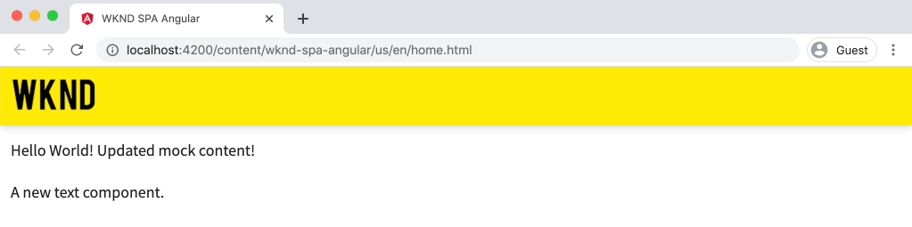
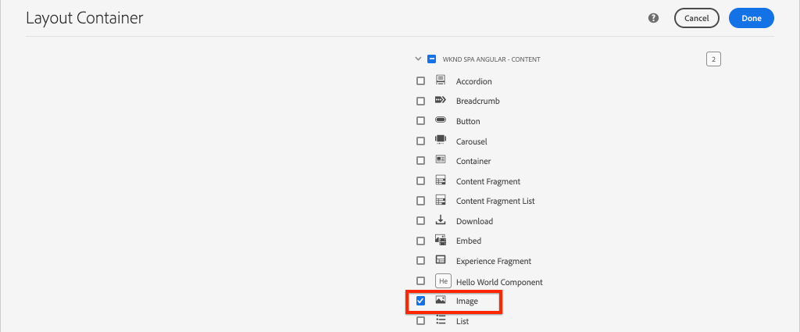

# 将SPA组件映射到AEM组件{#map-components}

了解如何使用AEM SPA Editor JS SDK将Angular组件映射到Adobe Experience Manager(AEM)组件。 组件映射使用户能够在AEM SPA Editor中对SPA组件进行动态更新，这与传统的AEM创作类似。

本章更深入地介绍AEM JSON模型API，以及如何将AEM组件公开的JSON内容自动注入Angular组件作为prop。

## 目标

1. 了解如何将AEM组件映射到SPA组件。
2. 了解&#x200B;**容器**&#x200B;组件与&#x200B;**内容**&#x200B;组件之间的差异。
3. 创建映射到现有AEM组件的新Angular组件。

## 您将构建的

本章将检查提供的`Text` SPA组件如何映射到AEM `Text`组件。 将创建一个新的`Image` SPA组件，可在SPA中使用并在AEM中创作。 **布局容器**&#x200B;和&#x200B;**模板编辑器**&#x200B;策略的现成功能还将用于创建外观更差的视图。


## 前提条件

查看设置[本地开发环境](overview.md#local-dev-environment)所需的工具和说明。

### 获取代码

1. 通过Git下载本教程的起点：

   ```shell
   $ git clone git@github.com:adobe/aem-guides-wknd-spa.git
   $ cd aem-guides-wknd-spa
   $ git checkout Angular/map-components-start
   ```

2. 使用Maven将代码库部署到本地AEM实例：

   ```shell
   $ mvn clean install -PautoInstallSinglePackage
   ```

   如果使用[AEM 6.x](overview.md#compatibility)添加`classic`用户档案:

   ```shell
   $ mvn clean install -PautoInstallSinglePackage -Pclassic
   ```

您始终可以在[GitHub](https://github.com/adobe/aem-guides-wknd-spa/tree/Angular/map-components-solution)上视图完成的代码，或通过切换到分支`Angular/map-components-solution`在本地签出代码。

## 映射方法

基本概念是将SPA组件映射到AEM组件。 AEM组件、运行服务器端、将内容作为JSON模型API的一部分导出。 SPA会使用JSON内容，在浏览器中运行客户端。 将创建SPA组件与AEM组件之间的1:1映射。


*将AEM组件映射到Angular组件的高级概述*

## Inspect the Text Component

[AEM项目原型](https://github.com/adobe/aem-project-archetype)提供映射到AEM [文本组件](https://docs.adobe.com/content/help/en/experience-manager-core-components/using/components/text.html)的`Text`组件。 这是&#x200B;**content**&#x200B;组件的示例，其中它从AEM中呈现&#x200B;*content*。

让我们看看组件的工作方式。

### Inspect JSON模型

1. 在跳入SPA代码之前，了解AEM提供的JSON模型非常重要。 导航到[核心组件库](https://www.aemcomponents.dev/content/core-components-examples/library/page-authoring/text.html)并视图文本组件的页面。 核心组件库提供所有AEM核心组件的示例。
2. 选择&#x200B;**JSON**&#x200B;选项卡，用于以下示例之一：

   

   您应该看到三个属性：`text`、`richText`和`:type`。

   `:type` 是一个保留属性，用 `sling:resourceType` 于列表AEM组件的（或路径）。`:type`的值用于将AEM组件映射到SPA组件。

   `text` 以 `richText` 及将向SPA组件公开的其他属性。

### Inspect the Text组件

1. 打开新终端并导航到项目内的`ui.frontend`文件夹。 运行`npm install`，然后运行`npm start`以开始&#x200B;**Webpack dev server**:

   ```shell
   $ cd ui.frontend
   $ npm run start:mock
   ```

   `ui.frontend`模块当前设置为使用[模拟JSON模型](./integrate-spa.md#mock-json)。

2. 您应当看到一个新的浏览器窗口打开到[http://localhost:4200/content/wknd-spa-angular/us/en/home.html](http://localhost:4200/content/wknd-spa-angular/us/en/home.html)

   

3. 在您选择的IDE中，为WKND SPA打开AEM项目。 展开`ui.frontend`模块并打开`ui.frontend/src/app/components/text/text.component.ts`下的文件&#x200B;**text.component.ts**:

   

4. 要检查的第一个区域是位于~第35行的`class TextComponent`:

   ```js
   export class TextComponent {
       @Input() richText: boolean;
       @Input() text: string;
       @Input() itemName: string;
   
       @HostBinding('innerHtml') get content() {
           return this.richText
           ? this.sanitizer.bypassSecurityTrustHtml(this.text)
           : this.text;
       }
       @HostBinding('attr.data-rte-editelement') editAttribute = true;
   
       constructor(private sanitizer: DomSanitizer) {}
   }
   ```

   [@Input()](https://angular.io/api/core/Input) decorator用于声明通过映射的JSON对象设置的字段，请稍前查看。

   `@HostBinding('innerHtml') get content()` 是从的值公开创作的文本内容的方 `this.text`法如果内容为富文本（由`this.richText`标志确定），则会绕过Angular的内置安全性。 Angular的[DomSanitizer](https://angular.io/api/platform-browser/DomSanitizer)用于“清除”原始HTML并防止跨站点脚本漏洞。 该方法使用[@HostBinding](https://angular.io/api/core/HostBinding)解码器绑定到`innerHtml`属性。

5. 接下来，在~行24检查`TextEditConfig`:

   ```js
   const TextEditConfig = {
       emptyLabel: 'Text',
       isEmpty: cqModel =>
           !cqModel || !cqModel.text || cqModel.text.trim().length < 1
   };
   ```

   上述代码负责确定何时在AEM作者环境中呈现占位符。 如果`isEmpty`方法返回&#x200B;**true**，则占位符将呈现。

6. 最后，查看~53行的`MapTo`调用：

   ```js
   MapTo('wknd-spa-angular/components/text')(TextComponent, TextEditConfig );
   ```

   **AEM** SPA Editor JS SDK()提供的`@adobe/cq-angular-editable-components`MapTois。路径`wknd-spa-angular/components/text`表示AEM组件的`sling:resourceType`。 此路径与前面观察到的JSON模型公开的`:type`匹配。 **映** 射分析JSON模型响应，并将正确值传递 `@Input()` 给SPA组件的变量。

   您可以在`ui.apps/src/main/content/jcr_root/apps/wknd-spa-angular/components/text`找到AEM `Text`组件定义。

7. 通过修改位于`ui.frontend/src/mocks/json/en.model.json`的&#x200B;**en.model.json**&#x200B;文件进行试验。

   在~line 62更新第一个`Text`值以使用&#x200B;**`H1`**&#x200B;和&#x200B;**`u`**&#x200B;标记：

   ```json
       "text": {
           "text": "<h1><u>Hello World!</u></h1>",
           "richText": true,
           ":type": "wknd-spa-angular/components/text"
       }
   ```

   返回浏览器以查看&#x200B;**webpack dev server**&#x200B;提供的效果：

   

   尝试在&#x200B;**true** / **false**&#x200B;之间切换`richText`属性，以查看渲染逻辑的实际操作情况。

8. Inspect **text.component.html**，地址为`ui.frontend/src/app/components/text/text.component.html`。

   此文件为空，因为组件的全部内容将由`innerHTML`属性设置。

9. Inspect **app.module.ts**&#x200B;在`ui.frontend/src/app/app.module.ts`。

   ```js
   @NgModule({
   imports: [
       BrowserModule,
       SpaAngularEditableComponentsModule,
       AppRoutingModule
   ],
   providers: [ModelManagerService, { provide: APP_BASE_HREF, useValue: '/' }],
   declarations: [AppComponent, TextComponent, PageComponent, HeaderComponent],
   entryComponents: [TextComponent, PageComponent],
   bootstrap: [AppComponent]
   })
   export class AppModule {}
   ```

   **TextComponent**&#x200B;未显式包含，而是通过AEM SPA Editor JS SDK提供的&#x200B;**AEMResponsiveGridComponent**&#x200B;动态包含。 因此，必须在&#x200B;**app.module.ts**&#39; [entryComponents](https://angular.io/guide/entry-components)数组中列出。

## 创建图像组件

然后，创建映射到AEM [图像组件](https://docs.adobe.com/content/help/zh-Hans/experience-manager-core-components/using/components/image.html)的`Image`Angular组件。 `Image`组件是&#x200B;**content**&#x200B;组件的另一个示例。

### Inspect the JSON

在跳入SPA代码之前，请检查AEM提供的JSON模型。

1. 导航到核心组件库](https://www.aemcomponents.dev/content/core-components-examples/library/page-authoring/image.html)中的[图像示例。

   

   `src`、`alt`和`title`的属性将用于填充SPA `Image`组件。

   >[!NOTE]
   >
   > 还有其他显示的图像属性(`lazyEnabled`, `widths`)允许开发人员创建自适应和延迟加载组件。 本教程中构建的组件将很简单，**不会**&#x200B;使用这些高级属性。

2. 返回IDE并在`ui.frontend/src/mocks/json/en.model.json`打开`en.model.json`。 由于这是我们项目的新组件，因此我们需要“模拟”图像JSON。

   在~line 70为`image`模型添加一个JSON项（不要忘记第二个`text_386303036`后面的尾随逗号`,`）并更新`:itemsOrder`数组。

   ```json
   ...
   ":items": {
               ...
               "text_386303036": {
                   "text": "<p>A new text component.</p>\r\n",
                   "richText": true,
                   ":type": "wknd-spa-angular/components/text"
                   },
               "image": {
                   "alt": "Rock Climber in New Zealand",
                   "title": "Rock Climber in New Zealand",
                   "src": "/mocks/images/adobestock-140634652.jpeg",
                   ":type": "wknd-spa-angular/components/image"
               }
           },
           ":itemsOrder": [
               "text",
               "text_386303036",
               "image"
           ],
   ```

   项目包含将与&#x200B;**webpack dev server**&#x200B;一起使用的`/mock-content/adobestock-140634652.jpeg`示例映像。

   您可以在此处视图完整[en.model.json。](https://github.com/adobe/aem-guides-wknd-spa/blob/Angular/map-components-solution/ui.frontend/src/mocks/json/en.model.json)

3. 添加要由组件显示的库存照片。

   在`ui.frontend/src/mocks`下面创建一个名为&#x200B;**images**&#x200B;的新文件夹。 下载[adobestock-140634652.jpeg](assets/map-components/adobestock-140634652.jpeg)并将其放入新创建的&#x200B;**images**&#x200B;文件夹中。 如果需要，可随意使用您自己的图像。

### 实现图像组件

1. 如果启动，请停止&#x200B;**Webpack dev server**。
2. 通过从`ui.frontend`文件夹中运行Angular CLI `ng generate component`命令，创建新的图像组件：

   ```shell
   $ ng generate component components/image
   ```

3. 在IDE中，打开&#x200B;**image.component.ts**（位于`ui.frontend/src/app/components/image/image.component.ts`），并按如下方式进行更新：

   ```js
   import {Component, Input, OnInit} from '@angular/core';
   import {MapTo} from '@adobe/cq-angular-editable-components';
   
   const ImageEditConfig = {
   emptyLabel: 'Image',
   isEmpty: cqModel =>
       !cqModel || !cqModel.src || cqModel.src.trim().length < 1
   };
   
   @Component({
   selector: 'app-image',
   templateUrl: './image.component.html',
   styleUrls: ['./image.component.scss']
   })
   export class ImageComponent implements OnInit {
   
   @Input() src: string;
   @Input() alt: string;
   @Input() title: string;
   
   constructor() { }
   
   get hasImage() {
       return this.src && this.src.trim().length > 0;
   }
   
   ngOnInit() { }
   }
   
   MapTo('wknd-spa-angular/components/image')(ImageComponent, ImageEditConfig);
   ```

   `ImageEditConfig` 是用于根据是否填充了属性来确定是否在AEM中呈现作者占 `src` 位符的配置。

   `@Input()` 的 `src`、 `alt`和是 `title` 从JSON API映射的属性。

   `hasImage()` 是一种方法，用于确定是否应渲染图像。

   `MapTo` 将SPA组件映射到位于的AEM组件 `ui.apps/src/main/content/jcr_root/apps/wknd-spa-angular/components/image`。

4. 打开&#x200B;**image.component.html**&#x200B;并更新它，如下所示：

   ```html
   <ng-container *ngIf="hasImage">
       
   </ng-container>
   ```

   如果`hasImage`返回&#x200B;**true**，则将呈现``元素。

5. 打开&#x200B;**image.component.scss**&#x200B;并更新它，如下所示：

   ```scss
   :host-context {
       display: block;
   }
   
   .image {
       margin: 1rem 0;
       width: 100%;
       border: 0;
   }
   ```

   >[!NOTE]
   >
   > `:host-context`规则为&#x200B;**critical**，以使AEM SPA编辑器占位符正常工作。 所有要在AEM页面编辑器中创作的SPA组件至少需要此规则。

6. 打开`app.module.ts`并将`ImageComponent`添加到`entryComponents`数组：

   ```js
   entryComponents: [TextComponent, PageComponent, ImageComponent],
   ```

   与`TextComponent`类似，`ImageComponent`是动态加载的，必须包含在`entryComponents`数组中。

7. 开始&#x200B;**webpack dev server**&#x200B;以查看`ImageComponent`渲染。

   ```shell
   $ npm run start:mock
   ```

   

   *已添加到SPA的图像*

   >[!NOTE]
   >
   > **奖金挑战**:实施新方法，将值作为题注 `title` 显示在图像下方。

## 在AEM中更新策略

`ImageComponent`组件仅在&#x200B;**webpack dev server**&#x200B;中可见。 接下来，将更新的SPA部署到AEM并更新模板策略。

1. 停止&#x200B;**webpack dev server**&#x200B;并从项目的&#x200B;**root**&#x200B;中，使用您的Maven技能将更改部署到AEM:

   ```shell
   $ cd aem-guides-wknd-spa
   $ mvn clean install -PautoInstallSinglePackage
   ```

2. 从AEM开始屏幕导航到&#x200B;**[!UICONTROL 工具]** > **[!UICONTROL 模板]** > **[WKND SPAAngular](http://localhost:4502/libs/wcm/core/content/sites/templates.html/conf/wknd-spa-angular)**。

   选择并编辑&#x200B;**SPA页面**:

   

3. 选择&#x200B;**布局容器**&#x200B;并单击其&#x200B;**策略**&#x200B;图标以编辑策略：

   

4. 在&#x200B;**允许的组件** > **WKND SPAAngular — 内容**&#x200B;下>检查&#x200B;**图像**&#x200B;组件：

   

   在&#x200B;**默认组件** > **添加映射**&#x200B;下，选择&#x200B;**图像 — WKND SPAAngular — 内容**&#x200B;组件：

   

   输入&#x200B;**mime类型**(`image/*`)。

   单击&#x200B;**完成**&#x200B;以保存策略更新。

5. 在&#x200B;**布局容器**&#x200B;中，单击&#x200B;**Text**&#x200B;组件的&#x200B;**policy**&#x200B;图标：

   

   创建名为&#x200B;**WKND SPA Text**&#x200B;的新策略。 在&#x200B;**插件** > **格式化**&#x200B;下，选中所有框以启用其他格式化选项：

   

   在&#x200B;**插件** > **段落样式**&#x200B;下，选中复选框以&#x200B;**启用段落样式**:

   

   单击&#x200B;**完成**&#x200B;以保存策略更新。

6. 导航到&#x200B;**Homepage** [http://localhost:4502/editor.html/content/wknd-spa-angular/us/en/home.html](http://localhost:4502/editor.html/content/wknd-spa-angular/us/en/home.html)。

   您还应能够编辑`Text`组件，并在&#x200B;**全屏**&#x200B;模式下添加其他段落样式。

   

7. 您还应能够从&#x200B;**资产查找器**&#x200B;中拖放图像：

   

8. 通过[AEM Assets](http://localhost:4502/assets.html/content/dam)添加您自己的映像，或为标准[ WKND参考站点](https://github.com/adobe/aem-guides-wknd/releases/latest)安装完成的代码库。 [WKND参考站点](https://github.com/adobe/aem-guides-wknd/releases/latest)包含许多可在WKND SPA上重新使用的图像。 可以使用[AEM Package Manager](http://localhost:4502/crx/packmgr/index.jsp)安装该包。

   

## Inspect The Layout容器

AEM SPA Editor SDK自动提供对&#x200B;**布局容器**&#x200B;的支持。 由名称指示的&#x200B;**布局容器**&#x200B;是&#x200B;**容器**&#x200B;组件。 容器组件是接受JSON结构的组件，这些结构表示&#x200B;*其他*&#x200B;组件并动态实例化它们。

让我们进一步检查布局容器。

1. 在IDE中，打开&#x200B;**responsive-grid.component.ts**（位于`ui.frontend/src/app/components/responsive-grid`）：

   ```js
   import { AEMResponsiveGridComponent,MapTo } from '@adobe/cq-angular-editable-components';
   
   MapTo('wcm/foundation/components/responsivegrid')(AEMResponsiveGridComponent);
   ```

   `AEMResponsiveGridComponent`是作为AEM SPA Editor SDK的一部分实现的，并通过`import-components`包含在项目中。

2. 在浏览器中，导航到[http://localhost:4502/content/wknd-spa-angular/us/en.model.json](http://localhost:4502/content/wknd-spa-angular/us/en.model.json)

   

   **布局容器**&#x200B;组件具有`wcm/foundation/components/responsivegrid`的`sling:resourceType`，并且SPA Editor使用`:type`属性进行识别，就像`Text`和`Image`组件一样。

   SPA Editor提供使用[布局模式](https://docs.adobe.com/content/help/en/experience-manager-65/authoring/siteandpage/responsive-layout.html#defining-layouts-layout-mode)重新调整组件大小的相同功能。

3. 返回至[http://localhost:4502/editor.html/content/wknd-spa-angular/us/en/home.html](http://localhost:4502/editor.html/content/wknd-spa-angular/us/en/home.html)。 添加其他&#x200B;**Image**&#x200B;组件，然后尝试使用&#x200B;**布局**&#x200B;选项重新调整它们的大小：

   

4. 重新打开JSON模型[http://localhost:4502/content/wknd-spa-angular/us/en.model.json](http://localhost:4502/content/wknd-spa-angular/us/en.model.json)，并观察作为JSON一部分的`columnClassNames`:

   

   类名`aem-GridColumn--default--4`表示组件应基于12列网格为4列宽。 有关[响应式网格的详细信息，请访问](https://adobe-marketing-cloud.github.io/aem-responsivegrid/)。

5. 返回IDE，在`ui.apps`模块中，有一个在`ui.apps/src/main/content/jcr_root/apps/wknd-spa-angular/clientlibs/clientlib-grid`定义的客户端库。 打开文件`less/grid.less`。

   此文件确定&#x200B;**布局容器**&#x200B;使用的断点（`default`、`tablet`和`phone`）。 此文件旨在根据项目规范进行自定义。 当前，断点设置为`1200px`和`650px`。

6. 您应该能够使用`Text`组件的响应功能和更新的富文本策略来创作类似以下内容的视图:

   

## 恭喜！{#congratulations}

恭喜您，您学习了如何将SPA组件映射到AEM组件，并且您实施了新的`Image`组件。 您还有机会了解&#x200B;**布局容器**&#x200B;的响应功能。

您始终可以在[GitHub](https://github.com/adobe/aem-guides-wknd-spa/tree/Angular/map-components-solution)上视图完成的代码，或通过切换到分支`Angular/map-components-solution`在本地签出代码。

### 后续步骤{#next-steps}

[导航和路由](navigation-routing.md)  — 了解如何通过使用SPA Editor SDK映射到AEM页面来支持SPA中的多个视图。动态导航是使用Angular路由器实现的，并添加到现有的Header组件中。

## 额外功能 — 保留源控件{#bonus}的配置

在许多情况下，尤其是在AEM项目开始时，将配置（如模板和相关内容策略）保留到源代码控制非常有价值。 这可确保所有开发人员针对同一组内容和配置工作，并可确保环境之间的额外一致性。 一旦项目达到一定的成熟度，模板管理的做法就可以交给一组特殊的高级用户。

接下来的几个步骤将使用Visual Studio代码IDE和[VSCode AEM Sync](https://marketplace.visualstudio.com/items?itemName=yamato-ltd.vscode-aem-sync)进行，但可能使用您已配置为从AEM的本地实例中&#x200B;**pull**&#x200B;或&#x200B;**导入**&#x200B;内容的任何工具和IDE进行。

1. 在Visual Studio代码IDE中，确保已通过Marketplace扩展安装&#x200B;**VSCode AEM Sync**:

   

2. 在“项目”资源管理器中展开&#x200B;**ui.content**&#x200B;模块，然后导航到`/conf/wknd-spa-angular/settings/wcm/templates`。

3. **右键单击** 文件夹 `templates` ，然后选择 **从AEM Server导入**:

   

4. 重复这些步骤以导入内容，但选择位于`/conf/wknd-spa-angular/settings/wcm/policies`的&#x200B;**policys**&#x200B;文件夹。

5. Inspect位于`ui.content/src/main/content/META-INF/vault/filter.xml`的`filter.xml`文件。

   ```xml
   <!--ui.content filter.xml-->
   <?xml version="1.0" encoding="UTF-8"?>
    <workspaceFilter version="1.0">
        <filter root="/conf/wknd-spa-angular" mode="merge"/>
        <filter root="/content/wknd-spa-angular" mode="merge"/>
        <filter root="/content/dam/wknd-spa-angular" mode="merge"/>
        <filter root="/content/experience-fragments/wknd-spa-angular" mode="merge"/>
    </workspaceFilter>
   ```

   `filter.xml`文件负责标识随软件包一起安装的节点的路径。 请注意每个过滤器上的`mode="merge"`，指示不会修改现有内容，只添加新内容。 由于内容作者可能正在更新这些路径，因此代码部署&#x200B;**不**&#x200B;覆盖内容很重要。 有关使用筛选器元素的详细信息，请参阅[FileVault文档](https://jackrabbit.apache.org/filevault/filter.html)。

   比较`ui.content/src/main/content/META-INF/vault/filter.xml`和`ui.apps/src/main/content/META-INF/vault/filter.xml`以了解每个模块管理的不同节点。
