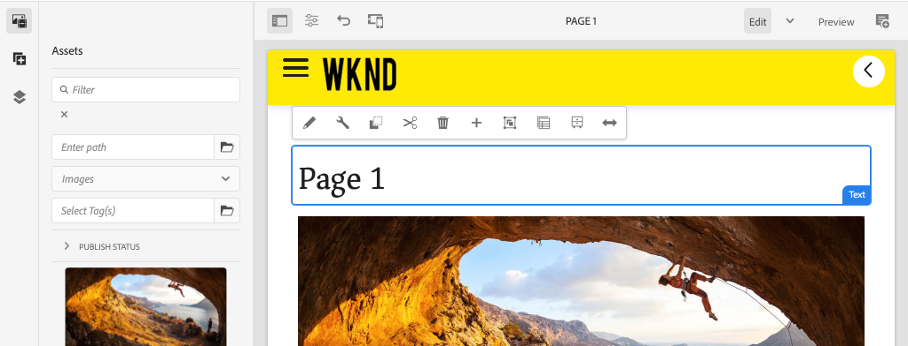
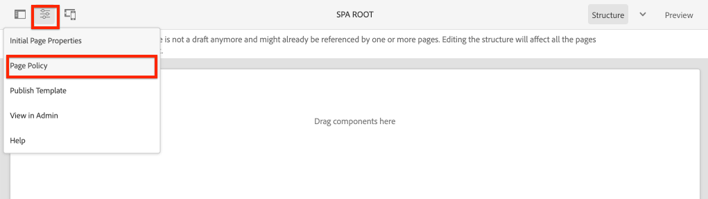

# 添加导航和路由 {#navigation-routing}

了解如何使用AEM页面和SPA编辑器SDK支持SPA中的多个视图。 动态导航是使用角度路由实现的，并添加到现有的标题组件。

## 目标

1. 了解使用SPA编辑器时可用的SPA模型路由选项。
2. 了解如何使用 [角度路由](https://angular.io/guide/router) ，在SPA的不同视图之间进行导航。
3. 实现由AEM页面层次结构驱动的动态导航。

## 您将构建的内容

本章将一个导航菜单添加到现有 `Header` 组件。 导航菜单由AEM页面层次结构驱动，并使用导航核心组件提供 [的JSON模型](https://docs.adobe.com/content/help/en/experience-manager-core-components/using/components/navigation.html)。


## 前提条件

查看设置本地开发环境所需的工 [具和说明](overview.md#local-dev-environment)。

### 获取代码

1. 通过Git下载本教程的起点：

   ```shell
   $ git clone git@github.com:adobe/aem-guides-wknd-spa.git
   $ cd aem-guides-wknd-spa
   $ git checkout Angular/navigation-routing-start
   ```

2. 使用Maven将代码库部署到本地AEM实例：

   ```shell
   $ mvn clean install -PautoInstallSinglePackage
   ```

   如果使用 [AEM 6.x](overview.md#compatibility) ，请添加 `classic` 用户档案:

   ```shell
   $ mvn clean install -PautoInstallSinglePackage -Pclassic
   ```

3. 为传统WKND参考站点安 [装完成的包](https://github.com/adobe/aem-guides-wknd/releases/latest)。 WKND参考站 [点提供的图像](https://github.com/adobe/aem-guides-wknd/releases/latest) ，将在WKND SPA上重新使用。 可以使用AEM Package Manager [安装包](http://localhost:4502/crx/packmgr/index.jsp)。

   

您始终可以在GitHub上视图完 [成的代码](https://github.com/adobe/aem-guides-wknd-spa/tree/Angular/navigation-routing-solution) ，或通过切换到分支在本地签出代码 `Angular/navigation-routing-solution`。

## Inspect标题组件更新 {#inspect-header}

在前几章中，将该 `HeaderComponent` 组件添加为通过提供的纯角度组件 `app.component.html`。 在本章中，组件 `HeaderComponent` 将从应用程序中删除，并将通过模板编辑器 [进行添加](https://docs.adobe.com/content/help/en/experience-manager-learn/sites/page-authoring/template-editor-feature-video-use.html)。 这允许用户从AEM中配置导航 `HeaderComponent` 菜单。

>[!NOTE]
>
> 已对代码库进行了多次CSS和JavaScript更新，以开始本章。 为了集中讨论核心概念， **并不讨论** 所有代码更改。 您可以在此处视图完 [整更改](https://github.com/adobe/aem-guides-wknd-spa/compare/Angular/map-components-solution...Angular/navigation-routing-start)。

1. 在您选择的IDE中，打开本章的SPA入门项目。
2. 在模块 `ui.frontend` 下方，检查文 `header.component.ts` 件： `ui.frontend/src/app/components/header/header.component.ts`.

   已进行了多次更新，包括添加 `HeaderEditConfig` 了 `MapTo` 一个和一个以使组件能够映射到AEM组件 `wknd-spa-angular/components/header`。

   ```js
   /* header.component.ts */
   ...
   const HeaderEditConfig = {
       ...
   };
   
   @Component({
   selector: 'app-header',
   templateUrl: './header.component.html',
   styleUrls: ['./header.component.scss']
   })
   export class HeaderComponent implements OnInit {
   @Input() items: object[];
       ...
   }
   ...
   MapTo('wknd-spa-angular/components/header')(withRouter(Header), HeaderEditConfig);
   ```

   请注 `@Input()` 释为 `items`。 `items` 将包含从AEM传入的导航对象的数组。

3. 在模块 `ui.apps` 中，检查AEM组件的组件定 `Header` 义： `ui.apps/src/main/content/jcr_root/apps/wknd-spa-angular/components/header/.content.xml`:

   ```xml
   <?xml version="1.0" encoding="UTF-8"?>
   <jcr:root xmlns:sling="http://sling.apache.org/jcr/sling/1.0" xmlns:cq="http://www.day.com/jcr/cq/1.0"
       xmlns:jcr="http://www.jcp.org/jcr/1.0"
       jcr:primaryType="cq:Component"
       jcr:title="Header"
       sling:resourceSuperType="wknd-spa-angular/components/navigation"
       componentGroup="WKND SPA Angular - Structure"/>
   ```

   AEM组 `Header` 件将通过属性继承导航核 [心组件的](https://docs.adobe.com/content/help/en/experience-manager-core-components/using/components/navigation.html) 所有 `sling:resourceSuperType` 功能。

## 将HeaderComponent添加到SPA模板 {#add-header-template}

1. 打开浏览器并登录AEM, [http://localhost:4502/](http://localhost:4502/)。 应已部署起始代码库。
2. 导航到 **[!UICONTROL SPA页面模板]**: [http://localhost:4502/editor.html/conf/wknd-spa-angular/settings/wcm/templates/spa-page-template/structure.html](http://localhost:4502/editor.html/conf/wknd-spa-angular/settings/wcm/templates/spa-page-template/structure.html)。
3. 选择最外侧的“根 **[!UICONTROL 布局”容器]** ，然后单 **[!UICONTROL 击“策略]** ”图标。 切勿选 **择布** 局容器 **[!UICONTROL ，取消]** 锁定，进行创作。

   

4. 复制当前策略并创建名为SPA结构的 **[!UICONTROL 新策略]**:

   

   在“允 **[!UICONTROL 许的组件]** ” > “ **[!UICONTROL 常规]** ” >下，选 **[!UICONTROL 择布局容器组件]** 。

   在“允 **[!UICONTROL 许的组]** 件” **[!UICONTROL >“WKND SPA角度——结构”]** >下，选 **[!UICONTROL 择标题组件]** :

   

   在“允 **[!UICONTROL 许的组]** 件” **[!UICONTROL >“WKND SPA角度——内容”]** >下，选择图 **[!UICONTROL 像]** 和文本 **** 组件。 您应选择4个总组件。

   Click **[!UICONTROL Done]** to save the changes.

5. **刷新页面。**&#x200B;在未锁 **[!UICONTROL 定的]** “布局”容器上添 **[!UICONTROL 加Header组件]**:

   

6. 选择标 **[!UICONTROL 头组件]** ，然后单击其 **策略图** 标以编辑策略。

   

7. 使用“WKND SPA标 **[!UICONTROL 题”]****的策略标题创建新策略**。

   在属 **[!UICONTROL 性下]**:

   * 将导航 **[!UICONTROL 根设置]** 为 `/content/wknd-spa-angular/us/en`。
   * 将“排 **[!UICONTROL 除根级别]** ”设 **置为1**。
   * 取消选中 **[!UICONTROL “收集所有子页面]**”。
   * 将“导航 **[!UICONTROL 结构深度]** ”设 **置为3**。

   

   这将收集深处的导航2级 `/content/wknd-spa-angular/us/en`。

8. 保存更改后，您应将填充的内 `Header` 容视为模板的一部分：

   

## 创建子页面

接下来，在AEM中创建其他页面，作为SPA中的不同视图。 我们还将检查AEM提供的JSON模型的层次结构。

1. 导航到站 **点** 控制台： [http://localhost:4502/sites.html/content/wknd-spa-angular/us/en/home](http://localhost:4502/sites.html/content/wknd-spa-angular/us/en/home)。 选择WKND **SPA角度主页** ，然 **[!UICONTROL 后单击“]** 创建 **[!UICONTROL ”]**>“页：

   

2. 在模 **[!UICONTROL 板下]** ，选 **[!UICONTROL 择SPA页面]**。 在“ **[!UICONTROL 属]** 性” **下，输入“Page 1”作为** “标 **[!UICONTROL 题]** ”，输 **入“page-1”作为** 名称。

   

   单击 **[!UICONTROL 创建]** ，在对话框弹出窗口中，单 **[!UICONTROL 击打]** 开，以在AEM SPA编辑器中打开页面。

3. 向主布 **[!UICONTROL 局容器]** 添加新的 **[!UICONTROL 文本组件]**。 编辑组件并输入文本： **使用RTE** 和H1元素 **的** “第1页”（您必须进入全屏模式才能更改段落元素）

   

   随意添加其他内容，如图像。

4. 返回AEM Sites控制台并重复上述步骤，创建名为“Page 2”的 **第二页作为第** 1页的同 **辈页面**。 将内容添 **加到第** 2页，以便轻松识别。
5. 最后创建第三页， **“第3页** ”，但 **是第** 2页的 **子页**。 完成后，站点层次结构应如下所示：

   

6. 在新选项卡中，打开AEM提供的JSON模型API: [http://localhost:4502/content/wknd-spa-angular/us/en.model.json](http://localhost:4502/content/wknd-spa-angular/us/en.model.json)。 首次加载SPA时请求此JSON内容。 外部结构如下所示：

   ```json
   {
   "language": "en",
   "title": "en",
   "templateName": "spa-app-template",
   "designPath": "/libs/settings/wcm/designs/default",
   "cssClassNames": "spa page basicpage",
   ":type": "wknd-spa-angular/components/spa",
   ":items": {},
   ":itemsOrder": [],
   ":hierarchyType": "page",
   ":path": "/content/wknd-spa-angular/us/en",
   ":children": {
       "/content/wknd-spa-angular/us/en/home": {},
       "/content/wknd-spa-angular/us/en/home/page-1": {},
       "/content/wknd-spa-angular/us/en/home/page-2": {},
       "/content/wknd-spa-angular/us/en/home/page-2/page-3": {}
       }
   }
   ```

   在下 `:children` 面，您应当看到创建的每个页面的条目。 所有页面的内容都在此初始JSON请求中。 一旦实施了导航路由,SPA的后续视图将被快速加载，因为内容在客户端已经可用。

   在初始JSON请求中 **加载** SPA的所有内容并不明智，因为这会减慢初始页面加载。 接下来，我们来了解如何收集页面的层次结构深度。

7. 导航到SPA **根模板** ，网址为： [http://localhost:4502/editor.html/conf/wknd-spa-angular/settings/wcm/templates/spa-app-template/structure.html](http://localhost:4502/editor.html/conf/wknd-spa-angular/settings/wcm/templates/spa-app-template/structure.html)。

   单击“页 **[!UICONTROL 面属性”菜单]** > **[!UICONTROL 页面策略]**:

   

8. SPA根 **模板中** ，还有一个额外的“ **[!UICONTROL 分层结构]** ”选项卡，用于控制收集的JSON内容。 结 **[!UICONTROL 构深度]** (Structure Depth)确定在站点层次结构中收集根下子页面的 **深度**。 您还可以使用“结 **[!UICONTROL 构模式]** ”字段根据常规表达式筛选其他页面。

   将结构 **[!UICONTROL 深度更]** 新 **为“2”**:

   

   单击 **[!UICONTROL 完成]** ，以保存对策略所做的更改。

9. 重新打开JSON模型 [http://localhost:4502/content/wknd-spa-angular/us/en.model.json](http://localhost:4502/content/wknd-spa-angular/us/en.model.json)。

   ```json
   {
   "language": "en",
   "title": "en",
   "templateName": "spa-app-template",
   "designPath": "/libs/settings/wcm/designs/default",
   "cssClassNames": "spa page basicpage",
   ":type": "wknd-spa-angular/components/spa",
   ":items": {},
   ":itemsOrder": [],
   ":hierarchyType": "page",
   ":path": "/content/wknd-spa-angular/us/en",
   ":children": {
       "/content/wknd-spa-angular/us/en/home": {},
       "/content/wknd-spa-angular/us/en/home/page-1": {},
       "/content/wknd-spa-angular/us/en/home/page-2": {}
       }
   }
   ```

   请注意， **页面** 3路径已被删除： `/content/wknd-spa-angular/us/en/home/page-2/page-3` 从初始JSON模型开始。

   稍后，我们将观察AEM SPA Editor SDK如何动态加载其他内容。

## 实现导航

然后，使用新的导航菜单实现导航菜 `NavigationComponent`单。 我们可以直接在中添加代 `header.component.html` 码，但最好的做法是避免使用大型组件。 相反，应实 `NavigationComponent` 施一个可能在以后重新使用的工具。

1. 查看AEM组件在http://localhost:4502/content/wknd-spa-angular/us/en.model.json上公 `Header` 开的 [JSON](http://localhost:4502/content/wknd-spa-angular/us/en.model.json):

   ```json
   ...
   "header": {
       "items": [
       {
       "level": 0,
       "active": true,
       "path": "/content/wknd-spa-angular/us/en/home",
       "description": null,
       "url": "/content/wknd-spa-angular/us/en/home.html",
       "lastModified": 1589062597083,
       "title": "WKND SPA Angular Home Page",
       "children": [
               {
               "children": [],
               "level": 1,
               "active": false,
               "path": "/content/wknd-spa-angular/us/en/home/page-1",
               "description": null,
               "url": "/content/wknd-spa-angular/us/en/home/page-1.html",
               "lastModified": 1589429385100,
               "title": "Page 1"
               },
               {
               "level": 1,
               "active": true,
               "path": "/content/wknd-spa-angular/us/en/home/page-2",
               "description": null,
               "url": "/content/wknd-spa-angular/us/en/home/page-2.html",
               "lastModified": 1589429603507,
               "title": "Page 2",
               "children": [
                   {
                   "children": [],
                   "level": 2,
                   "active": false,
                   "path": "/content/wknd-spa-angular/us/en/home/page-2/page-3",
                   "description": null,
                   "url": "/content/wknd-spa-angular/us/en/home/page-2/page-3.html",
                   "lastModified": 1589430413831,
                   "title": "Page 3"
                   }
               ],
               }
           ]
           }
       ],
   ":type": "wknd-spa-angular/components/header"
   ```

   AEM页面的分层性质在JSON中建模，可用于填充导航菜单。 请记住， `Header` 该组件继承了导航核心组 [件的所有功能](https://www.aemcomponents.dev/content/core-components-examples/library/templating/navigation.html) ，通过JSON公开的内容将自动映射到角度注 `@Input` 释。

2. 打开新的终端窗口并导 `ui.frontend` 航到SPA项目的文件夹。 使用Angular `NavigationComponent` CLI工具新建：

   ```shell
   $ cd ui.frontend
   $ ng generate component components/navigation
   CREATE src/app/components/navigation/navigation.component.scss (0 bytes)
   CREATE src/app/components/navigation/navigation.component.html (25 bytes)
   CREATE src/app/components/navigation/navigation.component.spec.ts (656 bytes)
   CREATE src/app/components/navigation/navigation.component.ts (286 bytes)
   UPDATE src/app/app.module.ts (2032 bytes)
   ```

3. 然后，在新创建的 `NavigationLink` 目录中使用Angular CLI创建一个名为的 `components/navigation` 类：

   ```shell
   $ cd src/app/components/navigation/
   $ ng generate class NavigationLink
   CREATE src/app/components/navigation/navigation-link.spec.ts (187 bytes)
   CREATE src/app/components/navigation/navigation-link.ts (32 bytes)
   ```

4. 返回您选择的IDE，并在上打开文 `navigation-link.ts` 件 `/src/app/components/navigation/navigation-link.ts`。

   

5. 填充 `navigation-link.ts` 以下内容：

   ```js
   export class NavigationLink {
   
       title: string;
       path: string;
       url: string;
       level: number;
       children: NavigationLink[];
       active: boolean;
   
       constructor(data) {
           this.path = data.path;
           this.title = data.title;
           this.url = data.url;
           this.level = data.level;
           this.active = data.active;
           this.children = data.children.map( item => {
               return new NavigationLink(item);
           });
       }
   }
   ```

   这是一个表示单个导航链接的简单类。 在类构造函数中，我 `data` 们期望是从AEM传入的JSON对象。 此类将用在和中，以 `NavigationComponent` 便 `HeaderComponent` 填充导航结构。

   不执行任何数据转换，创建此类主要是为了强烈键入JSON模型。 请注意， `this.children` 类型为 `NavigationLink[]` ，并且构造函数递归地为数 `NavigationLink` 组中的每个项创建新对 `children` 象。 回想一下，JSON模型的层次 `Header` 结构。

6. Open the file `navigation-link.spec.ts`. 这是类的测试文 `NavigationLink` 件。 请使用以下方式更新它：

   ```js
   import { NavigationLink } from './navigation-link';
   
   describe('NavigationLink', () => {
       it('should create an instance', () => {
           const data = {
               children: [],
               level: 1,
               active: false,
               path: '/content/wknd-spa-angular/us/en/home/page-1',
               description: null,
               url: '/content/wknd-spa-angular/us/en/home/page-1.html',
               lastModified: 1589429385100,
               title: 'Page 1'
           };
           expect(new NavigationLink(data)).toBeTruthy();
       });
   });
   ```

   请注意， `const data` 遵循之前检查的单个链接的同一JSON模型。 这远非健壮的单元测试，但测试的构造函数应该足够 `NavigationLink`。

7. Open the file `navigation.component.ts`. 请使用以下方式更新它：

   ```js
   import { Component, OnInit, Input } from '@angular/core';
   import { NavigationLink } from './navigation-link';
   
   @Component({
   selector: 'app-navigation',
   templateUrl: './navigation.component.html',
   styleUrls: ['./navigation.component.scss']
   })
   export class NavigationComponent implements OnInit {
   
       @Input() items: object[];
   
       constructor() { }
   
       get navigationLinks(): NavigationLink[] {
   
           if (this.items && this.items.length > 0) {
               return this.items.map(item => {
                   return new NavigationLink(item);
               });
           }
   
           return null;
       }
   
       ngOnInit() {}
   
   }
   ```

   `NavigationComponent` 需要 `object[]` 一个 `items` 名为AEM的JSON模型。 此类公开一个返回 `get navigationLinks()` 对象数组的单个 `NavigationLink` 方法。

8. 打开文件， `navigation.component.html` 然后使用以下内容更新它：

   ```html
   <ul *ngIf="navigationLinks && navigationLinks.length > 0" class="navigation__group">
       <ng-container *ngTemplateOutlet="recursiveListTmpl; context:{ links: navigationLinks }"></ng-container>
   </ul>
   ```

   这将生成初始 `<ul>` 值并从 `get navigationLinks()` 调用方法 `navigation.component.ts`。 用 `<ng-container>` 于调用名为的模板，并将 `recursiveListTmpl` 其作为名 `navigationLinks` 为的变量传递 `links`。

   添加下 `recursiveListTmpl` 一个：

   ```html
   <ng-template #recursiveListTmpl let-links="links">
       <li *ngFor="let link of links" class="{{'navigation__item navigation__item--' + link.level}}">
           <a [routerLink]="link.url" class="navigation__item-link" [title]="link.title" [attr.aria-current]="link.active">
               {{link.title}}
           </a>
           <ul *ngIf="link.children && link.children.length > 0">
               <ng-container *ngTemplateOutlet="recursiveListTmpl; context:{ links: link.children }"></ng-container>
           </ul>
       </li>
   </ng-template>
   ```

   此处实现了导航链接的其余渲染。 请注意，该变 `link` 量的类型 `NavigationLink` 为，该类创建的所有方法／属性均可用。 [`[routerLink]`](https://angular.io/api/router/RouterLink) 的值，而不是正常 `href` 属性。 这样，我们无需刷新整页即可链接到应用程序中的特定路由。

   如果当前具有非空数组，则通过创建另 `<ul>` 一个导航 `link` 的递归部分也 `children` 实现。

9. 更新 `navigation.component.spec.ts` 以添加对以下产品的支 `RouterTestingModule`持：

   ```diff
    ...
   + import { RouterTestingModule } from '@angular/router/testing';
    ...
    beforeEach(async(() => {
       TestBed.configureTestingModule({
   +   imports: [ RouterTestingModule ],
       declarations: [ NavigationComponent ]
       })
       .compileComponents();
    }));
    ...
   ```

   添加组件 `RouterTestingModule` 是必需的，因为组件使用 `[routerLink]`了。

10. 更新 `navigation.component.scss` 以向以下对象添加一些基本样式 `NavigationComponent`:

   ```scss
   @import "~src/styles/variables";
   
   $link-color: $black;
   $link-hover-color: $white;
   $link-background: $black;
   
   :host-context {
       display: block;
       width: 100%;
   }
   
   .navigation__item {
       list-style: none;
   }
   
   .navigation__item-link {
       color: $link-color;
       font-size: $font-size-large;
       text-transform: uppercase;
       padding: $gutter-padding;
       display: flex;
       border-bottom: 1px solid $gray;
   
       &:hover {
           background: $link-background;
           color: $link-hover-color;
       }
   
   }
   ```

## 更新标题组件

现在已 `NavigationComponent` 经实施，必 `HeaderComponent` 须更新以引用它。

1. 打开终端并导航到SPA `ui.frontend` 项目中的文件夹。 开始 **webpack dev服务器**:

   ```shell
   $ npm start
   ```

2. 打开浏览器选项卡并导航到 [http://localhost:4200/](http://localhost:4200/)。

   应 **将Webpack Dev** server配置为从AEM()的本地实例代理JSON模`ui.frontend/proxy.conf.json`型。 这将允许我们直接针对在教程前面部分在AEM中创建的内容进行编码。

   

   当前 `HeaderComponent` 已实现菜单切换功能。 然后，添加导航组件。

3. 返回您选择的IDE，并在打开文 `header.component.ts` 件 `ui.frontend/src/app/components/header/header.component.ts`。
4. 更新方 `setHomePage()` 法以删除硬编码的字符串，并使用AEM组件传入的动态prop:

   ```js
   /* header.component.ts */
   import { NavigationLink } from '../navigation/navigation-link';
   ...
    setHomePage() {
       if (this.hasNavigation) {
           const rootNavigationLink: NavigationLink = new NavigationLink(this.items[0]);
           this.isHome = rootNavigationLink.path === this.route.snapshot.data.path;
           this.homePageUrl = rootNavigationLink.url;
       }
   }
   ...
   ```

   根据从AEM传 `NavigationLink` 入的导 `items[0]`航JSON模型的根创建新实例。 `this.route.snapshot.data.path` 返回当前角度路由的路径。 此值用于确定当前路由是否为 **主页**。 `this.homePageUrl` 用于填充徽标上的锚点 **链接**。

5. 打 `header.component.html` 开导航的静态占位符并替换为对新创建的引用 `NavigationComponent`:

   ```diff
       <div class="header-navigation">
           <div class="navigation">
   -            Navigation Placeholder
   +           <app-navigation [items]="items"></app-navigation>
           </div>
       </div>
   ```

   `[items]=items` 属性将 `@Input() items` 从 `HeaderComponent` 传递 `NavigationComponent` 到导航的构建位置。

6. 打 `header.component.spec.ts` 开并添加声明 `NavigationComponent`:

   ```diff
       /* header.component.spect.ts */
   +   import { NavigationComponent } from '../navigation/navigation.component';
   
       describe('HeaderComponent', () => {
       let component: HeaderComponent;
       let fixture: ComponentFixture<HeaderComponent>;
   
       beforeEach(async(() => {
           TestBed.configureTestingModule({
           imports: [ RouterTestingModule ],
   +       declarations: [ HeaderComponent, NavigationComponent ]
           })
           .compileComponents();
       }));
   ```

   由于现 `NavigationComponent` 在将它用作测试 `HeaderComponent` 台的一部分，因此需要声明它。

7. 保存对任何打开的文件所做的更改并返回 **到webpack dev服务器**: [http://localhost:4200/](http://localhost:4200/)

   

   单击菜单切换打开导航，您应当看到已填充的导航链接。 您应该能够导航到SPA的不同视图。

## 了解SPA路由

现在，已实施导航，请检查AEM中的路由。

1. 在IDE中，打开位 `app-routing.module.ts` 于的文 `ui.frontend/src/app`件。

   ```js
   /* app-routing.module.ts */
   import { AemPageDataResolver, AemPageRouteReuseStrategy } from '@adobe/cq-angular-editable-components';
   import { NgModule } from '@angular/core';
   import { RouteReuseStrategy, RouterModule, Routes, UrlMatchResult, UrlSegment } from '@angular/router';
   import { PageComponent } from './components/page/page.component';
   
   export function AemPageMatcher(url: UrlSegment[]): UrlMatchResult {
       if (url.length) {
           return {
               consumed: url,
               posParams: {
                   path: url[url.length - 1]
               }
           };
       }
   }
   
   const routes: Routes = [
       {
           matcher: AemPageMatcher,
           component: PageComponent,
           resolve: {
               path: AemPageDataResolver
           }
       }
   ];
   @NgModule({
       imports: [RouterModule.forRoot(routes)],
       exports: [RouterModule],
       providers: [
           AemPageDataResolver,
           {
           provide: RouteReuseStrategy,
           useClass: AemPageRouteReuseStrategy
           }
       ]
   })
   export class AppRoutingModule {}
   ```

   数组 `routes: Routes = [];` 定义指向角度组件映射的路由或导航路径。

   `AemPageMatcher` 是自定义的Angular路 [由器](https://angular.io/api/router/UrlMatcher)UrlMatcher，它与AEM中作为此Angular应用程序一部分的页面“外观”相匹配。

   `PageComponent` 是在AEM中表示页面的角度组件，匹配的路由将调用。 将 `PageComponent` 进一步检查。

   `AemPageDataResolver`由AEM SPA Editor JS SDK提供的是自定义角路由器解 [析程序](https://angular.io/api/router/Resolve) ，用于将路由URL(在AEM中包括。html扩展的路径)转换为AEM中的资源路径（页面路径减去扩展）。

   例如， `AemPageDataResolver` 将路由的URL `content/wknd-spa-angular/us/en/home.html` 转换为路径 `/content/wknd-spa-angular/us/en/home`。 它用于根据JSON模型API中的路径解析页面内容。

   `AemPageRouteReuseStrategy`由AEM SPA Editor JS SDK提供的是一个自定义 [RouteReuseStrategy](https://angular.io/api/router/RouteReuseStrategy) ，可防止跨路 `PageComponent` 由重用。 否则，页面“A”中的内容在导航到页面“B”时可能显示。

2. 在打开文 `page.component.ts` 件 `ui.frontend/src/app/components/page/`。

   ```js
   ...
   export class PageComponent {
       items;
       itemsOrder;
       path;
   
       constructor(
           private route: ActivatedRoute,
           private modelManagerService: ModelManagerService
       ) {
           this.modelManagerService
           .getData({ path: this.route.snapshot.data.path })
           .then(data => {
               this.path = data[Constants.PATH_PROP];
               this.items = data[Constants.ITEMS_PROP];
               this.itemsOrder = data[Constants.ITEMS_ORDER_PROP];
           });
       }
   }
   ```

   需 `PageComponent` 要处理从AEM检索的JSON，并用作Angular组件来呈现路由。

   `ActivatedRoute`角度路由器模块提供的JSON内容包含状态，用于指示应将哪个AEM页面的JSON内容加载到此角度页面组件实例中。

   `ModelManagerService`，根据路由获取JSON数据并将数据映射到类变 `path`量 `items`, `itemsOrder`。 然后，这些组件将传递到 [AEMPageComponent](https://www.npmjs.com/package/@adobe/cq-angular-editable-components#aempagecomponent.md)

3. 打开位 `page.component.html` 置 `ui.frontend/src/app/components/page/`

   ```html
   <aem-page 
       class="structure-page" 
       [attr.data-cq-page-path]="path" 
       [cqPath]="path" 
       [cqItems]="items" 
       [cqItemsOrder]="itemsOrder">
   </aem-page>
   ```

   `aem-page` 包括 [AEMPageComponent](https://www.npmjs.com/package/@adobe/cq-angular-editable-components#aempagecomponent.md)。 变量 `path`、 `items`和 `itemsOrder` 将传递到 `AEMPageComponent`。 然 `AemPageComponent`后，通过SPA编辑器提供的JavaScript SDK将对该数据进行迭代，并根据JSON数据动态实例化角度组件，如“映射组件”教 [程所示](./map-components.md)。

   它 `PageComponent` 实际上只是代理，它 `AEMPageComponent` 负责执行 `AEMPageComponent` 大部分繁重的工作，以正确将JSON模型映射到角组件。

## InspectAEM温泉路由

1. 打开终端，如果启动， **则停止Webpack** dev服务器。 导航到项目的根，然后使用您的Maven技能将项目部署到AEM:

   ```shell
   $ cd aem-guides-wknd-spa
   $ mvn clean install -PautoInstallSinglePackage
   ```

   >[!CAUTION]
   >
   > Angular项目启用了一些非常严格的linting规则。 如果Maven生成失败，请检查错误并查找列 **出的文件中发现的Lint错误。**. 修复linter找到的任何问题并重新运行Maven命令。

2. 导航到AEM中的SPA主页： [http://localhost:4502/content/wknd-spa-angular/us/en/home.html](http://localhost:4502/content/wknd-spa-angular/us/en/home.html) 并打开浏览器的开发人员工具。 下面的截屏是从Google Chrome浏览器中捕获的。

   刷新页面，您应看到XHR请 `/content/wknd-spa-angular/us/en.model.json`求，该请求是SPA根。 请注意，根据本教程前面提到的SPA根模板的层次结构深度配置，只包含三个子页面。 这不包括第 **3页**。

   

3. 打开开发人员工具后，导航 **到第3页**:

   

   请注意，新的XHR请求是： `/content/wknd-spa-angular/us/en/home/page-2/page-3.model.json`

   

   AEM Model Manager了解第3页 **JSON内容** 不可用，并自动触发额外的XHR请求。

4. 使用各种导航链接继续导航SPA。 请注意，未发出任何其他XHR请求，且未发生完整页面刷新。 这使最终用户的SPA变得更快，并减少了返回AEM的不必要请求。

   

5. 通过直接导航到： [http://localhost:4502/content/wknd-spa-angular/us/en/home/page-2.html](http://localhost:4502/content/wknd-spa-angular/us/en/home/page-2.html)。 请注意，浏览器的“返回”按钮继续工作。

## 恭喜！ {#congratulations}

恭喜您，您学习了如何通过使用SPA编辑器SDK映射到AEM页面来支持SPA中的多个视图。 动态导航已使用角度路由实现并添加到组 `Header` 件中。

您始终可以在GitHub上视图完 [成的代码](https://github.com/adobe/aem-guides-wknd-spa/tree/Angular/navigation-routing-solution) ，或通过切换到分支在本地签出代码 `Angular/navigation-routing-solution`。

### 后续步骤 {#next-steps}

[创建自定义组件](custom-component.md) -了解如何创建要与AEM SPA编辑器一起使用的自定义组件。 了解如何开发创作对话框和Sling Models以扩展JSON模型以填充自定义组件。
