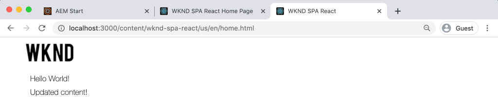

# 集成SPA {#integrate-spa}

了解在React中编写的单页应用程序(SPA)的源代码如何可以与Adobe Experience Manager(AEM)项目集成。 了解如何使用现代前端工具（如webpack dev服务器）快速开发SPA与AEM JSON模型API。

## 目标

1. 了解SPA项目如何与AEM与客户端库集成。
2. 了解如何使用Webpack开发服务器进行专用前端开发。
3. 探索使用&#x200B;**proxy**&#x200B;和静态&#x200B;**mock**&#x200B;文件根据AEM JSON模型API进行开发

## 您将构建的内容

本章将向SPA添加一个简单的`Header`组件。 在构建此静态`Header`组件的过程中，将使用若干方法进行AEM SPA开发。


*SPA经过扩展以添加静态组 `Header` 件*

## 前提条件

查看设置[本地开发环境](overview.md#local-dev-environment)所需的工具和说明。

### 获取代码

1. 通过Git下载本教程的起点：

   ```shell
   $ git clone git@github.com:adobe/aem-guides-wknd-spa.git
   $ cd aem-guides-wknd-spa
   $ git checkout React/integrate-spa-start
   ```

2. 使用Maven将代码库部署到本地AEM实例：

   ```shell
   $ mvn clean install -PautoInstallSinglePackage
   ```

   如果使用[AEM 6.x](overview.md#compatibility) ，则添加`classic`用户档案:

   ```shell
   $ mvn clean install -PautoInstallSinglePackage -Pclassic
   ```

您始终可以在[GitHub](https://github.com/adobe/aem-guides-wknd-spa/tree/React/integrate-spa-solution)上视图完成的代码，或通过切换到分支`React/integrate-spa-solution`在本地签出代码。

## 集成方法{#integration-approach}

作为AEM项目的一部分创建了两个模块：`ui.apps`和`ui.frontend`。

`ui.frontend`模块是[webpack](https://webpack.js.org/)项目，它包含所有SPA源代码。 大多数SPA开发和测试都将在webpack项目中完成。 触发生产生成后，将使用webpack构建和编译SPA。 编译的对象（CSS和Javascript）被复制到`ui.apps`模块中，然后部署到AEM运行时。


*SPA集成的高级描述。*

有关前端构建的其他信息，可在此[找到。](https://docs.adobe.com/content/help/en/experience-manager-core-components/using/developing/archetype/uifrontend-react.html)

## InspectSPA集成{#inspect-spa-integration}

接下来，检查`ui.frontend`模块，了解由[AEM项目原型](https://docs.adobe.com/content/help/en/experience-manager-core-components/using/developing/archetype/uifrontend-react.html)自动生成的SPA。

1. 在您选择的IDE中，为WKND SPA打开AEM项目。 本教程将使用[ Visual Studio代码IDE](https://docs.adobe.com/content/help/en/experience-manager-learn/cloud-service/local-development-environment-set-up/development-tools.html#microsoft-visual-studio-code)。

   

2. 展开并检查`ui.frontend`文件夹。 打开文件`ui.frontend/package.json`

3. 在`dependencies`下，您应看到与`react`相关的几个，包括`react-scripts`

   ```json
   "react": "^16.12.0",
   "react-app-polyfill": "^1.0.5",
   "react-dom": "^16.12.0",
   "react-router-dom": "^5.1.2",
   "react-scripts": "3.4.1"
   ```

   `ui.frontend`是基于[创建反应应用程序](https://create-react-app.dev/)或CRA的React应用程序。 `react-scripts`版本指示使用哪个版本的CRA。

4. 还有三个以`@adobe`为前缀的依赖关系：

   ```json
   "@adobe/aem-react-editable-components": "^1.0.0",
   "@adobe/aem-spa-component-mapping": "^1.0.0",
   "@adobe/aem-spa-page-model-manager": "^1.0.0",
   ```

   上述模块组成了[AEM SPA Editor JS SDK](https://docs.adobe.com/content/help/en/experience-manager-65/developing/headless/spas/spa-blueprint.html)并提供功能，使SPA组件能够映射到AEM组件。

5. 在`package.json`文件中，定义了几个`scripts`:

   ```json
   "scripts": {
       "start": "react-scripts start",
       "build": "react-scripts build && clientlib",
       "test": "react-scripts test",
       "eject": "react-scripts eject",
   }
   ```

   这些是由“创建反应应用程序”使[可用的标准构建脚本。](https://create-react-app.dev/docs/available-scripts)

   唯一的区别是将`&& clientlib`添加到`build`脚本。 此额外指令负责在构建过程中将编译后的SPA作为客户端库复制到`ui.apps`模块中。

   npm模块[aem-clientlib-generator](https://github.com/wcm-io-frontend/aem-clientlib-generator)用于实现此操作。

6. Inspect文件`ui.frontend/clientlib.config.js`。 [aem-clientlib-generator](https://github.com/wcm-io-frontend/aem-clientlib-generator#clientlibconfigjs)使用此配置文件确定如何生成客户端库。

7. Inspect文件`ui.frontend/pom.xml`。 此文件将`ui.frontend`文件夹转换为[Maven模块](http://maven.apache.org/guides/mini/guide-multiple-modules.html)。 `pom.xml`文件已更新为在Maven构建期间使用[frontend-maven-plugin](https://github.com/eirslett/frontend-maven-plugin)至&#x200B;**test**&#x200B;和&#x200B;**build** SPA。

8. Inspect文件`index.js`（位于`ui.frontend/src/index.js`）:

   ```js
   //ui.frontend/src/index.js
   ...
   document.addEventListener('DOMContentLoaded', () => {
       ModelManager.initialize().then(pageModel => {
           const history = createBrowserHistory();
           render(
           <Router history={history}>
               <App
               history={history}
               cqChildren={pageModel[Constants.CHILDREN_PROP]}
               cqItems={pageModel[Constants.ITEMS_PROP]}
               cqItemsOrder={pageModel[Constants.ITEMS_ORDER_PROP]}
               cqPath={pageModel[Constants.PATH_PROP]}
               locationPathname={window.location.pathname}
               />
           </Router>,
           document.getElementById('spa-root')
           );
       });
   });
   ```

   `index.js` 是SPA的入口。`ModelManager` 由AEM SPA editor JS SDK提供。它负责调用`pageModel`（JSON内容）并将其注入应用程序。

## 添加Header组件{#header-component}

然后，将新组件添加到SPA，并将更改部署到本地AEM实例。

1. 在`ui.frontend`模块中，在`ui.frontend/src/components`下面创建一个名为`Header`的新文件夹。
2. 在`Header`文件夹下创建名为`Header.js`的文件。

   

3. 使用以下内容填充`Header.js`:

   ```js
   //Header.js
   import React, {Component} from 'react';
   
   export default class Header extends Component {
   
       render() {
           return (
                   <header className="Header">
                       <div className="Header-container">
                           <h1>WKND</h1>
                       </div>
                   </header>
           );
       }
   }
   ```

   上面是一个标准的React组件，它将输出静态文本字符串。

4. 打开文件`ui.frontend/src/App.js`。 这是应用程序入口点。
5. 对`App.js`进行以下更新以包含静态`Header`:

   ```diff
     import { Page, withModel } from '@adobe/aem-react-editable-components';
     import React from 'react';
   + import Header from './components/Header/Header';
   
     // This component is the application entry point
     class App extends Page {
     render() {
         return (
         <div>
   +       <Header />
            {this.childComponents}
            {this.childPages}
        </div>
   ```

6. 打开新终端并导航到`ui.frontend`文件夹并运行`npm run build`命令：

   ```shell
   $ cd aem-guides-wknd-spa
   $ cd ui.frontend
   $ npm run build
   ...
   Compiled successfully.
   
   File sizes after gzip:
   
   118.95 KB (-33 B)  build/static/js/2.489f399a.chunk.js
   1.11 KB (+48 B)    build/static/js/main.6cfa5095.chunk.js
   806 B              build/static/js/runtime-main.42b998df.js
   451 B              build/static/css/main.e57bbe8a.chunk.css
   ```

7. 导航到`ui.apps`文件夹。 在`ui.apps/src/main/content/jcr_root/apps/wknd-spa-react/clientlibs/clientlib-react`下方，您应当看到已编译的SPA文件已从`ui.frontend/build`文件夹中复制。

   

8. 返回终端并导航到`ui.apps`文件夹。 执行以下Maven命令：

   ```shell
   $ cd ../ui.apps
   $ mvn clean install -PautoInstallPackage
   ...
   [INFO] ------------------------------------------------------------------------
   [INFO] BUILD SUCCESS
   [INFO] ------------------------------------------------------------------------
   [INFO] Total time:  9.629 s
   [INFO] Finished at: 2020-05-04T17:48:07-07:00
   [INFO] ------------------------------------------------------------------------
   ```

   这会将`ui.apps`包部署到AEM的本地运行实例。

9. 打开浏览器选项卡并导航到[http://localhost:4502/editor.html/content/wknd-spa-react/us/en/home.html](http://localhost:4502/editor.html/content/wknd-spa-react/us/en/home.html)。 您现在应该可以看到SPA中显示`Header`组件的内容。

   

   从项目的根触发Maven内部版本（即`mvn clean install -PautoInstallSinglePackage`）时，将自动执行步骤6-8。 您现在应该了解SPA和AEM客户端库之间集成的基础知识。 请注意，您仍可以在AEM的静态`Header`组件下编辑和添加`Text`组件。

## Webpack开发服务器——代理JSON API {#proxy-json}

如之前的练习所示，执行构建并将客户端库同步到AEM的本地实例需要几分钟时间。 这对于最终测试是可以接受的，但对于大多数SPA开发而言则不理想。

[webpack-dev-server](https://webpack.js.org/configuration/dev-server/)可用于快速开发SPA。 SPA由AEM生成的JSON模型驱动。 在本练习中，AEM运行实例中的JSON内容将&#x200B;**proxided**&#x200B;导入开发服务器。

1. 返回IDE并打开文件`ui.frontend/package.json`。

   查找如下所示的行：

   ```json
   "proxy": "http://localhost:4502",
   ```

   [创建React App](https://create-react-app.dev/docs/proxying-api-requests-in-development)提供了一种轻松的代理API请求机制。 所有未知请求都将通过`localhost:4502`(本地AEM快速启动)进行代理。

2. 打开终端窗口并导航到`ui.frontend`文件夹。 运行命令`npm start`:

   ```shell
   $ cd ui.frontend
   $ npm start
   ...
   Compiled successfully!
   
   You can now view wknd-spa-react in the browser.
   
   Local:            http://localhost:3000
   On Your Network:  http://192.168.86.136:3000
   
   Note that the development build is not optimized.
   To create a production build, use npm run build.
   ```

3. 打开新的浏览器选项卡（如果尚未打开），并导航到[http://localhost:3000/content/wknd-spa-react/us/en/home.html](http://localhost:3000/content/wknd-spa-react/us/en/home.html)。

   

   您应当看到与AEM中相同的内容，但不启用任何创作功能。

   >[!NOTE]
   >
   > 由于AEM的安全要求，您需要登录到同一浏览器中但位于不同选项卡中的本地AEM实例(http://localhost:4502)。

4. 返回IDE并在`ui.frontend/src/media`新建一个名为`media`的文件夹。
5. 下载以下WKND徽标并将其添加到`media`文件夹：

   

6. 在`ui.frontend/src/components/Header/Header.js`打开`Header.js`并导入标志：

   ```diff
     import React, {Component} from 'react';
   + import wkndLogoDark from '../../media/wknd-logo-dk.png';
   ```

7. 对`Header.js`进行以下更新，将徽标包含在标题中：

   ```js
    export default class Header extends Component {
   
       get logo() {
           return (
               <div className="Logo">
                   
               </div>
           );
       }
   
       render() {
           return (
                   <header className="Header">
                       <div className="Header-container">
                           {this.logo}
                       </div>
                   </header>
           );
       }
   }
   ```

   保存对`Header.js`所做的更改。

8. 返回至位于[http://localhost:3000/content/wknd-spa-react/us/en/home.html](http://localhost:3000/content/wknd-spa-react/us/en/home.html)的浏览器。 您应立即看到对应用程序所做的更改得到反映。

   

   您可以继续在AEM中进行内容更新，并查看它们反映在&#x200B;**webpack-dev-server**&#x200B;中，因为我们正在代理内容。

9. 在终端中停止带有`ctrl+c`的Webpack Dev服务器。

## Webpack开发服务器- Mock JSON API {#mock-json}

快速开发的另一种方法是使用静态JSON文件作为JSON模型。 通过“模仿”JSON，我们删除了对本地AEM实例的依赖。 它还允许前端开发人员更新JSON模型，以测试功能并推动对JSON API的更改，JSON API随后将由后端开发人员实施。

模型JSON的初始设置&#x200B;**需要本地AEM实例**。

1. 在浏览器中，导航到[http://localhost:4502/content/wknd-spa-react/us/en.model.json](http://localhost:4502/content/wknd-spa-react/us/en.model.json)。

   这是AEM导出的JSON，它驱动应用程序。 复制JSON输出。

2. 返回到IDE，导航到`ui.frontend/public`并添加一个名为`mock-content`的新文件夹。
3. 在`ui.frontend/public/mock-content`下新建一个名为`mock.model.json`的文件。 将&#x200B;**步骤1**&#x200B;的JSON输出粘贴到此处。

   

4. 在`ui.frontend/public/index.html`打开文件`index.html`。 更新AEM页面模型的元数据属性以指向变量`%REACT_APP_PAGE_MODEL_PATH%`:

   ```html
       <!-- AEM page model -->
       <meta
          property="cq:pagemodel_root_url"
          content="%REACT_APP_PAGE_MODEL_PATH%"
       />
   ```

   使用`cq:pagemodel_root_url`值的变量可更轻松地在代理和模型json模型之间切换。

5. 打开文件`ui.frontend/.env.development`并进行以下更新以注释掉`REACT_APP_PAGE_MODEL_PATH`的先前值：

   ```plain
   PUBLIC_URL=/
   
   #REACT_APP_PAGE_MODEL_PATH=/content/wknd-spa-react/us/en.model.json
   REACT_APP_PAGE_MODEL_PATH=/mock-content/mock.model.json
   
   REACT_APP_ROOT=/content/wknd-spa-react/us/en/home.html
   ```

6. 如果当前正在运行，请停止&#x200B;**webpack-dev-server**。 从终端开始&#x200B;**webpack-dev-server**:

   ```shell
   $ cd ui.frontend
   $ npm start
   ```

   导航到[http://localhost:3000/content/wknd-spa-react/us/en/home.html](http://localhost:3000/content/wknd-spa-react/us/en/home.html)，您应看到SPA的内容与&#x200B;**proxy** json中使用的内容相同。

7. 对之前创建的`mock.model.json`文件进行小的更改。 您应当看到更新的内容立即反映在&#x200B;**webpack-dev-server**&#x200B;中。

   

能够操作JSON模型并查看实时SPA上的效果可以帮助开发人员了解JSON模型API。 它还允许前端和后端开发并行进行。

您现在可以通过切换`env.development`文件中的条目来切换使用JSON内容的位置：

```plain
# JSON API via proxy to AEM
#REACT_APP_PAGE_MODEL_PATH=/content/wknd-spa-react/us/en.model.json

# JSON API via static mock file
REACT_APP_PAGE_MODEL_PATH=/mock-content/mock.model.json
```

## 使用Sass添加样式

React最佳实践是使每个组件保持模块化和独立。 一般建议是避免在组件之间重新使用相同的CSS类名称，这使得使用预处理器的功能不如以前强大。 此项目将使用[Sass](https://sass-lang.com/)获得一些有用的功能，如变量。 此项目也将松散地遵循[SUIT CSS命名约定](https://github.com/suitcss/suit/blob/master/doc/components.md)。 SUIT是BEM记号（块元素修饰符）的变体，用于创建一致的CSS规则。

1. 打开终端窗口，如果启动，则停止&#x200B;**webpack-dev-server**。 在`ui.frontend`文件夹中，输入以下命令以安装Sass](https://create-react-app.dev/docs/adding-a-sass-stylesheet):[

   ```shell
   $ cd ui.frontend
   $ npm install node-sass --save
   ```

   将`sass`作为对等项安装：

   ```shell
   $ npm install sass --save
   ```

2. 安装`normalize-scss`以跨浏览器标准化样式：

   ```shell
   $ npm install normalize-scss
   ```

3. 开始&#x200B;**webpack-dev-server**，以便我们能够实时查看样式更新：

   ```shell
   $ npm start
   ```

   使用模型代理方法处理JSON模型API。

4. 返回到IDE并在`ui.frontend/src`下面创建一个名为`styles`的新文件夹。
5. 在名为`_variables.scss`的`ui.frontend/src/styles`下创建一个新文件，并用以下变量填充该文件：

   ```scss
   //_variables.scss
   
   //== Colors
   //
   //## Gray and brand colors for use across theme.
   
   $black:                  #202020;
   $gray:                   #696969;
   $gray-light:             #EBEBEB;
   $gray-lighter:           #F7F7F7;
   $white:                  #FFFFFF;
   $yellow:                 #FFEA00;
   $blue:                   #0045FF;
   
   
   //== Typography
   //
   //## Font, line-height, and color for body text, headings, and more.
   
   $font-family-sans-serif:  "Helvetica Neue", Helvetica, Arial, sans-serif;
   $font-family-serif:       Georgia, "Times New Roman", Times, serif;
   $font-family-base:        $font-family-sans-serif;
   $font-size-base:          18px;
   
   $line-height-base:        1.5;
   $line-height-computed:    floor(($font-size-base * $line-height-base));
   
   // Functional Colors
   $brand-primary:             $yellow;
   $body-bg:                   $white;
   $text-color:                $black;
   $text-color-inverse:        $gray-light;
   $link-color:                $blue;
   
   //Layout
   $max-width: 1024px;
   
   // Spacing
   $gutter-padding: 12px;
   ```

6. 将文件`index.css`（位于`ui.frontend/src/index.css`）的扩展名重新命名为&#x200B;**`index.scss`**。 将内容替换为：

   ```scss
   /* index.scss * /
   
   /* Normalize */
   @import '~normalize-scss/sass/normalize';
   
   @import './styles/variables';
   
   body {
       background-color: $body-bg;
       font-family: $font-family-base;
       margin: 0;
       padding: 0;
       font-size: $font-size-base;
       text-align: left;
       color: $text-color;
       line-height: $line-height-base;
   }
   
   //spacing for header
   body.page {
       padding-top: 75px;
   }
   ```

7. 更新`ui.frontend/src/index.js`以包含重新命名的`index.scss`:

   ```diff
    ...
   - import './index.css';
   + import './index.scss';
    ....
   ```

8. 在`ui.frontend/src/components/Header`下新建一个名为`Header.scss`的文件。 使用以下内容填充文件：

   ```scss
   @import '../../styles/variables';
   
   .Header {
       width: 100%;
       position: fixed;
       top: 0;
       left:0;
       z-index: 99;
       background-color: $brand-primary;
       box-shadow: 0px 0px 10px 0px rgba(0, 0, 0, 0.24);
   }
   
   .Header-container {
       display: flex;
       max-width: $max-width;
       margin: 0 auto;
       padding-left: $gutter-padding;
       padding-right: $gutter-padding;
   }
   
   .Logo {
       z-index: 100;
       display: flex;
       padding-top: $gutter-padding;
       padding-bottom: $gutter-padding;
   }
   
   .Logo-img {
       width: 100px;
   }
   ```

9. 通过更新`Header.js`包含`Header.scss`:

   ```js
   import React, {Component} from 'react';
   import wkndLogoDark from '../../media/wknd-logo-dk.png';
   
   require('./Header.scss');
   ...
   ```

10. 返回浏览器和&#x200B;**webpack-dev-server**:[http://localhost:3000/content/wknd-spa-react/us/en/home.html](http://localhost:3000/content/wknd-spa-react/us/en/home.html)

   

   您现在应看到已更新的样式添加到`Header`组件。

## 将SPA更新部署到AEM

对`Header`所做的更改当前仅通过&#x200B;**webpack-dev-server**&#x200B;可见。 将更新的SPA部署到AEM以查看更改。

1. 导航到项目的根目录(`aem-guides-wknd-spa`)，然后使用Maven将项目部署到AEM::

   ```shell
   $ cd ..
   $ mvn clean install -PautoInstallSinglePackage
   ```

2. 导航到[http://localhost:4502/editor.html/content/wknd-spa-react/us/en/home.html](http://localhost:4502/editor.html/content/wknd-spa-react/us/en/home.html)。 您应看到已更新的`Header`，并应用了徽标和样式。

   

   现在更新的SPA已在AEM中，创作可以继续。

## 对节点错误进行疑难解答

在开发过程中，您可能会遇到以下错误：

```
Error: Missing binding aem-guides-wknd-spa/ui.frontend/node_modules/node-sass/vendor/darwin-x64-72/binding.node
Node Sass could not find a binding for your current environment: macOS 64-bit with Node.js 12.x
```

当&#x200B;**Node.js**&#x200B;和&#x200B;**npm**&#x200B;的本地版本与[frontend-maven-plugin](https://github.com/eirslett/frontend-maven-plugin)使用的版本不同时，会发生这种情况。 运行命令`npm rebuild node-sass`可以临时修复问题，或删除`ui.frontend/node_modules`文件夹并重新安装。

还有一些方法可以更永久地解决这个问题。

* 确保npm和Node.js的本地版本与[Maven build](https://github.com/adobe/aem-guides-wknd-spa/blob/React/latest/pom.xml#L118)使用的版本匹配
* 在`npm run build`步骤之前，将以下执行步骤添加到`ui.frontend/pom.xml`:

   ```xml
   <execution>
       <id>npm rebuild node-sass</id>
       <goals>
           <goal>npm</goal>
       </goals>
       <configuration>
           <arguments>rebuild node-sass</arguments>
       </configuration>
   </execution>
   ```

## 恭喜！{#congratulations}

祝贺您，您更新了SPA并探索了与AEM的集成！ 您现在了解两种不同的方法，使用&#x200B;**webpack-dev-server**&#x200B;针对AEM JSON模型API开发SPA。

您始终可以在[GitHub](https://github.com/adobe/aem-guides-wknd-spa/tree/React/integrate-spa-solution)上视图完成的代码，或通过切换到分支`React/integrate-spa-solution`在本地签出代码。

### 后续步骤{#next-steps}

[将SPA组件映射到AEM组件](map-components.md) -了解如何使用SPA AEM Editor JS SDK将React组件映射到Adobe Experience Manager(AEM)组件。组件映射使用户能够在AEM SPA编辑器中对SPA组件进行动态更新，这与传统的AEM创作类似。
