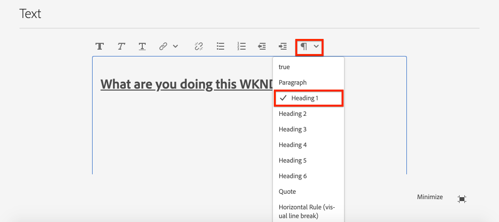

# 将SPA组件映射到AEM组件{#map-components}

了解如何使用SPA Editor JS SDK将React组件映射到Adobe Experience Manager(AEM)组件。 组件映射使用户能够在AEM SPA编辑器中对SPA组件进行动态更新，这与传统的AEM创作类似。

本章将更深入地介绍AEM JSON模型API，以及AEM组件公开的JSON内容如何作为prop自动注入到React组件中。

## 目标

1. 了解如何将AEM组件映射到SPA组件。
2. 了解&#x200B;**容器**&#x200B;组件与&#x200B;**内容**&#x200B;组件之间的差异。
3. 新建一个映射到现有AEM组件的React组件。

## 您将构建的内容

本章将检查提供的`Text` SPA组件如何映射到AEM `Text`组件。 将创建一个新的`Image` SPA组件，它可在SPA中使用，并在AEM中创作。 **布局容器**&#x200B;和&#x200B;**模板编辑器**&#x200B;策略的开箱即用功能还将用于创建外观稍有变化的视图。


## 前提条件

查看设置[本地开发环境](overview.md#local-dev-environment)所需的工具和说明。

### 获取代码

1. 通过Git下载本教程的起点：

   ```shell
   $ git clone git@github.com:adobe/aem-guides-wknd-spa.git
   $ cd aem-guides-wknd-spa
   $ git checkout React/map-components-start
   ```

2. 使用Maven将代码库部署到本地AEM实例：

   ```shell
   $ mvn clean install -PautoInstallSinglePackage
   ```

   如果使用[AEM 6.x](overview.md#compatibility) ，则添加`classic`用户档案:

   ```shell
   $ mvn clean install -PautoInstallSinglePackage -Pclassic
   ```

您始终可以在[GitHub](https://github.com/adobe/aem-guides-wknd-spa/tree/React/map-components-solution)上视图完成的代码，或通过切换到分支`React/map-components-solution`在本地签出代码。

## 映射方法

基本概念是将SPA组件映射到AEM组件。 AEM组件、运行服务器端、将内容作为JSON模型API的一部分导出。 SPA占用JSON内容，在浏览器中运行客户端。 将创建SPA组件与AEM组件之间的1:1映射。


*将AEM组件映射到React Component的高级概述*

## Inspect文本组件

[AEM项目原型](https://github.com/adobe/aem-project-archetype)提供映射到AEM [文本组件](https://docs.adobe.com/content/help/en/experience-manager-core-components/using/components/text.html)的`Text`组件。 这是&#x200B;**content**&#x200B;组件的示例，其中它从AEM呈现&#x200B;*content*。

让我们看看组件的工作方式。

### InspectJSON模型

1. 在跳转到SPA代码之前，了解AEM提供的JSON模型非常重要。 导航到[核心组件库](https://www.aemcomponents.dev/content/core-components-examples/library/page-authoring/text.html)并视图文本组件的页面。 核心组件库提供所有AEM核心组件的示例。
2. 选择&#x200B;**JSON**&#x200B;选项卡以获取以下示例之一：

   

   您应当看到三个属性：`text`、`richText`和`:type`。

   `:type` 是保留属性，它列表 `sling:resourceType` AEM组件的（或路径）。`:type`的值用于将AEM组件映射到SPA组件。

   `text` 以 `richText` 及将公开给SPA组件的其他属性。

### Inspect文本组件

1. 打开新终端并导航到项目内的`ui.frontend`文件夹。 运行`npm install`，然后运行`npm start`以开始&#x200B;**webpack-dev-server**:

   ```shell
   $ cd ui.frontend
   $ npm install
   $ npm start
   ```

   `ui.frontend`模块当前设置为使用[模拟JSON模型](./integrate-spa.md#mock-json)。

2. 您应当看到一个新的浏览器窗口打开到[http://localhost:3000/content/wknd-spa-react/us/en/home.html](http://localhost:3000/content/wknd-spa-react/us/en/home.html)

   

3. 在您选择的IDE中，为WKND SPA打开AEM项目。 展开`ui.frontend`模块并打开`ui.frontend/src/components/Text/Text.js`下的文件`Text.js`:

   

4. 我们将检查的第一个区域是位于~行40的`class Text`:

   ```js
   class Text extends Component {
   
       get richTextContent() {
           return (<div
                   id={extractModelId(this.props.cqPath)}
                   data-rte-editelement
                   dangerouslySetInnerHTML={{__html: DOMPurify.sanitize(this.props.text)}} />
                   );
       }
   
       get textContent() {
           return <div>{this.props.text}</div>;
       }
   
       render() {
           return this.props.richText ? this.richTextContent : this.textContent;
       }
   }
   ```

   `Text` 是标准的React组件。该组件使用`this.props.richText`确定要渲染的内容是富文本还是纯文本。 使用的实际“内容”来自`this.props.text`。 为避免潜在的XSS攻击，富文本在使用[危险的SetInnerHTML](https://reactjs.org/docs/dom-elements.html#dangerouslysetinnerhtml)来呈现内容之前会通过`DOMPurify`进行转义。 在练习前面的JSON模型中调用`richText`和`text`属性。

5. 接下来，查看~line 29的`TextEditConfig`:

   ```js
   const TextEditConfig = {
   emptyLabel: 'Text',
   
       isEmpty: function(props) {
           return !props || !props.text || props.text.trim().length < 1;
       }
   };
   ```

   以上代码负责确定何时在AEM作者环境中呈现占位符。 如果`isEmpty`方法返回&#x200B;**true**，则占位符将呈现。

6. 最后查看~line 62的`MapTo`调用：

   ```js
   export default MapTo('wknd-spa-react/components/text')(Text, TextEditConfig);
   ```

   `MapTo` 由AEM SPA Editor JS SDK(`@adobe/aem-react-editable-components`)提供。路径`wknd-spa-react/components/text`表示AEM组件的`sling:resourceType`。 此路径与前面观察的JSON模型公开的`:type`匹配。 `MapTo` 负责分析JSON模型响应并将正确值传递 `props` 给SPA组件。

   可在`ui.apps/src/main/content/jcr_root/apps/wknd-spa-react/components/text`找到AEM `Text`组件定义。

7. 尝试修改位于`ui.frontend/public/mock-content/mock.model.json`的`mock.model.json`文件。 在~line 62更新第一个`Text`值以使用&#x200B;**`H1`**&#x200B;和&#x200B;**`u`**&#x200B;标记：

   ```json
       "text": {
           "text": "<h1><u>Hello World!</u></h1>",
           "richText": true,
           ":type": "wknd-spa-react/components/text"
       }
   ```

   导航到[http://localhost:3000](http://localhost:3000)以查看效果：

   

   尝试在&#x200B;**true** / **false**&#x200B;之间切换`richText`属性，以查看正在运行的渲染逻辑。

8. Inspect`Text.scss`,`ui.frontend/src/components/Text/Text.scss`。

   此文件由本章的起始代码库添加，并利用上一章中添加的[Sass](https://sass-lang.com/)功能。 请注意`ui.frontend/src/styles/_variables.scss`引用的变量。

## 创建图像组件

然后，创建映射到AEM [图像组件](https://docs.adobe.com/content/help/zh-Hans/experience-manager-core-components/using/components/image.html)的`Image` React组件。 `Image`组件是&#x200B;**content**&#x200B;组件的另一个示例。

### InspectJSON

跳入SPA代码前，请检查AEM提供的JSON模型。

1. 导航到核心组件库中的[图像示例](https://www.aemcomponents.dev/content/core-components-examples/library/page-authoring/image.html)。

   

   `src`、`alt`和`title`的属性将用于填充SPA `Image`组件。

   >[!NOTE]
   >
   > 还有其他已公开的图像属性(`lazyEnabled`, `widths`)允许开发人员创建自适应和延迟加载组件。 本教程中构建的组件将很简单，**不会**&#x200B;使用这些高级属性。

2. 返回IDE并打开位于`ui.frontend/public/mock-content/mock.model.json`的`mock.model.json`。 由于这是我们项目的新组件，因此我们需要“模拟”图像JSON。

   在~line 70为`image`模型添加一个JSON项（不要忘记第二个`text_23828680`后面的尾随逗号`,`）并更新`:itemsOrder`数组。

   ```json
   ...
   ":items": {
               ...
               "text_23828680": {
                   "text": "<p>Mock Model JSON!</p>",
                   "richText": true,
                   ":type": "wknd-spa-react/components/text"
               },
               "image": {
                   "alt": "Rock Climber in New Zealand",
                   "title": "Rock Climber in New Zealand",
                   "src": "/mock-content/adobestock-140634652.jpeg",
                   ":type": "wknd-spa-react/components/image"
               }
           },
           ":itemsOrder": [
               "text",
               "text_23828680",
               "image"
           ],
   ```

   项目包含`/mock-content/adobestock-140634652.jpeg`的示例图像，该示例图像将与&#x200B;**webpack-dev-server**&#x200B;一起使用。

   您可以在此处视图完整的[mock.model.json](https://github.com/adobe/aem-guides-wknd-spa/blob/React/map-components-solution/ui.frontend/public/mock-content/mock.model.json)。

### 实现图像组件

1. 然后，在`ui.frontend/src/components`下新建一个名为`Image`的文件夹。
2. 在`Image`文件夹下，新建一个名为`Image.js`的文件。

   

3. 将以下`import`语句添加到`Image.js`:

   ```js
   import React, {Component} from 'react';
   import {MapTo} from '@adobe/aem-react-editable-components';
   ```

4. 然后添加`ImageEditConfig`以确定何时在AEM中显示占位符：

   ```js
   export const ImageEditConfig = {
   
       emptyLabel: 'Image',
   
       isEmpty: function(props) {
           return !props || !props.src || props.src.trim().length < 1;
       }
   };
   ```

   如果未设置`src`属性，则将显示占位符。

5. 接下来实现`Image`类：

   ```js
    export default class Image extends Component {
   
       get content() {
           return ;
       }
   
       render() {
           if(ImageEditConfig.isEmpty(this.props)) {
               return null;
           }
   
           return (
                   <div className="Image">
                       {this.content}
                   </div>
           );
       }
   }
   ```

   上述代码将根据JSON模型传入的props `src`、`alt`和`title`呈现``。

6. 添加`MapTo`代码，将React组件映射到AEM组件：

   ```js
   MapTo('wknd-spa-react/components/image')(Image, ImageEditConfig);
   ```

   请注意字符串`wknd-spa-react/components/image`与AEM组件在`ui.apps`中的位置对应：`ui.apps/src/main/content/jcr_root/apps/wknd-spa-react/components/image`。

7. 在同一目录中新建一个名为`Image.scss`的文件，并添加以下内容：

   ```scss
   .Image-src {
       margin: 1rem 0;
       width: 100%;
       border: 0;
   }
   ```

8. 在`Image.js`中，在`import`语句的顶部添加对文件的引用：

   ```js
   import React, {Component} from 'react';
   import {MapTo} from '@adobe/aem-react-editable-components';
   
   require('./Image.scss');
   ```

   您可以在此处视图已完成的[Image.js](https://github.com/adobe/aem-guides-wknd-spa/blob/React/map-components-solution/ui.frontend/src/components/Image/Image.js)。

9. 打开文件`ui.frontend/src/components/import-components.js`并添加对新`Image`组件的引用：

   ```js
   import './Page/Page';
   import './Text/Text';
   import './Image/Image'; //add reference to Image component
   ```

10. 如果尚未启动，请开始&#x200B;**webpack-dev-server**。 导航到[http://localhost:3000](http://localhost:3000)，您应当看到图像渲染：

   

   >[!NOTE]
   >
   > **奖金挑战**:在中实现新方 `Image.js` 法，以在图 `this.props.title` 像下显示字幕值。

## 更新AEM中的策略

`Image`组件仅在&#x200B;**webpack-dev-server**&#x200B;中可见。 然后，将更新的SPA部署到AEM并更新模板策略。

1. 停止&#x200B;**webpack-dev-server**&#x200B;并从项目的根目录中，使用您的Maven技能将更改部署到AEM:

   ```shell
   $ cd aem-guides-wknd-spa
   $ mvn clean install -PautoInstallSinglePackage
   ```

2. 从AEM开始屏幕导航到&#x200B;**工具** > **模板** > **[WKNDSPA React](http://localhost:4502/libs/wcm/core/content/sites/templates.html/conf/wknd-spa-react)**。

   选择并编辑&#x200B;**SPA Page**:

   

3. 选择&#x200B;**布局容器**&#x200B;并单击其&#x200B;**策略**&#x200B;图标以编辑策略：

   

4. 在&#x200B;**允许的组件** > **WKND SPA React - Content**&#x200B;下，检查&#x200B;**图像**&#x200B;组件：

   

   在&#x200B;**默认组件** > **添加映射**&#x200B;下，选择&#x200B;**图像- WKNDSPA React - Content**&#x200B;组件：

   

   输入&#x200B;**mime类型**(`image/*`)。

   单击&#x200B;**完成**&#x200B;以保存策略更新。

5. 在&#x200B;**布局容器**&#x200B;中，单击&#x200B;**文本**&#x200B;组件的&#x200B;**策略**&#x200B;图标：

   

   创建名为&#x200B;**WKND SPA Text**&#x200B;的新策略。 在&#x200B;**插件** > **格式**&#x200B;下，选中所有框以启用其他格式选项：

   

   在&#x200B;**插件** > **段落样式**&#x200B;下，选中复选框以&#x200B;**启用段落样式**:

   

   单击&#x200B;**完成**&#x200B;以保存策略更新。

6. 导航到&#x200B;**主页** [http://localhost:4502/editor.html/content/wknd-spa-react/us/en/home.html](http://localhost:4502/editor.html/content/wknd-spa-react/us/en/home.html)。

   您还应能够编辑`Text`组件，并在&#x200B;**全屏**&#x200B;模式下添加其他段落样式。

   

7. 您还应该能够从&#x200B;**资产查找器**&#x200B;中拖放图像：

   

8. 通过[AEM Assets](http://localhost:4502/assets.html/content/dam)添加您自己的映像，或为标准[WKND参考站点](https://github.com/adobe/aem-guides-wknd/releases/latest)安装完成的代码库。 [WKND引用站点](https://github.com/adobe/aem-guides-wknd/releases/latest)包含许多可在WKND SPA上重新使用的图像。 可以使用[AEM Package Manager](http://localhost:4502/crx/packmgr/index.jsp)安装该包。

   

## Inspect版面容器

AEMSPA编辑器SDK自动提供对&#x200B;**布局容器**&#x200B;的支持。 **布局容器**&#x200B;是&#x200B;**容器**&#x200B;组件。 容器组件是接受JSON结构的组件，这些结构表示&#x200B;*其他*&#x200B;组件并动态实例化它们。

让我们进一步检查布局容器。

1. 在浏览器中，导航到[http://localhost:4502/content/wknd-spa-react/us/en.model.json](http://localhost:4502/content/wknd-spa-react/us/en.model.json)

   

   **布局容器**&#x200B;组件的`sling:resourceType`为`wcm/foundation/components/responsivegrid`,SPA编辑器使用`:type`属性进行识别，与`Text`和`Image`组件类似。

   SPA Editor提供使用[布局模式](https://docs.adobe.com/content/help/en/experience-manager-65/authoring/siteandpage/responsive-layout.html#defining-layouts-layout-mode)重新调整组件大小的相同功能。

2. 返回至[http://localhost:4502/editor.html/content/wknd-spa-react/us/en/home.html](http://localhost:4502/editor.html/content/wknd-spa-react/us/en/home.html)。 添加其他&#x200B;**Image**&#x200B;组件，并尝试使用&#x200B;**布局**&#x200B;选项重新调整它们的大小：

   

3. 重新打开JSON模型[http://localhost:4502/content/wknd-spa-react/us/en.model.json](http://localhost:4502/content/wknd-spa-react/us/en.model.json)并观察作为JSON一部分的`columnClassNames`:

   

   类名`aem-GridColumn--default--4`表示组件应基于12列网格为4列宽。 有关[响应式网格的详细信息，请参阅此](https://adobe-marketing-cloud.github.io/aem-responsivegrid/)。

4. 返回IDE，在`ui.apps`模块中，有一个在`ui.apps/src/main/content/jcr_root/apps/wknd-spa-react/clientlibs/clientlib-grid`定义的客户端库。 打开文件`less/grid.less`。

   此文件确定&#x200B;**布局容器**&#x200B;使用的断点（`default`、`tablet`和`phone`）。 此文件旨在根据项目规范进行自定义。 当前断点设置为`1200px`和`650px`。

5. 您应该能够使用`Text`组件的响应功能和更新的富文本策略来创作视图，如下所示：

   

## 恭喜！{#congratulations}

恭喜您，您学习了如何将SPA组件映射到AEM组件，并且您实施了新的`Image`组件。 您还有机会探索&#x200B;**布局容器**&#x200B;的响应功能。

您始终可以在[GitHub](https://github.com/adobe/aem-guides-wknd-spa/tree/React/map-components-solution)上视图完成的代码，或通过切换到分支`React/map-components-solution`在本地签出代码。

### 后续步骤{#next-steps}

[导航和路由](navigation-routing.md) -了解如何通过使用SPA Editor SDK映射到AEM Pages来支持SPA中的多个视图。动态导航是使用React Router实现的，并添加到现有的Header组件中。

## 奖励——保留源控件{#bonus}的配置

在许多情况下，尤其是在AEM项目开始时，将配置（如模板和相关内容策略）保留到源代码控制非常有价值。 这可确保所有开发人员针对同一组内容和配置工作，并确保环境之间的更多一致性。 一旦一个项目达到一定的成熟度，管理模板的做法就可以交给一组特殊的高级用户。

接下来的几个步骤将使用Visual Studio代码IDE和[VSCode AEM Sync](https://marketplace.visualstudio.com/items?itemName=yamato-ltd.vscode-aem-sync)进行，但可能使用您已配置为从AEM的本地实例&#x200B;**pull**&#x200B;或&#x200B;**导入**&#x200B;内容的任何工具和任何IDE进行。

1. 在Visual Studio代码IDE中，确保已通过Marketplace扩展安装&#x200B;**VSCode AEM Sync**:

   

2. 在“项目”资源管理器中展开&#x200B;**ui.content**&#x200B;模块，然后导航到`/conf/wknd-spa-react/settings/wcm/templates`。

3. **右键单** 击文 `templates` 件夹，然 **后选择从AEM Server导入**:

   

4. 重复这些步骤以导入内容，但选择位于`/conf/wknd-spa-react/settings/wcm/templates/policies`的&#x200B;**策略**&#x200B;文件夹。

5. Inspect位于`ui.content/src/main/content/META-INF/vault/filter.xml`的`filter.xml`文件。

   ```xml
   <!--ui.content filter.xml-->
   <?xml version="1.0" encoding="UTF-8"?>
    <workspaceFilter version="1.0">
        <filter root="/conf/wknd-spa-react" mode="merge"/>
        <filter root="/content/wknd-spa-react" mode="merge"/>
        <filter root="/content/dam/wknd-spa-react" mode="merge"/>
        <filter root="/content/experience-fragments/wknd-spa-react" mode="merge"/>
    </workspaceFilter>
   ```

   `filter.xml`文件负责标识随软件包一起安装的节点的路径。 请注意每个过滤器上的`mode="merge"`，指示不会修改现有内容，只会添加新内容。 由于内容作者可能正在更新这些路径，因此代码部署&#x200B;**不**&#x200B;覆盖内容很重要。 有关使用筛选器元素的更多详细信息，请参阅[FileVault文档](https://jackrabbit.apache.org/filevault/filter.html)。

   比较`ui.content/src/main/content/META-INF/vault/filter.xml`和`ui.apps/src/main/content/META-INF/vault/filter.xml`以了解每个模块管理的不同节点。
