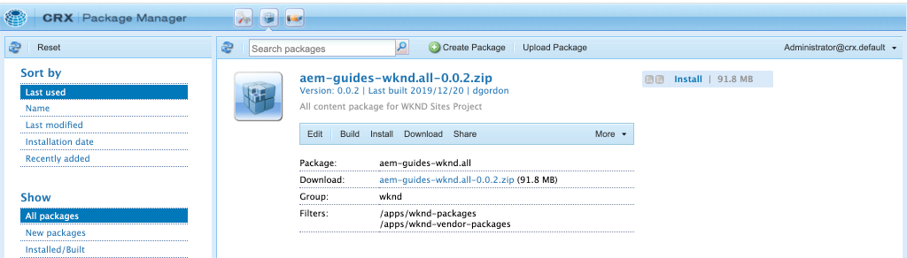
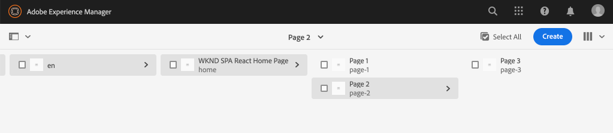
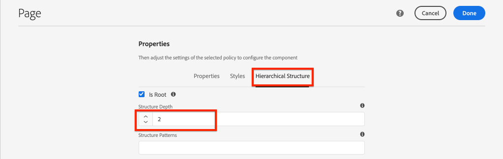

# 添加导航和路由{#navigation-routing}

了解如何通过使用SPA Editor SDK映射到AEM页面来支持SPA中的多个视图。 动态导航是使用React Router实现的，并添加到现有的Header组件中。

## 目标

1. 了解使用SPA编辑器时可用的SPA模型路由选项。
1. 了解如何使用[ React Router](https://reacttraining.com/react-router/)在SPA的不同视图之间导航。
1. 实施由AEM页面层次结构驱动的动态导航。

## 您将构建的

本章将向现有`Header`组件添加导航菜单。 导航菜单将由AEM页面层次结构驱动，并将利用[导航核心组件](https://docs.adobe.com/content/help/en/experience-manager-core-components/using/components/navigation.html)提供的JSON模型。


## 前提条件

查看设置[本地开发环境](overview.md#local-dev-environment)所需的工具和说明。

### 获取代码

1. 通过Git下载本教程的起点：

   ```shell
   $ git clone git@github.com:adobe/aem-guides-wknd-spa.git
   $ cd aem-guides-wknd-spa
   $ git checkout React/navigation-routing-start
   ```

1. 使用Maven将代码库部署到本地AEM实例：

   ```shell
   $ mvn clean install -PautoInstallSinglePackage
   ```

   如果使用[AEM 6.x](overview.md#compatibility)添加`classic`用户档案:

   ```shell
   $ mvn clean install -PautoInstallSinglePackage -Pclassic
   ```

1. 为传统[WKND参考站点](https://github.com/adobe/aem-guides-wknd/releases/latest)安装完成的包。 将在WKND SPA上重新使用由[WKND参考站点](https://github.com/adobe/aem-guides-wknd/releases/latest)提供的图像。 可以使用[AEM Package Manager](http://localhost:4502/crx/packmgr/index.jsp)安装该包。

   

您始终可以在[GitHub](https://github.com/adobe/aem-guides-wknd-spa/tree/React/navigation-routing-solution)上视图完成的代码，或通过切换到分支`React/navigation-routing-solution`在本地签出代码。

## Inspect头更新{#inspect-header}

在前几章中，将`Header`组件添加为通过`App.js`包含的纯React组件。 在本章中，`Header`组件已被删除，将通过[模板编辑器](https://docs.adobe.com/content/help/en/experience-manager-learn/sites/page-authoring/template-editor-feature-video-use.html)进行添加。 这将允许用户从AEM中配置`Header`的导航菜单。

>[!NOTE]
>
> 已对代码库进行了多次CSS和JavaScript更新，以开始本章。 要专注于核心概念，不讨论代码更改的&#x200B;**所有**。 您可以在[此处](https://github.com/adobe/aem-guides-wknd-spa/compare/React/map-components-solution...React/navigation-routing-start)视图完整更改。

1. 在您选择的IDE中，为本章打开SPA入门项目。
1. 在`ui.frontend`模块下，检查文件`Header.js`:`ui.frontend/src/components/Header/Header.js`。

   已进行了多次更新，包括添加`HeaderEditConfig`和`MapTo`以使组件能够映射到AEM组件`wknd-spa-react/components/header`。

   ```js
   /* Header.js */
   ...
   export const HeaderEditConfig = {
       ...
   }
   ...
   MapTo('wknd-spa-react/components/header')(withRouter(Header), HeaderEditConfig);
   ```

1. 在`ui.apps`模块中，检查AEM `Header`组件的组件定义：`ui.apps/src/main/content/jcr_root/apps/wknd-spa-react/components/header/.content.xml`:

   ```xml
   <?xml version="1.0" encoding="UTF-8"?>
   <jcr:root xmlns:sling="http://sling.apache.org/jcr/sling/1.0" xmlns:cq="http://www.day.com/jcr/cq/1.0"
       xmlns:jcr="http://www.jcp.org/jcr/1.0"
       jcr:primaryType="cq:Component"
       jcr:title="Header"
       sling:resourceSuperType="wknd-spa-react/components/navigation"
       componentGroup="WKND SPA React - Structure"/>
   ```

   AEM `Header`组件将通过`sling:resourceSuperType`属性继承[导航核心组件](https://docs.adobe.com/content/help/en/experience-manager-core-components/using/components/navigation.html)的所有功能。

## 将标题添加到模板{#add-header-template}

1. 打开浏览器并登录AEM,[http://localhost:4502/](http://localhost:4502/)。 应已部署起始代码库。
1. 导航到&#x200B;**SPA页面模板**:[http://localhost:4502/editor.html/conf/wknd-spa-react/settings/wcm/templates/spa-page-template/structure.html](http://localhost:4502/editor.html/conf/wknd-spa-react/settings/wcm/templates/spa-page-template/structure.html)。
1. 选择最外部的&#x200B;**根布局容器**，然后单击其&#x200B;**策略**&#x200B;图标。 请务必&#x200B;**不要**&#x200B;选择&#x200B;**布局容器**&#x200B;未锁定进行创作。

   

1. 创建名为&#x200B;**SPA Structure**&#x200B;的新策略：

   

   在&#x200B;**允许的组件** > **常规**&#x200B;下，选择&#x200B;**布局容器**&#x200B;组件。

   在&#x200B;**允许的组件** > **WKND SPA REACT - STRUCTURE**&#x200B;下，选择&#x200B;**标题**&#x200B;组件：

   

   在&#x200B;**允许的组件** > **WKND SPA REACT - Content**&#x200B;下，选择&#x200B;**图像**&#x200B;和&#x200B;**文本**&#x200B;组件。 您应选择4个总组件。

   单击&#x200B;**完成**&#x200B;以保存更改。

1. 刷新页面，并在未锁定的&#x200B;**布局容器**&#x200B;上添加&#x200B;**Header**&#x200B;组件：

   

1. 选择&#x200B;**Header**&#x200B;组件，然后单击其&#x200B;**Policy**&#x200B;图标以编辑策略。
1. 使用&#x200B;******WKND SPA标头**&#x200B;的策略标题创建新策略。

   在&#x200B;**属性**&#x200B;下：

   * 将&#x200B;**导航根**&#x200B;设置为`/content/wknd-spa-react/us/en`。
   * 将&#x200B;**排除根级别**&#x200B;设置为&#x200B;**1**。
   * 取消选中&#x200B;**收集所有子页面**。
   * 将&#x200B;**导航结构深度**&#x200B;设置为&#x200B;**3**。

   

   这将收集位于`/content/wknd-spa-react/us/en`下方的导航2级。

1. 在保存更改后，您应会看到填充的`Header`作为模板的一部分：

   

## 创建子页面

接下来，在AEM中创建其他页面，作为SPA中的不同视图。 我们还将检查AEM提供的JSON模型的层次结构。

1. 导航到&#x200B;**站点**&#x200B;控制台：[http://localhost:4502/sites.html/content/wknd-spa-react/us/en/home](http://localhost:4502/sites.html/content/wknd-spa-react/us/en/home)。 选择&#x200B;**WKND SPA React主页**&#x200B;并单击&#x200B;**创建** > **页面**:

   

1. 在&#x200B;**模板**&#x200B;下，选择&#x200B;**SPA页面**。 在&#x200B;**属性**&#x200B;下，输入&#x200B;**标题**&#x200B;和&#x200B;**page-1**&#x200B;的&#x200B;**第1**&#x200B;页作为名称。

   

   单击&#x200B;**创建**，在对话框弹出窗口中，单击&#x200B;**打开**&#x200B;以在AEM SPA编辑器中打开页面。

1. 向主&#x200B;**布局容器**&#x200B;添加新的&#x200B;**Text**&#x200B;组件。 编辑组件并输入文本：**使用RTE和** H1 **元素的第1**&#x200B;页（您必须进入全屏模式才能更改段落元素）

   

   随意添加其他内容，如图像。

1. 返回AEM Sites控制台并重复上述步骤，创建名为&#x200B;**Page 2**&#x200B;的第二页，作为&#x200B;**Page 1**&#x200B;的同级页。
1. 最后，创建第三页，**第3**&#x200B;页，但作为&#x200B;**第2页**&#x200B;的&#x200B;**子**。 完成后，站点层次结构应如下所示：

   

1. 在新选项卡中，打开AEM提供的JSON模型API:[http://localhost:4502/content/wknd-spa-react/us/en.model.json](http://localhost:4502/content/wknd-spa-react/us/en.model.json)。 首次加载SPA时会请求此JSON内容。 外部结构如下所示：

   ```json
   {
   "language": "en",
   "title": "en",
   "templateName": "spa-app-template",
   "designPath": "/libs/settings/wcm/designs/default",
   "cssClassNames": "spa page basicpage",
   ":type": "wknd-spa-react/components/spa",
   ":items": {},
   ":itemsOrder": [],
   ":hierarchyType": "page",
   ":path": "/content/wknd-spa-react/us/en",
   ":children": {
       "/content/wknd-spa-react/us/en/home": {},
       "/content/wknd-spa-react/us/en/home/page-1": {},
       "/content/wknd-spa-react/us/en/home/page-2": {},
       "/content/wknd-spa-react/us/en/home/page-2/page-3": {}
       }
   }
   ```

   在`:children`下，您应当看到每个已创建页面对应的条目。 所有页面的内容都在此初始JSON请求中。 一旦实现导航路由，将快速加载SPA的后续视图，因为内容已在客户端可用。

   在初始JSON请求中加载SPA内容的&#x200B;**ALL**&#x200B;并不明智，因为这会降低初始页面加载速度。 接下来，我们将查看如何收集页面的层次结构深度。

1. 导航到&#x200B;**SPA Root**&#x200B;模板，网址为：[http://localhost:4502/editor.html/conf/wknd-spa-react/settings/wcm/templates/spa-app-template/structure.html](http://localhost:4502/editor.html/conf/wknd-spa-react/settings/wcm/templates/spa-app-template/structure.html)。

   单击&#x200B;**页面属性菜单** > **页面策略**:

   

1. **SPA Root**&#x200B;模板中额外有一个&#x200B;**“分层结构**”选项卡，用于控制收集的JSON内容。 **结构深度**&#x200B;确定站点层次中收集&#x200B;**根**&#x200B;下子页面的深度。 您还可以使用&#x200B;**结构模式**&#x200B;字段根据常规表达式筛选其他页面。

   将&#x200B;**结构深度**&#x200B;更新为&#x200B;**2**:

   

   单击&#x200B;**完成**&#x200B;以保存对策略所做的更改。

1. 重新打开JSON模型[http://localhost:4502/content/wknd-spa-react/us/en.model.json](http://localhost:4502/content/wknd-spa-react/us/en.model.json)。

   ```json
   {
   "language": "en",
   "title": "en",
   "templateName": "spa-app-template",
   "designPath": "/libs/settings/wcm/designs/default",
   "cssClassNames": "spa page basicpage",
   ":type": "wknd-spa-react/components/spa",
   ":items": {},
   ":itemsOrder": [],
   ":hierarchyType": "page",
   ":path": "/content/wknd-spa-react/us/en",
   ":children": {
       "/content/wknd-spa-react/us/en/home": {},
       "/content/wknd-spa-react/us/en/home/page-1": {},
       "/content/wknd-spa-react/us/en/home/page-2": {}
       }
   }
   ```

   请注意，**第3**&#x200B;页路径已被删除：`/content/wknd-spa-react/us/en/home/page-2/page-3`。

   稍后，我们将观察AEM SPA Editor SDK如何动态加载其他内容。

## 实施导航

接下来，将导航菜单作为`Header`的一部分进行实现。 我们可以直接在`Header.js`中添加代码，但最好的做法是避免使用大型组件。 相反，我们将实现一个`Navigation` SPA组件，稍后可能会重新使用。

1. 查看位于[http://localhost:4502/content/wknd-spa-react/us/en.model.json](http://localhost:4502/content/wknd-spa-react/us/en.model.json)的AEM `Header`组件公开的JSON:

   ```json
   ...
   "header": {
       "items": [
       {
       "level": 0,
       "active": true,
       "path": "/content/wknd-spa-react/us/en/home",
       "description": null,
       "url": "/content/wknd-spa-react/us/en/home.html",
       "lastModified": 1589062597083,
       "title": "WKND SPA React Home Page",
       "children": [
               {
               "children": [],
               "level": 1,
               "active": false,
               "path": "/content/wknd-spa-react/us/en/home/page-1",
               "description": null,
               "url": "/content/wknd-spa-react/us/en/home/page-1.html",
               "lastModified": 1589429385100,
               "title": "Page 1"
               },
               {
               "level": 1,
               "active": true,
               "path": "/content/wknd-spa-react/us/en/home/page-2",
               "description": null,
               "url": "/content/wknd-spa-react/us/en/home/page-2.html",
               "lastModified": 1589429603507,
               "title": "Page 2",
               "children": [
                   {
                   "children": [],
                   "level": 2,
                   "active": false,
                   "path": "/content/wknd-spa-react/us/en/home/page-2/page-3",
                   "description": null,
                   "url": "/content/wknd-spa-react/us/en/home/page-2/page-3.html",
                   "lastModified": 1589430413831,
                   "title": "Page 3"
                   }
               ],
               }
           ]
           }
       ],
   ":type": "wknd-spa-react/components/header"
   ```

   AEM页面的分层性质在JSON中建模，可用于填充导航菜单。 记住，`Header`组件继承了[导航核心组件](https://docs.adobe.com/content/help/en/experience-manager-core-components/using/components/navigation.html)的所有功能，通过JSON公开的内容将自动映射到React prop。

1. 打开新的终端窗口，并导航到SPA项目的`ui.frontend`文件夹。 使用命令`npm start`开始&#x200B;**webpack-dev-server**。

   ```shell
   $ cd ui.frontend
   $ npm start
   ```

1. 打开新的浏览器选项卡并导航到[http://localhost:3000/](http://localhost:3000/)。

   应将&#x200B;**webpack-dev-server**&#x200B;配置为从AEM的本地实例代理JSON模型(`ui.frontend/.env.development`)。 这将允许我们针对在上一个练习中在AEM中创建的内容直接进行编码。 确保在同一浏览会话中对您进行AEM身份验证。

   

   `Header`当前已实现菜单切换功能。 然后，实施导航菜单。

1. 返回到您选择的IDE，然后在`ui.frontend/src/components/Header/Header.js`打开`Header.js`。
1. 更新`homeLink()`方法以删除硬编码字符串并使用AEM组件传入的动态prop:

   ```js
   /* Header.js */
   ...
   get homeLink() {
        //expect a single root defined as part of the navigation
       if(!this.props.items || this.props.items.length !== 1) {
           return null;
       }
   
       return this.props.items[0].url;
   }
   ...
   ```

   上述代码将根据组件配置的根导航项填充url。 `homeLink()` 用于填充方法中的 `logo()` 徽标，并用于确定是否应在中显示返回按钮 `backButton()`

   保存对`Header.js`的更改。

1. 在`Header.js`顶部添加一行，以在其他导入项下导入`Navigation`组件：

   ```js
   /* Header.js */
   ...
   import Navigation from '../Navigation/Navigation';
   ```

1. 下一步更新`get navigation()`方法以实例化`Navigation`组件：

   ```js
   /* Header.js */
   ...
   get navigation() {
       //pass all the props to Navigation component
       return <Navigation {...this.props} />;
   }
   ...
   ```

   如前所述，我们将在`Navigation`组件中实现大部分逻辑，而不是在`Header`中实现导航。  `Header`的prop包含构建菜单所需的JSON结构，我们传递了所有prop。
1. 在`ui.frontend/src/components/Navigation/Navigation.js`打开文件`Navigation.js`。
1. 实现`renderGroupNav(children)`方法：

   ```js
   /* Navigation.js */
   ...
   renderGroupNav(children) {
   
       if(children === null || children.length < 1 ) {
           return null;
       }
       return (<ul className={this.baseCss + '__group'}>
                   {children.map(
                       (item,index) => { return this.renderNavItem(item,index)}
                   )}
               </ul>
       );
   }
   ...
   ```

   此方法获取导航项的数组`children`，并创建无序列表。 然后，它循环访问阵列并将项传递给`renderNavItem`，随后将实现。

1. 实现`renderNavItem`:

   ```js
   /* Navigation.js */
   ...
   renderNavItem(item, index) {
       const cssClass = this.baseCss + '__item ' + 
                        this.baseCss + '__item--level-' + item.level + ' ' +
                        (item.active ? ' ' + this.baseCss + '__item--active' : '');
       return (
           <li key={this.baseCss + '__item-' + index} className={cssClass}>
                   { this.renderLink(item) }
                   { this.renderGroupNav(item.children) }
           </li>
       );
   }
   ...
   ```

   此方法呈现一个列表项，其CSS类基于属性`level`和`active`。 然后，该方法调用`renderLink`以创建锚点标签。 由于`Navigation`内容是分层的，因此使用递归策略为当前项的子项调用`renderGroupNav`。

1. 实现`renderLink`方法：

   在文件顶部为[Link](https://reacttraining.com/react-router/web/api/Link)组件添加导入方法，该组件是React路由器的一部分，并包含其他导入：

   ```js
   import {Link} from "react-router-dom";
   ```

   接下来完成`renderLink`方法的实现：

   ```js
   renderLink(item){
       return (
           <Link to={item.url} title={item.title} aria-current={item.active && 'page'}
              className={this.baseCss + '__item-link'}>{item.title}</Link>
       );
   }
   ```

   请注意，使用[Link](https://reacttraining.com/react-router/web/api/Link)组件代替了普通锚记`<a>`。 这可确保不会触发整个页面刷新，而是利用AEM SPA Editor JS SDK提供的React路由器。

1. 保存对`Navigation.js`的更改并返回至&#x200B;**webpack-dev-server**:[http://localhost:3000](http://localhost:3000)

   

   单击菜单切换打开导航，您应会看到已填充的导航链接。 您应该能够导航到SPA的不同视图。

## Inspect SPA 路由

现在已实施导航，请检查AEM中的路由。

1. 在IDE中，打开位于`ui.frontend/src/index.js`的文件`index.js`。

   ```js
   /* index.js */
   import { Router } from 'react-router-dom';
   ...
   ...
    ModelManager.initialize().then(pageModel => {
       const history = createBrowserHistory();
       render(
       <Router history={history}>
           <App
           history={history}
           cqChildren={pageModel[Constants.CHILDREN_PROP]}
           cqItems={pageModel[Constants.ITEMS_PROP]}
           cqItemsOrder={pageModel[Constants.ITEMS_ORDER_PROP]}
           cqPath={pageModel[Constants.PATH_PROP]}
           locationPathname={window.location.pathname}
           />
       </Router>,
       document.getElementById('spa-root')
       );
   });
   ```

   请注意，`App`包装在[ React Router](https://reacttraining.com/react-router/)的`Router`组件中。 由AEM SPA Editor JS SDK提供的`ModelManager`将根据JSON模型API向AEM页面添加动态路由。

1. 打开终端，导航到项目的根，然后使用您的Maven技能将项目部署到AEM:

   ```shell
   $ cd aem-guides-wknd-spa
   $ mvn clean install -PautoInstallSinglePackage
   ```

1. 导航到AEM中的SPA主页：[http://localhost:4502/content/wknd-spa-react/us/en/home.html](http://localhost:4502/content/wknd-spa-react/us/en/home.html)并打开浏览器的开发人员工具。 下面的屏幕截图是从Google Chrome浏览器中捕获的。

   刷新页面，您会看到对`/content/wknd-spa-react/us/en.model.json`的XHR请求，该请求是SPA根。 请注意，根据本教程前面部分对SPA根模板进行的层次结构深度配置，只包含三个子页面。 这不包括&#x200B;**第3**&#x200B;页。

   

1. 打开开发人员工具后，使用`Header`导航导航到&#x200B;**第3**&#x200B;页：

   

   请注意，新的XHR请求旨在：`/content/wknd-spa-react/us/en/home/page-2/page-3.model.json`

   

   AEM Model Manager了解&#x200B;**第3**&#x200B;页的JSON内容不可用，并会自动触发其他XHR请求。

1. 使用`Header`组件的各种导航链接继续导航SPA。 请注意，未发出任何其他XHR请求，且未发生完整页面刷新。 这使得SPA对最终用户而言更快，并减少了返回AEM的不必要请求。

   

1. 通过直接导航到：[http://localhost:4502/content/wknd-spa-react/us/en/home/page-2.html](http://localhost:4502/content/wknd-spa-react/us/en/home/page-2.html)。 请注意，浏览器的“后退”按钮仍然有效。

## 恭喜！{#congratulations}

祝贺您，您学习了如何通过SPA Editor SDK映射到AEM页面来支持SPA中的多个视图。 动态导航已使用React Router实现，并已添加到`Header`组件。

您始终可以在[GitHub](https://github.com/adobe/aem-guides-wknd-spa/tree/React/navigation-routing-solution)上视图完成的代码，或通过切换到分支`React/navigation-routing-solution`在本地签出代码。
